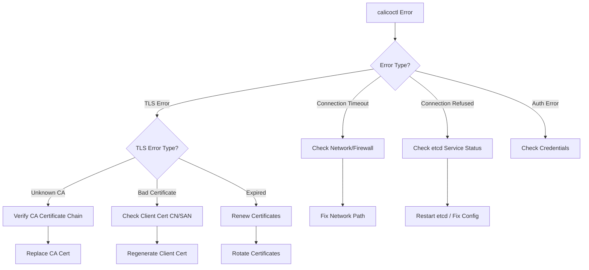

# Troubleshooting Calicoctl etcd Configuration

Author: [nawazdhandala](https://github.com/nawazdhandala)

Tags: Calico, etcd, Troubleshooting, Kubernetes, Calicoctl

Description: A systematic guide to diagnosing and fixing common calicoctl etcd configuration issues including connection failures, TLS errors, authentication problems, and data inconsistencies.

---

## Introduction

When calicoctl is configured to use etcd as its datastore, connectivity and configuration issues can prevent you from managing Calico network policies entirely. These problems range from simple misconfigured endpoints to complex TLS handshake failures and etcd cluster health issues.

Troubleshooting calicoctl etcd configuration requires a methodical approach: verify the etcd cluster health first, then check connectivity from the calicoctl host, validate TLS certificates, and finally confirm that calicoctl can read and write Calico data. Skipping steps leads to chasing red herrings.

This guide provides a structured troubleshooting workflow for the most common calicoctl etcd configuration problems, with specific commands and solutions for each scenario.

## Prerequisites

- calicoctl installed with etcd datastore configuration
- Access to the etcd cluster (directly or through calicoctl)
- etcdctl v3 installed for direct etcd verification
- openssl for certificate inspection
- Basic understanding of TLS and etcd architecture

## Step 1: Verify etcd Cluster Health

Before troubleshooting calicoctl, confirm the etcd cluster itself is healthy:

```bash
# Check etcd cluster health with etcdctl
etcdctl --endpoints=https://etcd1:2379,https://etcd2:2379,https://etcd3:2379 \
  --cert=/etc/calico/certs/cert.pem \
  --key=/etc/calico/certs/key.pem \
  --cacert=/etc/calico/certs/ca.pem \
  endpoint health

# Expected output:
# https://etcd1:2379 is healthy: successfully committed proposal: took = 2.5ms
# https://etcd2:2379 is healthy: successfully committed proposal: took = 3.1ms
# https://etcd3:2379 is healthy: successfully committed proposal: took = 2.8ms

# Check etcd cluster member list
etcdctl --endpoints=https://etcd1:2379 \
  --cert=/etc/calico/certs/cert.pem \
  --key=/etc/calico/certs/key.pem \
  --cacert=/etc/calico/certs/ca.pem \
  member list -w table
```

## Step 2: Diagnose Connection Failures

Common connection error messages and their solutions:

```bash
# Error: "context deadline exceeded"
# Cause: etcd endpoint is unreachable

# Test basic TCP connectivity
nc -zv etcd1 2379
# Or using curl
curl -k --connect-timeout 5 https://etcd1:2379/health

# Check DNS resolution
nslookup etcd1
dig etcd1

# Check firewall rules (port 2379 must be open)
sudo iptables -L -n | grep 2379
```

```bash
# Error: "connection refused"
# Cause: etcd is not listening on the expected address/port

# Verify etcd is running
systemctl status etcd
# Or in Kubernetes
kubectl get pods -n kube-system -l component=etcd

# Check what port etcd is listening on
ss -tlnp | grep etcd
```

## Step 3: Debug TLS Certificate Issues

TLS-related errors are the most common calicoctl etcd configuration problems:

```bash
# Error: "certificate signed by unknown authority"
# Verify the CA certificate matches the etcd server certificate

# Inspect the CA certificate
openssl x509 -in /etc/calico/certs/ca.pem -text -noout | head -20

# Verify the client certificate was signed by the CA
openssl verify -CAfile /etc/calico/certs/ca.pem /etc/calico/certs/cert.pem
# Expected: /etc/calico/certs/cert.pem: OK

# Check certificate expiration
openssl x509 -in /etc/calico/certs/cert.pem -noout -dates
# notBefore=...
# notAfter=...
```

```bash
# Error: "tls: bad certificate"
# The server rejected the client certificate

# Check the client certificate CN and SANs
openssl x509 -in /etc/calico/certs/cert.pem -noout -subject -ext subjectAltName

# Test the TLS handshake directly
openssl s_client -connect etcd1:2379 \
  -cert /etc/calico/certs/cert.pem \
  -key /etc/calico/certs/key.pem \
  -CAfile /etc/calico/certs/ca.pem \
  -verify_return_error
```



## Step 4: Validate Calicoctl Configuration

Systematically verify each configuration parameter:

```bash
# Display the current calicoctl configuration
cat /etc/calicoctl/calicoctl.cfg

# Verify environment variables
echo "DATASTORE_TYPE: ${DATASTORE_TYPE:-not set}"
echo "ETCD_ENDPOINTS: ${ETCD_ENDPOINTS:-not set}"
echo "ETCD_KEY_FILE: ${ETCD_KEY_FILE:-not set}"
echo "ETCD_CERT_FILE: ${ETCD_CERT_FILE:-not set}"
echo "ETCD_CA_CERT_FILE: ${ETCD_CA_CERT_FILE:-not set}"

# Verify file paths exist and are readable
for f in "$ETCD_KEY_FILE" "$ETCD_CERT_FILE" "$ETCD_CA_CERT_FILE"; do
    if [ -r "$f" ]; then
        echo "OK: $f is readable"
    else
        echo "ERROR: $f is not readable"
    fi
done

# Test with explicit config
export DATASTORE_TYPE=etcdv3
calicoctl get nodes --config=/etc/calicoctl/calicoctl.cfg
```

## Step 5: Check Calico Data in etcd

Verify that Calico data exists and is accessible in etcd:

```bash
# List Calico keys in etcd
etcdctl --endpoints=https://etcd1:2379 \
  --cert=/etc/calico/certs/cert.pem \
  --key=/etc/calico/certs/key.pem \
  --cacert=/etc/calico/certs/ca.pem \
  get /calico --prefix --keys-only | head -20

# Check if Calico cluster information exists
etcdctl --endpoints=https://etcd1:2379 \
  --cert=/etc/calico/certs/cert.pem \
  --key=/etc/calico/certs/key.pem \
  --cacert=/etc/calico/certs/ca.pem \
  get /calico/resources/v3/projectcalico.org/clusterinformations/default

# Verify with calicoctl
calicoctl get clusterinformation default -o yaml
```

## Verification

After applying fixes, run a complete verification:

```bash
# Full connectivity check
export DATASTORE_TYPE=etcdv3
calicoctl get clusterinformation default -o yaml

# Verify read operations
calicoctl get nodes -o wide
calicoctl get ippools -o yaml

# Verify write operations (create a test resource)
calicoctl apply -f - <<EOF
apiVersion: projectcalico.org/v3
kind: GlobalNetworkSet
metadata:
  name: troubleshoot-test
spec:
  nets:
    - 192.0.2.0/24
EOF

# Clean up test resource
calicoctl delete globalnetworkset troubleshoot-test
```

## Troubleshooting

- **Intermittent connection failures**: One or more etcd members may be unhealthy. Check individual member health and remove/replace failed members. Ensure all endpoints are listed in the configuration.
- **"mvcc: required revision has been compacted"**: etcd has compacted past the revision calicoctl is trying to watch. Restart the calicoctl operation or the component experiencing the error.
- **Slow operations**: Check etcd performance metrics. High disk latency or large database size can cause timeouts. Run `etcdctl defrag` and check disk I/O performance.
- **"too many open files"**: The system file descriptor limit is too low. Increase it with `ulimit -n 65536` or modify `/etc/security/limits.conf`.

## Conclusion

Troubleshooting calicoctl etcd configuration follows a logical progression: verify the etcd cluster health, test network connectivity, validate TLS certificates, confirm calicoctl configuration parameters, and check data accessibility. By working through these steps systematically, you can quickly identify the root cause of any calicoctl etcd connectivity issue and apply the appropriate fix. Keep this guide as a reference for your operations team to reduce mean time to resolution for etcd-related Calico issues.
