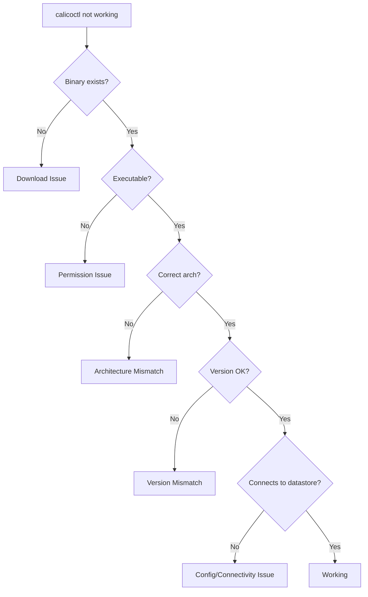

# How to Troubleshoot Calicoctl Installation

Author: [nawazdhandala](https://github.com/nawazdhandala)

Tags: Calico, Calicoctl, Troubleshooting, Installation, Debugging

Description: A comprehensive troubleshooting guide for calicoctl installation issues, covering download failures, permission errors, version mismatches, and datastore connectivity problems.

---

## Introduction

Calicoctl installation can fail for a variety of reasons: network issues preventing downloads, permission problems, architecture mismatches, version incompatibilities with the cluster, and datastore connectivity failures. Each failure type has different symptoms and requires different diagnostic approaches.

This guide provides a systematic troubleshooting methodology for calicoctl installation issues. We organize problems by symptom and provide step-by-step diagnostic and resolution procedures for each. The goal is to get calicoctl working correctly in the minimum number of troubleshooting steps.

Most calicoctl installation problems fall into three categories: getting the binary onto the system, making it executable and accessible, and connecting it to the Calico datastore.

## Prerequisites

- A system where calicoctl installation has failed or is not working correctly
- SSH or terminal access to the system
- Basic understanding of Linux file permissions and PATH
- Knowledge of your Calico cluster version and datastore type

## Diagnosing the Problem

Start with a systematic diagnostic that identifies the failure category.

```bash
#!/bin/bash
# diagnose-calicoctl.sh
# Systematic calicoctl installation diagnostic

echo "=== Calicoctl Diagnostic Report ==="

# Check 1: Is calicoctl in PATH?
echo ""
echo "--- Binary Location ---"
CALICOCTL_PATH=$(which calicoctl 2>/dev/null)
if [ -n "${CALICOCTL_PATH}" ]; then
  echo "Found: ${CALICOCTL_PATH}"
  ls -la "${CALICOCTL_PATH}"
else
  echo "NOT FOUND in PATH"
  echo "PATH: ${PATH}"
  # Check common locations
  for loc in /usr/local/bin/calicoctl /usr/bin/calicoctl /opt/bin/calicoctl; do
    if [ -f "${loc}" ]; then
      echo "Found at ${loc} (but not in PATH)"
    fi
  done
fi

# Check 2: Is it executable?
echo ""
echo "--- Permissions ---"
if [ -n "${CALICOCTL_PATH}" ]; then
  file "${CALICOCTL_PATH}"
  if [ -x "${CALICOCTL_PATH}" ]; then
    echo "Executable: YES"
  else
    echo "Executable: NO (fix with: chmod +x ${CALICOCTL_PATH})"
  fi
fi

# Check 3: Architecture match
echo ""
echo "--- Architecture ---"
echo "System: $(uname -m)"
if [ -n "${CALICOCTL_PATH}" ]; then
  echo "Binary: $(file ${CALICOCTL_PATH} | grep -oP '(x86-64|aarch64|ARM)')"
fi

# Check 4: Version
echo ""
echo "--- Version ---"
calicoctl version 2>&1

# Check 5: Configuration
echo ""
echo "--- Configuration ---"
if [ -f /etc/calico/calicoctl.cfg ]; then
  echo "Config file found: /etc/calico/calicoctl.cfg"
  cat /etc/calico/calicoctl.cfg
else
  echo "No config file at /etc/calico/calicoctl.cfg"
fi
echo "DATASTORE_TYPE=${DATASTORE_TYPE:-not set}"
echo "KUBECONFIG=${KUBECONFIG:-not set}"

# Check 6: Datastore connectivity
echo ""
echo "--- Datastore Connectivity ---"
calicoctl get nodes -o name 2>&1
```



## Fixing Download Failures

```bash
# Problem: Cannot download calicoctl binary
# Symptom: curl returns connection error or 404

# Check 1: Network connectivity
echo "Testing network connectivity..."
curl -fsSL -o /dev/null https://github.com 2>&1
if [ $? -ne 0 ]; then
  echo "Cannot reach GitHub. Check network/proxy settings."
  echo "If behind a proxy:"
  echo "  export https_proxy=http://proxy.example.com:8080"
  echo "  curl -fsSL --proxy http://proxy.example.com:8080 -o /tmp/calicoctl <URL>"
fi

# Check 2: Verify the URL is correct
CALICO_VERSION="v3.27.0"
ARCH=$(uname -m | sed 's/x86_64/amd64/;s/aarch64/arm64/')
URL="https://github.com/projectcalico/calico/releases/download/${CALICO_VERSION}/calicoctl-linux-${ARCH}"
echo "Download URL: ${URL}"
curl -fsSL -I "${URL}" | head -5

# Check 3: Try alternative download
# If GitHub is blocked, use a mirror or local artifact repository
echo ""
echo "Alternative: Download on another machine and copy via SCP"
echo "  scp calicoctl user@target:/usr/local/bin/calicoctl"
```

## Fixing Permission Issues

```bash
# Problem: Permission denied when running calicoctl
# Symptom: "bash: /usr/local/bin/calicoctl: Permission denied"

# Fix execute permission
sudo chmod +x /usr/local/bin/calicoctl

# Fix ownership (should be root-owned)
sudo chown root:root /usr/local/bin/calicoctl

# Verify
ls -la /usr/local/bin/calicoctl
# Expected: -rwxr-xr-x 1 root root ... /usr/local/bin/calicoctl
```

## Fixing Version Mismatches

```bash
# Problem: calicoctl version does not match cluster version
# Symptom: API errors, unexpected behavior, or explicit version mismatch warning

# Check current calicoctl version
calicoctl version 2>&1

# Check cluster Calico version
kubectl get deployment calico-kube-controllers -n kube-system -o jsonpath='{.spec.template.spec.containers[0].image}' 2>/dev/null

# Download matching version
CLUSTER_VERSION=$(kubectl get deployment calico-kube-controllers -n kube-system   -o jsonpath='{.spec.template.spec.containers[0].image}' 2>/dev/null | grep -oP 'v[0-9.]+')
echo "Cluster version: ${CLUSTER_VERSION}"

# Reinstall with correct version
ARCH=$(uname -m | sed 's/x86_64/amd64/;s/aarch64/arm64/')
sudo curl -fsSL -o /usr/local/bin/calicoctl   "https://github.com/projectcalico/calico/releases/download/${CLUSTER_VERSION}/calicoctl-linux-${ARCH}"
sudo chmod +x /usr/local/bin/calicoctl
calicoctl version
```

## Fixing Datastore Connectivity

```bash
# Problem: calicoctl cannot connect to datastore
# Symptom: "connection refused" or "unauthorized" errors

# For Kubernetes API datastore
echo "=== Kubernetes Datastore Troubleshooting ==="

# Check kubeconfig exists and is valid
echo "KUBECONFIG: ${KUBECONFIG:-default (~/.kube/config)}"
kubectl cluster-info 2>&1

# Create or fix calicoctl configuration
sudo mkdir -p /etc/calico
cat << 'EOF' | sudo tee /etc/calico/calicoctl.cfg
apiVersion: projectcalico.org/v3
kind: CalicoAPIConfig
metadata:
spec:
  datastoreType: "kubernetes"
  kubeconfig: "/root/.kube/config"
EOF

# For etcd datastore
echo ""
echo "=== etcd Datastore Troubleshooting ==="
echo "Check etcd connectivity:"
echo "  etcdctl endpoint health"
echo "Check TLS certificates if using etcd with TLS"
```

## Verification

```bash
#!/bin/bash
# verify-calicoctl-fix.sh
echo "=== Post-Fix Verification ==="

echo "Binary: $(which calicoctl)"
echo "Version: $(calicoctl version 2>&1 | head -1)"
echo "Permissions: $(ls -la $(which calicoctl) | awk '{print $1}')"
echo "Architecture: $(file $(which calicoctl) | grep -oP '(x86-64|aarch64|ARM)')"

echo ""
echo "Datastore:"
calicoctl get nodes -o name 2>&1 | head -5
RESULT=$?
if [ ${RESULT} -eq 0 ]; then
  echo "Status: CONNECTED"
else
  echo "Status: CANNOT CONNECT (exit code: ${RESULT})"
fi
```

## Troubleshooting

- **"exec format error"**: Binary architecture does not match the system. Download the correct binary for your architecture (amd64 vs arm64).
- **"no such file or directory" on a file that exists**: The binary may be linked against missing shared libraries. Check with `ldd /usr/local/bin/calicoctl`. Static binaries should not have this issue.
- **Works as root but not as regular user**: Check file permissions and PATH for the regular user. Ensure `/usr/local/bin` is in the non-root user's PATH.
- **"resource not found" errors**: Version mismatch between calicoctl and cluster. Calico API resources change between versions. Align the versions.

## Conclusion

Troubleshooting calicoctl installation follows a systematic path from binary availability through permissions, architecture, version compatibility, and datastore connectivity. The diagnostic script at the beginning of this guide identifies which category the problem falls into, and each section provides the specific resolution steps. Save the diagnostic script on your systems for quick troubleshooting when issues arise.
