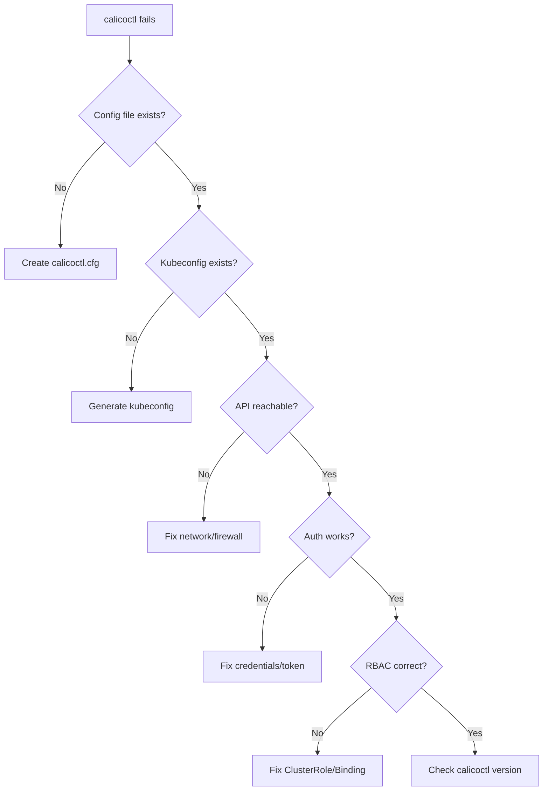

# How to Troubleshoot Calicoctl Kubernetes API Datastore Configuration

Author: [nawazdhandala](https://github.com/nawazdhandala)

Tags: Calico, calicoctl, Kubernetes, Datastore, Troubleshooting

Description: A troubleshooting guide for calicoctl Kubernetes API datastore configuration issues, covering authentication failures, RBAC problems, connectivity errors, and configuration file issues.

---

## Introduction

When calicoctl is configured to use the Kubernetes API as its datastore, several layers must work correctly: the configuration file must point to a valid kubeconfig, the kubeconfig must contain valid credentials, those credentials must have RBAC permissions for Calico resources, and the network path to the Kubernetes API must be available.

This guide provides systematic troubleshooting procedures for each layer of the datastore connection. We start with the most common issues and work toward edge cases, helping you resolve calicoctl datastore connectivity problems quickly.

Kubernetes API datastore issues are more nuanced than etcd datastore issues because they involve Kubernetes authentication, authorization, and API server availability.

## Prerequisites

- A system with calicoctl installed and configured for Kubernetes API datastore
- Access to the Kubernetes cluster for diagnostic commands
- Understanding of Kubernetes authentication and RBAC

## Systematic Diagnosis

Start with a diagnostic script that identifies the failure point.

```bash
#!/bin/bash
# diagnose-k8s-datastore.sh
# Diagnose calicoctl Kubernetes API datastore issues

echo "=== Kubernetes API Datastore Diagnostic ==="

# Layer 1: Configuration file
echo ""
echo "--- Layer 1: Configuration ---"
CONFIG_FILE="/etc/calico/calicoctl.cfg"
if [ -f "${CONFIG_FILE}" ]; then
  echo "Config file: EXISTS"
  DATASTORE_TYPE=$(grep datastoreType ${CONFIG_FILE} | awk '{print $2}' | tr -d '"')
  echo "Datastore type: ${DATASTORE_TYPE}"
  KUBECONFIG_PATH=$(grep kubeconfig ${CONFIG_FILE} | awk '{print $2}' | tr -d '"')
  echo "Kubeconfig path: ${KUBECONFIG_PATH}"
else
  echo "Config file: MISSING"
  echo "FIX: Create /etc/calico/calicoctl.cfg"
  exit 1
fi

# Layer 2: Kubeconfig validity
echo ""
echo "--- Layer 2: Kubeconfig ---"
if [ -f "${KUBECONFIG_PATH}" ]; then
  echo "Kubeconfig file: EXISTS"
  # Check if it contains required fields
  grep -q "server:" "${KUBECONFIG_PATH}" && echo "API server: CONFIGURED" || echo "API server: MISSING"
  grep -q "token:" "${KUBECONFIG_PATH}" || grep -q "client-certificate" "${KUBECONFIG_PATH}" &&     echo "Credentials: PRESENT" || echo "Credentials: MISSING"
else
  echo "Kubeconfig file: MISSING at ${KUBECONFIG_PATH}"
  echo "FIX: Generate kubeconfig for calicoctl"
  exit 1
fi

# Layer 3: API server connectivity
echo ""
echo "--- Layer 3: API Server Connectivity ---"
API_SERVER=$(grep "server:" "${KUBECONFIG_PATH}" | head -1 | awk '{print $2}')
echo "API server: ${API_SERVER}"
# Extract host and port
HOST=$(echo ${API_SERVER} | sed 's|https://||;s|:[0-9]*$||')
PORT=$(echo ${API_SERVER} | grep -oP ':\K[0-9]+$' || echo "6443")
echo -n "Network connectivity: "
timeout 5 bash -c "echo > /dev/tcp/${HOST}/${PORT}" 2>/dev/null && echo "OK" || echo "FAILED"

# Layer 4: Authentication
echo ""
echo "--- Layer 4: Authentication ---"
KUBECONFIG="${KUBECONFIG_PATH}" kubectl get nodes > /dev/null 2>&1
if [ $? -eq 0 ]; then
  echo "kubectl auth: OK"
else
  echo "kubectl auth: FAILED"
  KUBECONFIG="${KUBECONFIG_PATH}" kubectl get nodes 2>&1 | head -3
fi

# Layer 5: Calico RBAC
echo ""
echo "--- Layer 5: Calico RBAC ---"
KUBECONFIG="${KUBECONFIG_PATH}" kubectl auth can-i list nodes.projectcalico.org 2>/dev/null
KUBECONFIG="${KUBECONFIG_PATH}" kubectl auth can-i get globalnetworkpolicies.projectcalico.org 2>/dev/null

# Layer 6: calicoctl connectivity
echo ""
echo "--- Layer 6: calicoctl Test ---"
calicoctl get nodes 2>&1
```



## Fixing Authentication Failures

```bash
# Problem: "Unauthorized" error from Kubernetes API
# Common cause: Expired or invalid token

# Check if the service account token is valid
SA_SECRET="calicoctl-token"
NAMESPACE="kube-system"

echo "=== Authentication Fix ==="

# Check if the secret exists
kubectl get secret ${SA_SECRET} -n ${NAMESPACE} > /dev/null 2>&1
if [ $? -ne 0 ]; then
  echo "Secret not found. Creating..."
  kubectl apply -f - << 'EOF'
apiVersion: v1
kind: Secret
metadata:
  name: calicoctl-token
  namespace: kube-system
  annotations:
    kubernetes.io/service-account.name: calicoctl
type: kubernetes.io/service-account-token
EOF
  sleep 5
fi

# Extract fresh token
TOKEN=$(kubectl get secret ${SA_SECRET} -n ${NAMESPACE} -o jsonpath='{.data.token}' | base64 --decode)
echo "Token retrieved (first 20 chars): ${TOKEN:0:20}..."

# Update kubeconfig with fresh token
KUBECONFIG_PATH=$(grep kubeconfig /etc/calico/calicoctl.cfg | awk '{print $2}' | tr -d '"')
# Use kubectl config set-credentials to update token
echo "Update the token in: ${KUBECONFIG_PATH}"
```

## Fixing RBAC Issues

```bash
# Problem: "forbidden" error on Calico resources
# The service account lacks RBAC permissions

echo "=== RBAC Fix ==="

# Check current permissions
echo "Current permissions for calicoctl service account:"
kubectl auth can-i --list --as=system:serviceaccount:kube-system:calicoctl | grep calico

# Apply correct RBAC
kubectl apply -f - << 'EOF'
apiVersion: rbac.authorization.k8s.io/v1
kind: ClusterRole
metadata:
  name: calicoctl-role
rules:
  - apiGroups: ["projectcalico.org"]
    resources: ["*"]
    verbs: ["get", "list", "watch", "create", "update", "patch", "delete"]
  - apiGroups: [""]
    resources: ["nodes", "namespaces", "pods"]
    verbs: ["get", "list", "watch"]
---
apiVersion: rbac.authorization.k8s.io/v1
kind: ClusterRoleBinding
metadata:
  name: calicoctl-binding
roleRef:
  apiGroup: rbac.authorization.k8s.io
  kind: ClusterRole
  name: calicoctl-role
subjects:
  - kind: ServiceAccount
    name: calicoctl
    namespace: kube-system
EOF

# Verify fix
echo ""
echo "Verifying RBAC fix:"
kubectl auth can-i list globalnetworkpolicies.projectcalico.org \
  --as=system:serviceaccount:kube-system:calicoctl
```

## Fixing Configuration File Issues

```bash
# Problem: calicoctl ignores configuration or uses wrong datastore

echo "=== Configuration Fix ==="

# Check environment variables that override config file
echo "Environment overrides:"
echo "  DATASTORE_TYPE=${DATASTORE_TYPE:-not set}"
echo "  CALICO_DATASTORE_TYPE=${CALICO_DATASTORE_TYPE:-not set}"
echo "  CALICO_KUBECONFIG=${CALICO_KUBECONFIG:-not set}"
echo "  KUBECONFIG=${KUBECONFIG:-not set}"

# Write a correct configuration
cat << 'EOF' | sudo tee /etc/calico/calicoctl.cfg
apiVersion: projectcalico.org/v3
kind: CalicoAPIConfig
metadata:
spec:
  datastoreType: "kubernetes"
  kubeconfig: "/etc/calico/kubeconfig"
EOF

echo ""
echo "Configuration written. Testing:"
calicoctl get nodes 2>&1 | head -5
```

## Verification

```bash
#!/bin/bash
# verify-datastore-fix.sh
echo "=== Post-Fix Verification ==="

echo "1. Config file:"
cat /etc/calico/calicoctl.cfg

echo ""
echo "2. Kubeconfig valid:"
KUBECONFIG_PATH=$(grep kubeconfig /etc/calico/calicoctl.cfg | awk '{print $2}' | tr -d '"')
KUBECONFIG=${KUBECONFIG_PATH} kubectl cluster-info 2>&1 | head -2

echo ""
echo "3. calicoctl connected:"
calicoctl get nodes -o wide 2>&1

echo ""
echo "4. Read/write test:"
calicoctl apply -f - << 'EOF' 2>&1
apiVersion: projectcalico.org/v3
kind: GlobalNetworkSet
metadata:
  name: datastore-test
spec:
  nets: ["192.0.2.0/24"]
EOF
calicoctl delete globalnetworkset datastore-test 2>/dev/null
echo "Read/write: OK"
```

## Troubleshooting

- **Config file not being read**: calicoctl looks for config at `/etc/calico/calicoctl.cfg` by default. Use `--config` flag to specify an alternate path, or set the `CALICO_DATASTORE_TYPE` and `CALICO_KUBECONFIG` environment variables.
- **"no kind CalicoAPIConfig" error**: The config file has incorrect syntax. Verify the apiVersion is `projectcalico.org/v3` and kind is `CalicoAPIConfig`.
- **Works from one machine but not another**: Compare the kubeconfig files and network connectivity to the API server. The API server may only be accessible from certain networks.
- **Intermittent failures**: The API server may be overloaded. Check API server health and response times. Consider increasing API server resources.

## Conclusion

Troubleshooting calicoctl Kubernetes API datastore configuration follows a layered approach: configuration file, kubeconfig, network connectivity, authentication, and RBAC. The diagnostic script at the beginning identifies which layer is failing, and the fix sections provide specific remediation for each. Save the diagnostic script on all management machines for quick troubleshooting.
