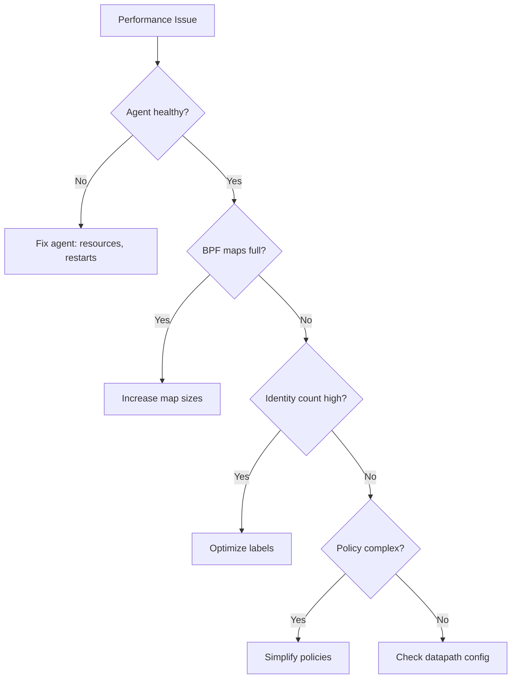

# Troubleshooting Cilium Performance and Scalability

Author: [nawazdhandala](https://github.com/nawazdhandala)

Tags: Cilium, Kubernetes, Performance, Scalability, Troubleshooting

Description: Systematic troubleshooting guide for Cilium performance and scalability issues in production clusters, covering agent health, BPF map exhaustion, and identity management problems.

---

## Introduction

When Cilium performance degrades in production, the root cause may be a scalability issue rather than a configuration problem. As clusters grow, resources that were adequate at small scale can become exhausted, causing sudden performance cliffs.

Troubleshooting at scale requires understanding Cilium's resource consumption patterns: BPF map utilization, identity count growth, agent CPU and memory usage, and the impact of policy complexity on computation time.

This guide provides a systematic troubleshooting approach for production Cilium clusters experiencing performance or scalability issues.

## Prerequisites

- Kubernetes cluster (v1.24+) with Cilium v1.14+
- `cilium` CLI, `helm`, and `kubectl`
- `iperf3` and `netperf` for benchmarking
- Prometheus and Grafana for monitoring
- Node-level root access

## Step 1: Agent Health Check

```bash
# Check agent status on all nodes
kubectl get pods -n kube-system -l k8s-app=cilium -o wide

# Look for OOMKilled or CrashLoopBackOff
kubectl get events -n kube-system --field-selector reason=OOMKilled

# Check agent resource usage
kubectl top pods -n kube-system -l k8s-app=cilium --sort-by=cpu

# Review agent logs for errors
kubectl logs -n kube-system ds/cilium --tail=100 | grep -i error
```

## Step 2: BPF Map Utilization

```bash
# Check all BPF map sizes
kubectl exec -n kube-system ds/cilium -- cilium bpf ct list global | wc -l
kubectl exec -n kube-system ds/cilium -- cilium bpf nat list | wc -l

# Compare against maximums
cilium config view | grep -E "bpf-ct|bpf-nat|bpf-policy"

# If maps are >80% full, increase sizes
```

## Step 3: Identity Analysis

```bash
# Count total identities
cilium identity list | wc -l

# Find most common identity labels
cilium identity list -o json | jq '.[].labels' | sort | uniq -c | sort -rn | head -20

# Check identity allocation rate
kubectl exec -n kube-system ds/cilium -- cilium metrics list | grep identity
```

## Step 4: Policy Computation Performance

```bash
# Check policy computation time
kubectl exec -n kube-system ds/cilium -- cilium metrics list | grep policy

# Count total rules
kubectl get cnp --all-namespaces --no-headers | wc -l
kubectl get ccnp --no-headers 2>/dev/null | wc -l

# Check for expensive FQDN policies
kubectl get cnp --all-namespaces -o json | jq '.items[] | select(.spec.egress[]?.toFQDNs?) | .metadata.name'
```

## Step 5: Network Performance Under Scale

```bash
# Test throughput from different endpoints
for ns in default production staging; do
  echo "=== $ns ==="
  kubectl exec -n $ns test-client -- iperf3 -c iperf-server.monitoring -t 10 -P 1 -J | \
    jq '.end.sum_sent.bits_per_second / 1000000000'
done

# Check for drops
cilium monitor --type drop | head -20
hubble observe --type drop --last 50
```



## Verification

```bash
cilium status --verbose
kubectl top pods -n kube-system -l k8s-app=cilium
cilium identity list | wc -l
```

## Troubleshooting

- **Agent consuming >1 CPU**: Check for excessive endpoints or policy computation. Reduce FQDN policies.
- **Identity count > 50000**: Urgently configure label optimization to reduce identity cardinality.
- **BPF maps at capacity**: Increase map sizes in Cilium config and restart agents.
- **Drops increasing with scale**: Check policy map size and increase bpf.policyMapMax.

## Systematic Troubleshooting Approach

Follow a structured methodology to avoid wasting time on false leads:

### The Five Whys Method

Apply iterative root cause analysis:

```
Problem: Throughput is 50% below baseline
Why 1: BPF programs are running slower (higher avg_ns)
Why 2: Conntrack lookups are taking longer
Why 3: Conntrack table is 90% full (hash collisions)
Why 4: Table size was not increased when cluster grew
Why 5: No monitoring on conntrack utilization
Root Cause: Missing capacity monitoring
```

### Data Collection During Issues

When troubleshooting active performance issues, collect data quickly before conditions change:

```bash
#!/bin/bash
# emergency-diag.sh - Run immediately when performance issues are reported
DIAG="/tmp/perf-issue-$(date +%s)"
mkdir -p $DIAG

# Quick data collection (runs in <30 seconds)
cilium status --verbose > $DIAG/status.txt &
cilium bpf ct list global | wc -l > $DIAG/ct-count.txt &
kubectl top pods -n kube-system -l k8s-app=cilium > $DIAG/agent-resources.txt &
kubectl exec -n kube-system ds/cilium -- cilium metrics list > $DIAG/metrics.txt &
wait

# BPF program stats
bpftool prog show --json > $DIAG/bpf-progs.json 2>/dev/null

# Network stats
kubectl exec -n kube-system ds/cilium -- ip -s link show > $DIAG/interfaces.txt

echo "Emergency diagnostics saved to $DIAG"
```

### Escalation Path

If the issue cannot be resolved through standard troubleshooting:

1. Collect a Cilium bugtool report: `cilium-bugtool`
2. Check Cilium GitHub issues for similar problems
3. Post on the Cilium Slack channel with diagnostic data
4. Open a GitHub issue with the bugtool archive

Include the following in any escalation:
- Cilium version and configuration
- Kernel version
- Cluster size (nodes, pods, identities)
- Timeline of when the issue started
- Any recent changes to the cluster

## Conclusion

Troubleshooting Cilium performance and scalability at production scale requires checking agent health, BPF map utilization, identity count, and policy complexity in sequence. Most scalability issues manifest as resource exhaustion (map full, OOM, CPU saturation) that can be resolved by increasing resource limits and optimizing identity management.
