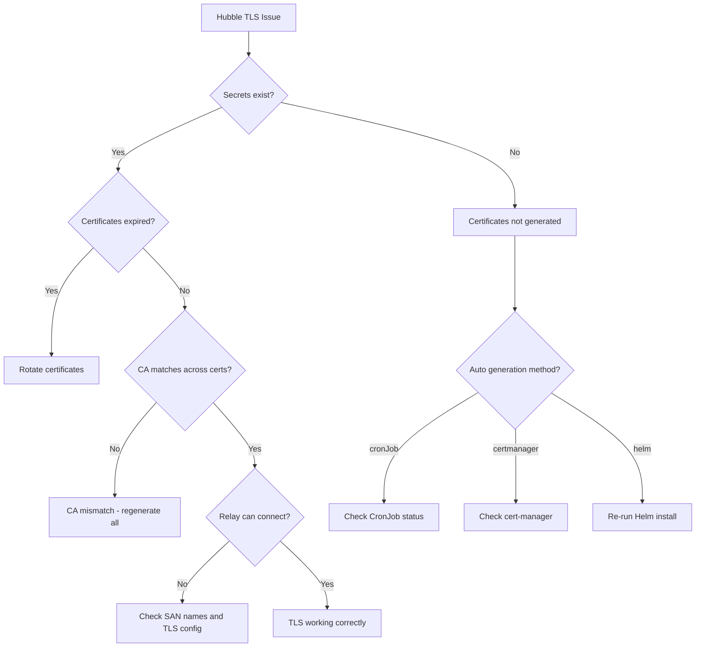

# How to Troubleshoot Cilium TLS with Hubble Configuration

Author: [nawazdhandala](https://github.com/nawazdhandala)

Tags: Cilium, TLS, Hubble, Troubleshooting, Certificates

Description: Diagnose and resolve TLS certificate issues in Cilium Hubble, including certificate generation failures, mTLS handshake errors, certificate rotation problems, and relay connection issues.

---

## Introduction

TLS encryption between Hubble components is essential for production deployments, but it introduces a significant source of configuration complexity. Certificate generation, distribution, rotation, and validation all need to work correctly across every Cilium agent pod and the Hubble relay. When any part of the TLS chain fails, the symptoms can range from relay connection errors to complete Hubble unavailability.

The most common TLS issues involve mismatched certificates between agents and relay, expired certificates, failed cert-manager integrations, and CronJob-based rotation that silently fails.

This guide provides a systematic approach to diagnosing and resolving each type of TLS issue in the Cilium Hubble stack.

## Prerequisites

- Kubernetes cluster with Cilium and Hubble deployed with TLS enabled
- kubectl access to kube-system namespace
- openssl CLI for certificate inspection
- Understanding of TLS/mTLS concepts

## Diagnosing Certificate Issues

Start by checking the current state of Hubble TLS certificates:

```bash
# Check if TLS secrets exist
kubectl -n kube-system get secrets | grep hubble

# Expected secrets:
# hubble-ca-secret (CA certificate)
# hubble-server-certs (agent server certificates)
# hubble-relay-client-certs (relay client certificates)

# Inspect the CA certificate
kubectl -n kube-system get secret hubble-ca-secret -o jsonpath='{.data.ca\.crt}' | \
  base64 -d | openssl x509 -noout -text | grep -E "Issuer|Subject|Not Before|Not After"

# Check server certificate validity
kubectl -n kube-system get secret hubble-server-certs -o jsonpath='{.data.tls\.crt}' | \
  base64 -d | openssl x509 -noout -text | grep -E "Issuer|Subject|Not Before|Not After|DNS"

# Check relay client certificate
kubectl -n kube-system get secret hubble-relay-client-certs -o jsonpath='{.data.tls\.crt}' | \
  base64 -d | openssl x509 -noout -text | grep -E "Issuer|Subject|Not Before|Not After"
```



## Fixing Certificate Generation Failures

### CronJob Method

```bash
# Check the certificate generation CronJob
kubectl -n kube-system get cronjobs | grep hubble

# View recent job history
kubectl -n kube-system get jobs | grep hubble

# Check the latest job logs
LATEST_JOB=$(kubectl -n kube-system get jobs --sort-by=.metadata.creationTimestamp | grep hubble | tail -1 | awk '{print $1}')
kubectl -n kube-system logs job/$LATEST_JOB

# If the job failed, check permissions
kubectl -n kube-system get sa hubble-generate-certs -o yaml
kubectl get clusterrolebinding | grep hubble
```

### cert-manager Method

```bash
# Check Certificate resources
kubectl -n kube-system get certificates | grep hubble

# View certificate status
kubectl -n kube-system describe certificate hubble-server-certs

# Check for cert-manager errors
kubectl -n cert-manager logs deploy/cert-manager --tail=30 | grep -i "hubble\|error"

# Verify the ClusterIssuer exists
kubectl get clusterissuer | grep -i ca
kubectl describe clusterissuer ca-issuer
```

### Helm Method

```bash
# Regenerate certificates by re-running Helm
helm upgrade cilium cilium/cilium -n kube-system \
  --reuse-values \
  --set hubble.tls.auto.method=helm

# This regenerates certificates on every Helm upgrade
```

## Resolving Relay Connection Failures

The relay uses mTLS to connect to agents. Connection failures are the most visible TLS symptom:

```bash
# Check relay logs for TLS errors
kubectl -n kube-system logs deploy/hubble-relay --tail=50

# Common errors:
# "tls: first record does not look like a TLS handshake" - TLS mismatch
# "x509: certificate signed by unknown authority" - CA mismatch
# "x509: certificate has expired or is not yet valid" - expired cert
# "remote error: tls: bad certificate" - client cert rejected

# Verify the relay is using the correct certificates
kubectl -n kube-system exec deploy/hubble-relay -- ls -la /var/lib/hubble-relay/tls/

# Test TLS connectivity from relay to agent
AGENT_POD_IP=$(kubectl -n kube-system get pods -l k8s-app=cilium -o jsonpath='{.items[0].status.podIP}')
kubectl -n kube-system exec deploy/hubble-relay -- \
  wget -qO- --timeout=5 https://$AGENT_POD_IP:4244 2>&1 | head -5
```

Fix CA mismatch by regenerating all certificates:

```bash
# Delete existing secrets to force regeneration
kubectl -n kube-system delete secret hubble-ca-secret hubble-server-certs hubble-relay-client-certs 2>/dev/null

# Trigger regeneration
helm upgrade cilium cilium/cilium -n kube-system --reuse-values

# Restart all components to pick up new certs
kubectl -n kube-system rollout restart daemonset/cilium
kubectl -n kube-system rollout restart deployment/hubble-relay
kubectl -n kube-system rollout status daemonset/cilium
kubectl -n kube-system rollout status deployment/hubble-relay
```

## Fixing Certificate Rotation Issues

Certificates that expire without rotation cause sudden Hubble failures:

```bash
# Check certificate expiration dates
for secret in hubble-ca-secret hubble-server-certs hubble-relay-client-certs; do
  echo "=== $secret ==="
  kubectl -n kube-system get secret $secret -o jsonpath='{.data.tls\.crt}' 2>/dev/null | \
    base64 -d 2>/dev/null | openssl x509 -noout -enddate 2>/dev/null || \
  kubectl -n kube-system get secret $secret -o jsonpath='{.data.ca\.crt}' 2>/dev/null | \
    base64 -d 2>/dev/null | openssl x509 -noout -enddate 2>/dev/null || \
  echo "Secret not found or no certificate data"
done

# Set up certificate expiration monitoring
```

```yaml
# cert-expiration-alert.yaml
apiVersion: monitoring.coreos.com/v1
kind: PrometheusRule
metadata:
  name: hubble-cert-expiration
  namespace: monitoring
spec:
  groups:
    - name: hubble-tls
      rules:
        - alert: HubbleCertificateExpiringSoon
          expr: |
            (certmanager_certificate_expiration_timestamp_seconds{namespace="kube-system",name=~"hubble.*"} - time()) / 86400 < 30
          for: 1h
          labels:
            severity: warning
          annotations:
            summary: "Hubble certificate {{ $labels.name }} expires in less than 30 days"
```

## Verification

After fixing TLS issues:

```bash
# 1. All secrets exist with valid certificates
for secret in hubble-ca-secret hubble-server-certs hubble-relay-client-certs; do
  EXISTS=$(kubectl -n kube-system get secret $secret 2>/dev/null && echo "yes" || echo "no")
  echo "$secret: exists=$EXISTS"
done

# 2. Certificates are not expired
kubectl -n kube-system get secret hubble-server-certs -o jsonpath='{.data.tls\.crt}' | \
  base64 -d | openssl x509 -noout -checkend 86400
# Should print "Certificate will not expire"

# 3. Relay connects successfully
kubectl -n kube-system logs deploy/hubble-relay --tail=10 | grep -i "connected\|tls"

# 4. Hubble CLI works through the relay
cilium hubble port-forward &
hubble status
hubble observe --last 5

# 5. No TLS errors in agent logs
kubectl -n kube-system logs ds/cilium --tail=50 | grep -i "tls\|certificate\|x509"
```

## Troubleshooting

- **Certificates regenerated but relay still fails**: The relay pod may have cached old certificates. Restart it: `kubectl -n kube-system rollout restart deployment/hubble-relay`.

- **CronJob runs but certificates are not updated**: Check if the CronJob has permissions to update secrets in kube-system. Verify the ServiceAccount and RBAC.

- **cert-manager Certificate stuck in "Not Ready"**: Check the cert-manager logs and the Certificate's status conditions. The ClusterIssuer may be misconfigured.

- **TLS works for some agents but not others**: Certificate Subject Alternative Names (SANs) may not cover all agent pod IPs. Check the SAN list with openssl.

## Conclusion

TLS issues in Cilium Hubble follow predictable patterns: missing certificates, expired certificates, CA mismatches, or rotation failures. Start by checking whether all required secrets exist, then verify certificate validity and CA chain consistency. Most issues can be resolved by deleting the certificate secrets and letting the configured auto-generation method recreate them. Always set up monitoring for certificate expiration to prevent unexpected outages.
