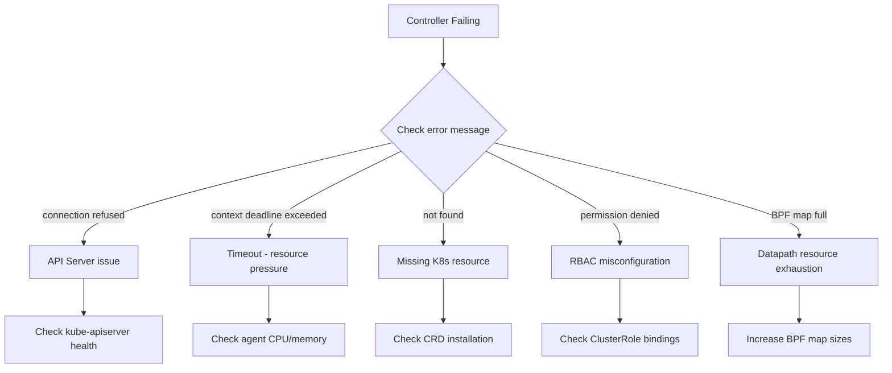

# How to Troubleshoot Controllers in Cilium Observability

Author: [nawazdhandala](https://github.com/nawazdhandala)

Tags: Cilium, Controller, Troubleshooting, Kubernetes, Debugging

Description: A hands-on guide to diagnosing and resolving Cilium controller failures, including common error patterns, log analysis techniques, and recovery procedures.

---

## Introduction

When Cilium controllers fail, the consequences vary from delayed policy enforcement to complete networking breakdown for affected endpoints. Controllers are the reconciliation engine of Cilium, and a failing controller means that some aspect of the networking state is not being kept in sync.

Controller failures can be transient -- caused by temporary API server unavailability -- or persistent, indicating a deeper configuration or resource problem. The key to effective troubleshooting is quickly identifying which controller is failing, understanding what it does, and tracing the root cause.

This guide provides a systematic approach to troubleshooting Cilium controller issues, with real commands and analysis patterns you can apply immediately in your cluster.

## Prerequisites

- Kubernetes cluster with Cilium installed
- kubectl with exec permissions in kube-system namespace
- cilium CLI tool
- Access to Cilium agent logs
- Basic understanding of Cilium architecture

## Identifying Failing Controllers

Start by getting a clear picture of which controllers are in a failure state:

```bash
# Quick check: number of failing controllers per node
for pod in $(kubectl get pods -n kube-system -l k8s-app=cilium -o name); do
  node=$(kubectl -n kube-system get $pod -o jsonpath='{.spec.nodeName}')
  count=$(kubectl -n kube-system exec $pod -- cilium status controllers -o json 2>/dev/null | \
    python3 -c "import json,sys; print(len([c for c in json.load(sys.stdin) if c.get('status',{}).get('consecutive-failure-count',0)>0]))" 2>/dev/null)
  echo "Node: $node - Failing controllers: $count"
done

# Detailed view of failing controllers on a specific node
kubectl -n kube-system exec ds/cilium -- cilium status controllers -o json | python3 -c "
import json, sys
data = json.load(sys.stdin)
for c in sorted(data, key=lambda x: x.get('status',{}).get('consecutive-failure-count',0), reverse=True):
    fails = c.get('status',{}).get('consecutive-failure-count',0)
    if fails > 0:
        msg = c.get('status',{}).get('last-failure-msg','unknown')
        print(f'{c[\"name\"]} ({fails} consecutive failures): {msg}')
"
```



## Analyzing Controller Error Messages

Each controller failure includes an error message. Here are the most common patterns and their solutions:

### API Server Connectivity

```bash
# Error: "connection refused" or "i/o timeout"
# Check API server health
kubectl get componentstatuses 2>/dev/null || kubectl get --raw /healthz

# Check Cilium's API server connectivity
kubectl -n kube-system exec ds/cilium -- cilium status | grep "KubeProxyReplacement\|KVStore\|Kubernetes"

# Look for API server errors in logs
kubectl -n kube-system logs ds/cilium --tail=100 | grep -i "apiserver\|connection refused\|timeout"
```

### Resource Exhaustion

```bash
# Error: "context deadline exceeded" or "resource exhausted"
# Check Cilium agent resource usage
kubectl -n kube-system top pod -l k8s-app=cilium

# Check BPF map sizes
kubectl -n kube-system exec ds/cilium -- cilium bpf ct list global | wc -l
kubectl -n kube-system exec ds/cilium -- cilium bpf nat list | wc -l

# Check endpoint count (each endpoint uses controller resources)
kubectl -n kube-system exec ds/cilium -- cilium endpoint list -o json | python3 -c "
import json, sys
eps = json.load(sys.stdin)
print(f'Total endpoints: {len(eps)}')
states = {}
for ep in eps:
    state = ep.get('status',{}).get('state','unknown')
    states[state] = states.get(state,0) + 1
for state, count in sorted(states.items()):
    print(f'  {state}: {count}')
"
```

### CRD and RBAC Issues

```bash
# Error: "not found" for CRDs
kubectl get crd | grep cilium

# Reinstall CRDs if missing
helm template cilium cilium/cilium -n kube-system | kubectl apply -f - --dry-run=server 2>&1 | grep crd

# Error: "forbidden" or "permission denied"
kubectl get clusterrolebinding | grep cilium
kubectl auth can-i --as=system:serviceaccount:kube-system:cilium list pods -A
kubectl auth can-i --as=system:serviceaccount:kube-system:cilium list ciliumnetworkpolicies -A
```

## Recovering from Persistent Controller Failures

When a controller is stuck in a failure loop, you may need to intervene:

```bash
# Option 1: Restart the specific Cilium agent pod
# This resets all controllers on that node
FAILING_POD=$(kubectl -n kube-system get pods -l k8s-app=cilium \
  -o jsonpath='{.items[0].metadata.name}')
kubectl -n kube-system delete pod $FAILING_POD

# Option 2: If the issue is cluster-wide, do a rolling restart
kubectl -n kube-system rollout restart daemonset/cilium
kubectl -n kube-system rollout status daemonset/cilium --timeout=300s

# Option 3: For endpoint-specific controller failures, regenerate the endpoint
# First, find the failing endpoint
kubectl -n kube-system exec ds/cilium -- cilium endpoint list | grep -i "not-ready\|error"

# Trigger a regeneration
ENDPOINT_ID=12345  # Replace with actual endpoint ID
kubectl -n kube-system exec ds/cilium -- cilium endpoint regenerate $ENDPOINT_ID
```

## Monitoring Controller Recovery

After applying a fix, track the recovery:

```bash
# Watch the failing controller count decrease
watch -n 5 'kubectl -n kube-system exec ds/cilium -- cilium status controllers -o json 2>/dev/null | python3 -c "
import json, sys
data = json.load(sys.stdin)
failing = len([c for c in data if c.get(\"status\",{}).get(\"consecutive-failure-count\",0) > 0])
total = len(data)
print(f\"Controllers: {total} total, {failing} failing\")
"'

# Check that the specific controller has recovered
kubectl -n kube-system exec ds/cilium -- cilium status controllers | grep -A2 "controller-name"
```

## Verification

Confirm that all controllers are healthy after remediation:

```bash
# 1. No controllers should be in consecutive failure state
kubectl -n kube-system exec ds/cilium -- cilium status controllers -o json | python3 -c "
import json, sys
data = json.load(sys.stdin)
failing = [c['name'] for c in data if c.get('status',{}).get('consecutive-failure-count',0) > 0]
if failing:
    print(f'Still failing: {failing}')
else:
    print('All controllers healthy')
"

# 2. Cilium overall status should be OK
cilium status --brief

# 3. Prometheus metric should show zero failing
curl -s 'http://localhost:9090/api/v1/query?query=cilium_controllers_failing' | python3 -m json.tool

# 4. All endpoints should be in ready state
kubectl -n kube-system exec ds/cilium -- cilium endpoint list -o json | python3 -c "
import json, sys
eps = json.load(sys.stdin)
not_ready = [e['id'] for e in eps if e.get('status',{}).get('state') != 'ready']
print(f'Not-ready endpoints: {len(not_ready)}')
"
```

## Troubleshooting

- **Controllers keep failing after pod restart**: The issue is external to the agent. Check the API server, etcd, or the specific Kubernetes resource the controller is trying to reconcile.

- **Only one node has failing controllers**: Check if that node has specific issues like disk pressure, high CPU, or network partition. Run `kubectl describe node <node-name>` to check conditions.

- **Controllers recover but fail again immediately**: This indicates a recurring trigger. Enable debug logging with `cilium config set debug true` (revert after investigation) and watch the logs.

- **Cannot identify which controller maps to which feature**: Use the controller name as a search term in the Cilium source code or documentation. Most names are self-descriptive (e.g., `sync-cnp-policy-status` handles CiliumNetworkPolicy status updates).

## Conclusion

Troubleshooting Cilium controllers requires correlating controller error messages with the cluster state. Most failures trace back to API server connectivity, resource exhaustion, missing CRDs, or RBAC misconfigurations. By using the diagnostic commands in this guide, you can quickly pinpoint the root cause and apply targeted fixes, whether that means restarting a pod, increasing resource limits, or fixing RBAC permissions.
