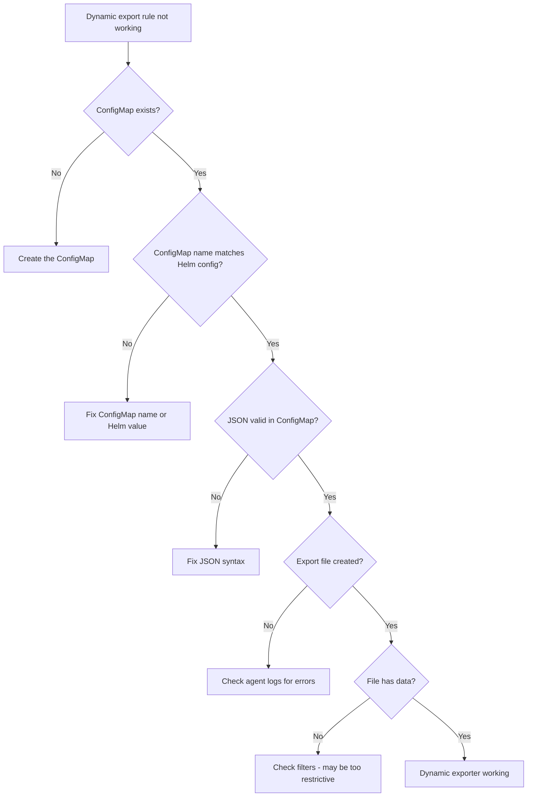

# How to Troubleshoot Dynamic Exporter Configuration in Cilium Hubble

Author: [nawazdhandala](https://github.com/nawazdhandala)

Tags: Cilium, Hubble, Dynamic Exporter, Troubleshooting, Observability

Description: Diagnose and resolve issues with Cilium Hubble's dynamic exporter configuration, including ConfigMap parsing failures, export file problems, and rule synchronization issues.

---

## Introduction

The dynamic exporter in Hubble allows runtime changes to flow export rules through a Kubernetes ConfigMap. While this eliminates the need for agent restarts, it introduces a new class of issues: ConfigMap synchronization delays, JSON parsing errors, file path conflicts, and stale exporters that should have expired.

Troubleshooting the dynamic exporter requires checking the full pipeline from ConfigMap changes through Cilium agent processing to actual file output. Unlike static configuration where issues are caught at startup, dynamic configuration errors can occur silently at runtime.

This guide provides a systematic approach to diagnosing dynamic exporter issues.

## Prerequisites

- Kubernetes cluster with Cilium and dynamic Hubble exporter enabled
- kubectl access to kube-system namespace
- Familiarity with Hubble exporter concepts
- Access to Cilium agent logs

## Diagnosing ConfigMap Synchronization Issues

The most common problem is changes not being picked up:

```bash
# Check if the ConfigMap exists with expected content
kubectl -n kube-system get configmap cilium-hubble-export-config -o yaml

# Check the ConfigMap resource version (changes increment this)
kubectl -n kube-system get configmap cilium-hubble-export-config \
  -o jsonpath='{.metadata.resourceVersion}'

# Verify Cilium is configured to watch the correct ConfigMap name
helm get values cilium -n kube-system -o yaml | grep -A5 "dynamic:"

# Check Cilium agent logs for ConfigMap watch events
kubectl -n kube-system logs ds/cilium --tail=100 | grep -i "configmap\|dynamic.*export"

# Verify the watch interval
helm get values cilium -n kube-system -o yaml | grep watchInterval
```



## Fixing JSON Parse Errors

Invalid JSON in the ConfigMap is a frequent cause of silent failures:

```bash
# Validate all JSON entries in the ConfigMap
kubectl -n kube-system get configmap cilium-hubble-export-config -o json | python3 -c "
import json, sys

cm = json.load(sys.stdin)
data = cm.get('data', {})
for key, value in data.items():
    try:
        parsed = json.loads(value)
        # Validate required fields
        required = ['filePath']
        missing = [f for f in required if f not in parsed]
        if missing:
            print(f'WARNING {key}: missing required fields: {missing}')
        else:
            print(f'OK {key}: valid JSON with filePath={parsed[\"filePath\"]}')
    except json.JSONDecodeError as e:
        print(f'ERROR {key}: invalid JSON - {e}')
"

# Common JSON mistakes in ConfigMaps:
# 1. Trailing commas in arrays/objects
# 2. Single quotes instead of double quotes
# 3. Unescaped special characters in filter values
# 4. Missing quotes around field names
```

Fix invalid JSON:

```bash
# Extract, fix, and reapply
kubectl -n kube-system get configmap cilium-hubble-export-config -o jsonpath='{.data.broken-rule\.json}' > /tmp/broken-rule.json

# Validate
python3 -m json.tool /tmp/broken-rule.json

# Fix the JSON, then update the ConfigMap
kubectl -n kube-system create configmap cilium-hubble-export-config \
  --from-file=fixed-rule.json=/tmp/fixed-rule.json \
  --dry-run=client -o yaml | kubectl apply -f -
```

## Resolving File Path Conflicts

Multiple dynamic exporters writing to the same path can cause corruption:

```bash
# Check for duplicate file paths across all export rules
kubectl -n kube-system get configmap cilium-hubble-export-config -o json | python3 -c "
import json, sys
from collections import Counter

cm = json.load(sys.stdin)
paths = Counter()
for key, value in cm.get('data', {}).items():
    try:
        cfg = json.loads(value)
        path = cfg.get('filePath', 'unknown')
        paths[path] += 1
    except json.JSONDecodeError:
        pass

for path, count in paths.items():
    if count > 1:
        print(f'CONFLICT: {path} used by {count} exporters')
    else:
        print(f'OK: {path}')
"

# Also check for conflicts with the static exporter
static_path=$(helm get values cilium -n kube-system -o yaml | grep filePath | head -1 | awk '{print $2}')
echo "Static exporter path: $static_path"
```

## Debugging Expired Exporters

Exporters with an `end` time should stop automatically:

```bash
# Check expiration times for all dynamic exporters
kubectl -n kube-system get configmap cilium-hubble-export-config -o json | python3 -c "
import json, sys
from datetime import datetime

cm = json.load(sys.stdin)
now = datetime.utcnow().isoformat() + 'Z'
for key, value in cm.get('data', {}).items():
    try:
        cfg = json.loads(value)
        end = cfg.get('end', 'no expiry')
        if end != 'no expiry' and end < now:
            print(f'EXPIRED: {key} (ended {end})')
        elif end != 'no expiry':
            print(f'ACTIVE: {key} (expires {end})')
        else:
            print(f'PERMANENT: {key}')
    except json.JSONDecodeError:
        print(f'ERROR: {key} - invalid JSON')
"

# Clean up expired rules
kubectl -n kube-system get configmap cilium-hubble-export-config -o json | python3 -c "
import json, sys
from datetime import datetime

cm = json.load(sys.stdin)
now = datetime.utcnow().isoformat() + 'Z'
to_remove = []
for key, value in cm.get('data', {}).items():
    try:
        cfg = json.loads(value)
        end = cfg.get('end', '')
        if end and end < now:
            to_remove.append(key)
    except json.JSONDecodeError:
        pass

if to_remove:
    for key in to_remove:
        del cm['data'][key]
    del cm['metadata']['resourceVersion']
    json.dump(cm, sys.stdout)
    print(f'\nRemoved {len(to_remove)} expired rules', file=sys.stderr)
else:
    print('No expired rules to clean up', file=sys.stderr)
" | kubectl apply -f - 2>/dev/null
```

## Verification

After fixing dynamic exporter issues:

```bash
# 1. All ConfigMap entries are valid JSON
kubectl -n kube-system get configmap cilium-hubble-export-config -o json | python3 -c "
import json, sys
cm = json.load(sys.stdin)
errors = 0
for key, value in cm.get('data', {}).items():
    try:
        json.loads(value)
    except:
        errors += 1
        print(f'Invalid: {key}')
print(f'{len(cm.get(\"data\",{}))} rules, {errors} errors')
"

# 2. Export files exist and are growing
kubectl -n kube-system exec ds/cilium -- ls -la /var/run/cilium/hubble/*.log

# 3. No file path conflicts
# (use the conflict check script from above)

# 4. Agent logs show no export errors
kubectl -n kube-system logs ds/cilium --tail=30 | grep -i "export"

# 5. Exported data matches filter expectations
for file in $(kubectl -n kube-system exec ds/cilium -- ls /var/run/cilium/hubble/*.log 2>/dev/null); do
  echo "=== $file ==="
  kubectl -n kube-system exec ds/cilium -- tail -2 $file 2>/dev/null | head -2
done
```

## Troubleshooting

- **ConfigMap changes take too long**: Reduce the `watchInterval` in Helm values. Default is 10 seconds, minimum is 1 second.

- **Old export files not cleaned up**: The dynamic exporter does not delete old files when a rule is removed. Clean up manually or with a CronJob.

- **Agent restart loses dynamic config**: The ConfigMap is persistent, so the agent will re-read it on startup. However, in-progress write state is lost.

- **Cannot create ConfigMap in kube-system**: Check RBAC permissions. You need `create` and `update` permissions for ConfigMaps in kube-system.

## Conclusion

Dynamic exporter troubleshooting focuses on three areas: ConfigMap synchronization (is the change being picked up?), JSON validity (is the configuration parseable?), and file output (is data being written correctly?). Most issues are caused by JSON syntax errors or ConfigMap name mismatches. Use the validation scripts in this guide to quickly identify and fix dynamic exporter problems.
