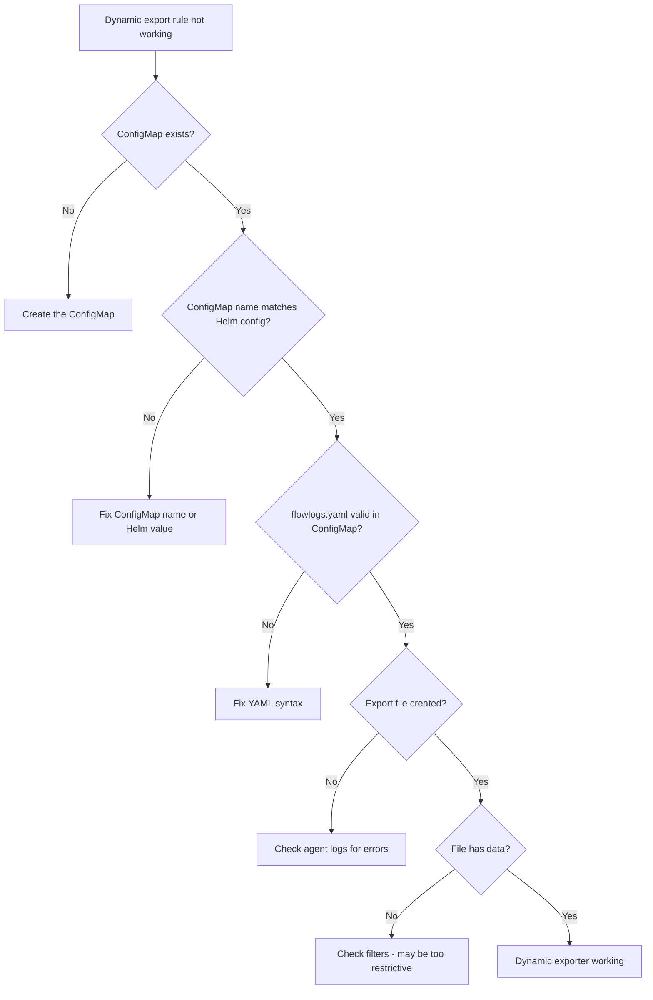

# How to Troubleshoot Dynamic Exporter Configuration in Cilium Hubble

Author: [nawazdhandala](https://github.com/nawazdhandala)

Tags: Cilium, Hubble, Dynamic Exporter, Troubleshooting, Observability

Description: Diagnose and resolve issues with Cilium Hubble's dynamic exporter configuration, including ConfigMap parsing failures, export file problems, and rule synchronization issues.

---

## Introduction

The dynamic exporter in Hubble allows runtime changes to flow export rules through a Kubernetes ConfigMap. While this eliminates the need for agent restarts, it introduces a new class of issues: ConfigMap synchronization delays, YAML parsing errors, file path conflicts, and stale exporters that should have expired.

Troubleshooting the dynamic exporter requires checking the full pipeline from ConfigMap changes through Cilium agent processing to actual file output. Unlike static configuration where issues are caught at startup, dynamic configuration errors can occur silently at runtime.

This guide provides a systematic approach to diagnosing dynamic exporter issues.

## Prerequisites

- Kubernetes cluster with Cilium and dynamic Hubble exporter enabled
- kubectl access to kube-system namespace
- Familiarity with Hubble exporter concepts
- Access to Cilium agent logs
- Python 3 with PyYAML installed for the validation scripts

## Diagnosing ConfigMap Synchronization Issues

The most common problem is changes not being picked up:

```bash
# Check if the ConfigMap exists with expected content

kubectl -n kube-system get configmap cilium-flowlog-config -o yaml

# Check the ConfigMap resource version (changes update this opaque value)
kubectl -n kube-system get configmap cilium-flowlog-config \
  -o jsonpath='{.metadata.resourceVersion}'

# Verify Cilium is configured to watch the correct ConfigMap name
helm get values cilium -n kube-system -o yaml | grep -A5 "dynamic:"

# Check Cilium agent logs for ConfigMap watch events
kubectl -n kube-system logs ds/cilium --tail=100 | grep -i "configmap\|dynamic.*export"

# ConfigMap updates should be reflected after Kubernetes propagates the volume update
```


```mermaid
flowchart TD
    A[Dynamic export rule not working] --> B{ConfigMap exists?}
    B -->|No| C[Create the ConfigMap]
    B -->|Yes| D{ConfigMap name matches Helm config?}
    D -->|No| E[Fix ConfigMap name or Helm value]
    D -->|Yes| F{flowlogs.yaml valid in ConfigMap?}
    F -->|No| G[Fix YAML syntax]
    F -->|Yes| H{Export file created?}
    H -->|No| I[Check agent logs for errors]
    H -->|Yes| J{File has data?}
    J -->|No| K[Check filters - may be too restrictive]
    J -->|Yes| L[Dynamic exporter working]
```

## Fixing YAML Parse Errors

Invalid YAML in the ConfigMap is a frequent cause of silent failures:

```bash
# Validate flowlogs.yaml in the ConfigMap
python3 - <<'PY' < <(kubectl -n kube-system get configmap cilium-flowlog-config -o json)
import json, sys
try:
    import yaml
except ImportError:
    print('ERROR: install PyYAML first, for example: python3 -m pip install PyYAML', file=sys.stderr)
    sys.exit(1)

cm = json.load(sys.stdin)
raw = cm.get('data', {}).get('flowlogs.yaml', '')
try:
    parsed = yaml.safe_load(raw) or {}
except yaml.YAMLError as e:
    print(f'ERROR: invalid YAML - {e}')
    sys.exit(1)

flow_logs = parsed.get('flowLogs', [])
if not isinstance(flow_logs, list):
    print('ERROR: flowLogs must be a list')
    sys.exit(1)

for index, cfg in enumerate(flow_logs):
    name = cfg.get('name', f'index-{index}')
    missing = [field for field in ['name', 'filePath'] if field not in cfg]
    if missing:
        print(f'WARNING {name}: missing required fields: {missing}')
    else:
        print(f'OK {name}: valid YAML with filePath={cfg["filePath"]}')
PY

# Common YAML mistakes in ConfigMaps:
# 1. Wrong indentation under flowLogs
# 2. Missing dash before each exporter entry
# 3. Unquoted timestamp values for the end field
# 4. Using a top-level list instead of flowLogs:
```

Fix invalid YAML:

```bash
# Extract, fix, and reapply
kubectl -n kube-system get configmap cilium-flowlog-config -o jsonpath='{.data.flowlogs\.yaml}' > /tmp/flowlogs.yaml

# Validate
python3 - <<'PY'
import sys
try:
    import yaml
except ImportError:
    print('ERROR: install PyYAML first, for example: python3 -m pip install PyYAML', file=sys.stderr)
    sys.exit(1)

with open('/tmp/flowlogs.yaml') as f:
    yaml.safe_load(f)
print('YAML is valid')
PY

# Fix the YAML, then update the ConfigMap
kubectl -n kube-system create configmap cilium-flowlog-config \
  --from-file=flowlogs.yaml=/tmp/flowlogs.yaml \
  --dry-run=client -o yaml | kubectl apply -f -
```

## Resolving File Path Conflicts

Multiple dynamic exporters writing to the same path can produce interleaved output:

```bash
# Check for duplicate file paths across all export rules
python3 - <<'PY' < <(kubectl -n kube-system get configmap cilium-flowlog-config -o json)
import json, sys
from collections import Counter
try:
    import yaml
except ImportError:
    print('ERROR: install PyYAML first, for example: python3 -m pip install PyYAML', file=sys.stderr)
    sys.exit(1)

cm = json.load(sys.stdin)
paths = Counter()
cfg = yaml.safe_load(cm.get('data', {}).get('flowlogs.yaml', '')) or {}
for flow_log in cfg.get('flowLogs', []):
    path = flow_log.get('filePath', 'unknown')
    paths[path] += 1

for path, count in paths.items():
    if count > 1:
        print(f'CONFLICT: {path} used by {count} exporters')
    else:
        print(f'OK: {path}')
PY

# Also check for conflicts with the static exporter
static_path=$(helm get values cilium -n kube-system -o yaml | grep -A20 "static:" | grep filePath | head -1 | awk '{print $2}')
echo "Static exporter path: $static_path"
```

## Debugging Expired Exporters

Exporters with an `end` time should stop automatically:

```bash
# Check expiration times for all dynamic exporters
python3 - <<'PY' < <(kubectl -n kube-system get configmap cilium-flowlog-config -o json)
import json, sys
from datetime import datetime, timezone
try:
    import yaml
except ImportError:
    print('ERROR: install PyYAML first, for example: python3 -m pip install PyYAML', file=sys.stderr)
    sys.exit(1)

def parse_time(value):
    return datetime.fromisoformat(value.replace('Z', '+00:00')).astimezone(timezone.utc)

cm = json.load(sys.stdin)
cfg = yaml.safe_load(cm.get('data', {}).get('flowlogs.yaml', '')) or {}
now = datetime.now(timezone.utc)
for index, flow_log in enumerate(cfg.get('flowLogs', [])):
    name = flow_log.get('name', f'index-{index}')
    end = flow_log.get('end')
    if not end:
        print(f'PERMANENT: {name}')
        continue
    try:
        end_time = parse_time(str(end))
        if end_time < now:
            print(f'EXPIRED: {name} (ended {end})')
        else:
            print(f'ACTIVE: {name} (expires {end})')
    except ValueError:
        print(f'ERROR: {name} - invalid end timestamp: {end}')
PY

# Clean up expired rules
tmpfile=$(mktemp)
python3 - <<'PY' < <(kubectl -n kube-system get configmap cilium-flowlog-config -o json) > "$tmpfile"
import json, sys
from datetime import datetime, timezone
try:
    import yaml
except ImportError:
    print('ERROR: install PyYAML first, for example: python3 -m pip install PyYAML', file=sys.stderr)
    sys.exit(1)

def parse_time(value):
    return datetime.fromisoformat(value.replace('Z', '+00:00')).astimezone(timezone.utc)

cm = json.load(sys.stdin)
cfg = yaml.safe_load(cm.get('data', {}).get('flowlogs.yaml', '')) or {}
now = datetime.now(timezone.utc)
flow_logs = cfg.get('flowLogs', [])
kept = []
removed = []
for flow_log in flow_logs:
    end = flow_log.get('end')
    if end:
        try:
            if parse_time(str(end)) < now:
                removed.append(flow_log.get('name', flow_log.get('filePath', 'unnamed')))
                continue
        except ValueError:
            pass
    kept.append(flow_log)

if removed:
    cfg['flowLogs'] = kept
    cm['data']['flowlogs.yaml'] = yaml.safe_dump(cfg, sort_keys=False)
    cm['metadata'].pop('resourceVersion', None)
    json.dump(cm, sys.stdout)
    print(f'\nRemoved {len(removed)} expired rules', file=sys.stderr)
else:
    print('No expired rules to clean up', file=sys.stderr)
PY
if [ -s "$tmpfile" ]; then
  kubectl apply -f "$tmpfile"
fi
rm -f "$tmpfile"
```

## Verification

After fixing dynamic exporter issues:

```bash
# 1. flowlogs.yaml is valid YAML
python3 - <<'PY' < <(kubectl -n kube-system get configmap cilium-flowlog-config -o json)
import json, sys
try:
    import yaml
except ImportError:
    print('ERROR: install PyYAML first, for example: python3 -m pip install PyYAML', file=sys.stderr)
    sys.exit(1)

cm = json.load(sys.stdin)
cfg = yaml.safe_load(cm.get('data', {}).get('flowlogs.yaml', '')) or {}
flow_logs = cfg.get('flowLogs', [])
print(f'{len(flow_logs)} rules, 0 YAML errors')
PY

# 2. Export files exist and are growing
kubectl -n kube-system exec ds/cilium -- sh -c 'ls -la /var/run/cilium/hubble/*.log'

# 3. No file path conflicts
# (use the conflict check script from above)

# 4. Agent logs show no export errors
kubectl -n kube-system logs ds/cilium --tail=30 | grep -i "export"

# 5. Exported data matches filter expectations
for file in $(kubectl -n kube-system exec ds/cilium -- sh -c 'ls /var/run/cilium/hubble/*.log 2>/dev/null'); do
  echo "=== $file ==="
  kubectl -n kube-system exec ds/cilium -- tail -2 $file 2>/dev/null | head -2
done
```

## Troubleshooting

- **ConfigMap changes take too long**: Dynamic exporter changes should be reflected after Kubernetes propagates the ConfigMap volume update. Cilium documentation notes this can take up to about 60 seconds.

- **Old export files not cleaned up**: The dynamic exporter does not delete old files when a rule is removed. Clean up manually or with a CronJob.

- **Agent restart loses dynamic config**: The ConfigMap is persistent, so the agent will re-read it on startup. However, in-progress write state is lost.

- **Cannot create ConfigMap in kube-system**: Check RBAC permissions. You need `create` and `update` permissions for ConfigMaps in kube-system.

## Conclusion

Dynamic exporter troubleshooting focuses on three areas: ConfigMap synchronization (is the change being picked up?), YAML validity (is the configuration parseable?), and file output (is data being written correctly?). Most issues are caused by YAML syntax errors or ConfigMap name mismatches. Use the validation scripts in this guide to quickly identify and fix dynamic exporter problems.
