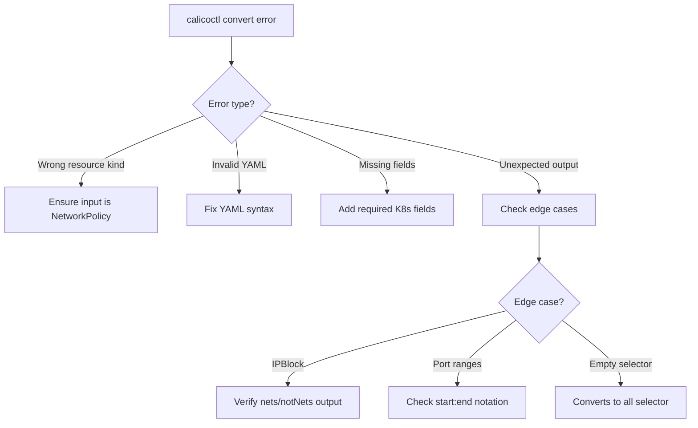

# How to Troubleshoot Errors in calicoctl convert

Author: [nawazdhandala](https://github.com/nawazdhandala)

Tags: Calico, Kubernetes, Troubleshooting, calicoctl, Migration

Description: Diagnose and fix common calicoctl convert errors including unsupported resource types, invalid input formats, and conversion edge cases.

---

## Introduction

The `calicoctl convert` command transforms Kubernetes NetworkPolicy resources into Calico format. While straightforward for simple policies, it can fail or produce unexpected results with complex policies that use features like IPBlock ranges, port ranges, or unusual selector combinations.

Understanding the common error patterns helps you work through conversion issues efficiently and produce correct Calico policies from any Kubernetes NetworkPolicy input.

## Prerequisites

- calicoctl v3.27 or later
- Kubernetes NetworkPolicy YAML files
- Basic understanding of both K8s and Calico policy formats

## Error: Unsupported Resource Kind

```bash
# Error: trying to convert a non-NetworkPolicy resource
calicoctl convert -f deployment.yaml
# Error: cannot convert resource of kind "Deployment"

# Fix: calicoctl convert only works with Kubernetes NetworkPolicy
# Verify the input file
python3 -c "import yaml; doc=yaml.safe_load(open('input.yaml')); print(f\"Kind: {doc['kind']}, API: {doc['apiVersion']}\")"

# Ensure it's a networking.k8s.io/v1 NetworkPolicy
cat > valid-input.yaml <<EOF
apiVersion: networking.k8s.io/v1
kind: NetworkPolicy
metadata:
  name: my-policy
  namespace: default
spec:
  podSelector:
    matchLabels:
      app: web
  policyTypes:
    - Ingress
  ingress:
    - from:
        - podSelector:
            matchLabels:
              role: frontend
EOF

calicoctl convert -f valid-input.yaml -o yaml
```

## Error: Invalid YAML Input

```bash
# Error: malformed YAML
calicoctl convert -f broken.yaml
# Error: error parsing input

# Fix: Validate YAML syntax first
python3 -c "import yaml; yaml.safe_load(open('broken.yaml'))"
# Fix any syntax errors, then retry
```

## Error: Missing Required Fields

```bash
# Error: missing podSelector
cat > missing-selector.yaml <<EOF
apiVersion: networking.k8s.io/v1
kind: NetworkPolicy
metadata:
  name: test
  namespace: default
spec:
  policyTypes:
    - Ingress
  ingress:
    - from:
        - podSelector: {}
EOF

# This should work because empty podSelector selects all pods
calicoctl convert -f missing-selector.yaml -o yaml

# If it fails, add explicit podSelector
# podSelector: {} means "all pods in the namespace"
```

## Handling IPBlock Conversion

IPBlock selectors convert to Calico's nets/notNets format:

```yaml
# k8s-ipblock.yaml
apiVersion: networking.k8s.io/v1
kind: NetworkPolicy
metadata:
  name: allow-external
  namespace: default
spec:
  podSelector:
    matchLabels:
      app: api
  policyTypes:
    - Ingress
  ingress:
    - from:
        - ipBlock:
            cidr: 203.0.113.0/24
            except:
              - 203.0.113.128/25
      ports:
        - protocol: TCP
          port: 443
```

```bash
# Convert - IPBlock becomes nets/notNets
calicoctl convert -f k8s-ipblock.yaml -o yaml
```

Expected output includes:

```yaml
ingress:
  - action: Allow
    protocol: TCP
    source:
      nets:
        - 203.0.113.0/24
      notNets:
        - 203.0.113.128/25
    destination:
      ports:
        - 443
```

## Handling Port Range Conversion

```yaml
# k8s-port-range.yaml
apiVersion: networking.k8s.io/v1
kind: NetworkPolicy
metadata:
  name: allow-high-ports
  namespace: default
spec:
  podSelector:
    matchLabels:
      app: backend
  policyTypes:
    - Ingress
  ingress:
    - ports:
        - protocol: TCP
          port: 8000
          endPort: 9000
```

```bash
# Convert port ranges
calicoctl convert -f k8s-port-range.yaml -o yaml
# Calico format uses "start:end" notation for port ranges
# Expected: ports: ["8000:9000"]
```

## Debugging Conversion Output

```bash
#!/bin/bash
# debug-convert.sh
# Compare K8s and Calico policy side by side

set -euo pipefail

INPUT="${1:?Usage: $0 <k8s-netpol.yaml>}"

echo "=== Original Kubernetes NetworkPolicy ==="
cat "$INPUT"
echo ""
echo "=== Converted Calico NetworkPolicy ==="
calicoctl convert -f "$INPUT" -o yaml
echo ""
echo "=== Key Differences ==="
python3 -c "
import yaml

with open('$INPUT') as f:
    k8s = yaml.safe_load(f)

print(f\"K8s API: {k8s['apiVersion']}\")
print(f\"K8s podSelector: {k8s['spec'].get('podSelector', {})}\")
print(f\"K8s policyTypes: {k8s['spec'].get('policyTypes', [])}\")
print(f\"K8s ingress rules: {len(k8s['spec'].get('ingress', []))}\")
print(f\"K8s egress rules: {len(k8s['spec'].get('egress', []))}\")
"
```



## Verification

```bash
# Validate the converted output
calicoctl convert -f k8s-netpol.yaml -o yaml | calicoctl validate -f -

# Compare behavior by applying both
kubectl apply -f k8s-netpol.yaml
calicoctl apply -f calico-netpol.yaml

# Test connectivity is the same under both policies
kubectl exec deploy/frontend -- curl -s --max-time 5 http://backend:8080/health
```

## Troubleshooting

- **Conversion produces empty ingress/egress**: The original K8s policy may have used an empty rule (which means "allow all"). Calico converts this differently. Review the original policy intent.
- **Selector looks different after conversion**: Calico uses `==` syntax while K8s uses `matchLabels`. The behavior is identical; only the syntax differs.
- **Named ports not converted**: Calico may not resolve named ports during conversion. Replace named ports with numeric ports in the converted output.
- **Multi-document YAML partially converts**: Convert each document separately if the multi-document file contains mixed resource types.

## Conclusion

Troubleshooting calicoctl convert errors requires understanding both Kubernetes and Calico NetworkPolicy formats. The most common issues stem from wrong resource types, invalid YAML, and edge cases around IPBlock and port ranges. By validating input before conversion and output after, you ensure reliable policy migration from Kubernetes to Calico format.
