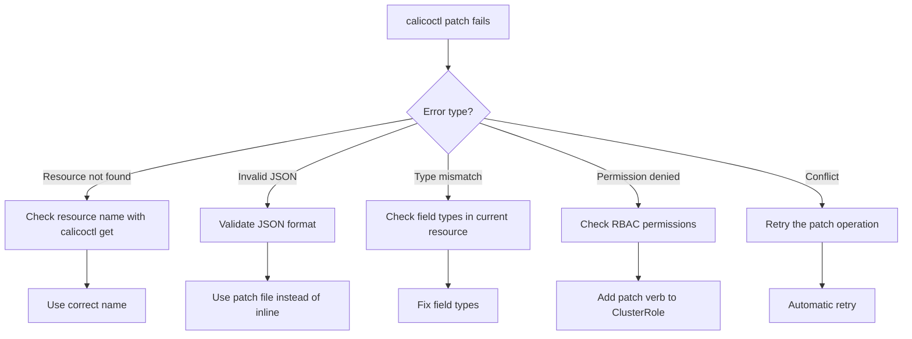

# How to Troubleshoot Errors in calicoctl patch

Author: [nawazdhandala](https://github.com/nawazdhandala)

Tags: Calico, Kubernetes, Troubleshooting, Calicoctl, Network Policy

Description: A systematic guide to diagnosing and fixing common calicoctl patch errors including merge conflicts, invalid field paths, resource not found, and permission issues.

---

## Introduction

The `calicoctl patch` command applies partial updates to existing Calico resources without needing to specify the entire resource definition. While this makes targeted changes convenient, it also introduces unique error scenarios that differ from `apply` or `replace` operations. Patch errors often relate to incorrect JSON merge paths, type mismatches, or conflicts with the existing resource state.

Understanding the common error patterns and their root causes helps you resolve calicoctl patch failures quickly and avoid introducing misconfigurations into your Calico deployment.

This guide covers the most common calicoctl patch errors, their causes, and step-by-step resolution procedures.

## Prerequisites

- A running Kubernetes cluster with Calico installed
- calicoctl v3.27 or later
- kubectl access to the cluster
- Basic understanding of JSON merge patch and strategic merge patch

## Error: Resource Not Found

```bash
# Error example
calicoctl patch globalnetworkpolicy my-policy -p '{"spec":{"order":100}}'
# Error: resource does not exist: GlobalNetworkPolicy(my-policy)

# Diagnosis: Verify the resource exists
export DATASTORE_TYPE=kubernetes
calicoctl get globalnetworkpolicies | grep my-policy

# Fix: Use the correct resource name (case-sensitive)
calicoctl get globalnetworkpolicies -o wide
# Find the exact name and retry
calicoctl patch globalnetworkpolicy correct-policy-name -p '{"spec":{"order":100}}'
```

## Error: Invalid Patch Format

```bash
# Error example - invalid JSON
calicoctl patch globalnetworkpolicy my-policy -p '{spec: {order: 100}}'
# Error: invalid character 's' looking for beginning of object key

# Fix: Use valid JSON with quoted keys
calicoctl patch globalnetworkpolicy my-policy -p '{"spec":{"order":100}}'

# For complex patches, use a file instead of inline JSON
cat > /tmp/patch.yaml <<EOF
spec:
  order: 100
  selector: app == "web"
EOF

calicoctl patch globalnetworkpolicy my-policy --patch-file=/tmp/patch.yaml
```

## Error: Type Mismatch on Patch

```bash
# Error example - string where number expected
calicoctl patch globalnetworkpolicy my-policy -p '{"spec":{"order":"100"}}'
# Error: spec.order: Invalid type. Expected: number, got: string

# Fix: Use the correct type
calicoctl patch globalnetworkpolicy my-policy -p '{"spec":{"order":100}}'

# Check the expected types by getting the current resource
calicoctl get globalnetworkpolicy my-policy -o yaml
```

## Error: Permission Denied

```bash
# Error example
calicoctl patch felixconfiguration default -p '{"spec":{"logSeverityScreen":"Debug"}}'
# Error: forbidden: User cannot patch resource "felixconfigurations"

# Diagnosis: Check RBAC permissions
kubectl auth can-i patch felixconfigurations.projectcalico.org

# Fix: Add the patch verb to the RBAC role
cat <<EOF | kubectl apply -f -
apiVersion: rbac.authorization.k8s.io/v1
kind: ClusterRole
metadata:
  name: calico-patch-role
rules:
  - apiGroups: ["projectcalico.org"]
    resources: ["felixconfigurations", "globalnetworkpolicies", "networkpolicies"]
    verbs: ["get", "list", "patch"]
EOF
```

## Error: Conflict on Update

```bash
# Error example - resource was modified between get and patch
calicoctl patch globalnetworkpolicy my-policy -p '{"spec":{"order":200}}'
# Error: update conflict

# Fix: Retry the patch operation (conflicts are usually transient)
# The patch will use the latest version automatically on retry
calicoctl patch globalnetworkpolicy my-policy -p '{"spec":{"order":200}}'
```

## Debugging Complex Patches

For complex patch operations, use a step-by-step debugging approach:

```bash
export DATASTORE_TYPE=kubernetes

# Step 1: Get the current resource state
calicoctl get globalnetworkpolicy my-policy -o yaml > /tmp/current.yaml

# Step 2: Create the patch file
cat > /tmp/patch.json <<'EOF'
{
  "spec": {
    "ingress": [
      {
        "action": "Allow",
        "protocol": "TCP",
        "source": {
          "selector": "role == \"frontend\""
        },
        "destination": {
          "ports": [8080]
        }
      }
    ]
  }
}
EOF

# Step 3: Preview the merged result
python3 -c "
import json, yaml

current = yaml.safe_load(open('/tmp/current.yaml'))
patch = json.load(open('/tmp/patch.json'))

# Simulate merge
def deep_merge(base, patch):
    for key, value in patch.items():
        if key in base and isinstance(base[key], dict) and isinstance(value, dict):
            deep_merge(base[key], value)
        else:
            base[key] = value
    return base

result = deep_merge(current, patch)
print(yaml.dump(result, default_flow_style=False))
"

# Step 4: Apply the patch
calicoctl patch globalnetworkpolicy my-policy --patch-file=/tmp/patch.json
```



## Verification

```bash
export DATASTORE_TYPE=kubernetes

# Verify the patch was applied correctly
calicoctl get globalnetworkpolicy my-policy -o yaml

# Compare specific fields
calicoctl get globalnetworkpolicy my-policy -o json | python3 -c "
import sys, json
policy = json.load(sys.stdin)
print(f\"Order: {policy['spec'].get('order', 'not set')}\")
print(f\"Selector: {policy['spec'].get('selector', 'not set')}\")
"

# Verify the patched policy is being enforced
calicoctl get globalnetworkpolicies -o wide
```

## Troubleshooting

- **Patch succeeds but change is not visible**: The patch may have targeted the wrong field path. Verify the full resource YAML to check where the change landed.
- **Array fields replaced instead of merged**: JSON merge patch replaces arrays entirely. If you need to add items to an array, get the current array, add items, and patch with the complete array.
- **"unknown field" error**: The field name is misspelled or not supported in your Calico version. Check the Calico resource API reference for valid field names.
- **Patch applied but connectivity unchanged**: Felix may need a few seconds to process the updated policy. Check Felix logs for policy update events.

## Conclusion

Troubleshooting calicoctl patch errors requires understanding both the patch format (JSON merge patch) and the target resource structure. The most common issues -- invalid JSON, wrong field types, missing resources, and RBAC gaps -- are quickly resolved once identified. Use the debugging workflow of getting current state, previewing the merge, and validating after application to ensure patches behave as expected.
