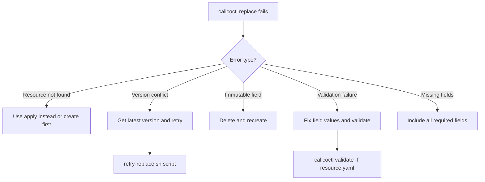

# How to Troubleshoot Errors in calicoctl replace

Author: [nawazdhandala](https://github.com/nawazdhandala)

Tags: Calico, Kubernetes, Troubleshooting, calicoctl, Network Policy

Description: A systematic guide to diagnosing and fixing common calicoctl replace errors including resource not found, version conflicts, validation failures, and field immutability issues.

---

## Introduction

The `calicoctl replace` command replaces an entire Calico resource with a new definition. Because it requires the resource to already exist and replaces it completely, it has unique error modes compared to `apply` or `patch`. Common errors include resource not found, resource version conflicts, immutable field changes, and validation failures.

Understanding these error patterns and their root causes helps you resolve calicoctl replace failures quickly and choose the right command for each situation.

This guide covers the most common calicoctl replace errors with specific diagnostic steps and solutions.

## Prerequisites

- A running Kubernetes cluster with Calico installed
- calicoctl v3.27 or later
- kubectl access to the cluster
- Basic understanding of Calico resource lifecycle

## Error: Resource Does Not Exist

```bash
# Error
calicoctl replace -f policy.yaml
# Error: resource does not exist: GlobalNetworkPolicy(my-new-policy)

# Diagnosis: The resource must exist before using replace
export DATASTORE_TYPE=kubernetes
calicoctl get globalnetworkpolicies | grep my-new-policy

# Fix Option 1: Use apply instead (creates or updates)
calicoctl apply -f policy.yaml

# Fix Option 2: Create first, then replace
calicoctl create -f policy.yaml
# Later, for updates:
calicoctl replace -f policy-updated.yaml
```

## Error: Resource Version Conflict

```bash
# Error
calicoctl replace -f policy.yaml
# Error: update conflict: resource modified by another process

# Diagnosis: Another process or user modified the resource between
# your get and replace operations

# Fix: Get the latest version and merge changes
calicoctl get globalnetworkpolicy my-policy -o yaml > /tmp/latest.yaml
# Edit /tmp/latest.yaml with your changes
calicoctl replace -f /tmp/latest.yaml
```

For automated retries:

```bash
#!/bin/bash
# retry-replace.sh
# Retries calicoctl replace on version conflict

set -euo pipefail

export DATASTORE_TYPE=kubernetes
RESOURCE_FILE="${1:?Usage: $0 <resource-file.yaml>}"
MAX_RETRIES=3

KIND=$(python3 -c "import yaml; print(yaml.safe_load(open('$RESOURCE_FILE'))['kind'])")
NAME=$(python3 -c "import yaml; print(yaml.safe_load(open('$RESOURCE_FILE'))['metadata']['name'])")

for attempt in $(seq 1 $MAX_RETRIES); do
  echo "Attempt ${attempt}/${MAX_RETRIES}..."

  # Get latest resource version
  CURRENT=$(calicoctl get "$KIND" "$NAME" -o json)
  RESOURCE_VERSION=$(echo "$CURRENT" | python3 -c "import sys,json; print(json.load(sys.stdin)['metadata']['resourceVersion'])")

  # Update resource version in the file
  python3 -c "
import yaml, json
with open('$RESOURCE_FILE') as f:
    doc = yaml.safe_load(f)
doc['metadata']['resourceVersion'] = '$RESOURCE_VERSION'
with open('/tmp/replace-with-version.yaml', 'w') as f:
    yaml.dump(doc, f, default_flow_style=False)
"

  if calicoctl replace -f /tmp/replace-with-version.yaml 2>/dev/null; then
    echo "Replace succeeded on attempt $attempt"
    exit 0
  fi

  echo "Conflict on attempt $attempt, retrying..."
  sleep 1
done

echo "Failed after $MAX_RETRIES attempts"
exit 1
```

## Error: Immutable Field Change

```bash
# Error - trying to change the CIDR of an IPPool
calicoctl replace -f ippool-new-cidr.yaml
# Error: field is immutable: spec.cidr

# Diagnosis: Some fields cannot be changed after creation
# IPPool CIDR and name are immutable

# Fix: Delete and recreate (with careful migration)
calicoctl get ippool old-pool -o yaml > /tmp/old-pool-backup.yaml
calicoctl delete ippool old-pool
calicoctl create -f ippool-new-cidr.yaml
```

## Error: Validation Failure

```bash
# Error - invalid field value
calicoctl replace -f policy.yaml
# Error: spec.ingress[0].action: Unsupported value: "allow"

# Diagnosis: Field values are case-sensitive
# Fix: Use correct casing
# WRONG: "allow"  CORRECT: "Allow"
# WRONG: "deny"   CORRECT: "Deny"
# WRONG: "log"    CORRECT: "Log"

# Validate before replacing
calicoctl validate -f policy.yaml
```

## Error: Missing Required Fields

```bash
# Error - incomplete resource definition
calicoctl replace -f incomplete-policy.yaml
# Error: spec.selector: Required value

# Diagnosis: Replace requires the COMPLETE resource definition
# All required fields must be present

# Fix: Get the current resource as a starting point
calicoctl get globalnetworkpolicy my-policy -o yaml > /tmp/complete-policy.yaml
# Edit /tmp/complete-policy.yaml with all required fields
calicoctl replace -f /tmp/complete-policy.yaml
```



## Debugging Workflow

```bash
#!/bin/bash
# debug-replace.sh
# Diagnostic script for calicoctl replace failures

set -euo pipefail

export DATASTORE_TYPE=kubernetes
RESOURCE_FILE="${1:?Usage: $0 <resource-file.yaml>}"

KIND=$(python3 -c "import yaml; print(yaml.safe_load(open('$RESOURCE_FILE'))['kind'])")
NAME=$(python3 -c "import yaml; print(yaml.safe_load(open('$RESOURCE_FILE'))['metadata']['name'])")

echo "=== Replace Diagnostic for ${KIND}/${NAME} ==="

# Check 1: Resource exists?
echo "1. Checking if resource exists..."
if calicoctl get "$KIND" "$NAME" -o yaml > /tmp/current-resource.yaml 2>/dev/null; then
  echo "   EXISTS"
else
  echo "   DOES NOT EXIST - use 'calicoctl apply' instead"
  exit 1
fi

# Check 2: YAML valid?
echo "2. Validating YAML..."
calicoctl validate -f "$RESOURCE_FILE" && echo "   VALID" || echo "   INVALID"

# Check 3: Show differences
echo "3. Differences from current state:"
diff /tmp/current-resource.yaml "$RESOURCE_FILE" || true
```

## Verification

```bash
export DATASTORE_TYPE=kubernetes

# Verify the replacement was successful
calicoctl get globalnetworkpolicy my-policy -o yaml

# Compare with the intended state
diff <(calicoctl get globalnetworkpolicy my-policy -o yaml) policy.yaml

# Verify network behavior
kubectl exec deploy/test -- curl -s --max-time 5 http://backend:8080/health
```

## Troubleshooting

- **Replace succeeds but old fields persist**: This should not happen with replace (it overwrites entirely). If you see old fields, you may have used `apply` instead of `replace`. Verify with `calicoctl get <kind> <name> -o yaml`.
- **"metadata.resourceVersion: must be specified"**: Some datastores require the resourceVersion for replace. Get the current version first with `calicoctl get`.
- **Replace breaks existing connections**: Replace removes any fields not in the new definition. Ensure your replacement includes all needed ingress/egress rules, not just the new ones.
- **"unknown field" in replacement YAML**: Check for typos in field names. Use `calicoctl get <kind> <name> -o yaml` to see valid field names.

## Conclusion

Troubleshooting calicoctl replace errors comes down to understanding its strict requirements: the resource must exist, all fields must be present, immutable fields cannot change, and the resource version must be current. By using the diagnostic workflow to check each condition before replacing, you can prevent most errors. For version conflicts in automated environments, implement retry logic with fresh resource versions.
