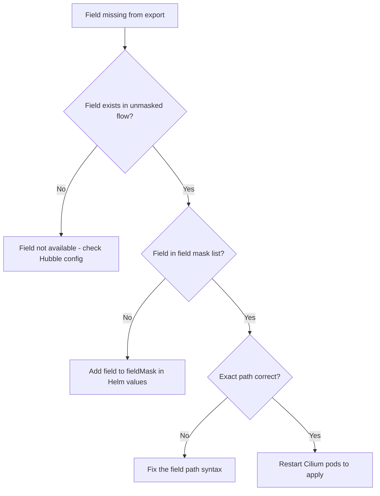

# How to Troubleshoot Field Mask in Cilium Hubble

Author: [nawazdhandala](https://github.com/nawazdhandala)

Tags: Cilium, Hubble, Field Mask, Troubleshooting, Observability

Description: Diagnose and resolve field mask configuration issues in Cilium Hubble, including missing fields, incorrect mask syntax, and downstream parsing failures.

---

## Introduction

Field mask problems in Hubble typically manifest as missing data in exported flows, unexpected fields appearing in output, or downstream log pipelines failing to parse the modified event structure. Since field masks change the shape of exported data, any misconfiguration can break integrations that depend on specific fields being present.

Troubleshooting field masks requires comparing the expected output with the actual output, validating the mask syntax against the Hubble flow protobuf definition, and testing downstream parsers with the masked data format.

This guide covers the common field mask issues and their solutions.

## Prerequisites

- Kubernetes cluster with Cilium and Hubble exporter enabled
- Field mask configured in Helm values
- kubectl access to Cilium pods
- Understanding of Hubble flow data structure

## Diagnosing Missing Fields

When expected fields are not in the exported data:

```bash
# Step 1: View a raw (unmasked) flow to see all available fields
hubble observe --last 1 -o json | python3 -c "
import json, sys

def print_fields(obj, prefix=''):
    if isinstance(obj, dict):
        for k, v in obj.items():
            full_key = f'{prefix}.{k}' if prefix else k
            if isinstance(v, dict):
                print_fields(v, full_key)
            elif isinstance(v, list):
                print(f'{full_key} (list)')
            else:
                print(f'{full_key} = {v}')

line = next(sys.stdin)
flow = json.loads(line)
print_fields(flow.get('flow', {}))
"

# Step 2: View the current field mask configuration
helm get values cilium -n kube-system -o yaml | grep -A30 fieldMask

# Step 3: Compare expected vs actual exported fields
kubectl -n kube-system exec ds/cilium -- head -1 /var/run/cilium/hubble/events.log | python3 -c "
import json, sys

def get_fields(obj, prefix=''):
    fields = set()
    if isinstance(obj, dict):
        for k, v in obj.items():
            full_key = f'{prefix}.{k}' if prefix else k
            fields.add(full_key)
            if isinstance(v, dict):
                fields.update(get_fields(v, full_key))
    return fields

flow = json.load(sys.stdin)
exported_fields = get_fields(flow.get('flow', {}))
print('Exported fields:')
for f in sorted(exported_fields):
    print(f'  {f}')
"
```



## Fixing Field Mask Syntax Issues

Field mask paths must match the Hubble flow protobuf field names exactly:

```bash
# Common syntax mistakes and corrections:

# WRONG: Using camelCase
# fieldMask: ["sourceNamespace", "destinationPodName"]

# CORRECT: Using dot notation with snake_case
# fieldMask: ["source.namespace", "destination.pod_name"]

# WRONG: Using nested paths that do not exist
# fieldMask: ["source.pod.name"]

# CORRECT: Using the actual field path
# fieldMask: ["source.pod_name"]

# WRONG: Trying to mask individual TCP flag fields
# fieldMask: ["l4.TCP.flags.SYN"]

# CORRECT: Include the entire TCP object
# fieldMask: ["l4.TCP"]

# Verify field names from the Hubble protobuf definition
# The primary fields are:
# time, source, destination, Type, node_name, verdict, drop_reason,
# l4, l7, reply, event_type, source_service, destination_service,
# Summary, IP, ethernet, interface, proxy_port, trace_observation_point
```

## Resolving Downstream Parser Failures

When your log pipeline breaks after applying field masks:

```bash
# Check the actual structure of masked events
kubectl -n kube-system exec ds/cilium -- head -5 /var/run/cilium/hubble/events.log | python3 -c "
import json, sys
for i, line in enumerate(sys.stdin, 1):
    event = json.loads(line)
    print(f'Event {i} structure:')
    print(json.dumps(event, indent=2, default=str)[:500])
    print('---')
"

# Compare with what your parser expects
# Common issues:
# 1. Parser expects 'IP' field but it was masked out
# 2. Parser expects nested objects that are now absent
# 3. Parser fails on null/missing values instead of missing keys

# Generate a sample file for testing your parser
kubectl -n kube-system exec ds/cilium -- head -100 /var/run/cilium/hubble/events.log > /tmp/hubble-sample.json
# Send this to your parser for testing
```

Fix by either updating the parser or the field mask:

```yaml
# If your parser requires specific fields, add them to the mask
hubble:
  export:
    static:
      fieldMask:
        # Fields your parser requires
        - time
        - source.namespace
        - source.pod_name
        - source.identity
        - destination.namespace
        - destination.pod_name
        - destination.identity
        - destination.port
        - verdict
        - drop_reason
        - l4.TCP
        - l4.UDP
        - Type
        - IP.source       # Add back if parser needs it
        - IP.destination   # Add back if parser needs it
```

## Debugging Empty Export Files

If the export file is empty after adding a field mask:

```bash
# Check if the exporter is running at all
kubectl -n kube-system logs ds/cilium --tail=50 | grep -i "export"

# Check if the issue is the field mask or the exporter
# Temporarily remove the field mask
helm upgrade cilium cilium/cilium -n kube-system \
  --reuse-values \
  --set hubble.export.static.fieldMask='{}'

kubectl -n kube-system rollout restart ds/cilium
kubectl -n kube-system rollout status ds/cilium

# Check if events appear now
sleep 30
kubectl -n kube-system exec ds/cilium -- wc -l /var/run/cilium/hubble/events.log

# If events appear without the mask, the mask configuration has a syntax error
```

## Verification

After fixing field mask issues:

```bash
# 1. Exported events contain expected fields
kubectl -n kube-system exec ds/cilium -- head -3 /var/run/cilium/hubble/events.log | python3 -c "
import json, sys
required_fields = ['time', 'source', 'destination', 'verdict']
for line in sys.stdin:
    flow = json.loads(line).get('flow', {})
    missing = [f for f in required_fields if f not in flow]
    if missing:
        print(f'MISSING: {missing}')
    else:
        print('All required fields present')
"

# 2. Excluded fields are not present
kubectl -n kube-system exec ds/cilium -- head -1 /var/run/cilium/hubble/events.log | python3 -c "
import json, sys
flow = json.loads(sys.stdin.readline()).get('flow', {})
unwanted = ['ethernet', 'IP']  # Adjust based on your mask
for field in unwanted:
    if field in flow:
        print(f'WARNING: {field} present in export')
    else:
        print(f'OK: {field} not in export')
"

# 3. Events are being written regularly
kubectl -n kube-system exec ds/cilium -- wc -l /var/run/cilium/hubble/events.log

# 4. Downstream parser can handle the format
kubectl -n kube-system exec ds/cilium -- head -10 /var/run/cilium/hubble/events.log | python3 -c "
import json, sys
success = 0
for line in sys.stdin:
    try:
        json.loads(line)
        success += 1
    except json.JSONDecodeError as e:
        print(f'Parse error: {e}')
print(f'{success} events parsed successfully')
"
```

## Troubleshooting

- **Field mask changes not taking effect**: The Cilium agent must be restarted after Helm upgrades that modify field masks. Run `kubectl -n kube-system rollout restart ds/cilium`.

- **Empty field values in export**: A field may be in the mask but empty for certain flow types. For example, `l7` is empty for L3/L4-only flows.

- **Performance not improved by field mask**: Field masks reduce export I/O but do not reduce the cost of capturing flows. Use monitor aggregation for CPU reduction.

- **Cannot find the right field name**: Use `hubble observe --last 1 -o json | python3 -m json.tool` to see the complete field structure and match paths exactly.

## Conclusion

Field mask troubleshooting centers on matching the mask configuration to the actual Hubble flow protobuf structure. Most issues are caused by incorrect field paths, missing pod restarts after configuration changes, or downstream parsers that cannot handle the modified event structure. Use the diagnostic approach in this guide -- compare unmasked vs masked output, validate syntax, and test downstream compatibility -- to resolve field mask issues efficiently.
