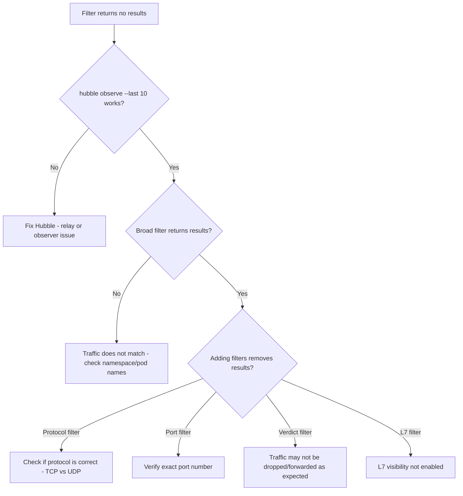

# How to Troubleshoot Filters in Cilium Hubble

Author: [nawazdhandala](https://github.com/nawazdhandala)

Tags: Cilium, Hubble, Filter, Troubleshooting, Observability

Description: Diagnose and fix Hubble filter issues including empty results, incorrect matching behavior, L7 filter failures, and exporter filter misconfiguration.

---

## Introduction

Hubble filters are powerful but can be confusing when they do not return the expected results. A filter that returns no data could mean the traffic does not exist, the filter syntax is wrong, the required observability features are not enabled, or the filter logic is not what you intended.

Troubleshooting filter issues requires understanding how filters compose (AND logic for CLI flags), how identity-based filtering works in Cilium, and what data is available at each observability layer (L3/L4 vs L7).

This guide systematically addresses the common filter problems you will encounter when working with Hubble.

## Prerequisites

- Kubernetes cluster with Cilium and Hubble enabled
- cilium and hubble CLI tools installed
- Active workloads generating network traffic
- Understanding of Hubble filter syntax

## Debugging Empty Filter Results

The most common complaint is that a filter returns no flows:

```bash
# Step 1: Verify Hubble is working at all (no filters)
hubble observe --last 10
# If this returns nothing, the issue is Hubble itself, not filters

# Step 2: Check with a broad filter
hubble observe --last 100 --namespace default
# If this returns nothing, there may be no traffic in that namespace

# Step 3: Generate test traffic
kubectl run curl-test --image=curlimages/curl --rm -it --restart=Never -- \
  curl -s http://kubernetes.default/healthz
# Then immediately check
hubble observe --last 20

# Step 4: Narrow down progressively
hubble observe --last 100  # All flows
hubble observe --last 100 --namespace default  # Namespace filter
hubble observe --last 100 --namespace default --protocol TCP  # Add protocol
hubble observe --last 100 --namespace default --protocol TCP --to-port 443  # Add port
```



## Fixing Identity and Label Mismatches

Hubble uses Cilium security identities for filtering. Pod names and labels must match exactly:

```bash
# Check how Hubble sees a specific pod's identity
kubectl -n kube-system exec ds/cilium -- cilium endpoint list -o json | python3 -c "
import json, sys
for ep in json.load(sys.stdin):
    labels = ep.get('status',{}).get('identity',{}).get('labels',[])
    k8s_labels = [l for l in labels if l.startswith('k8s:')]
    if k8s_labels:
        ns = ''
        pod = ''
        for l in labels:
            if l.startswith('k8s:io.kubernetes.pod.namespace='):
                ns = l.split('=')[1]
        name = ep.get('status',{}).get('external-identifiers',{}).get('pod-name','')
        print(f'{ns}/{name}: {k8s_labels[:3]}')
" | head -10

# Common mistake: using deployment name instead of pod name
# WRONG: --pod default/my-deployment
# RIGHT: --pod default/my-deployment-abc123-xyz
# BETTER: --to-workload my-deployment (uses label matching)

# Verify the exact pod name
kubectl get pods -n default -o name

# Use workload-based filtering instead of pod names
hubble observe --from-workload frontend --to-workload backend
```

## Resolving L7 Filter Problems

L7 filters (HTTP, DNS, gRPC) require additional configuration:

```bash
# Check if L7 visibility is enabled
kubectl -n kube-system exec ds/cilium -- cilium endpoint list -o json | python3 -c "
import json, sys
for ep in json.load(sys.stdin):
    proxy = ep.get('status',{}).get('policy',{}).get('proxy-statistics',[])
    if proxy:
        name = ep.get('status',{}).get('external-identifiers',{}).get('pod-name','')
        print(f'{name}: L7 proxy active - {len(proxy)} rules')
" | head -10

# If no endpoints have L7 proxy active, L7 filters won't work
# Enable L7 visibility with a CiliumNetworkPolicy
```

```yaml
# enable-l7-visibility.yaml
apiVersion: cilium.io/v2
kind: CiliumNetworkPolicy
metadata:
  name: l7-visibility
  namespace: default
spec:
  endpointSelector:
    matchLabels:
      app: my-app
  ingress:
    - fromEndpoints:
        - matchLabels: {}
      toPorts:
        - ports:
            - port: "8080"
              protocol: TCP
          rules:
            http:
              - method: ""  # Match all methods to enable visibility
```

```bash
kubectl apply -f enable-l7-visibility.yaml

# Now L7 filters should work
hubble observe --type l7 --namespace default --last 20
hubble observe --http-method GET --namespace default --last 20
hubble observe --http-status 500 --namespace default --last 20
```

## Fixing Exporter Filter Syntax

Exporter filters use a different JSON-based syntax that is error-prone:

```bash
# View current exporter filter configuration
helm get values cilium -n kube-system -o yaml | grep -A20 "export:"

# Common syntax errors:

# WRONG: Missing quotes around JSON
# allowList:
#   - {verdict: [DROPPED]}

# CORRECT: JSON string with proper quoting
# allowList:
#   - '{"verdict":["DROPPED"]}'

# WRONG: Using pod names instead of prefixes
# '{"source_pod":["my-exact-pod-name"]}'

# CORRECT: Using namespace prefix
# '{"source_pod":["production/"]}'

# Test exporter filters by checking the output
kubectl -n kube-system exec ds/cilium -- wc -l /var/run/cilium/hubble/events.log
# If the count is 0 or not growing, filters may be too restrictive

# Temporarily remove filters to verify export is working
helm upgrade cilium cilium/cilium -n kube-system \
  --reuse-values \
  --set hubble.export.static.allowList='{}'
```

## Verification

Confirm filters are working correctly:

```bash
# 1. Basic namespace filter
hubble observe --namespace kube-system --last 5 -o compact
# Should only show kube-system traffic

# 2. Verdict filter
hubble observe --verdict FORWARDED --last 5 -o compact
# Should only show forwarded traffic

# 3. Protocol filter
hubble observe --protocol UDP --last 5 -o compact
# Should only show UDP traffic (mostly DNS)

# 4. L7 filter (if L7 policies are applied)
hubble observe --type l7 --last 5 -o compact

# 5. Combined filter
hubble observe --namespace default --verdict DROPPED --last 100 -o json 2>/dev/null | python3 -c "
import json, sys
count = 0
for line in sys.stdin:
    f = json.loads(line)
    flow = f.get('flow',{})
    ns = flow.get('source',{}).get('namespace','') or flow.get('destination',{}).get('namespace','')
    verdict = flow.get('verdict','')
    assert 'default' in [flow.get('source',{}).get('namespace',''), flow.get('destination',{}).get('namespace','')]
    assert verdict == 'DROPPED'
    count += 1
print(f'Validated {count} flows - all match filter criteria')
"
```

## Troubleshooting

- **Filter matches too many flows**: CLI filters use AND logic. Add more filter criteria to narrow results. Use `--from-namespace` and `--to-namespace` instead of `--namespace` for directional filtering.

- **Workload filter does not match**: The workload name must match the Kubernetes Deployment/StatefulSet name, not the pod name. Check with `kubectl get deploy`.

- **DNS filter shows no results**: DNS traffic uses UDP port 53. Ensure you are not filtering for TCP when looking for DNS. Use `--to-port 53` without a protocol filter.

- **Exporter filter not taking effect**: Helm upgrade requires a pod restart for exporter configuration changes. Run `kubectl -n kube-system rollout restart ds/cilium`.

## Conclusion

Filter troubleshooting follows a simple pattern: start with no filters to confirm Hubble works, then add filters one at a time to identify which one causes the issue. Most filter problems are caused by incorrect pod names, missing L7 visibility configuration, or exporter filter syntax errors. Use the progressive narrowing approach described in this guide to efficiently debug any filter-related problem.
