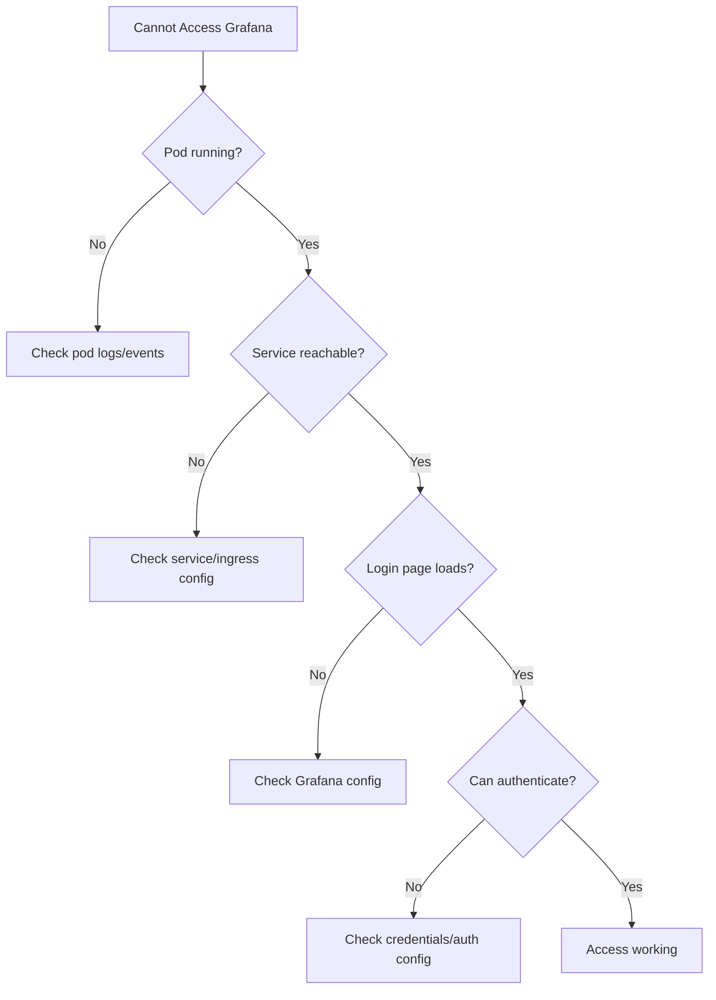

# Troubleshooting Grafana Access for Cilium Observability

Author: [nawazdhandala](https://github.com/nawazdhandala)

Tags: Cilium, Observability, Grafana, Troubleshooting, Monitoring

Description: Diagnose and resolve common Grafana access and display issues when visualizing Cilium observability data, including authentication failures, datasource errors, dashboard rendering problems, and...

---

## Introduction

Grafana issues with Cilium observability fall into three categories: access problems (cannot reach Grafana or authenticate), data problems (dashboards show no data or wrong data), and display problems (panels render incorrectly or alerts do not fire). Each category has distinct diagnostic approaches.

Access issues prevent users from seeing any data, data issues result in empty or inaccurate dashboards, and display issues make the data available but hard to interpret. This guide covers troubleshooting for all three categories.

## Prerequisites

- Grafana deployed in the Kubernetes cluster
- `kubectl` access to the monitoring namespace
- Grafana admin credentials
- Prometheus with Cilium metrics
- Browser developer tools for UI issues

## Diagnosing Access Issues

When users cannot reach or log into Grafana:

```bash
# Check Grafana pod status
kubectl get pods -n monitoring -l app.kubernetes.io/name=grafana

# Check Grafana logs for startup errors
kubectl logs -n monitoring deploy/grafana | tail -30

# Verify the Grafana service
kubectl get svc -n monitoring | grep grafana

# Test internal connectivity
kubectl run grafana-test --image=curlimages/curl --rm -it --restart=Never -- \
    curl -s -o /dev/null -w "%{http_code}" http://grafana.monitoring.svc:80/login

# Check if Ingress or port-forward is working
kubectl port-forward -n monitoring svc/grafana 3000:80 &
curl -s -o /dev/null -w "%{http_code}" http://localhost:3000/login
```

Authentication troubleshooting:

```bash
# Check default credentials
curl -s -u admin:admin http://localhost:3000/api/org

# If password was changed, check the secret
kubectl get secret -n monitoring grafana -o jsonpath='{.data.admin-password}' | base64 -d

# Reset admin password
kubectl exec -n monitoring deploy/grafana -- grafana-cli admin reset-admin-password newpassword

# Check for LDAP/OAuth configuration issues
kubectl logs -n monitoring deploy/grafana | grep -i "auth\|login\|ldap\|oauth"
```



## Fixing Datasource Connection Issues

When Grafana connects but shows no Cilium data:

```bash
# Check datasource health
curl -s -u admin:admin http://localhost:3000/api/datasources | jq '.[].name'
curl -s -u admin:admin http://localhost:3000/api/datasources/1/health | jq '.'

# Test Prometheus connectivity from Grafana pod
kubectl exec -n monitoring deploy/grafana -- \
    curl -s http://prometheus-server.monitoring.svc:9090/api/v1/query?query=up | head -100

# Check datasource URL configuration
curl -s -u admin:admin http://localhost:3000/api/datasources/1 | jq '{name: .name, url: .url, access: .access}'
```

Fix common datasource issues:

```bash
# Issue: Wrong Prometheus URL
# Symptoms: All dashboards show "No data"
curl -s -u admin:admin -X PUT http://localhost:3000/api/datasources/1 \
    -H "Content-Type: application/json" \
    -d '{"name":"Prometheus","type":"prometheus","url":"http://prometheus-server.monitoring.svc:9090","access":"proxy","isDefault":true}'

# Issue: Datasource not set as default
curl -s -u admin:admin http://localhost:3000/api/datasources | jq '.[] | {name: .name, isDefault: .isDefault}'

# Issue: Network policy blocks Grafana to Prometheus
kubectl apply -f - <<EOF
apiVersion: cilium.io/v2
kind: CiliumNetworkPolicy
metadata:
  name: allow-grafana-prometheus
  namespace: monitoring
spec:
  endpointSelector:
    matchLabels:
      app.kubernetes.io/name: grafana
  egress:
    - toEndpoints:
        - matchLabels:
            app: prometheus
      toPorts:
        - ports:
            - port: "9090"
              protocol: TCP
EOF
```

## Resolving Dashboard Rendering Problems

When dashboards load but panels show errors or wrong data:

```bash
# Check for panel query errors
# Open browser developer tools, Network tab, filter by "query"
# Look for 400/500 responses from /api/datasources/proxy/

# Test the query directly in Prometheus
curl -s "http://localhost:9090/api/v1/query?query=cilium_policy_l7_total" | jq '.data.result | length'

# Check that required metrics exist
curl -s "http://localhost:9090/api/v1/label/__name__/values" | jq '.data[] | select(startswith("cilium_"))' | head -20
curl -s "http://localhost:9090/api/v1/label/__name__/values" | jq '.data[] | select(startswith("hubble_"))' | head -20
```

Common panel issues:

```bash
# Issue: Rate calculation returns 0
# Cause: Not enough data points. Rate needs at least 2 scrapes within the range.
# Fix: Wait for 2x the scrape interval, or widen the time range

# Issue: Panel shows "too many data points"
# Fix: Increase the min step or reduce the time range

# Issue: Template variables show "No options found"
# Check: Does the label exist in Prometheus?
curl -s "http://localhost:9090/api/v1/label/namespace/values" | jq '.data'
```

## Fixing Permission Issues

When some users can access Grafana but not specific dashboards:

```bash
# Check user permissions
curl -s -u admin:admin http://localhost:3000/api/org/users | jq '.[] | {login: .login, role: .role}'

# Check dashboard permissions
DASHBOARD_UID=$(curl -s -u admin:admin http://localhost:3000/api/search?query=Cilium | jq -r '.[0].uid')
curl -s -u admin:admin "http://localhost:3000/api/dashboards/uid/$DASHBOARD_UID/permissions" | jq '.'

# Grant viewer access to a team
curl -s -u admin:admin -X POST "http://localhost:3000/api/dashboards/uid/$DASHBOARD_UID/permissions" \
    -H "Content-Type: application/json" \
    -d '{"items":[{"teamId":1,"permission":1}]}'
```

## Verification

Verify Grafana is fully operational:

```bash
# Check overall health
curl -s -u admin:admin http://localhost:3000/api/health | jq '.'

# Verify all datasources healthy
curl -s -u admin:admin http://localhost:3000/api/datasources | jq '.[] | {name: .name}' | while read ds; do
    echo "Checking: $ds"
done

# List all dashboards
curl -s -u admin:admin http://localhost:3000/api/search | jq '.[].title'

# Verify Cilium metrics in Grafana
curl -s -u admin:admin "http://localhost:3000/api/datasources/proxy/1/api/v1/query?query=cilium_endpoint_state" | jq '.data.result | length'
```

## Troubleshooting

**Problem: Grafana pod in CrashLoopBackOff**
Check logs for configuration errors: `kubectl logs -n monitoring deploy/grafana --previous`. Common causes include invalid datasource YAML, missing persistent volume, or incompatible plugin versions.

**Problem: Dashboard import fails**
Verify the dashboard JSON is valid and the datasource names match. Use the Grafana UI import (Dashboard > Import) rather than the API for better error messages.

**Problem: Alerts show "Pending" but never fire**
Check that the alert evaluation interval is shorter than the `for` duration. Also verify the notification channel is configured and tested.

**Problem: Grafana is slow to load dashboards**
Reduce the number of panels per dashboard, increase the query step interval, or add caching. Check Grafana pod resource limits.

## Conclusion

Troubleshooting Grafana for Cilium observability requires checking three layers: access (can users reach and authenticate to Grafana), data (are Prometheus metrics available through the datasource), and display (do panels render correctly with the right data). Most issues are configuration problems — wrong datasource URL, missing network policy allowing connectivity, or incorrect metric names in dashboard queries. Systematic checking of each layer identifies the failure point efficiently.
