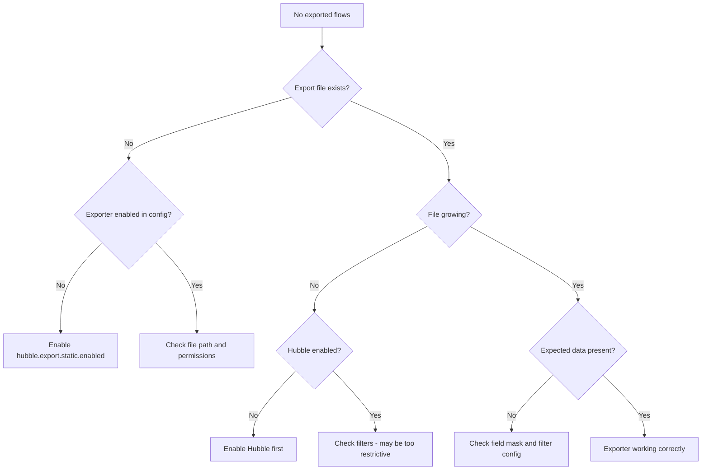

# How to Troubleshoot Cilium Hubble Exporter Configuration

Author: [nawazdhandala](https://github.com/nawazdhandala)

Tags: Cilium, Hubble, Exporter, Troubleshooting, Observability

Description: Diagnose and resolve common issues with the Cilium Hubble exporter, including missing exports, file rotation problems, filter misconfiguration, and data loss scenarios.

---

## Introduction

The Hubble exporter converts Cilium's real-time flow data into persistent records for external consumption. When the exporter misconfigures or fails silently, you lose the ability to perform historical analysis on network flows, which can be critical for incident response and compliance requirements.

Exporter problems often manifest as missing data rather than visible errors. The exporter may be running but not capturing the flows you expect, or it may be dropping events due to backpressure without any obvious indication. Systematic troubleshooting is essential.

This guide covers the most common Hubble exporter issues, from basic configuration validation to advanced debugging of filter logic and data loss scenarios.

## Prerequisites

- Kubernetes cluster with Cilium and Hubble exporter enabled
- kubectl access with exec permissions in kube-system
- cilium CLI installed
- Access to Cilium agent logs

## Verifying Exporter Status

Start by confirming the exporter is running and producing output:

```bash
# Check if the exporter is configured
kubectl -n kube-system exec ds/cilium -- cilium status --verbose | grep -i export

# Verify the export file exists
kubectl -n kube-system exec ds/cilium -- ls -la /var/run/cilium/hubble/events.log 2>&1

# Check if the file is being written to (run twice with a gap)
kubectl -n kube-system exec ds/cilium -- stat --format='%s %Y' /var/run/cilium/hubble/events.log
sleep 10
kubectl -n kube-system exec ds/cilium -- stat --format='%s %Y' /var/run/cilium/hubble/events.log

# If the file size and modification time haven't changed, the exporter is stalled
```



## Debugging Filter Configuration

Filters are the most common source of "missing data" issues:

```bash
# View the current exporter configuration
helm get values cilium -n kube-system -o yaml | grep -A30 "export:"

# Test if flows exist that should match your filters
hubble observe --last 100 -o json 2>/dev/null | python3 -c "
import json, sys
flows = []
for line in sys.stdin:
    f = json.loads(line)
    flows.append(f)

# Check how many flows would match an allow-list filter
production_flows = [f for f in flows if f.get('flow',{}).get('source',{}).get('namespace','') == 'production']
dropped_flows = [f for f in flows if f.get('flow',{}).get('verdict','') == 'DROPPED']
print(f'Total flows: {len(flows)}')
print(f'Production namespace flows: {len(production_flows)}')
print(f'Dropped flows: {len(dropped_flows)}')
"

# Read the actual exported file to see what passed through filters
kubectl -n kube-system exec ds/cilium -- wc -l /var/run/cilium/hubble/events.log
kubectl -n kube-system exec ds/cilium -- tail -10 /var/run/cilium/hubble/events.log
```

Common filter mistakes:

```bash
# WRONG: Using full pod name instead of prefix
# '{"source_pod":["production/my-exact-pod-name-abc123"]}'
# This won't match because pod names change with deployments

# CORRECT: Using namespace prefix
# '{"source_pod":["production/"]}'

# WRONG: Mixing up allow and deny list logic
# Allow list: only matching flows are exported
# Deny list: matching flows are excluded
# If both are set, allow list is checked first, then deny list
```

## Resolving File Rotation Issues

File rotation problems can cause disk space exhaustion or data loss:

```bash
# Check current file sizes
kubectl -n kube-system exec ds/cilium -- ls -la /var/run/cilium/hubble/events.log*

# Check disk usage on the Cilium pod
kubectl -n kube-system exec ds/cilium -- df -h /var/run/cilium/hubble/

# Check Helm values for rotation settings
helm get values cilium -n kube-system -o yaml | grep -E "fileMax|filePath"

# If rotation is not working, check for permission issues
kubectl -n kube-system exec ds/cilium -- touch /var/run/cilium/hubble/test-write 2>&1
kubectl -n kube-system exec ds/cilium -- rm -f /var/run/cilium/hubble/test-write
```

Fix rotation by updating Helm values:

```yaml
# Proper rotation configuration
hubble:
  export:
    static:
      enabled: true
      filePath: /var/run/cilium/hubble/events.log
      fileMaxSizeMb: 10    # Rotate at 10MB
      fileMaxBackups: 5     # Keep 5 backup files
```

```bash
helm upgrade cilium cilium/cilium -n kube-system \
  --reuse-values \
  --set hubble.export.static.fileMaxSizeMb=10 \
  --set hubble.export.static.fileMaxBackups=5
```

## Diagnosing Data Loss

Event loss occurs when the exporter cannot keep up with the flow rate:

```bash
# Check for lost events in metrics
kubectl -n kube-system exec ds/cilium -- \
  wget -qO- http://localhost:9962/metrics 2>/dev/null | grep hubble_export

# Compare Hubble observed flows vs exported flows
OBSERVED=$(hubble observe --last 1000 -o json 2>/dev/null | wc -l)
EXPORTED=$(kubectl -n kube-system exec ds/cilium -- wc -l /var/run/cilium/hubble/events.log | awk '{print $1}')
echo "Observed: $OBSERVED, Exported: $EXPORTED"

# Check Cilium agent logs for export errors
kubectl -n kube-system logs ds/cilium --tail=100 | grep -i "export\|hubble.*error"
```

If data loss is occurring, reduce the export volume:

```bash
# Add more restrictive filters
helm upgrade cilium cilium/cilium -n kube-system \
  --reuse-values \
  --set-json 'hubble.export.static.allowList=["{\"verdict\":[\"DROPPED\"]}"]'
```

## Verification

After fixing exporter issues, confirm everything works:

```bash
# 1. Export file is being written
kubectl -n kube-system exec ds/cilium -- tail -3 /var/run/cilium/hubble/events.log | python3 -m json.tool

# 2. Exported data matches expected filters
kubectl -n kube-system exec ds/cilium -- cat /var/run/cilium/hubble/events.log | python3 -c "
import json, sys
verdicts = {}
for line in sys.stdin:
    f = json.loads(line)
    v = f.get('flow',{}).get('verdict','UNKNOWN')
    verdicts[v] = verdicts.get(v,0) + 1
for v, count in sorted(verdicts.items()):
    print(f'{v}: {count}')
"

# 3. No lost events
kubectl -n kube-system exec ds/cilium -- \
  wget -qO- http://localhost:9962/metrics 2>/dev/null | grep "hubble_export_events_lost"

# 4. File rotation is working
kubectl -n kube-system exec ds/cilium -- ls -la /var/run/cilium/hubble/
```

## Troubleshooting

- **Export file exists but is empty**: Hubble may not be processing any flows. Verify with `hubble observe --last 5`. If Hubble itself has no flows, fix Hubble first.

- **JSON parse errors in exported data**: The file may have been corrupted during a pod restart. Delete the file and let it recreate: `kubectl -n kube-system exec ds/cilium -- rm /var/run/cilium/hubble/events.log`.

- **Export stops after file rotation**: This can happen with specific Cilium versions. Update to the latest patch release of your Cilium minor version.

- **Disk full on Cilium node**: The rotation settings are not being respected. As a quick fix, delete old backup files manually and then fix the Helm values.

## Conclusion

Troubleshooting the Hubble exporter requires checking each stage of the pipeline: configuration, filter logic, file writing, rotation, and data integrity. Most issues are caused by overly restrictive filters, incorrect file paths, or rotation misconfigurations. Use the diagnostic commands in this guide to systematically verify each component and restore your flow export pipeline.
