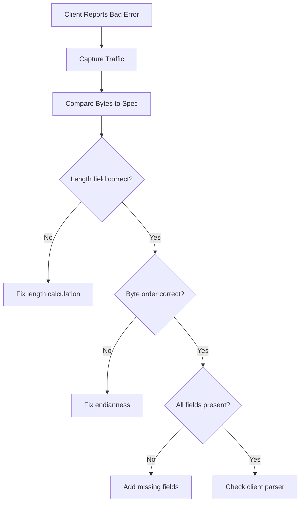

# Troubleshooting Error Response Injection in Cilium Network Security

Author: [nawazdhandala](https://github.com/nawazdhandala)

Tags: Cilium, Network Security, Error Injection, Troubleshooting, L7 Proxy

Description: Diagnose and fix common issues with error response injection in Cilium L7 parsers, including malformed responses, connection resets, client compatibility problems, and injection timing issues.

---

## Introduction

Error response injection in Cilium L7 parsers can fail in subtle ways. The response may be correctly formatted but delivered at the wrong time, properly timed but malformed, or technically correct but incompatible with specific client implementations. These issues result in confusing client behavior: unexpected connection resets, garbled error messages, or silent failures.

Troubleshooting injection problems requires examining the full data path from the policy decision through the injection mechanism to the client's reception and interpretation of the error. This guide covers systematic approaches to diagnosing each category of injection failure.

## Prerequisites

- Cilium cluster with L7 policy and error injection enabled
- Packet capture tools (tcpdump, Wireshark)
- Access to Cilium agent and Envoy proxy logs
- Protocol-aware traffic generator for testing
- Understanding of your protocol's error response format

## Diagnosing Malformed Error Responses

When clients report unparseable error responses:

```bash
# Capture traffic at the proxy level
kubectl exec -n kube-system ds/cilium -- \
    tcpdump -i any -w /tmp/inject-debug.pcap port 9000 -c 100

# Copy the capture for analysis
kubectl cp kube-system/<cilium-pod>:/tmp/inject-debug.pcap ./inject-debug.pcap

# Examine with tshark or Wireshark
tshark -r inject-debug.pcap -Y "tcp.port==9000" -x
```

Debug the error response builder:

```go
// Add hex dump logging to error response construction
func (p *Parser) buildErrorResponseDebug(command byte, requestID uint32, message string) []byte {
    resp := p.buildErrorResponse(command, requestID, message)

    log.WithFields(log.Fields{
        "responseLen": len(resp),
        "hexDump":     fmt.Sprintf("%x", resp),
        "command":     command,
        "requestID":   requestID,
    }).Debug("Built error response")

    return resp
}
```

Common formatting errors:

```go
// BUG: Length header does not include itself
bodyLen := 1 + 1 + 4 + 2 + len(message)
response := make([]byte, 4+bodyLen)
response[0] = byte((4 + bodyLen) >> 24) // WRONG: includes header in length
// FIX: Length field should contain only the body length
response[0] = byte(bodyLen >> 24)       // CORRECT: body length only

// BUG: Request ID byte order reversed
response[6] = byte(requestID)           // Should be highest byte
response[7] = byte(requestID >> 8)
response[8] = byte(requestID >> 16)
response[9] = byte(requestID >> 24)
// FIX: Big-endian order
response[6] = byte(requestID >> 24)
response[7] = byte(requestID >> 16)
response[8] = byte(requestID >> 8)
response[9] = byte(requestID)
```



## Fixing Connection Reset Issues

When error injection causes TCP resets instead of clean error delivery:

```bash
# Check for RST packets
kubectl exec -n kube-system ds/cilium -- \
    tcpdump -i any "tcp[tcpflags] & tcp-rst != 0 and port 9000" -c 10

# Check Envoy connection stats
kubectl exec -n kube-system ds/cilium -c cilium-agent -- \
    curl -s http://localhost:9901/stats | grep "cx_destroy\|cx_close"
```

Common causes of connection resets:

```go
// PROBLEM: Injecting response after connection is already closing
func (p *Parser) OnData(reply bool, reader *proxylib.Reader) (proxylib.OpType, int) {
    // ... parse and deny ...

    // BUG: DROP closes the connection immediately, injection may not be delivered
    p.connection.Inject(true, errorResp)
    return proxylib.DROP, 0 // Connection tears down, response may be lost
}

// FIX: Use ERROR return type if the framework supports injecting before close
func (p *Parser) OnData(reply bool, reader *proxylib.Reader) (proxylib.OpType, int) {
    // ... parse and deny ...

    // Inject the error response
    p.connection.Inject(true, errorResp)

    // Consume the request bytes so the proxy can process the injection
    // before closing the connection
    return proxylib.DROP, totalLen // Consume the denied request
}
```

## Resolving Client Compatibility Issues

Different client libraries may handle error responses differently:

```bash
# Test with multiple client implementations
kubectl exec test-client-go -- go-client send --command DELETE --target server:9000
kubectl exec test-client-python -- python-client send --command DELETE --target server:9000
kubectl exec test-client-java -- java-client send --command DELETE --target server:9000
```

Document compatibility findings:

```go
// Some clients expect error responses to include a specific version header
// that normal responses also include. Check your protocol spec.

func (p *Parser) buildCompatibleErrorResponse(command byte, requestID uint32, msg string) []byte {
    // Include protocol version header that some clients require
    response := make([]byte, 0, 256)

    // Protocol version (some clients check this even in error responses)
    response = append(response, 0x00, 0x01) // version 1

    // ... rest of error response construction ...

    return response
}
```

## Debugging Timing Issues

When error responses arrive out of order or at unexpected times:

```bash
# Enable detailed proxy timing logs
kubectl exec -n kube-system ds/cilium -- cilium config set debug true

# Watch for injection-related log entries
kubectl logs -n kube-system ds/cilium -c cilium-agent -f | grep -i "inject"
```

```go
// Add timestamps to injection logging
func (p *Parser) injectErrorWithTiming(command byte, requestID uint32) {
    start := time.Now()

    errorResp := p.buildErrorResponse(command, requestID, "request denied")
    p.connection.Inject(true, errorResp)

    elapsed := time.Since(start)
    log.WithFields(log.Fields{
        "requestID": requestID,
        "elapsed":   elapsed,
        "respLen":   len(errorResp),
    }).Debug("Error response injected")
}
```

## Verification

Verify error injection is working correctly:

```bash
# Run injection-specific tests
go test ./proxylib/myprotocol/... -v -run TestErrorInjection

# Verify in cluster
kubectl apply -f test-deny-policy.yaml
kubectl exec test-client -- protocol-client send --command DELETE --target server:9000 2>&1

# Check that the client receives a proper error (not a connection reset)
kubectl exec test-client -- protocol-client send --command DELETE --target server:9000 --expect-error

# Verify server never received the denied request
kubectl logs protocol-server | grep DELETE
```

## Troubleshooting

**Problem: Error response is never received by client**
Check that `Inject` is called before returning DROP. If the framework tears down the connection before flushing the injection buffer, the response is lost.

**Problem: Error response arrives after legitimate response**
This happens when the proxy forwards the request before the policy decision completes. Ensure the parser returns a policy verdict before passing any data to the backend.

**Problem: Multiple error responses for one request**
The parser may be called multiple times for the same request data if it returns MORE first and then DROP. Track whether an error was already injected for the current request.

**Problem: Error injection works in tests but not in cluster**
The test Reader may not accurately simulate the injection API. Test injection end-to-end in a cluster as part of your CI pipeline.

## Conclusion

Troubleshooting error response injection requires examining the full path from policy decision to client reception. Common issues include formatting errors in the response bytes, timing problems where the connection closes before the response is delivered, and client compatibility differences. Systematic use of packet captures, hex dump logging, and multi-client testing reveals the root cause efficiently. Always verify injection behavior end-to-end in a real cluster in addition to unit tests.
