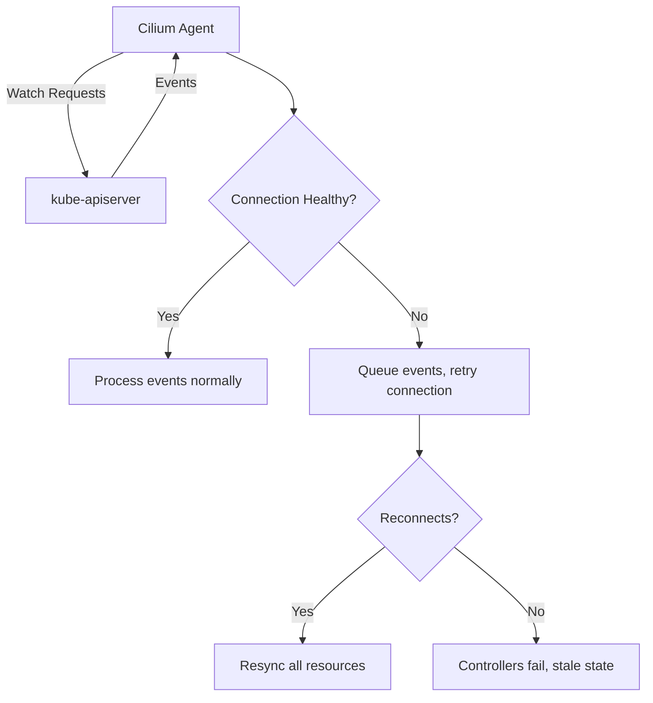

# How to Troubleshoot Kubernetes in Cilium Observability

Author: [nawazdhandala](https://github.com/nawazdhandala)

Tags: Cilium, Kubernetes, Troubleshooting, Networking, Observability

Description: A practical troubleshooting guide for resolving Kubernetes integration issues in Cilium observability, covering API server connectivity, identity resolution, and endpoint synchronization problems.

---

## Introduction

Cilium relies heavily on the Kubernetes API to function correctly. It watches pods, services, endpoints, network policies, and its own CRDs to maintain a consistent networking state. When this integration breaks, you can see symptoms ranging from missing flow metadata in Hubble to complete networking failures for new pods.

Troubleshooting Kubernetes integration issues in Cilium requires understanding the data flow: the API server sends events to the Cilium agent, which processes them through its controller framework, updates BPF maps, and exposes the resulting state through Hubble and metrics endpoints.

This guide walks through the most common Kubernetes-related failures in Cilium observability and provides concrete steps to diagnose and resolve each one.

## Prerequisites

- Kubernetes cluster with Cilium installed
- kubectl and cilium CLI access
- Ability to view logs from kube-system namespace
- Basic understanding of Kubernetes watches and informers

## Diagnosing API Server Connectivity Issues

The most common Kubernetes integration failure is the Cilium agent losing connectivity to the API server:

```bash
# Check Cilium's view of the API server connection
kubectl -n kube-system exec ds/cilium -- cilium status | grep -A3 "Kubernetes"

# Look for API server errors in Cilium logs
kubectl -n kube-system logs ds/cilium --tail=200 | grep -i "apiserver\|k8s.*error\|watch.*error\|connection"

# Test API server connectivity from the Cilium pod
kubectl -n kube-system exec ds/cilium -- \
  wget -qO- --timeout=5 https://kubernetes.default.svc/healthz 2>&1

# Check if the kubernetes service endpoint is correct
kubectl get endpoints kubernetes
```



## Fixing Kubernetes Identity Resolution Failures

Cilium assigns security identities based on Kubernetes labels. When identity resolution fails, flows appear without proper metadata:

```bash
# Check identity allocation
kubectl -n kube-system exec ds/cilium -- cilium identity list | head -20

# Look for identity allocation errors
kubectl -n kube-system logs ds/cilium --tail=100 | grep -i "identity\|allocat"

# Verify a specific pod has the correct identity
POD_NAME="my-app-pod"
NAMESPACE="default"
ENDPOINT_ID=$(kubectl -n kube-system exec ds/cilium -- cilium endpoint list -o json | python3 -c "
import json, sys
for ep in json.load(sys.stdin):
    labels = ep.get('status',{}).get('identity',{}).get('labels',[])
    for l in labels:
        if '$POD_NAME' in l:
            print(ep['id'])
            break
")
echo "Endpoint ID: $ENDPOINT_ID"

# Get identity details for the endpoint
kubectl -n kube-system exec ds/cilium -- cilium endpoint get $ENDPOINT_ID -o json | python3 -c "
import json, sys
ep = json.load(sys.stdin)
identity = ep[0].get('status',{}).get('identity',{})
print(f\"Identity: {identity.get('id')}\")
print(f\"Labels: {identity.get('labels')}\")
"
```

If identities are stale or incorrect:

```bash
# Force identity reallocation by restarting the agent
kubectl -n kube-system rollout restart daemonset/cilium

# Or regenerate a specific endpoint
kubectl -n kube-system exec ds/cilium -- cilium endpoint regenerate $ENDPOINT_ID
```

## Resolving Endpoint Synchronization Problems

Endpoints in Cilium represent Kubernetes pods. When they fail to sync, new pods may not get network connectivity:

```bash
# List endpoints and their states
kubectl -n kube-system exec ds/cilium -- cilium endpoint list

# Find endpoints in non-ready states
kubectl -n kube-system exec ds/cilium -- cilium endpoint list -o json | python3 -c "
import json, sys
eps = json.load(sys.stdin)
for ep in eps:
    state = ep.get('status',{}).get('state','unknown')
    if state != 'ready':
        labels = ep.get('status',{}).get('identity',{}).get('labels',[])
        k8s_labels = [l for l in labels if l.startswith('k8s:')]
        print(f'Endpoint {ep[\"id\"]} ({state}): {k8s_labels}')
        # Show the last error if available
        log = ep.get('status',{}).get('log',{})
        if log:
            last = log[-1] if isinstance(log, list) else log
            print(f'  Last status: {last}')
"

# Check CiliumEndpoint CRD status
kubectl get ciliumendpoints -A | grep -v "1/1"

# Look for endpoint-related controller failures
kubectl -n kube-system exec ds/cilium -- cilium status controllers | grep endpoint
```

## Debugging CRD Synchronization

Cilium uses several CRDs that must stay synchronized with the Kubernetes API:

```bash
# Verify all Cilium CRDs are installed
kubectl get crd | grep cilium

# Expected CRDs:
# ciliumnetworkpolicies.cilium.io
# ciliumclusterwidenetworkpolicies.cilium.io
# ciliumendpoints.cilium.io
# ciliumidentities.cilium.io
# ciliumnodes.cilium.io
# ciliumexternalworkloads.cilium.io

# Check CRD versions
kubectl get crd ciliumnetworkpolicies.cilium.io -o jsonpath='{.spec.versions[*].name}'

# Verify CiliumNode resources match actual nodes
kubectl get ciliumnodes
kubectl get nodes
# These should have the same count

# Check for orphaned CiliumEndpoints
kubectl get ciliumendpoints -A -o json | python3 -c "
import json, sys
ceps = json.load(sys.stdin)
for item in ceps.get('items', []):
    ns = item['metadata']['namespace']
    name = item['metadata']['name']
    # Try to find matching pod
    print(f'{ns}/{name}')
"
```

## Verification

After resolving issues, confirm Kubernetes integration is healthy:

```bash
# 1. Cilium status shows healthy Kubernetes connection
kubectl -n kube-system exec ds/cilium -- cilium status | grep -A5 "Kubernetes"

# 2. All endpoints are in ready state
kubectl -n kube-system exec ds/cilium -- cilium endpoint list -o json | python3 -c "
import json, sys
eps = json.load(sys.stdin)
ready = len([e for e in eps if e.get('status',{}).get('state') == 'ready'])
total = len(eps)
print(f'{ready}/{total} endpoints ready')
"

# 3. Hubble flows contain Kubernetes metadata
hubble observe --last 10 -o json 2>/dev/null | python3 -c "
import json, sys
for line in sys.stdin:
    f = json.loads(line).get('flow',{})
    src = f.get('source',{})
    if src.get('namespace'):
        print(f'Flow has K8s context: {src.get(\"namespace\")}/{src.get(\"pod_name\")}')
" | head -3

# 4. No Kubernetes-related controller failures
kubectl -n kube-system exec ds/cilium -- cilium status controllers -o json | python3 -c "
import json, sys
data = json.load(sys.stdin)
k8s_failing = [c for c in data if 'k8s' in c['name'].lower() and c.get('status',{}).get('consecutive-failure-count',0) > 0]
if k8s_failing:
    for c in k8s_failing:
        print(f'Failing: {c[\"name\"]}')
else:
    print('All K8s controllers healthy')
"
```

## Troubleshooting

- **Cilium shows "Kubernetes: Disabled"**: The agent was started without Kubernetes integration. This should not happen with Helm installations. Check the Helm values for `k8s.requireIPv4PodCIDR` and related settings.

- **Pods stuck in ContainerCreating**: Cilium CNI is not responding. Check if the Cilium agent is running on that node with `kubectl get pods -n kube-system -l k8s-app=cilium -o wide`.

- **CiliumEndpoints not created for pods**: The endpoint controller may be failing. Check with `kubectl -n kube-system exec ds/cilium -- cilium status controllers | grep endpoint`.

- **Hubble shows numeric identities instead of pod names**: The agent cannot resolve identities to Kubernetes labels. Check API server connectivity and identity allocation.

## Conclusion

Kubernetes integration is fundamental to Cilium observability. When the API server connection, identity resolution, endpoint synchronization, or CRD reconciliation breaks down, your observability data becomes incomplete or misleading. By systematically checking each integration point using the commands in this guide, you can quickly identify and resolve the root cause, restoring full visibility into your cluster networking.
