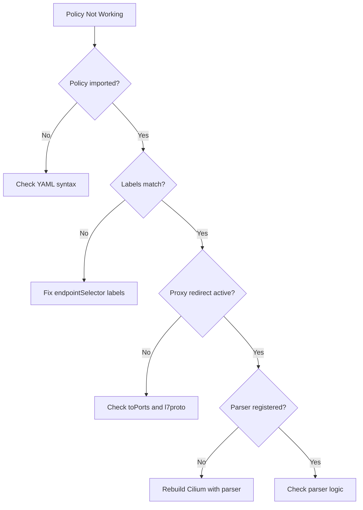

# Troubleshooting Manual Testing for Cilium Network Security

Author: [nawazdhandala](https://github.com/nawazdhandala)

Tags: Cilium, Network Security, Manual Testing, Troubleshooting, Debugging

Description: Resolve common issues encountered during manual testing of Cilium L7 parsers, including connectivity failures, policy enforcement gaps, proxy redirect problems, and test environment setup errors.

---

## Introduction

Manual testing of Cilium L7 parsers frequently encounters issues that block or invalidate test execution. These range from environment setup problems (pods not connecting, policies not applied) to parser-specific issues (unexpected drops, wrong error responses) to tooling problems (Hubble not showing flows, cilium monitor silent).

Efficient troubleshooting during manual testing requires a systematic approach: verify the environment first, then the policy configuration, then the proxy operation, and finally the parser behavior. This guide walks through each layer.

## Prerequisites

- A test Kubernetes cluster with Cilium
- `kubectl`, `cilium`, and `hubble` CLI tools
- Access to Cilium agent logs
- Protocol-specific test client
- Basic networking troubleshooting skills

## Layer 1: Environment Connectivity

Start by verifying basic connectivity before L7 policy:

```bash
# Check pod status
kubectl get pods -n cilium-parser-test -o wide

# Check Cilium endpoint status
kubectl exec -n kube-system ds/cilium -- cilium endpoint list | grep cilium-parser-test

# Test basic TCP connectivity (before L7 policy)
kubectl exec -n cilium-parser-test deploy/test-client -- \
    nc -zv test-server 9000

# Check DNS resolution
kubectl exec -n cilium-parser-test deploy/test-client -- \
    nslookup test-server.cilium-parser-test.svc.cluster.local

# Verify Cilium health
kubectl exec -n kube-system ds/cilium -- cilium status
```

Common environment issues:

```bash
# Issue: Pod stuck in ContainerCreating
kubectl describe pod -n cilium-parser-test <pod-name>
# Check for: missing image, volume mount errors, resource limits

# Issue: Cilium endpoint not ready
kubectl exec -n kube-system ds/cilium -- cilium endpoint list
# Look for endpoints in "not-ready" state
# Fix: Wait for endpoint regeneration or restart the Cilium agent

# Issue: Service not resolving
kubectl get svc -n cilium-parser-test
kubectl get endpoints -n cilium-parser-test
# Fix: Ensure pod labels match service selector
```

## Layer 2: Policy Configuration

Verify L7 policy is correctly applied:

```bash
# Check policy status
kubectl exec -n kube-system ds/cilium -- cilium policy get

# Verify endpoint has the policy
kubectl exec -n kube-system ds/cilium -- cilium endpoint get <endpoint-id> | grep -A 10 "policy"

# Check for policy import errors
kubectl exec -n kube-system ds/cilium -- cilium policy get 2>&1 | grep -i "error\|warn"

# Verify label matching
kubectl get pods -n cilium-parser-test --show-labels
```



## Layer 3: Proxy Operation

Verify the L7 proxy is intercepting traffic:

```bash
# Check proxy redirects
kubectl exec -n kube-system ds/cilium -- cilium bpf proxy list

# Check Envoy proxy is running
kubectl exec -n kube-system ds/cilium -c cilium-agent -- \
    curl -s http://localhost:9901/server_info

# Monitor proxy events
kubectl exec -n kube-system ds/cilium -- cilium monitor --type l7

# Check for proxy errors
kubectl logs -n kube-system ds/cilium -c cilium-agent | grep -i "proxy\|envoy" | tail -20
```

Common proxy issues:

```bash
# Issue: "proxy redirect not found"
# Cause: Policy is not correctly creating a proxy redirect
# Fix: Verify toPorts section includes l7proto field
kubectl exec -n kube-system ds/cilium -- cilium bpf proxy list
# Should show an entry for port 9000

# Issue: "unknown parser" error
# Cause: Parser not registered in proxylib
# Fix: Ensure parser init() function registers the factory
kubectl logs -n kube-system ds/cilium -c cilium-agent | grep "unknown parser"

# Issue: Envoy returns 503
# Cause: Backend service not reachable from proxy
# Fix: Check service endpoints and network connectivity
kubectl exec -n kube-system ds/cilium -c cilium-agent -- \
    curl -s http://localhost:9901/clusters | grep test-server
```

## Layer 4: Parser Behavior

When connectivity and policy are correct but parser behavior is unexpected:

```bash
# Enable debug logging for the parser
kubectl exec -n kube-system ds/cilium -- cilium config set debug true

# Watch parser-specific log output
kubectl logs -n kube-system ds/cilium -c cilium-agent -f | grep "myprotocol"

# Send a known-good request and trace it
kubectl exec -n cilium-parser-test deploy/test-client -- \
    protocol-client send --command GET --key test --target test-server:9000 --debug

# Compare with raw TCP (bypassing parser)
kubectl exec -n cilium-parser-test deploy/test-client -- \
    protocol-client send --command GET --key test --target <pod-ip>:9000 --debug
```

## Quick Diagnostic Script

Use this script to quickly assess the test environment:

```bash
#!/bin/bash
# diagnose-test-env.sh

NS="cilium-parser-test"

echo "=== Pod Status ==="
kubectl get pods -n $NS -o wide

echo ""
echo "=== Service Status ==="
kubectl get svc -n $NS

echo ""
echo "=== Cilium Endpoints ==="
kubectl exec -n kube-system ds/cilium -- cilium endpoint list 2>/dev/null | grep $NS

echo ""
echo "=== Proxy Redirects ==="
kubectl exec -n kube-system ds/cilium -- cilium bpf proxy list 2>/dev/null

echo ""
echo "=== Policy Status ==="
kubectl get cnp -n $NS

echo ""
echo "=== Recent L7 Events ==="
kubectl exec -n kube-system ds/cilium -- cilium monitor --type l7 2>/dev/null &
MONITOR_PID=$!
sleep 3
kill $MONITOR_PID 2>/dev/null
```

## Verification

After resolving issues, re-run the manual test plan:

```bash
# Quick smoke test
kubectl exec -n cilium-parser-test deploy/test-client -- \
    protocol-client send --command GET --key smoketest --target test-server:9000

# Verify policy enforcement
kubectl exec -n cilium-parser-test deploy/test-client -- \
    protocol-client send --command DELETE --key smoketest --target test-server:9000

# Verify Hubble visibility
hubble observe --namespace cilium-parser-test --type l7 --last 5
```

## Troubleshooting

**Problem: All requests timeout after applying L7 policy**
The parser may be returning MORE indefinitely. Check parser logs for the last OnData call and verify the return value.

**Problem: Policy allows everything (no enforcement)**
Verify the `l7proto` field matches the parser's registered name exactly (case-sensitive). A mismatch causes Cilium to skip L7 enforcement.

**Problem: cilium monitor shows no events**
Ensure monitor is running on the correct node. The Cilium pod must be on the same node as the test pods. Use `kubectl get pods -o wide` to verify.

**Problem: Test results differ between runs**
Check for connection pooling in the test client. Persistent connections may carry state from previous tests. Use `--new-connection` flag if available, or restart pods between tests.

## Conclusion

Troubleshooting manual testing requires systematically verifying each layer from basic connectivity through policy configuration, proxy operation, and parser behavior. The diagnostic script provides a quick assessment of the test environment state. Most issues fall into one of four categories: environment setup, policy configuration, proxy redirect, or parser logic. Address them in order from the bottom of the stack upward.
