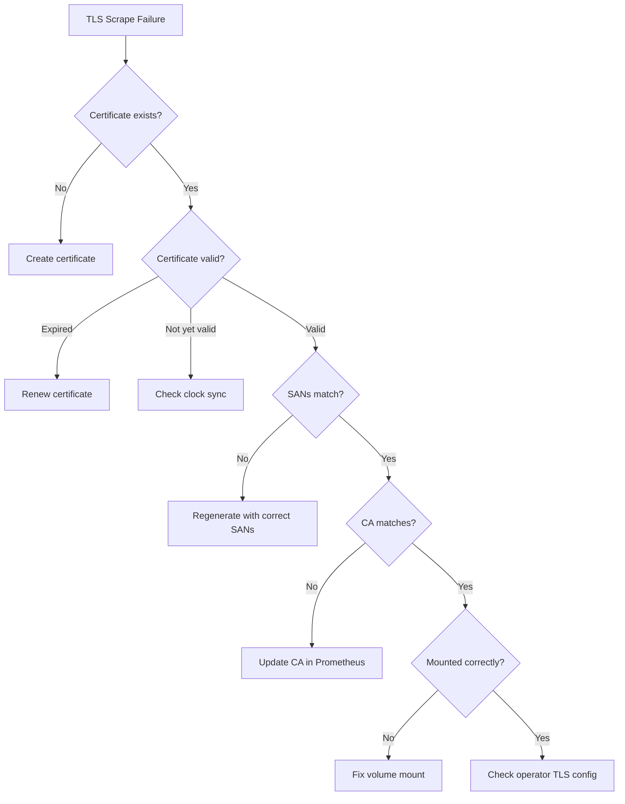

# Troubleshooting Operator Prometheus TLS Configuration in Cilium Observability

Author: [nawazdhandala](https://github.com/nawazdhandala)

Tags: Cilium, Observability, Prometheus, TLS, Troubleshooting

Description: Diagnose and fix TLS configuration issues between Prometheus and the Cilium Operator metrics endpoint, including certificate errors, handshake failures, and scrape configuration mismatches.

---

## Introduction

TLS configuration between Prometheus and the Cilium Operator can fail at multiple points: certificate generation, secret mounting, operator TLS initialization, Prometheus scraper configuration, and certificate renewal. Each failure point produces different symptoms, from complete scrape failures to intermittent connectivity issues.

This guide provides systematic troubleshooting for TLS-related metrics collection failures in Cilium observability.

## Prerequisites

- Cilium with Operator TLS metrics configured
- Prometheus deployed and configured for TLS scraping
- `kubectl` and `openssl` tools
- Access to Prometheus targets page
- Understanding of TLS certificate chains

## Diagnosing TLS Handshake Failures

When Prometheus reports TLS errors:

```bash
# Check Prometheus target errors
curl -s http://localhost:9090/api/v1/targets | \
    jq '.data.activeTargets[] | select(.labels.job | contains("operator")) | {health: .health, lastError: .lastError}'

# Common error messages:
# "x509: certificate signed by unknown authority" - CA mismatch
# "x509: certificate has expired or is not yet valid" - Expired cert
# "tls: handshake failure" - Protocol mismatch
# "connection refused" - TLS not enabled on operator

# Test TLS directly
kubectl run tls-debug --image=curlimages/curl --rm -it --restart=Never -- \
    curl -v https://cilium-operator.kube-system.svc:9963/metrics 2>&1
```

## Fixing Certificate Issues

```bash
# Check certificate expiry
kubectl get secret -n kube-system cilium-operator-metrics-tls -o jsonpath='{.data.tls\.crt}' | \
    base64 -d | openssl x509 -noout -dates

# Check certificate subject and SANs
kubectl get secret -n kube-system cilium-operator-metrics-tls -o jsonpath='{.data.tls\.crt}' | \
    base64 -d | openssl x509 -noout -text | grep -A1 "Subject:\|Subject Alternative Name"

# Check certificate issuer
kubectl get secret -n kube-system cilium-operator-metrics-tls -o jsonpath='{.data.tls\.crt}' | \
    base64 -d | openssl x509 -noout -issuer

# Compare with CA certificate in Prometheus
kubectl get secret -n monitoring prometheus-cilium-ca -o jsonpath='{.data.ca\.crt}' | \
    base64 -d | openssl x509 -noout -subject -issuer
```



## Resolving Secret Mount Issues

```bash
# Check if the secret is mounted in the operator pod
kubectl describe pod -n kube-system -l name=cilium-operator | grep -A10 "Mounts:"

# Check volume mount contents
kubectl exec -n kube-system deploy/cilium-operator -- ls -la /etc/cilium/metrics-tls/

# Verify file permissions
kubectl exec -n kube-system deploy/cilium-operator -- stat /etc/cilium/metrics-tls/tls.crt

# Check for secret not found errors
kubectl get events -n kube-system | grep -i "secret\|mount\|volume"
```

Common mount fixes:

```bash
# Issue: Secret name mismatch
kubectl get secret -n kube-system | grep metrics-tls
# Fix: Ensure Helm values reference the correct secret name

# Issue: Secret in wrong namespace
kubectl get secret --all-namespaces | grep metrics-tls
# Fix: Create the secret in kube-system

# Issue: Operator pod not restarted after secret creation
kubectl delete pod -n kube-system -l name=cilium-operator
```

## Fixing Prometheus Scraper Configuration

```bash
# Check ServiceMonitor configuration
kubectl get servicemonitor -n kube-system cilium-operator -o yaml

# Verify the scheme is set to https
kubectl get servicemonitor -n kube-system cilium-operator -o jsonpath='{.spec.endpoints[0].scheme}'

# Check TLS config in ServiceMonitor
kubectl get servicemonitor -n kube-system cilium-operator -o jsonpath='{.spec.endpoints[0].tlsConfig}' | jq .

# Verify Prometheus has the CA certificate
kubectl exec -n monitoring deploy/prometheus -- ls -la /etc/prometheus/certs/
```

Update ServiceMonitor if needed:

```yaml
apiVersion: monitoring.coreos.com/v1
kind: ServiceMonitor
metadata:
  name: cilium-operator
  namespace: kube-system
spec:
  selector:
    matchLabels:
      name: cilium-operator
  endpoints:
    - port: operator-prometheus
      scheme: https
      tlsConfig:
        ca:
          secret:
            name: cilium-operator-metrics-tls
            key: ca.crt
        serverName: cilium-operator.kube-system.svc
        insecureSkipVerify: false
```

## Handling Certificate Renewal

When certificates expire and auto-renewal fails:

```bash
# Check cert-manager certificate status
kubectl get certificate -n kube-system cilium-operator-metrics-tls -o yaml | grep -A10 "status:"

# Check cert-manager logs for renewal issues
kubectl logs -n cert-manager deploy/cert-manager | grep "cilium-operator" | tail -10

# Force certificate renewal
kubectl delete certificate -n kube-system cilium-operator-metrics-tls
kubectl apply -f cilium-operator-metrics-cert.yaml

# Restart operator to pick up new certificate
kubectl delete pod -n kube-system -l name=cilium-operator
```

## Verification

After fixing TLS issues:

```bash
# Verify TLS connection works
kubectl run tls-verify --image=curlimages/curl --rm -it --restart=Never -- \
    curl -s --cacert /tmp/ca.crt https://cilium-operator.kube-system.svc:9963/metrics | head -5

# Verify Prometheus target is healthy
curl -s http://localhost:9090/api/v1/targets | \
    jq '.data.activeTargets[] | select(.labels.job | contains("operator")) | .health'

# Verify metrics are flowing
curl -s "http://localhost:9090/api/v1/query?query=cilium_operator_process_start_time_seconds" | \
    jq '.data.result | length'

# Verify certificate expiry is in the future
kubectl get secret -n kube-system cilium-operator-metrics-tls -o jsonpath='{.data.tls\.crt}' | \
    base64 -d | openssl x509 -noout -enddate
```

## Troubleshooting

**Problem: Certificate renews but operator still uses old certificate**
The operator needs to be restarted to load the new certificate. Configure a file watcher or use cert-manager's `renewBefore` to trigger rolling restarts.

**Problem: insecureSkipVerify is true but should not be**
Setting `insecureSkipVerify: true` bypasses certificate validation, defeating the purpose of TLS. Fix the certificate chain so verification passes, then set it to false.

**Problem: Different Cilium pods use different certificates**
When running multiple replicas, ensure all replicas mount the same secret. The secret is shared across all pods in the deployment.

**Problem: TLS works but Prometheus shows "server returned HTTP status 400"**
The operator metrics endpoint may not support TLS on the expected port. Verify the port number and that the operator was compiled with TLS support enabled.

## Conclusion

TLS troubleshooting for Cilium Operator Prometheus metrics follows a systematic path: verify the certificate exists and is valid, confirm it is mounted correctly, check that the operator is configured to use it, and verify Prometheus is configured to trust the CA. Most issues are certificate lifecycle problems (expiry, CA mismatch) or configuration mismatches (wrong secret name, wrong mount path). Always verify the complete chain end-to-end after making changes.
