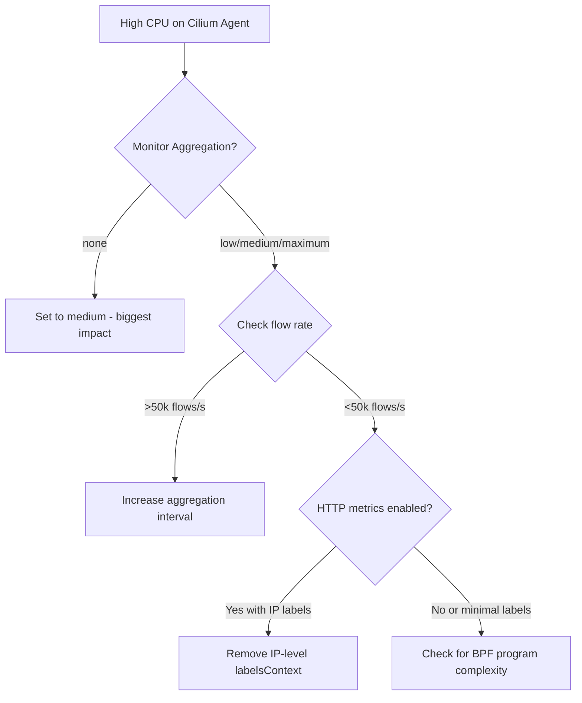

# How to Troubleshoot Performance Tuning in Cilium Hubble

Author: [nawazdhandala](https://github.com/nawazdhandala)

Tags: Cilium, Hubble, Performance, Troubleshooting, Kubernetes

Description: Diagnose and resolve performance problems in Cilium Hubble, including high CPU usage, memory pressure, event loss, and slow metric scrapes that impact cluster stability.

---

## Introduction

Performance problems in Hubble can manifest as high CPU usage on Cilium agent nodes, excessive memory consumption, lost flow events, or slow Prometheus scrapes that trigger alerts. These issues are particularly concerning because Hubble runs inside the Cilium agent, meaning performance degradation can affect the network datapath itself.

Diagnosing Hubble performance issues requires correlating resource metrics with configuration parameters to identify which component is consuming resources and why. Often the root cause is a single misconfiguration -- such as disabled monitor aggregation or high-cardinality metric labels -- that amplifies under production traffic loads.

This guide provides systematic procedures for identifying and resolving each type of Hubble performance problem.

## Prerequisites

- Kubernetes cluster with Cilium and Hubble enabled
- Prometheus for resource monitoring
- kubectl access with exec permissions
- Metrics server deployed for `kubectl top` functionality

## Diagnosing High CPU Usage

High CPU on Cilium agent pods is the most common Hubble performance symptom:

```bash
# Check CPU usage across all Cilium pods
kubectl -n kube-system top pod -l k8s-app=cilium --sort-by=cpu

# Compare with expected baseline (Cilium without Hubble typically uses 50-200m)
# If usage is significantly higher, Hubble processing is likely the cause

# Check monitor aggregation level
kubectl -n kube-system exec ds/cilium -- cilium config | grep MonitorAggregation

# If MonitorAggregation is "none", that is the likely cause
# Check flow processing rate
kubectl -n kube-system exec ds/cilium -- \
  wget -qO- http://localhost:9962/metrics 2>/dev/null | \
  grep "cilium_event_ts"
```



Apply the fix:

```bash
# Set monitor aggregation to medium (most impactful change)
helm upgrade cilium cilium/cilium -n kube-system \
  --reuse-values \
  --set monitorAggregation=medium \
  --set monitorAggregationInterval=5s

# Wait for rollout and measure again
kubectl -n kube-system rollout status daemonset/cilium
kubectl -n kube-system top pod -l k8s-app=cilium --sort-by=cpu
```

## Resolving Memory Pressure

Memory issues can come from large event buffers, high metric cardinality, or relay buffer overflow:

```bash
# Check memory usage
kubectl -n kube-system top pod -l k8s-app=cilium --sort-by=memory

# Check event buffer configuration
helm get values cilium -n kube-system | grep eventBufferCapacity

# Calculate buffer memory usage
# Each event ~150 bytes average
# eventBufferCapacity * 150 bytes = approximate memory usage
# 65536 * 150 = ~10MB per agent

# Check if Prometheus metric storage is consuming memory
kubectl -n kube-system exec ds/cilium -- \
  wget -qO- http://localhost:9965/metrics 2>/dev/null | wc -l

# If metric line count is very high (>10000), cardinality is an issue
```

Reduce memory consumption:

```bash
# Reduce event buffer if it is oversized
helm upgrade cilium cilium/cilium -n kube-system \
  --reuse-values \
  --set hubble.eventBufferCapacity="4096"

# Reduce metric cardinality
helm upgrade cilium cilium/cilium -n kube-system \
  --reuse-values \
  --set-json 'hubble.metrics.enabled=["dns","drop","tcp","flow"]'
```

## Fixing Event Loss

Lost events mean Hubble cannot keep up with the flow rate:

```bash
# Check for lost events
kubectl -n kube-system exec ds/cilium -- cilium status --verbose 2>&1 | grep -i "lost\|missed"

# Check perf event reader statistics
kubectl -n kube-system exec ds/cilium -- \
  wget -qO- http://localhost:9962/metrics 2>/dev/null | \
  grep "cilium_perf_event"

# Key metrics:
# cilium_perf_event_lost_total - events lost from BPF perf buffer
# cilium_perf_event_received_total - events successfully received

# Calculate loss ratio
kubectl -n kube-system exec ds/cilium -- \
  wget -qO- http://localhost:9962/metrics 2>/dev/null | python3 -c "
import sys
received = lost = 0
for line in sys.stdin:
    if 'cilium_perf_event_received_total' in line and not line.startswith('#'):
        received += float(line.split()[-1])
    elif 'cilium_perf_event_lost_total' in line and not line.startswith('#'):
        lost += float(line.split()[-1])
total = received + lost
if total > 0:
    print(f'Loss ratio: {lost/total*100:.2f}% ({int(lost)} lost / {int(total)} total)')
else:
    print('No events recorded yet')
"
```

Reduce event loss:

```bash
# Increase the BPF perf event buffer size
helm upgrade cilium cilium/cilium -n kube-system \
  --reuse-values \
  --set bpf.events.drop.enabled=true \
  --set monitorAggregation=medium

# Alternatively, increase monitor aggregation to reduce event volume
helm upgrade cilium cilium/cilium -n kube-system \
  --reuse-values \
  --set monitorAggregation=maximum
```

## Addressing Slow Prometheus Scrapes

When Hubble metric scrapes take too long, Prometheus may timeout:

```bash
# Check scrape duration
curl -s 'http://localhost:9090/api/v1/query?query=scrape_duration_seconds{job=~".*hubble.*"}' | python3 -c "
import json, sys
data = json.load(sys.stdin)
for result in data.get('data',{}).get('result',[]):
    instance = result['metric'].get('instance','')
    duration = float(result['value'][1])
    print(f'{instance}: {duration:.2f}s')
"

# If scrape duration > 10s, there are too many time series
# Count the number of time series per metric
kubectl -n kube-system exec ds/cilium -- \
  wget -qO- http://localhost:9965/metrics 2>/dev/null | \
  grep "^hubble_" | cut -d'{' -f1 | sort | uniq -c | sort -rn | head -10
```

Fix slow scrapes by reducing cardinality:

```yaml
# Reduce metric labels - example for httpV2
hubble:
  metrics:
    enabled:
      - dns
      - drop
      - tcp
      - flow
      # Remove IP-level context which causes high cardinality
      - "httpV2:labelsContext=source_namespace,destination_namespace"
```

## Verification

After applying performance fixes:

```bash
# 1. CPU usage should be reduced
kubectl -n kube-system top pod -l k8s-app=cilium --sort-by=cpu

# 2. Memory usage should be stable
kubectl -n kube-system top pod -l k8s-app=cilium --sort-by=memory

# 3. Event loss should be minimal
kubectl -n kube-system exec ds/cilium -- cilium status --verbose | grep -i lost

# 4. Scrape duration should be under 10 seconds
curl -s 'http://localhost:9090/api/v1/query?query=scrape_duration_seconds{job=~".*hubble.*"}' | python3 -m json.tool

# 5. Hubble still provides useful data
hubble observe --last 10 -o compact
```

## Troubleshooting

- **CPU still high after increasing aggregation**: Check if there are L7 policies in effect. L7 inspection (HTTP, DNS) adds significant CPU overhead. Review with `kubectl get cnp -A -o yaml | grep -c "l7"`.

- **Memory growing over time**: This could be a metric cardinality explosion. Monitor with `sum(scrape_samples_scraped{job=~".*hubble.*"})` in Prometheus.

- **Event loss persists**: Consider whether you need `monitorAggregation=maximum` for extremely high-traffic workloads. This still captures all new connections and drops.

- **Performance degrades over time**: Check if endpoint count is growing. More endpoints mean more BPF events. Monitor with `cilium_endpoint_count`.

## Conclusion

Hubble performance tuning is primarily about controlling the volume of events processed and the cardinality of metrics exposed. Monitor aggregation is the single most impactful setting, followed by metric label management and event buffer sizing. Always measure before and after changes to confirm the improvement, and ensure that your tuning decisions still provide the level of observability your team requires.
