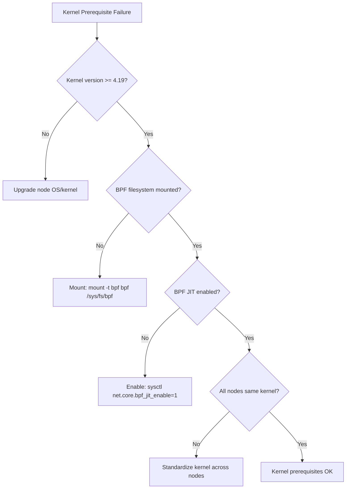

# How to Troubleshoot Pre-Requisites in Cilium Hubble

Author: [nawazdhandala](https://github.com/nawazdhandala)

Tags: Cilium, Hubble, Prerequisites, Troubleshooting, Kubernetes

Description: Diagnose and resolve prerequisite failures that prevent Cilium Hubble from installing or running correctly, including kernel issues, CNI conflicts, and missing dependencies.

---

## Introduction

Prerequisite failures are among the most frustrating issues when deploying Cilium Hubble because they often manifest as cryptic errors during installation or as subtle runtime failures. A kernel missing BPF features may allow Cilium to install but cause Hubble to fail silently. A conflicting CNI may create intermittent networking issues that are difficult to trace back to the root cause.

This guide helps you diagnose and resolve each category of prerequisite failure, from kernel-level issues to missing Kubernetes resources and tool version mismatches.

## Prerequisites

- Access to the Kubernetes cluster where Cilium installation failed or is failing
- kubectl and SSH access to cluster nodes
- Basic understanding of Linux kernel capabilities and Kubernetes networking

## Diagnosing Kernel Issues

Kernel problems are the hardest to diagnose because they often cause silent failures:

```bash
# Check kernel version across all nodes
kubectl get nodes -o jsonpath='{range .items[*]}{.metadata.name}{"\t"}{.status.nodeInfo.kernelVersion}{"\n"}{end}'

# Check for heterogeneous kernel versions (can cause inconsistent behavior)
kubectl get nodes -o jsonpath='{.items[*].status.nodeInfo.kernelVersion}' | tr ' ' '\n' | sort -u

# Verify BPF filesystem is mounted
kubectl debug node/$(kubectl get nodes -o jsonpath='{.items[0].metadata.name}') \
  -it --image=ubuntu -- bash -c 'mount | grep bpf'
# Should show: bpf on /sys/fs/bpf type bpf

# Check if BPF JIT is enabled (required for performance)
kubectl debug node/$(kubectl get nodes -o jsonpath='{.items[0].metadata.name}') \
  -it --image=ubuntu -- bash -c 'cat /proc/sys/net/core/bpf_jit_enable'
# Should return 1

# Check cgroup v2 support (needed for some Cilium features)
kubectl debug node/$(kubectl get nodes -o jsonpath='{.items[0].metadata.name}') \
  -it --image=ubuntu -- bash -c 'mount | grep cgroup2'
```



Fix BPF JIT if disabled:

```bash
# On each node (via debug pod or SSH)
kubectl debug node/<node-name> -it --image=ubuntu -- bash -c '
  sysctl -w net.core.bpf_jit_enable=1
  echo "net.core.bpf_jit_enable=1" >> /etc/sysctl.d/99-bpf.conf
'
```

## Resolving CNI Conflicts

Running Cilium alongside another CNI causes unpredictable networking:

```bash
# Detect running CNIs
kubectl get pods -A -o json | python3 -c "
import json, sys
cni_keywords = ['calico', 'flannel', 'weave', 'canal', 'antrea', 'kube-router']
pods = json.load(sys.stdin)
for pod in pods['items']:
    name = pod['metadata']['name'].lower()
    ns = pod['metadata']['namespace']
    for keyword in cni_keywords:
        if keyword in name:
            print(f'CONFLICT: Found {keyword} CNI: {ns}/{pod[\"metadata\"][\"name\"]}')
"

# Check for CNI configuration files on nodes
kubectl debug node/$(kubectl get nodes -o jsonpath='{.items[0].metadata.name}') \
  -it --image=ubuntu -- bash -c 'ls -la /etc/cni/net.d/'

# If multiple CNI configs exist, only the first alphabetically is used
# Cilium creates: 05-cilium.conflist
# Calico creates: 10-calico.conflist
# This ordering means Cilium takes priority if both exist
```

Remove conflicting CNIs:

```bash
# Remove Calico (example)
kubectl delete -f https://raw.githubusercontent.com/projectcalico/calico/master/manifests/calico.yaml 2>/dev/null

# Remove Flannel (example)
kubectl delete -f https://raw.githubusercontent.com/flannel-io/flannel/master/Documentation/kube-flannel.yml 2>/dev/null

# Clean up leftover CNI configs on nodes
kubectl debug node/$(kubectl get nodes -o jsonpath='{.items[0].metadata.name}') \
  -it --image=ubuntu -- bash -c '
  ls /etc/cni/net.d/
  # Remove non-Cilium configs
  rm -f /etc/cni/net.d/10-calico.conflist 2>/dev/null
  rm -f /etc/cni/net.d/10-flannel.conflist 2>/dev/null
'
```

## Fixing Kubernetes Version Mismatches

```bash
# Check Kubernetes version compatibility
K8S_VERSION=$(kubectl version -o json 2>/dev/null | python3 -c "import json,sys; v=json.load(sys.stdin)['serverVersion']; print(f\"{v['major']}.{v['minor']}\")")
echo "Kubernetes: $K8S_VERSION"

# Check available Cilium versions for this Kubernetes version
helm search repo cilium/cilium --versions | head -10

# Common compatibility issues:
# - Cilium 1.15 requires Kubernetes 1.21+
# - Cilium 1.14 requires Kubernetes 1.21+
# - Very old Kubernetes versions (<1.21) need Cilium 1.12 or earlier
```

## Resolving Missing Tool Dependencies

```bash
# Check all required tools
for tool in kubectl helm cilium hubble; do
  if command -v $tool &>/dev/null; then
    version=$($tool version --short 2>/dev/null || $tool version 2>/dev/null | head -1)
    echo "OK: $tool - $version"
  else
    echo "MISSING: $tool"
  fi
done

# Fix missing Cilium CLI
if ! command -v cilium &>/dev/null; then
  CILIUM_CLI_VERSION=$(curl -s https://raw.githubusercontent.com/cilium/cilium-cli/main/stable.txt)
  curl -L --fail --remote-name-all \
    https://github.com/cilium/cilium-cli/releases/download/${CILIUM_CLI_VERSION}/cilium-linux-amd64.tar.gz
  sudo tar xzvf cilium-linux-amd64.tar.gz -C /usr/local/bin
  rm cilium-linux-amd64.tar.gz
fi

# Fix missing Hubble CLI
if ! command -v hubble &>/dev/null; then
  HUBBLE_VERSION=$(curl -s https://raw.githubusercontent.com/cilium/hubble/main/stable.txt)
  curl -L --fail --remote-name-all \
    https://github.com/cilium/hubble/releases/download/${HUBBLE_VERSION}/hubble-linux-amd64.tar.gz
  sudo tar xzvf hubble-linux-amd64.tar.gz -C /usr/local/bin
  rm hubble-linux-amd64.tar.gz
fi
```

## Verification

After resolving prerequisite issues, run the full check:

```bash
echo "=== Prerequisites Verification ==="

# Kernel
echo "Kernel versions:"
kubectl get nodes -o jsonpath='{range .items[*]}  {.metadata.name}: {.status.nodeInfo.kernelVersion}{"\n"}{end}'

# No conflicting CNI
echo "CNI check:"
CONFLICTS=$(kubectl get pods -A --no-headers 2>/dev/null | grep -cE "calico|flannel|weave")
echo "  Conflicting CNI pods: $CONFLICTS"

# Kubernetes version
echo "Kubernetes:"
kubectl version --short 2>/dev/null | grep Server || kubectl version -o json | python3 -c "import json,sys; print(f\"  {json.load(sys.stdin)['serverVersion']['gitVersion']}\")"

# Tools
echo "Tools:"
for tool in kubectl helm cilium hubble; do
  command -v $tool &>/dev/null && echo "  $tool: installed" || echo "  $tool: MISSING"
done

# Ready to install
echo ""
echo "Prerequisites: $([ $CONFLICTS -eq 0 ] && echo 'PASSED' || echo 'FAILED - fix CNI conflicts')"
```

## Troubleshooting

- **Cannot upgrade kernel on managed cluster**: Use a newer node pool or node image. GKE, EKS, and AKS all offer node images with kernel >= 5.10.

- **CNI removal breaks existing pods**: Pods created under the old CNI may lose networking. Drain nodes and recreate pods after installing Cilium.

- **Helm timeout during install**: Increase the timeout with `--timeout 10m`. Large clusters take longer to roll out the Cilium DaemonSet.

- **Multiple kubectl contexts causing confusion**: Verify you are targeting the correct cluster with `kubectl config current-context`.

## Conclusion

Prerequisite failures are the leading cause of Cilium Hubble deployment issues. By systematically checking kernel version and BPF support, removing conflicting CNIs, verifying Kubernetes version compatibility, and ensuring all CLI tools are installed, you eliminate the most common failure modes before they occur. Run the prerequisites verification script before every Cilium installation or upgrade.
