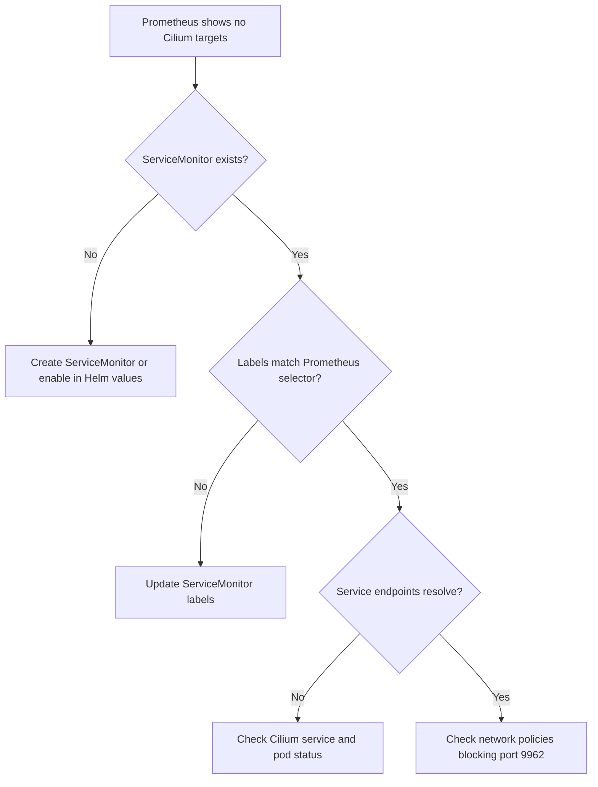

# How to Troubleshoot Prometheus Access for Cilium Observability

Author: [nawazdhandala](https://github.com/nawazdhandala)

Tags: Cilium, Prometheus, Troubleshooting, Observability, Kubernetes

Description: A practical guide to diagnosing and resolving common Prometheus scraping issues when collecting Cilium metrics in Kubernetes clusters.

---

## Introduction

When Prometheus fails to scrape Cilium metrics, your observability pipeline goes dark. You lose visibility into packet drops, policy verdicts, and network flow data that are critical for maintaining a healthy Kubernetes cluster. These failures can stem from network policies blocking scrape traffic, misconfigured ServiceMonitors, or Cilium agent issues.

Troubleshooting Prometheus access for Cilium requires a systematic approach. You need to verify connectivity between Prometheus and Cilium pods, confirm that metric endpoints are responding, and ensure that the scrape configuration matches the actual service topology.

This guide walks you through a structured debugging workflow, covering the most common failure modes and their solutions. Each section includes commands you can run immediately to identify and fix the problem.

## Prerequisites

- A Kubernetes cluster with Cilium installed
- Prometheus deployed (standalone or via kube-prometheus-stack)
- kubectl access to the cluster
- cilium CLI installed locally
- Basic understanding of Prometheus scrape configuration

## Diagnosing Scrape Target Failures

Start by checking whether Prometheus can see and reach the Cilium targets.

```bash
# Check Prometheus targets via the API
kubectl port-forward -n monitoring svc/prometheus-operated 9090:9090 &
curl -s http://localhost:9090/api/v1/targets | python3 -c "
import json, sys
data = json.load(sys.stdin)
for target in data['data']['activeTargets']:
    if 'cilium' in target.get('labels', {}).get('job', ''):
        print(f\"Job: {target['labels']['job']}, Health: {target['health']}, Last Error: {target.get('lastError', 'none')}\")
"
```

If no Cilium targets appear at all, the ServiceMonitor is likely misconfigured:

```bash
# Verify ServiceMonitor exists
kubectl get servicemonitor -A | grep cilium

# Check the ServiceMonitor label selector matches Prometheus
kubectl get prometheus -n monitoring -o jsonpath='{.items[0].spec.serviceMonitorSelector}' | python3 -m json.tool

# Compare with ServiceMonitor labels
kubectl get servicemonitor cilium-agent -n kube-system -o jsonpath='{.metadata.labels}' | python3 -m json.tool
```



## Fixing Network Policy Blocks on Metrics Ports

Cilium network policies can inadvertently block Prometheus from reaching metrics endpoints on ports 9962 (agent), 9963 (operator), and 9965 (Hubble).

```bash
# Test connectivity from Prometheus pod to Cilium agent metrics
PROM_POD=$(kubectl get pods -n monitoring -l app.kubernetes.io/name=prometheus -o jsonpath='{.items[0].metadata.name}')
CILIUM_POD_IP=$(kubectl get pods -n kube-system -l k8s-app=cilium -o jsonpath='{.items[0].status.podIP}')

kubectl exec -n monitoring $PROM_POD -c prometheus -- wget -qO- --timeout=5 http://$CILIUM_POD_IP:9962/metrics 2>&1 | head -5
```

If the connection times out, create a CiliumNetworkPolicy to allow scraping:

```yaml
# allow-prometheus-scrape.yaml
apiVersion: cilium.io/v2
kind: CiliumNetworkPolicy
metadata:
  name: allow-prometheus-scrape-cilium
  namespace: kube-system
spec:
  endpointSelector:
    matchLabels:
      k8s-app: cilium
  ingress:
    - fromEndpoints:
        - matchLabels:
            app.kubernetes.io/name: prometheus
            io.kubernetes.pod.namespace: monitoring
      toPorts:
        - ports:
            - port: "9962"
              protocol: TCP
            - port: "9965"
              protocol: TCP
```

```bash
kubectl apply -f allow-prometheus-scrape.yaml
```

## Resolving Metric Endpoint Failures

Sometimes the Cilium agent metrics endpoint itself is not responding correctly.

```bash
# Check if the metrics server is running inside the Cilium agent
kubectl -n kube-system exec ds/cilium -- cilium status | grep -i prometheus

# Check if the port is actually listening
kubectl -n kube-system exec ds/cilium -- ss -tlnp | grep 9962

# Look at Cilium agent logs for metrics-related errors
kubectl -n kube-system logs ds/cilium --tail=50 | grep -i "metrics\|prometheus\|9962"

# Verify the Helm configuration enabled metrics
helm get values cilium -n kube-system | grep -A5 prometheus
```

If metrics are disabled, upgrade the Helm release:

```bash
helm upgrade cilium cilium/cilium -n kube-system \
  --reuse-values \
  --set prometheus.enabled=true \
  --set operator.prometheus.enabled=true
```

After upgrading, the Cilium agent pods will restart and begin serving metrics.

## Debugging Hubble-Specific Metric Issues

Hubble metrics require both the Hubble component and the specific metric collectors to be enabled.

```bash
# Check Hubble status
cilium hubble port-forward &
cilium hubble status

# Verify which Hubble metrics are enabled
kubectl -n kube-system exec ds/cilium -- cilium status --verbose | grep -A20 "Hubble"

# Check Hubble relay connectivity
kubectl -n kube-system get pods -l k8s-app=hubble-relay
kubectl -n kube-system logs -l k8s-app=hubble-relay --tail=20

# Test Hubble metrics endpoint directly
kubectl -n kube-system exec ds/cilium -- wget -qO- http://localhost:9965/metrics 2>&1 | head -10
```

If Hubble metrics are empty, verify the metric list in your Helm values:

```bash
helm get values cilium -n kube-system -o yaml | grep -A15 "hubble:" | grep -A10 "metrics:"
```

Common issue: the `enabled` list under `hubble.metrics` is empty or contains invalid metric names. Valid metric names include: `dns`, `drop`, `tcp`, `flow`, `icmp`, `httpV2`, `port-distribution`.

## Verification

After applying fixes, confirm that metrics are flowing:

```bash
# 1. Verify Prometheus can reach all Cilium targets
curl -s http://localhost:9090/api/v1/targets/metadata?metric=cilium_endpoint_count | python3 -m json.tool

# 2. Query a known Cilium metric
curl -s 'http://localhost:9090/api/v1/query?query=up{job=~".*cilium.*"}' | python3 -m json.tool

# 3. Check that Hubble flow metrics are being collected
curl -s 'http://localhost:9090/api/v1/query?query=hubble_flows_processed_total' | python3 -m json.tool

# 4. Verify scrape duration is reasonable (under 10s)
curl -s 'http://localhost:9090/api/v1/query?query=scrape_duration_seconds{job=~".*cilium.*"}' | python3 -m json.tool
```

## Troubleshooting

- **Targets show as DOWN**: Check the `lastError` field in the Prometheus targets API. Common errors include connection refused (metrics not enabled), context deadline exceeded (network policy blocking), and 403 forbidden (RBAC issue).

- **Intermittent scrape failures**: If targets flap between UP and DOWN, check for resource pressure on Cilium agent pods. High CPU usage can cause the metrics server to time out. Increase the `scrapeTimeout` in the ServiceMonitor.

- **Metrics exist but values are zero**: This typically means Cilium is healthy but no traffic matching those metrics is flowing. Generate test traffic with `kubectl run curl --image=curlimages/curl --rm -it -- curl http://kubernetes.default`.

- **Duplicate time series**: This happens when multiple Prometheus instances scrape the same targets. Use `external_labels` to differentiate or ensure only one Prometheus replica scrapes Cilium.

- **High memory usage in Prometheus**: Cilium can generate high-cardinality metrics, especially with `httpV2` and IP-level labels. Use `metric_relabel_configs` to drop unnecessary label dimensions.

## Conclusion

Troubleshooting Prometheus access for Cilium observability follows a predictable path: verify target discovery, check network connectivity, confirm metric endpoints are running, and validate the data pipeline. Most issues fall into three categories -- misconfigured ServiceMonitors, network policies blocking scrape traffic, or disabled metric collectors. By following the diagnostic commands in this guide, you can quickly identify the root cause and restore your Cilium observability pipeline.
