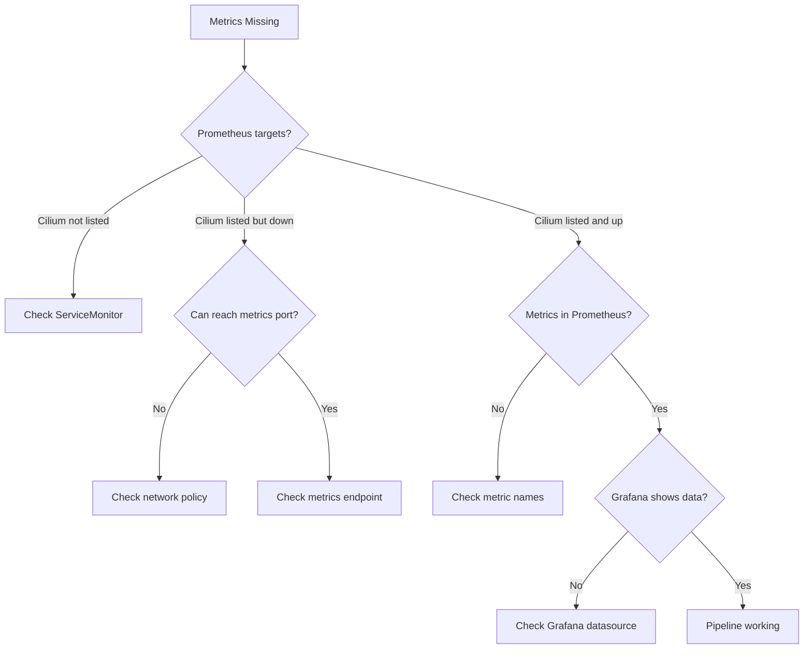

# Troubleshooting Prometheus and Grafana for Cilium Observability

Author: [nawazdhandala](https://github.com/nawazdhandala)

Tags: Cilium, Observability, Prometheus, Grafana, Troubleshooting, Monitoring

Description: Diagnose and resolve common issues with Prometheus metric collection and Grafana dashboard visualization for Cilium and Hubble observability, including scrape failures, missing metrics, and broken...

---

## Introduction

Prometheus and Grafana form the metrics backbone of Cilium observability. Prometheus scrapes metrics from Cilium agents, Hubble, and the Cilium operator, while Grafana visualizes these metrics in dashboards. When this pipeline breaks, you lose visibility into network policy enforcement, traffic patterns, and cluster health.

Issues range from Prometheus not discovering Cilium endpoints, to metrics being collected but not displayed in Grafana, to dashboards showing stale or incorrect data. This guide provides systematic troubleshooting for each stage of the metrics pipeline.

## Prerequisites

- Kubernetes cluster with Cilium installed
- Prometheus deployed (standalone or via Prometheus Operator)
- Grafana deployed with Cilium dashboards
- `kubectl` and `promtool` CLI tools
- Access to Prometheus and Grafana web UIs

## Diagnosing Prometheus Scrape Failures

When Prometheus cannot collect Cilium metrics:

```bash
# Check Prometheus targets
kubectl port-forward -n monitoring svc/prometheus 9090:9090 &
curl -s http://localhost:9090/api/v1/targets | jq '.data.activeTargets[] | select(.labels.job | contains("cilium")) | {job: .labels.job, health: .health, lastError: .lastError}'

# Check if Cilium metrics endpoint is reachable
kubectl exec -n kube-system ds/cilium -c cilium-agent -- curl -s http://localhost:9962/metrics | head -5

# Check Hubble metrics endpoint
kubectl exec -n kube-system ds/cilium -c cilium-agent -- curl -s http://localhost:9965/metrics | head -5

# Check Cilium Operator metrics
kubectl exec -n kube-system deploy/cilium-operator -- curl -s http://localhost:9963/metrics | head -5
```

Common scrape issues:

```bash
# Issue: Prometheus ServiceMonitor not found
kubectl get servicemonitor -n kube-system | grep cilium
# Fix: Create ServiceMonitors for Cilium components

# Issue: Network policy blocks Prometheus scraping
# Fix: Allow Prometheus to reach Cilium metrics ports
kubectl apply -f - <<EOF
apiVersion: cilium.io/v2
kind: CiliumNetworkPolicy
metadata:
  name: allow-prometheus-scrape
  namespace: kube-system
spec:
  endpointSelector:
    matchLabels:
      k8s-app: cilium
  ingress:
    - fromEndpoints:
        - matchLabels:
            app.kubernetes.io/name: prometheus
      toPorts:
        - ports:
            - port: "9962"
              protocol: TCP
            - port: "9965"
              protocol: TCP
EOF
```



## Fixing Missing Metrics

When Prometheus connects but specific metrics are absent:

```bash
# List all Cilium metrics available
kubectl exec -n kube-system ds/cilium -c cilium-agent -- curl -s http://localhost:9962/metrics | grep "^cilium_" | cut -d'{' -f1 | sort -u

# List all Hubble metrics available
kubectl exec -n kube-system ds/cilium -c cilium-agent -- curl -s http://localhost:9965/metrics | grep "^hubble_" | cut -d'{' -f1 | sort -u

# Check if specific metric exists
kubectl exec -n kube-system ds/cilium -c cilium-agent -- curl -s http://localhost:9962/metrics | grep "cilium_policy_verdict"

# Query Prometheus for a specific metric
curl -s "http://localhost:9090/api/v1/query?query=cilium_policy_l7_total" | jq '.data.result | length'
```

Verify Hubble metrics are enabled:

```bash
# Check Cilium configuration for Hubble metrics
kubectl get configmap -n kube-system cilium-config -o yaml | grep -A5 "hubble-metrics"

# Verify Hubble metrics are configured correctly
kubectl exec -n kube-system ds/cilium -- cilium config | grep hubble-metrics
```

## Resolving Grafana Dashboard Issues

When dashboards show "No data" or incorrect values:

```bash
# Check Grafana datasource configuration
kubectl port-forward -n monitoring svc/grafana 3000:3000 &
# Navigate to http://localhost:3000/api/datasources
curl -s -u admin:admin http://localhost:3000/api/datasources | jq '.[].name'

# Test datasource connectivity from Grafana
curl -s -u admin:admin http://localhost:3000/api/datasources/proxy/1/api/v1/query?query=up | jq '.data.result | length'

# Import Cilium dashboards
# Dashboard IDs: 16611 (Cilium Metrics), 16612 (Hubble Metrics)
```

Fix common Grafana issues:

```bash
# Issue: Dashboard variables not populated
# Check if label values exist in Prometheus
curl -s "http://localhost:9090/api/v1/label/namespace/values" | jq '.data'

# Issue: Dashboard shows stale data
# Check Prometheus retention
curl -s "http://localhost:9090/api/v1/status/runtimeinfo" | jq '.data.storageRetention'

# Issue: Rate calculations show 0
# Verify counters are incrementing
curl -s "http://localhost:9090/api/v1/query?query=cilium_policy_l7_total" | jq '.data.result[0].value'
# Wait 30s and check again - value should increase if traffic is flowing
```

## Validating the Complete Pipeline

End-to-end validation from traffic to dashboard:

```bash
# Step 1: Generate some traffic
kubectl exec test-client -- curl -s http://test-server/api/health

# Step 2: Verify Hubble sees the flow
hubble observe --last 5 --type l7

# Step 3: Check metrics incremented
kubectl exec -n kube-system ds/cilium -c cilium-agent -- \
    curl -s http://localhost:9965/metrics | grep "hubble_http_requests_total"

# Step 4: Query Prometheus
curl -s "http://localhost:9090/api/v1/query?query=hubble_http_requests_total" | jq '.data.result | length'

# Step 5: Verify in Grafana dashboard
echo "Check Grafana at http://localhost:3000"
```

## Verification

Confirm the monitoring stack is healthy:

```bash
# All Prometheus targets healthy
curl -s http://localhost:9090/api/v1/targets | jq '[.data.activeTargets[] | select(.health != "up")] | length'
# Expected: 0

# Cilium metrics flowing
curl -s "http://localhost:9090/api/v1/query?query=up{job=~'.*cilium.*'}" | jq '.data.result[] | {instance: .metric.instance, value: .value[1]}'

# Grafana datasource working
curl -s -u admin:admin http://localhost:3000/api/datasources/1/health | jq '.status'
```

## Troubleshooting

**Problem: Prometheus discovers Cilium but scrapes fail intermittently**
Check resource limits on the Cilium agent. Metrics collection times out if the agent is under heavy load. Increase `--metrics-scrape-timeout` in Prometheus.

**Problem: Hubble metrics exist but HTTP metrics are empty**
HTTP metrics require L7 visibility to be enabled. Apply an L7 network policy or add the `proxy-visibility` annotation to pods.

**Problem: Grafana dashboards show data for some panels but not others**
Different panels may query different metrics. Check which specific metric is missing in Prometheus and trace it back to the source.

**Problem: Metrics cardinality explosion causing OOM**
High-cardinality labels (like pod IP or request path) can overwhelm Prometheus. Configure Hubble metrics to use identity-based labels instead of IP-based labels.

## Conclusion

The Prometheus and Grafana pipeline for Cilium observability requires correct configuration at each stage: metrics exposure on Cilium components, ServiceMonitor creation for Prometheus discovery, network policy allowing scraping, Grafana datasource configuration, and dashboard setup. Troubleshooting proceeds from the metrics source (Cilium agent) through each stage to the visualization layer (Grafana). Most issues are configuration problems that can be identified by checking each stage independently.
