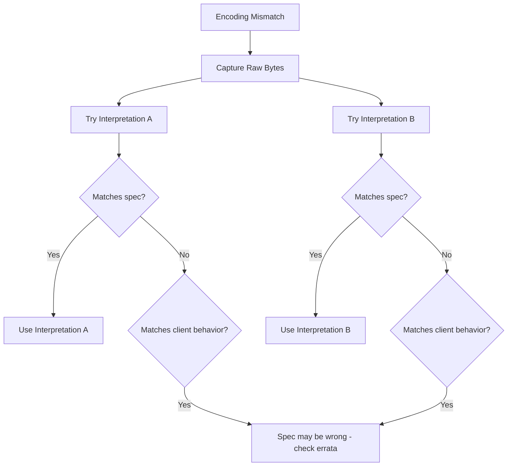

# Troubleshooting Protocol Spec Corner Cases in Cilium Network Security

Author: [nawazdhandala](https://github.com/nawazdhandala)

Tags: Cilium, Network Security, Protocol Specification, Corner Cases, Troubleshooting

Description: Diagnose and resolve issues caused by protocol specification corner cases in Cilium L7 parsers, including client/server disagreements, encoding ambiguities, and state machine conflicts.

---

## Introduction

Corner cases in protocol specifications become real bugs when the parser encounters traffic that falls into ambiguous territory. These bugs are among the hardest to diagnose because the traffic may appear valid to the client, valid to the server, but be misinterpreted by the parser — leading to policy bypasses, connection failures, or data corruption.

Troubleshooting corner case issues requires comparing actual wire traffic against the specification, understanding where implementations diverge from the spec, and determining whether the parser's interpretation is correct for security purposes.

## Prerequisites

- Packet capture of the problematic traffic
- Protocol specification for reference
- Access to client and server source code or documentation
- Wireshark with protocol dissector (if available)
- Parser source code and debug logging

## Diagnosing Client-Parser Disagreements

When clients report failures that the parser logs show as successful, or vice versa:

```bash
# Capture traffic for analysis
kubectl exec -n kube-system ds/cilium -- \
    tcpdump -i any -w /tmp/corner-case.pcap port 9000 -c 50

# Copy capture for local analysis
kubectl cp kube-system/<cilium-pod>:/tmp/corner-case.pcap ./corner-case.pcap

# Examine with tshark
tshark -r corner-case.pcap -Y "tcp.port==9000" -T fields \
    -e frame.number -e ip.src -e ip.dst -e data.len -e data
```

Compare parser interpretation with raw bytes:

```go
// Add diagnostic logging that shows raw bytes alongside parsed values
func (p *Parser) OnDataDiagnostic(reply bool, reader *proxylib.Reader) (proxylib.OpType, int) {
    dataLen := reader.Length()
    if dataLen > 0 {
        data, _ := reader.PeekSlice(min(dataLen, 64))
        log.WithFields(log.Fields{
            "direction": directionStr(reply),
            "dataLen":   dataLen,
            "hexDump":   fmt.Sprintf("%x", data),
            "ascii":     sanitizeASCII(data),
        }).Debug("OnData raw input")
    }

    op, n := p.OnData(reply, reader)

    log.WithFields(log.Fields{
        "opType":   opTypeStr(op),
        "consumed": n,
    }).Debug("OnData result")

    return op, n
}

func sanitizeASCII(data []byte) string {
    result := make([]byte, len(data))
    for i, b := range data {
        if b >= 0x20 && b <= 0x7E {
            result[i] = b
        } else {
            result[i] = '.'
        }
    }
    return string(result)
}
```

## Resolving Encoding Ambiguities

When the same bytes are interpreted differently:

```bash
# Example: Is length field signed or unsigned?
# Byte sequence: 0x80 0x00 0x00 0x01
# As unsigned int32: 2147483649
# As signed int32: -2147483647

# Example: Is string encoding UTF-8 or Latin-1?
# Byte sequence: 0xC3 0xA9
# As UTF-8: "e" (single character)
# As Latin-1: "é" (two characters)
```

```go
// Diagnostic: Try both interpretations and log the difference
func diagnoseLengthField(data []byte) {
    if len(data) < 4 {
        return
    }

    unsigned := uint32(data[0])<<24 | uint32(data[1])<<16 | uint32(data[2])<<8 | uint32(data[3])
    signed := int32(data[0])<<24 | int32(data[1])<<16 | int32(data[2])<<8 | int32(data[3])

    log.WithFields(log.Fields{
        "bytes":      fmt.Sprintf("%02x %02x %02x %02x", data[0], data[1], data[2], data[3]),
        "asUint32":   unsigned,
        "asInt32":    signed,
        "signBitSet": data[0]&0x80 != 0,
    }).Info("Length field interpretation")
}
```



## Handling Version-Specific Corner Cases

When different client versions trigger different corner cases:

```bash
# Identify client versions in traffic
kubectl logs -n cilium-parser-test deploy/test-client | grep "version\|Version"

# Check if the issue is version-specific
# Test with different client versions
kubectl exec -n cilium-parser-test deploy/test-client-v1 -- \
    protocol-client send --command GET --key test --target server:9000

kubectl exec -n cilium-parser-test deploy/test-client-v2 -- \
    protocol-client send --command GET --key test --target server:9000
```

```go
// Handle version-specific corner cases
func (p *Parser) parseMessageVersionAware(data []byte) (ParsedMessage, error) {
    version := data[4] // Assuming version byte at offset 4

    switch version {
    case 1:
        // v1: Length field is signed int32
        return p.parseMessageV1(data)
    case 2:
        // v2: Length field is unsigned int32
        return p.parseMessageV2(data)
    default:
        // Unknown version: use most restrictive parsing
        log.WithField("version", version).Warn("Unknown protocol version, using strict parsing")
        return p.parseMessageStrict(data)
    }
}
```

## Debugging State Machine Corner Cases

When connections get stuck or behave unexpectedly after specific message sequences:

```go
// State machine debugging: log every transition
func (p *Parser) setState(newState parserState, reason string) {
    log.WithFields(log.Fields{
        "oldState": stateNames[p.state],
        "newState": stateNames[newState],
        "reason":   reason,
    }).Debug("Parser state transition")

    p.state = newState
}

var stateNames = map[parserState]string{
    stateInit:    "INIT",
    stateRunning: "RUNNING",
    stateError:   "ERROR",
    stateClosed:  "CLOSED",
}

// Use in OnData
func (p *Parser) OnData(reply bool, reader *proxylib.Reader) (proxylib.OpType, int) {
    if p.state == stateInit {
        p.setState(stateRunning, "first data received")
    }
    // ...
}
```

## Verification

After resolving a corner case issue:

```bash
# Test the specific corner case
go test ./proxylib/myprotocol/... -v -run TestCornerCase

# Run the full test suite to check for regressions
go test ./proxylib/myprotocol/... -v -race

# Fuzz to check for related corner cases
go test ./proxylib/myprotocol/... -fuzz=FuzzOnData -fuzztime=60s

# Test with real traffic that triggered the issue
kubectl exec -n cilium-parser-test deploy/test-client -- \
    protocol-client replay --file /tmp/corner-case-traffic.bin --target server:9000
```

## Troubleshooting

**Problem: Corner case only occurs with specific client libraries**
The client library may implement a non-standard extension or interpret an ambiguity differently. Capture traffic from the specific client and compare byte-by-byte with the spec.

**Problem: Fix for one corner case breaks another**
The two corner cases may conflict. Document both and implement version detection or client detection to handle each case appropriately.

**Problem: Cannot reproduce the corner case in testing**
Create a custom test that sends the exact byte sequence captured from production. Use raw TCP connections rather than the protocol client library.

**Problem: Spec has been updated but old clients remain**
Implement protocol version negotiation if the spec supports it. Otherwise, default to the most restrictive interpretation that does not break active clients.

## Conclusion

Troubleshooting protocol spec corner cases requires detailed byte-level analysis of traffic, comparison against the specification, and understanding of how different implementations interpret ambiguities. Use diagnostic logging to expose the parser's interpretation alongside raw traffic data. When ambiguities cannot be resolved from the spec alone, choose the interpretation that is most restrictive from a security perspective while maintaining compatibility with known client implementations.
