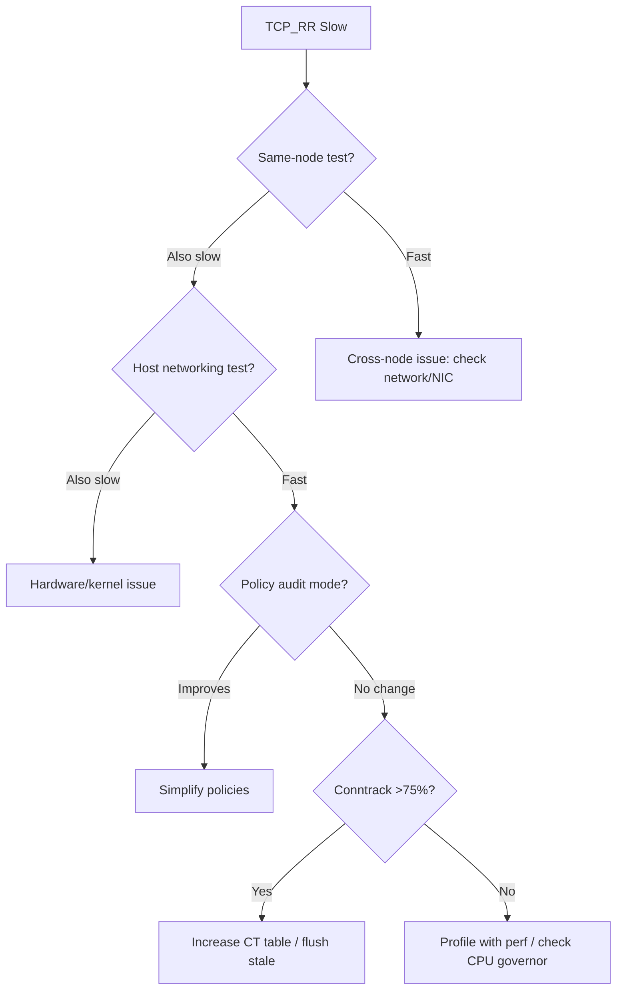

# Troubleshooting Request/Response Rate (TCP_RR) in Cilium Performance

Author: [nawazdhandala](https://github.com/nawazdhandala)

Tags: Cilium, Kubernetes, Networking, Performance, TCP_RR, Troubleshooting

Description: A systematic troubleshooting guide for TCP_RR latency and throughput issues in Cilium, covering datapath analysis, conntrack debugging, and policy impact assessment.

---

## Introduction

When TCP_RR performance degrades in a Cilium-managed cluster, the symptoms are usually high latency per transaction and reduced transactions per second. Since TCP_RR measures the round-trip time of a single request and response on an established connection, every component in the datapath contributes to the total latency.

Troubleshooting TCP_RR issues requires a systematic approach that isolates each layer: the application, the kernel TCP stack, Cilium's eBPF programs, network policies, and the physical network. This guide provides a step-by-step troubleshooting methodology with specific commands for each layer.

The most common root causes are conntrack table contention, excessive policy evaluation, CPU frequency scaling, and competition with other eBPF programs for CPU time.

## Prerequisites

- Kubernetes cluster with Cilium v1.14+
- `netperf` and `cilium/netperf` container images
- `cilium` CLI, `kubectl`, and `bpftool`
- Node-level root access for `perf` profiling
- Hubble CLI for flow inspection

## Step 1: Establish the Problem Scope

Determine whether the issue is cluster-wide or specific to certain paths:

```bash
# Test pod-to-pod on same node
kubectl run server-local --image=cilium/netperf -- netserver -D
kubectl run client-local --image=cilium/netperf \
  --overrides='{"spec":{"nodeName":"'$(kubectl get pod server-local -o jsonpath='{.spec.nodeName}')}'"}}' \
  --rm -it --restart=Never \
  -- netperf -H $(kubectl get pod server-local -o jsonpath='{.status.podIP}') -t TCP_RR -l 10

# Test pod-to-pod cross-node
kubectl run server-remote --image=cilium/netperf \
  --overrides='{"spec":{"nodeSelector":{"kubernetes.io/hostname":"node-2"}}}' \
  -- netserver -D
kubectl run client-remote --image=cilium/netperf \
  --overrides='{"spec":{"nodeSelector":{"kubernetes.io/hostname":"node-1"}}}' \
  --rm -it --restart=Never \
  -- netperf -H $(kubectl get pod server-remote -o jsonpath='{.status.podIP}') -t TCP_RR -l 10

# Test host-to-host baseline
kubectl run host-server --image=cilium/netperf \
  --overrides='{"spec":{"hostNetwork":true,"nodeSelector":{"kubernetes.io/hostname":"node-2"}}}' \
  -- netserver -D
kubectl run host-client --image=cilium/netperf \
  --overrides='{"spec":{"hostNetwork":true,"nodeSelector":{"kubernetes.io/hostname":"node-1"}}}' \
  --rm -it --restart=Never \
  -- netperf -H <node-2-ip> -t TCP_RR -l 10
```

Compare the three results to isolate where the overhead is.

## Step 2: Analyze Cilium Datapath

```bash
# Check Cilium's datapath mode
cilium status --verbose | grep -E "DatapathMode|Host Routing|KubeProxyReplacement"

# List BPF programs with execution stats
bpftool prog show --json | jq '.[] | select(.name | contains("cil")) | {id, name, run_cnt, run_time_ns, avg_ns: (if .run_cnt > 0 then (.run_time_ns / .run_cnt) else 0 end)}'

# High avg_ns (>2000) indicates slow BPF programs
```

Check if the datapath is taking a sub-optimal route:

```bash
# Trace packet path through Cilium
cilium monitor --type trace --related-to <endpoint-id> | head -50

# Check endpoint configuration
cilium endpoint get <endpoint-id> -o json | jq '.status.policy'
```

## Step 3: Conntrack Table Analysis

Conntrack is often the bottleneck for TCP_RR:

```bash
# Check table utilization
CT_COUNT=$(cilium bpf ct list global | wc -l)
CT_MAX=$(cilium config view | grep bpf-ct-global-tcp-max | awk '{print $2}')
echo "Conntrack utilization: $CT_COUNT / $CT_MAX"

# If > 75% full, contention is likely
# Check for stale entries
cilium bpf ct list global | awk '{print $NF}' | sort | uniq -c | sort -rn | head

# Flush conntrack if needed (causes brief disruption)
cilium bpf ct flush global
```

## Step 4: Policy Impact Assessment

```bash
# Temporarily switch to audit mode to measure policy overhead
cilium config set policy-audit-mode enabled

# Re-run TCP_RR test
kubectl run audit-test --image=cilium/netperf \
  --rm -it --restart=Never \
  -- netperf -H $SERVER_IP -t TCP_RR -l 10

# If TCP_RR improves significantly, policies are the bottleneck
# Re-enable enforcement
cilium config set policy-audit-mode disabled
```

## Step 5: CPU and Scheduling Analysis

```bash
# Check CPU frequency (should be at max)
cat /sys/devices/system/cpu/cpu0/cpufreq/scaling_cur_freq
cat /sys/devices/system/cpu/cpu0/cpufreq/scaling_max_freq

# Check for CPU throttling
dmesg | grep -i throttl

# Profile the kernel during TCP_RR test
perf record -g -a -- sleep 5
perf report --sort=dso,symbol --stdio | head -30

# Check scheduling latency
perf sched record -- sleep 5
perf sched latency --sort max
```

## Step 6: Network-Level Debugging

```bash
# Check for packet drops in the NIC
ethtool -S eth0 | grep -i drop
ethtool -S eth0 | grep -i error

# Check kernel drop counters
netstat -s | grep -i drop
netstat -s | grep -i retransmit

# Use Hubble to look for drops
hubble observe --type drop --last 100
```

## Resolution Flowchart



## Verification

After applying fixes, verify the improvement:

```bash
# Run comprehensive TCP_RR verification
for SIZE in 1 64 256 1024; do
  echo "=== Payload size: $SIZE bytes ==="
  kubectl run verify-$SIZE --image=cilium/netperf \
    --rm -it --restart=Never \
    -- netperf -H $SERVER_IP -t TCP_RR -l 15 -- -r $SIZE,$SIZE
done
```

## Troubleshooting

- **TCP_RR good on same node, bad cross-node**: Focus on physical network latency. Check MTU consistency across nodes.
- **Intermittent latency spikes**: Look for Cilium agent restarts (`kubectl get events -n kube-system`) or conntrack GC pauses.
- **Latency increases with cluster size**: Likely identity or policy scaling issue. Check `cilium identity list | wc -l`.
- **Test results vary wildly between runs**: Pin test pods to specific CPUs and eliminate noisy neighbors.

## Conclusion

Troubleshooting TCP_RR performance in Cilium follows a layered approach: compare same-node vs cross-node vs host networking to isolate the problem layer, then drill into Cilium's datapath, conntrack tables, policy evaluation, and CPU scheduling. The systematic flowchart approach ensures you do not waste time on the wrong layer. Most TCP_RR issues in Cilium resolve through conntrack optimization, policy simplification, or CPU frequency management.
