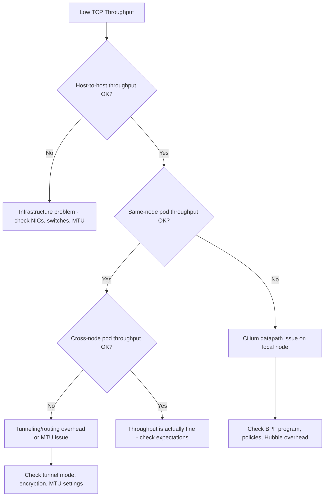

# How to Troubleshoot TCP Throughput (TCP_STREAM) in Cilium Performance

Author: [nawazdhandala](https://github.com/nawazdhandala)

Tags: Cilium, TCP, Performance, Troubleshooting, Networking

Description: Diagnose and resolve TCP throughput issues in Cilium, including identifying bottlenecks in the BPF datapath, fixing connection tracking problems, and resolving kernel-level TCP stack issues.

---

## Introduction

When TCP throughput in a Cilium cluster falls below expectations, the bottleneck can exist at any layer: the physical network, the kernel TCP stack, the BPF datapath, or the Cilium configuration. Each layer requires different diagnostic tools and produces different symptoms.

Low throughput is particularly insidious because it often does not generate errors or alerts -- applications just run slowly. Identifying whether the problem is Cilium-specific or infrastructure-related is the first and most important diagnostic step.

This guide provides a systematic troubleshooting approach for TCP throughput issues, from eliminating infrastructure causes to pinpointing Cilium-specific bottlenecks.

## Prerequisites

- Kubernetes cluster with Cilium where TCP throughput is below expectations
- iperf3 for benchmarking
- kubectl and cilium CLI access
- Access to node-level diagnostics
- Baseline throughput measurements for comparison

## Step 1: Isolate the Problem Layer

Determine whether the bottleneck is Cilium-specific or infrastructure-related:

```bash
# Test 1: Host-to-host throughput (bypasses Cilium entirely)
# SSH to node1 and run iperf3 server
# From node2, run: iperf3 -c <node1-ip> -t 30 -P 4
# If this is slow, the problem is infrastructure, not Cilium

# Test 2: Pod-to-pod same-node throughput
kubectl run iperf-server --image=networkstatic/iperf3 --port=5201 -- -s
kubectl expose pod iperf-server --port=5201
NODE=$(kubectl get pod iperf-server -o jsonpath='{.spec.nodeName}')

kubectl run iperf-same --image=networkstatic/iperf3 --rm -it --restart=Never \
  --overrides='{"spec":{"nodeSelector":{"kubernetes.io/hostname":"'$NODE'"}}}' -- \
  -c iperf-server.default -t 30 -P 4

# Test 3: Pod-to-pod cross-node throughput
OTHER_NODE=$(kubectl get nodes -o jsonpath='{.items[1].metadata.name}')
kubectl run iperf-cross --image=networkstatic/iperf3 --rm -it --restart=Never \
  --overrides='{"spec":{"nodeSelector":{"kubernetes.io/hostname":"'$OTHER_NODE'"}}}' -- \
  -c iperf-server.default -t 30 -P 4
```



## Step 2: Check for MTU Issues

MTU mismatches are a common cause of throughput degradation:

```bash
# Check MTU on Cilium interfaces
kubectl -n kube-system exec ds/cilium -- ip link show | grep mtu

# Check the configured MTU in Cilium
kubectl -n kube-system exec ds/cilium -- cilium config | grep MTU

# Test with specific packet sizes to detect MTU issues
kubectl run mtu-test --image=busybox --rm -it --restart=Never -- \
  ping -c 5 -s 1472 -M do iperf-server.default
# If this fails but ping -s 1400 works, there is an MTU issue

# For VXLAN tunnels, effective MTU = NIC MTU - 50 (VXLAN header)
# For WireGuard, effective MTU = NIC MTU - 60 (WireGuard header)
```

Fix MTU:

```bash
helm upgrade cilium cilium/cilium -n kube-system \
  --reuse-values \
  --set MTU=1450  # For VXLAN with standard 1500 NIC MTU
```

## Step 3: Analyze BPF Datapath Performance

Check for BPF-level bottlenecks:

```bash
# Check BPF program complexity
kubectl -n kube-system exec ds/cilium -- cilium bpf prog list

# Check for conntrack table pressure
kubectl -n kube-system exec ds/cilium -- cilium bpf ct list global | wc -l
CT_MAX=$(kubectl -n kube-system exec ds/cilium -- cilium config | grep CTMapEntriesGlobalTCP | awk '{print $2}')
CT_CURRENT=$(kubectl -n kube-system exec ds/cilium -- cilium bpf ct list global | wc -l)
echo "CT usage: $CT_CURRENT / $CT_MAX"

# Check for drops during the throughput test
kubectl -n kube-system exec ds/cilium -- cilium monitor --type drop &
MONITOR_PID=$!
# Run your iperf3 test
# Then stop the monitor
kill $MONITOR_PID 2>/dev/null

# Check metrics for drop spikes during the test
kubectl -n kube-system exec ds/cilium -- \
  wget -qO- http://localhost:9962/metrics 2>/dev/null | \
  grep "cilium_drop_count_total" | grep -v "^#"
```

## Step 4: Check for Encryption Overhead

Encryption significantly impacts throughput:

```bash
# Check if encryption is enabled
cilium status | grep "Encryption"
kubectl -n kube-system exec ds/cilium -- cilium config | grep -i encrypt

# If IPSec is enabled, check the algorithm
kubectl -n kube-system exec ds/cilium -- cilium config | grep "EncryptionType"

# Benchmark comparison:
# No encryption: ~line rate
# WireGuard: ~70-90% of line rate
# IPSec: ~40-70% of line rate (depends on algorithm and hardware offload)

# If encryption is the bottleneck, consider:
# 1. Switch from IPSec to WireGuard (better performance)
# 2. Use hardware crypto offload if available
# 3. Accept the overhead as a security trade-off
```

## Step 5: Diagnose Kernel TCP Stack Issues

```bash
# Check for TCP retransmissions (indicate packet loss)
kubectl debug node/$(kubectl get nodes -o jsonpath='{.items[0].metadata.name}') \
  -it --image=ubuntu -- bash -c '
  cat /proc/net/snmp | grep Tcp
  echo "---"
  cat /proc/net/netstat | grep TcpExt
'

# Key counters to watch:
# TCPRetransFail - failed retransmissions
# TCPLostRetransmit - lost retransmit packets
# TCPSackFailures - SACK failures
# TCPAbortOnTimeout - connections aborted due to timeout

# Check for buffer overflows
kubectl debug node/$(kubectl get nodes -o jsonpath='{.items[0].metadata.name}') \
  -it --image=ubuntu -- bash -c '
  echo "Socket buffer overflows:"
  cat /proc/net/softnet_stat | awk "{print \"CPU\" NR-1 \": dropped=\" strtonum(\"0x\"\$2) \" squeezed=\" strtonum(\"0x\"\$3)}"
'

# Check current TCP buffer sizes
kubectl debug node/$(kubectl get nodes -o jsonpath='{.items[0].metadata.name}') \
  -it --image=busybox -- sh -c '
  echo "tcp_rmem: $(cat /proc/sys/net/ipv4/tcp_rmem)"
  echo "tcp_wmem: $(cat /proc/sys/net/ipv4/tcp_wmem)"
  echo "rmem_max: $(cat /proc/sys/net/core/rmem_max)"
  echo "wmem_max: $(cat /proc/sys/net/core/wmem_max)"
  echo "tcp_congestion: $(cat /proc/sys/net/ipv4/tcp_congestion_control)"
'
```

## Verification

After applying fixes, re-measure throughput:

```bash
# 1. Same benchmark as initial diagnosis
kubectl run iperf-verify --image=networkstatic/iperf3 --rm -it --restart=Never \
  --overrides='{"spec":{"nodeSelector":{"kubernetes.io/hostname":"'$NODE'"}}}' -- \
  -c iperf-server.default -t 30 -P 4

# 2. Verify no drops during test
kubectl -n kube-system exec ds/cilium -- \
  wget -qO- http://localhost:9962/metrics 2>/dev/null | \
  grep "cilium_drop_count_total"

# 3. Check retransmission rate
kubectl debug node/$NODE -it --image=busybox -- sh -c '
  cat /proc/net/snmp | grep Tcp | tail -1 | awk "{print \"RetransSegs: \" \$13}"
'

# 4. Compare with baseline
echo "Compare the throughput with your baseline measurement"

# Clean up
kubectl delete pod iperf-server 2>/dev/null
kubectl delete svc iperf-server 2>/dev/null
```

## Troubleshooting

- **Same-node throughput is low**: Check if Hubble is running with `monitorAggregation=none`. This is the most common cause of same-node throughput reduction.

- **Cross-node throughput is much lower than same-node**: This is expected with VXLAN tunneling (adds overhead). Consider switching to native routing.

- **Throughput fluctuates wildly**: Check for noisy neighbors on the same nodes. Use resource limits and QoS to isolate workloads.

- **High retransmission rate**: Check for MTU issues, network congestion, or faulty NICs. Use `tcpdump` on the node to capture packet traces.

- **Throughput drops under load**: BPF maps may be filling up. Check CT table pressure and increase map sizes if needed.

## Conclusion

TCP throughput troubleshooting in Cilium follows a layered approach: first eliminate infrastructure issues, then check Cilium-specific factors like MTU, encryption, BPF datapath, and kernel TCP settings. The diagnostic isolation test -- comparing host-to-host, same-node, and cross-node throughput -- quickly narrows down the problem layer. Most Cilium-specific throughput issues trace back to MTU mismatches, monitor aggregation settings, or encryption overhead.
