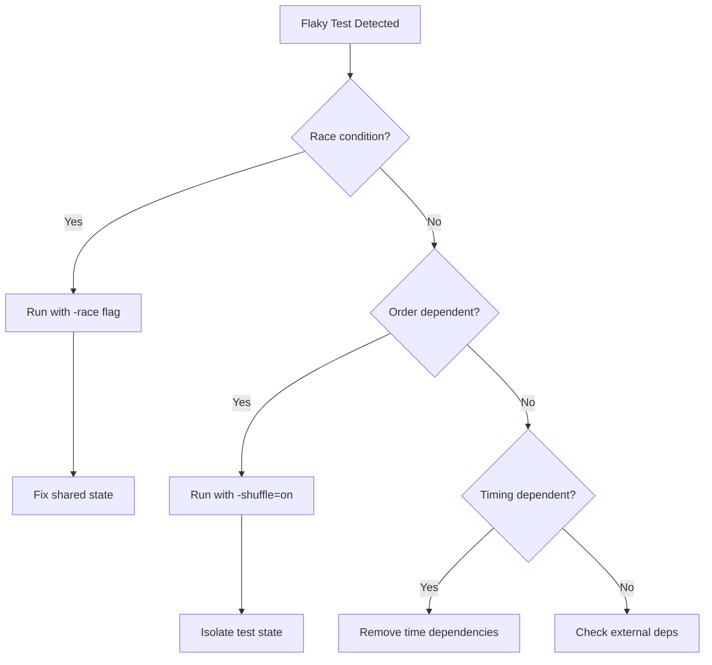

# Troubleshooting Unit Testing for Cilium L7 Parser Development

Author: [nawazdhandala](https://github.com/nawazdhandala)

Tags: Cilium, Network Security, Unit Testing, Troubleshooting, Go, TDD

Description: Solve common problems encountered when writing and running unit tests for Cilium L7 protocol parsers, including test infrastructure issues, flaky tests, and debugging techniques.

---

## Introduction

Unit testing Cilium L7 parsers can present unique challenges that go beyond typical Go testing problems. The proxylib framework has specific requirements for how parsers interact with the Reader interface, how connection state is managed, and how policy decisions are evaluated during tests.

When tests fail unexpectedly, produce inconsistent results, or cannot reach certain code paths, developers need systematic approaches to diagnose the root cause. Many issues stem from misunderstanding the proxylib testing utilities, incorrect test data construction, or missing test dependencies.

This guide addresses the most common unit testing problems encountered during Cilium parser development and provides practical solutions for each.

## Prerequisites

- Go 1.21 or later
- Cilium source code with proxylib
- Existing parser with test files
- Familiarity with Go test debugging (`-v`, `-run`, `-count`)
- `dlv` (Delve) debugger installed for interactive debugging

## Fixing Test Reader Issues

The most common testing problem is incorrect test Reader setup:

```bash
# Run tests with verbose output to see failures
go test ./proxylib/myprotocol/... -v -count=1 2>&1 | head -80
```

```go
// PROBLEM: Test reader returns unexpected data
func TestOnData_BasicMessage(t *testing.T) {
    // BUG: Data does not match protocol format
    data := []byte("hello world")
    reader := proxylib.NewTestReader(data)

    parser := &Parser{state: stateRunning}
    op, n := parser.OnData(false, reader)

    // This will fail because "hello world" is not a valid protocol message
    if op != proxylib.PASS {
        t.Errorf("Expected PASS, got %v", op) // Will likely get DROP or MORE
    }
    _ = n
}

// FIX: Construct properly formatted protocol data
func TestOnData_BasicMessage(t *testing.T) {
    // Create a valid message: 4-byte length header + body
    body := []byte{0x01, 0x00, 0x00, 0x00, 0x01} // command + request ID
    header := make([]byte, 4)
    header[0] = byte(len(body) >> 24)
    header[1] = byte(len(body) >> 16)
    header[2] = byte(len(body) >> 8)
    header[3] = byte(len(body))

    data := append(header, body...)
    reader := proxylib.NewTestReader(data)

    parser := &Parser{state: stateRunning}
    op, n := parser.OnData(false, reader)

    if op != proxylib.PASS {
        t.Errorf("Expected PASS, got %v", op)
    }
    if n != len(data) {
        t.Errorf("Expected to consume %d bytes, got %d", len(data), n)
    }
}
```

## Debugging Flaky Tests

Flaky tests in parsers usually indicate uninitialized state or order-dependent behavior:

```bash
# Run tests multiple times to reproduce flakiness
go test ./proxylib/myprotocol/... -v -count=10 2>&1 | grep -E "FAIL|PASS|---"

# Run with race detector to find data races
go test ./proxylib/myprotocol/... -race -count=5

# Run tests in random order (Go 1.17+)
go test ./proxylib/myprotocol/... -v -shuffle=on
```

```go
// PROBLEM: Global state leaks between tests
var globalParser *Parser // BAD: shared state

func TestFirst(t *testing.T) {
    globalParser = &Parser{state: stateRunning}
    // ... modifies globalParser.state to stateError
}

func TestSecond(t *testing.T) {
    // BUG: globalParser is still in stateError from TestFirst
    op, _ := globalParser.OnData(false, reader)
    // Unexpected DROP because parser is in error state
    _ = op
}

// FIX: Create fresh state in each test
func TestFirst(t *testing.T) {
    parser := &Parser{state: stateRunning}
    // ... test logic
    _ = parser
}

func TestSecond(t *testing.T) {
    parser := &Parser{state: stateRunning}
    // ... test logic with clean state
    _ = parser
}
```



## Resolving Coverage Gaps

When tests cannot reach certain code paths:

```bash
# Generate detailed coverage report
go test ./proxylib/myprotocol/... -coverprofile=coverage.out -covermode=atomic
go tool cover -html=coverage.out -o coverage.html

# Check which lines are uncovered
go tool cover -func=coverage.out | grep -v "100.0%"
```

Common uncovered paths and how to test them:

```go
// Problem: Cannot reach the error recovery path
// The path requires a specific state + specific input combination

func TestOnData_ErrorStateRecovery(t *testing.T) {
    // Set parser directly to the state needed
    parser := &Parser{
        state:    stateError,
        bytesRead: 1000,
    }

    // Provide data that would normally be valid
    msg := makeValidMessage(0x01, []byte("test"))
    reader := proxylib.NewTestReader(msg)

    op, n := parser.OnData(false, reader)

    // Error state should remain terminal
    if op != proxylib.DROP {
        t.Errorf("Error state should DROP, got %v", op)
    }
    if n != 0 {
        t.Errorf("Error state should consume 0 bytes, got %d", n)
    }
}

// Problem: Cannot trigger integer overflow path
func TestOnData_IntegerOverflowPath(t *testing.T) {
    // Craft a header with length that would overflow when added to header size
    header := []byte{0x7F, 0xFF, 0xFF, 0xFF} // Near-max positive int32

    reader := proxylib.NewTestReader(header)
    parser := &Parser{state: stateRunning}

    op, _ := parser.OnData(false, reader)

    if op != proxylib.DROP {
        t.Errorf("Near-overflow length should be dropped, got %v", op)
    }
}
```

## Using Delve for Interactive Debugging

When test failures are not obvious from output alone:

```bash
# Start Delve on a specific test
dlv test ./proxylib/myprotocol/ -- -test.run TestOnData_BasicMessage -test.v

# Inside Delve, set breakpoints
# (dlv) break myprotocolparser.go:45
# (dlv) continue
# (dlv) print data
# (dlv) print len(data)
# (dlv) print parser.state
# (dlv) next
```

Add strategic debug logging for test troubleshooting:

```go
func TestOnData_DebugComplex(t *testing.T) {
    if testing.Verbose() {
        // Only logs when running with -v flag
        t.Logf("Input data: %x", data)
        t.Logf("Parser state before: %v", parser.state)
    }

    op, n := parser.OnData(false, reader)

    if testing.Verbose() {
        t.Logf("Result: op=%v, n=%d", op, n)
        t.Logf("Parser state after: %v", parser.state)
    }
}
```

## Verification

Confirm your test suite is healthy:

```bash
# Run full suite with all checks
go test ./proxylib/myprotocol/... -v -race -count=1 -shuffle=on

# Verify coverage meets threshold
COVERAGE=$(go test ./proxylib/myprotocol/... -coverprofile=/dev/stderr 2>&1 | grep -o '[0-9.]*%' | head -1)
echo "Coverage: $COVERAGE"

# Run benchmarks to ensure tests don't have performance issues
go test ./proxylib/myprotocol/... -bench=. -benchtime=1s

# Check for test binary size (large size may indicate unnecessary imports)
go test -c ./proxylib/myprotocol/ -o /dev/null
```

## Troubleshooting

**Problem: Tests pass locally but fail in CI**
Check Go version differences between local and CI. Also verify that CI runs tests with the same build tags. Add `t.Logf` statements to capture environment info in CI output.

**Problem: Test binary panics before any test runs**
This usually indicates an `init()` function problem - the parser factory registration may conflict with another parser. Check for duplicate parser names.

**Problem: Coverage report shows 0%**
Ensure the test file is in the same package as the code under test (not a separate `_test` package for internal function access).

**Problem: Tests take too long to run**
Profile slow tests with `-cpuprofile` and examine whether they allocate excessive memory. Table-driven tests with many cases should use `t.Parallel()` where possible.

## Conclusion

Troubleshooting unit tests for Cilium L7 parsers requires attention to test data construction, state isolation, coverage analysis, and debugging techniques. By maintaining clean test state, constructing valid protocol data, using coverage reports to find gaps, and employing Delve for complex debugging scenarios, you can build a reliable test suite that gives confidence in your parser's correctness and security properties.
