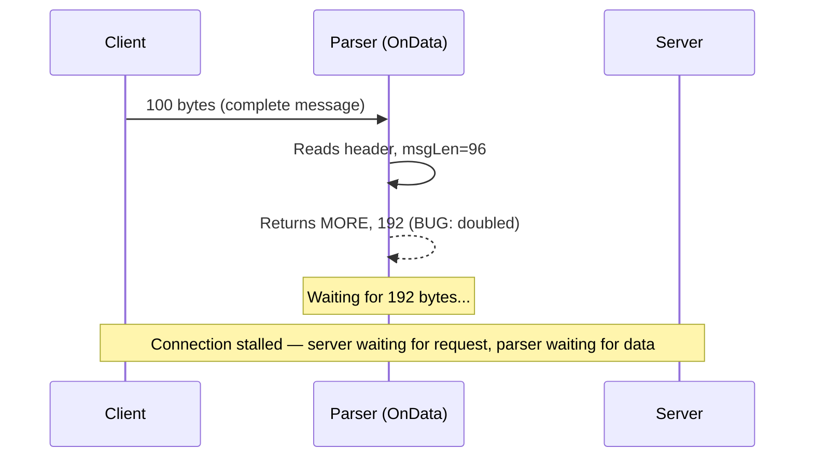

# Troubleshooting the OnData Method in Cilium Network Security

Author: [nawazdhandala](https://github.com/nawazdhandala)

Tags: Cilium, Network Security, Troubleshooting, OnData, L7 Proxy, Debugging

Description: A practical troubleshooting guide for common issues in Cilium L7 parser OnData implementations, covering panics, connection stalls, policy mismatches, and data corruption scenarios.

---

## Introduction

The `OnData` method in Cilium's proxylib framework is where raw network bytes meet parsing logic. When things go wrong here, the symptoms can range from subtle — slightly elevated latency or intermittent connection resets — to dramatic, such as Envoy proxy crashes that disrupt all L7-filtered traffic on a node.

Troubleshooting OnData issues requires understanding the proxylib execution model, the relationship between return values and proxy behavior, and the tools available for inspecting traffic flow through Cilium's data path. Many problems stem from incorrect return values, off-by-one errors in length calculations, or misunderstanding how the framework buffers data between calls.

This guide covers the most common OnData problems, their root causes, and systematic approaches to diagnosing and fixing them.

## Prerequisites

- A running Kubernetes cluster with Cilium installed
- Access to Cilium agent and Envoy proxy logs
- Go debugging tools (delve)
- `cilium` CLI installed
- `kubectl` access to the cluster
- Familiarity with the proxylib Parser interface

## Diagnosing Connection Stalls

Connection stalls happen when the parser requests more data than will ever arrive, creating a deadlock.

```bash
# Check for connections stuck in the proxy
kubectl exec -n kube-system ds/cilium -- cilium bpf proxy list

# Check Envoy proxy stats for timeouts
kubectl exec -n kube-system ds/cilium -c cilium-agent -- \
    curl -s http://localhost:9901/stats | grep timeout

# Look for parser-related warnings in Cilium logs
kubectl logs -n kube-system ds/cilium -c cilium-agent | grep -i "proxylib\|parser\|OnData"
```

Common causes of connection stalls:

```go
// BUG: Requesting more data than the message contains
func (p *Parser) OnData(reply bool, reader *proxylib.Reader) (proxylib.OpType, int) {
    data, _ := reader.PeekSlice(4)
    msgLen := int(data[0])<<24 | int(data[1])<<16 | int(data[2])<<8 | int(data[3])

    // BUG: Should be 4 + msgLen, not msgLen + msgLen
    return proxylib.MORE, msgLen + msgLen  // WRONG — doubles the required bytes
}

// FIX: Calculate total length correctly
func (p *Parser) OnData(reply bool, reader *proxylib.Reader) (proxylib.OpType, int) {
    dataLen := reader.Length()
    if dataLen < 4 {
        return proxylib.MORE, 4
    }
    data, _ := reader.PeekSlice(4)
    msgLen := int(data[0])<<24 | int(data[1])<<16 | int(data[2])<<8 | int(data[3])

    totalLen := 4 + msgLen  // header + body
    if dataLen < totalLen {
        return proxylib.MORE, totalLen
    }
    return proxylib.PASS, totalLen
}
```



## Debugging Parser Panics

Panics in OnData crash the Envoy proxy process. Diagnose them quickly:

```bash
# Check for Envoy restarts
kubectl get pods -n kube-system -l k8s-app=cilium -o wide
kubectl describe pod -n kube-system <cilium-pod> | grep -A5 "Restart Count"

# Check Cilium agent logs for panic traces
kubectl logs -n kube-system <cilium-pod> -c cilium-agent --previous | grep -A 30 "panic"

# Enable debug logging for the proxy
kubectl exec -n kube-system <cilium-pod> -- cilium config set debug true
```

Common panic scenarios and fixes:

```go
// PANIC: Slice bounds out of range
func (p *Parser) OnData(reply bool, reader *proxylib.Reader) (proxylib.OpType, int) {
    data, _ := reader.PeekSlice(reader.Length())
    // PANIC if reader.Length() < 5
    command := data[4]  // No bounds check!

    // FIX: Always check bounds
    if len(data) < 5 {
        return proxylib.MORE, 5
    }
    command := data[4]  // Safe
    _ = command
    return proxylib.PASS, len(data)
}
```

## Fixing Policy Matching Failures

When OnData passes traffic that should be denied, or drops traffic that should pass:

```bash
# Inspect the active L7 policy
kubectl exec -n kube-system ds/cilium -- cilium policy get -o jsonpath='{.spec}'

# Check proxy redirect status
kubectl exec -n kube-system ds/cilium -- cilium bpf proxy list

# Monitor policy verdicts in real time
kubectl exec -n kube-system ds/cilium -- cilium monitor --type policy-verdict
```

Debug the policy matching logic:

```go
// Add detailed logging to identify policy matching issues
func (p *Parser) matchesPolicy(command byte) bool {
    rules := p.connection.Rules
    log.WithFields(log.Fields{
        "command":    command,
        "ruleCount":  len(rules),
        "srcID":      p.connection.SrcIdentity,
        "dstID":      p.connection.DstIdentity,
    }).Debug("Evaluating policy rules")

    for i, rule := range rules {
        log.WithFields(log.Fields{
            "ruleIndex": i,
            "rule":      fmt.Sprintf("%+v", rule),
        }).Debug("Checking rule")
    }

    // ... policy matching logic
    return true
}
```

## Resolving Data Corruption Issues

Data corruption manifests as valid-looking messages with garbled content:

```bash
# Capture traffic before and after the proxy for comparison
kubectl exec -n kube-system ds/cilium -- \
    tcpdump -i any -w /tmp/proxy-traffic.pcap port 9000 &

# Compare request bytes at client and server
# Use a test client that logs exact bytes sent
```

Common corruption cause — consuming the wrong number of bytes:

```go
// BUG: PASS consumes fewer bytes than the message, corrupting the stream
func (p *Parser) OnData(reply bool, reader *proxylib.Reader) (proxylib.OpType, int) {
    dataLen := reader.Length()
    if dataLen < 4 {
        return proxylib.MORE, 4
    }
    data, _ := reader.PeekSlice(4)
    msgLen := int(data[0])<<24 | int(data[1])<<16 | int(data[2])<<8 | int(data[3])

    // BUG: Only passing msgLen bytes, not accounting for the 4-byte header
    return proxylib.PASS, msgLen  // WRONG — leaves header bytes in the buffer
}

// FIX: Include header in consumed bytes
func (p *Parser) OnData(reply bool, reader *proxylib.Reader) (proxylib.OpType, int) {
    dataLen := reader.Length()
    if dataLen < 4 {
        return proxylib.MORE, 4
    }
    data, _ := reader.PeekSlice(4)
    msgLen := int(data[0])<<24 | int(data[1])<<16 | int(data[2])<<8 | int(data[3])

    totalLen := 4 + msgLen  // Header + body
    if dataLen < totalLen {
        return proxylib.MORE, totalLen
    }
    return proxylib.PASS, totalLen  // Correct — consumes entire message
}
```

## Handling Performance Issues

When OnData causes latency spikes:

```bash
# Check Envoy proxy latency metrics
kubectl exec -n kube-system ds/cilium -c cilium-agent -- \
    curl -s http://localhost:9901/stats | grep "cx_length\|rq_time"

# Profile the parser with Go pprof
go test ./proxylib/myprotocol/... -bench=BenchmarkOnData -cpuprofile=cpu.prof
go tool pprof cpu.prof
```

Optimize hot paths:

```go
// SLOW: Allocating new slices on every call
func (p *Parser) OnData(reply bool, reader *proxylib.Reader) (proxylib.OpType, int) {
    buf := make([]byte, reader.Length())  // Allocation on every call
    // ...
}

// FAST: Use PeekSlice which returns a view into existing buffer
func (p *Parser) OnData(reply bool, reader *proxylib.Reader) (proxylib.OpType, int) {
    data, err := reader.PeekSlice(reader.Length())  // No allocation
    if err != nil {
        return proxylib.MORE, 1
    }
    // ...
    _ = data
    return proxylib.PASS, len(data)
}
```

## Verification

After fixing an OnData issue, verify the fix thoroughly:

```bash
# Run unit tests
go test ./proxylib/myprotocol/... -v -run TestOnData

# Run with race detector
go test ./proxylib/myprotocol/... -race

# Run benchmarks to check for performance regression
go test ./proxylib/myprotocol/... -bench=. -benchmem

# Deploy and test in cluster
kubectl apply -f test-policy.yaml
kubectl exec test-client -- curl -v http://test-service:9000/
```

## Troubleshooting

**Problem: Fix works in tests but not in cluster**
Ensure you have rebuilt the Cilium agent image with your fix and redeployed it. Check the image tag on the running pods matches your build.

**Problem: Issue only appears under load**
Use the `-race` flag during testing and run load tests with `go test -bench`. Some issues only manifest when OnData is called rapidly or with interleaved request/response data.

**Problem: Logs show no OnData calls at all**
Verify that the L7 policy is actually applied and traffic is being redirected to the proxy. Check `cilium bpf proxy list` to confirm proxy redirects are active.

**Problem: Different behavior for requests vs responses**
Remember that the `reply` parameter distinguishes direction. A bug might only affect one direction. Test both request and response parsing independently.

## Conclusion

Troubleshooting the OnData method requires understanding the contract between the parser and the proxylib framework — specifically the meaning of return values, how data is buffered, and how policy decisions are enforced. The most common issues stem from incorrect length calculations, missing bounds checks, and off-by-one errors in byte consumption. Systematic use of debug logging, unit tests with edge cases, and cluster-level monitoring will help you identify and resolve OnData problems efficiently.
