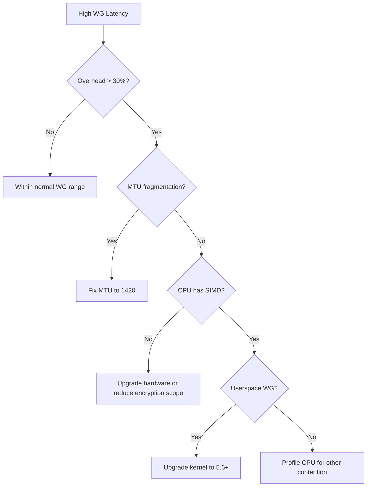

# Troubleshooting WireGuard Request/Response Performance in Cilium

Author: [nawazdhandala](https://github.com/nawazdhandala)

Tags: Cilium, Kubernetes, WireGuard, Troubleshooting, Latency, Performance

Description: A systematic troubleshooting guide for WireGuard request/response latency issues in Cilium, covering crypto overhead analysis, key rotation problems, and MTU-related delays.

---

## Introduction

When WireGuard request/response latency is higher than expected in Cilium, the root cause is typically one of: excessive crypto overhead per packet, MTU issues causing fragmentation, key rotation disruptions, or CPU contention between encryption and application processing.

Troubleshooting requires isolating the WireGuard-specific overhead from other sources of latency. The methodology compares encrypted and unencrypted paths, profiles the crypto processing, and checks for known WireGuard pitfalls.

This guide provides a step-by-step troubleshooting approach for WireGuard latency issues in Cilium.

## Prerequisites

- Kubernetes cluster with Cilium v1.14+ and WireGuard enabled
- `netperf`, `perf`, `tcpdump` available
- `cilium` CLI and node-level access

## Step 1: Quantify the Overhead

```bash
# Test with WireGuard enabled
WG_RR=$(kubectl exec netperf-client -- \
  netperf -H $SERVER_IP -t TCP_RR -l 20 -- -r 1,1 2>/dev/null | tail -1 | awk '{print $1}')

# Temporarily test with host networking (bypasses WireGuard)
HOST_RR=$(kubectl exec host-netperf-client -- \
  netperf -H $HOST_SERVER_IP -t TCP_RR -l 20 -- -r 1,1 2>/dev/null | tail -1 | awk '{print $1}')

echo "WireGuard TCP_RR: $WG_RR trans/s"
echo "Host TCP_RR: $HOST_RR trans/s"
echo "Overhead: $(echo "scale=1; (1 - $WG_RR / $HOST_RR) * 100" | bc)%"
```

## Step 2: Check for MTU Fragmentation

```bash
# Fragmentation adds extra round trips
kubectl exec test-pod -- ping -M do -s 1350 $REMOTE_POD_IP

# If this fails, MTU is too high
# Check all interfaces in the path
kubectl exec -n kube-system ds/cilium -- sh -c \
  'for iface in eth0 cilium_wg0 cilium_host; do
    echo "$iface: $(ip link show $iface 2>/dev/null | grep mtu)"
  done'

# Fix: set MTU to account for WireGuard overhead
helm upgrade cilium cilium/cilium --namespace kube-system \
  --set MTU=1420
```

## Step 3: Profile Crypto Overhead

```bash
# On the node during a TCP_RR test
perf record -g -a -- sleep 10
perf report --stdio | grep -E "chacha|poly1305|wireguard|crypto" | head -10

# If crypto functions dominate, check:
# 1. CPU supports SIMD (AVX/SSSE3)
grep -c -E "avx|ssse3" /proc/cpuinfo
# 2. Not using userspace fallback
lsmod | grep wireguard
```

## Step 4: Check Key Rotation

```bash
# View handshake times
kubectl exec -n kube-system ds/cilium -- wg show cilium_wg0

# Recent handshakes should be within the last 2 minutes
# If handshake times are old, there may be connectivity issues

# Check for rekey events in logs
kubectl logs -n kube-system ds/cilium --tail=100 | grep -i wireguard
```

## Resolution Flowchart



## Verification

```bash
# After fixes, verify improvement
kubectl exec netperf-client -- \
  netperf -H $SERVER_IP -t TCP_RR -l 20 -- -r 1,1
echo "Expected: < 20% overhead vs unencrypted"
```

## Troubleshooting

- **Overhead > 50%**: Almost certainly using userspace WireGuard or fragmentation. Check kernel version and MTU.
- **Periodic latency spikes**: Key rotation causes brief handshake delays. These should be < 100ms and occur every ~2 minutes.
- **One node pair has high latency**: Check if that node has different CPU capabilities (missing AVX).
- **Latency varies with payload size**: MTU fragmentation threshold. Test with different `-r` sizes in netperf.

## Systematic Troubleshooting Approach

Follow a structured methodology to avoid wasting time on false leads:

### The Five Whys Method

Apply iterative root cause analysis:

```yaml
Problem: Throughput is 50% below baseline
Why 1: BPF programs are running slower (higher avg_ns)
Why 2: Conntrack lookups are taking longer
Why 3: Conntrack table is 90% full (hash collisions)
Why 4: Table size was not increased when cluster grew
Why 5: No monitoring on conntrack utilization
Root Cause: Missing capacity monitoring
```

### Data Collection During Issues

When troubleshooting active performance issues, collect data quickly before conditions change:

```bash
#!/bin/bash
# emergency-diag.sh - Run immediately when performance issues are reported
DIAG="/tmp/perf-issue-$(date +%s)"
mkdir -p $DIAG

# Quick data collection (runs in <30 seconds)
cilium status --verbose > $DIAG/status.txt &
cilium bpf ct list global | wc -l > $DIAG/ct-count.txt &
kubectl top pods -n kube-system -l k8s-app=cilium > $DIAG/agent-resources.txt &
kubectl exec -n kube-system ds/cilium -- cilium metrics list > $DIAG/metrics.txt &
wait

# BPF program stats
bpftool prog show --json > $DIAG/bpf-progs.json 2>/dev/null

# Network stats
kubectl exec -n kube-system ds/cilium -- ip -s link show > $DIAG/interfaces.txt

echo "Emergency diagnostics saved to $DIAG"
```

### Escalation Path

If the issue cannot be resolved through standard troubleshooting:

1. Collect a Cilium bugtool report: `cilium-bugtool`
2. Check Cilium GitHub issues for similar problems
3. Post on the Cilium Slack channel with diagnostic data
4. Open a GitHub issue with the bugtool archive

Include the following in any escalation:
- Cilium version and configuration
- Kernel version
- Cluster size (nodes, pods, identities)
- Timeline of when the issue started
- Any recent changes to the cluster

## Conclusion

Troubleshooting WireGuard request/response latency in Cilium follows a structured approach: quantify the overhead, check for MTU fragmentation, profile crypto operations, and verify key rotation is healthy. Most issues resolve by fixing MTU, ensuring the kernel WireGuard module is used, and verifying CPU SIMD support. With these issues addressed, WireGuard overhead should be below 20% for TCP_RR workloads.
