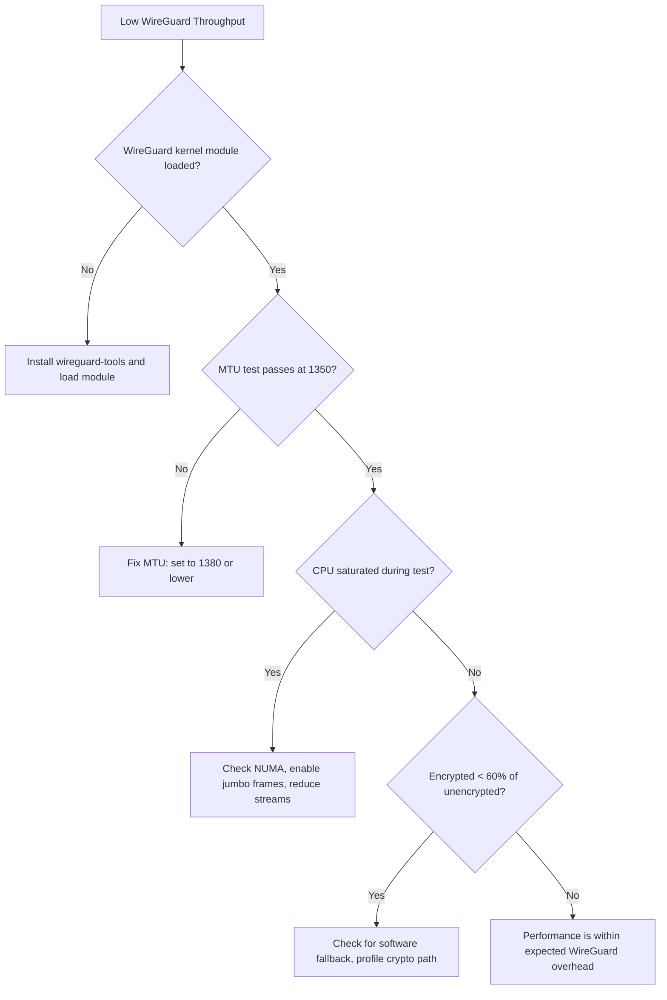

# Troubleshooting WireGuard Throughput in Cilium Performance

Author: [nawazdhandala](https://github.com/nawazdhandala)

Tags: Cilium, Kubernetes, WireGuard, Encryption, Troubleshooting, Performance

Description: Systematic troubleshooting guide for WireGuard throughput issues in Cilium, covering crypto bottlenecks, MTU problems, and peer connectivity failures.

---

## Introduction

When WireGuard throughput in Cilium falls below expectations, the issues can range from simple MTU misconfiguration to complex CPU contention between encryption processing and other workloads. Troubleshooting requires understanding the WireGuard packet flow through Cilium's datapath and identifying exactly where the throughput loss occurs.

This guide provides a systematic troubleshooting approach starting from basic connectivity verification through to deep performance analysis of the encryption path.

The most common issues are MTU fragmentation, CPU saturation from ChaCha20 encryption, WireGuard userspace fallback (dramatically slower), and key rotation disruptions.

## Prerequisites

- Kubernetes cluster with Cilium v1.14+ and WireGuard enabled
- `cilium`, `kubectl`, `bpftool`, `tcpdump`
- Node-level access for kernel debugging

## Step 1: Verify WireGuard Is Active

```bash
# Check Cilium encryption status
cilium encrypt status

# Verify WireGuard interface exists
kubectl exec -n kube-system ds/cilium -- ip link show cilium_wg0

# Check WireGuard peer list
kubectl exec -n kube-system ds/cilium -- wg show cilium_wg0

# Verify kernel module (not userspace)
lsmod | grep wireguard
# If empty, WireGuard may be using userspace fallback (very slow)
```

## Step 2: MTU Diagnosis

```bash
# Check MTU chain
kubectl exec -n kube-system ds/cilium -- ip link show cilium_wg0 | grep mtu
kubectl exec -n kube-system ds/cilium -- ip link show eth0 | grep mtu
kubectl exec -n kube-system ds/cilium -- ip link show lxc* | grep mtu

# Test for fragmentation
kubectl exec test-pod -- ping -M do -s 1350 $REMOTE_POD_IP
# Decrease size until it works - if < 1350, MTU is misconfigured

# Check for PMTUD issues
kubectl exec -n kube-system ds/cilium -- ip route show | grep mtu
```

## Step 3: CPU Analysis During Encrypted Transfer

```bash
# Run iperf3 and monitor CPU simultaneously
kubectl exec iperf-client -- iperf3 -c $SERVER_IP -t 30 -P 1 &

# On the node, check CPU usage
mpstat -P ALL 1 10

# Profile crypto operations
perf top -e cycles:pp -g --no-children -z

# Check for ChaCha20 or Poly1305 in the hot path
perf record -g -a -- sleep 10
perf report --stdio | grep -E "chacha|poly1305|wireguard"
```

## Step 4: Compare Encrypted vs Unencrypted

```bash
# Temporarily disable encryption (causes brief disruption)
helm upgrade cilium cilium/cilium --namespace kube-system \
  --set encryption.enabled=false

# Wait for rollout
kubectl rollout status ds/cilium -n kube-system

# Run benchmark without encryption
kubectl exec iperf-client -- iperf3 -c $SERVER_IP -t 30 -P 1 -J | \
  jq '.end.sum_sent.bits_per_second / 1000000000'

# Re-enable encryption
helm upgrade cilium cilium/cilium --namespace kube-system \
  --set encryption.enabled=true \
  --set encryption.type=wireguard

# Run benchmark with encryption
kubectl exec iperf-client -- iperf3 -c $SERVER_IP -t 30 -P 1 -J | \
  jq '.end.sum_sent.bits_per_second / 1000000000'

# Calculate overhead percentage
```

## Step 5: Check for Packet Drops

```bash
# WireGuard interface drop counters
kubectl exec -n kube-system ds/cilium -- ip -s link show cilium_wg0

# Kernel drop counters
kubectl exec -n kube-system ds/cilium -- cat /proc/net/snmp | grep -i udp

# Cilium drops related to encryption
cilium monitor --type drop | grep -i encrypt
```

## Troubleshooting Decision Tree



## Verification

```bash
# After applying fixes, verify
cilium encrypt status
kubectl exec iperf-client -- iperf3 -c $SERVER_IP -t 30 -P 1 -J | \
  jq '.end.sum_sent.bits_per_second / 1000000000'

echo "Expected: 70-90% of unencrypted throughput"
```

## Troubleshooting

- **Throughput under 50% of unencrypted**: Almost certainly using userspace WireGuard. Upgrade kernel to 5.6+.
- **Intermittent throughput drops**: Key rotation may cause brief pauses. Check `wg show cilium_wg0` for recent handshake times.
- **One node pair slow**: Check if that specific node has different kernel version or missing crypto hardware support.
- **WireGuard interface missing**: Verify `encryption.type=wireguard` in Cilium config and check agent logs.

## Systematic Troubleshooting Approach

Follow a structured methodology to avoid wasting time on false leads:

### The Five Whys Method

Apply iterative root cause analysis:

```
Problem: Throughput is 50% below baseline
Why 1: BPF programs are running slower (higher avg_ns)
Why 2: Conntrack lookups are taking longer
Why 3: Conntrack table is 90% full (hash collisions)
Why 4: Table size was not increased when cluster grew
Why 5: No monitoring on conntrack utilization
Root Cause: Missing capacity monitoring
```

### Data Collection During Issues

When troubleshooting active performance issues, collect data quickly before conditions change:

```bash
#!/bin/bash
# emergency-diag.sh - Run immediately when performance issues are reported
DIAG="/tmp/perf-issue-$(date +%s)"
mkdir -p $DIAG

# Quick data collection (runs in <30 seconds)
cilium status --verbose > $DIAG/status.txt &
cilium bpf ct list global | wc -l > $DIAG/ct-count.txt &
kubectl top pods -n kube-system -l k8s-app=cilium > $DIAG/agent-resources.txt &
kubectl exec -n kube-system ds/cilium -- cilium metrics list > $DIAG/metrics.txt &
wait

# BPF program stats
bpftool prog show --json > $DIAG/bpf-progs.json 2>/dev/null

# Network stats
kubectl exec -n kube-system ds/cilium -- ip -s link show > $DIAG/interfaces.txt

echo "Emergency diagnostics saved to $DIAG"
```

### Escalation Path

If the issue cannot be resolved through standard troubleshooting:

1. Collect a Cilium bugtool report: `cilium-bugtool`
2. Check Cilium GitHub issues for similar problems
3. Post on the Cilium Slack channel with diagnostic data
4. Open a GitHub issue with the bugtool archive

Include the following in any escalation:
- Cilium version and configuration
- Kernel version
- Cluster size (nodes, pods, identities)
- Timeline of when the issue started
- Any recent changes to the cluster

## Conclusion

Troubleshooting WireGuard throughput in Cilium follows a systematic approach: verify WireGuard is active and using the kernel module, check MTU for fragmentation, profile CPU for crypto overhead, and compare against unencrypted baseline. Most issues resolve by ensuring the kernel WireGuard module is loaded (not userspace fallback), fixing MTU to account for WireGuard's 60-byte overhead, and ensuring CPUs have enough capacity for ChaCha20-Poly1305 operations.
