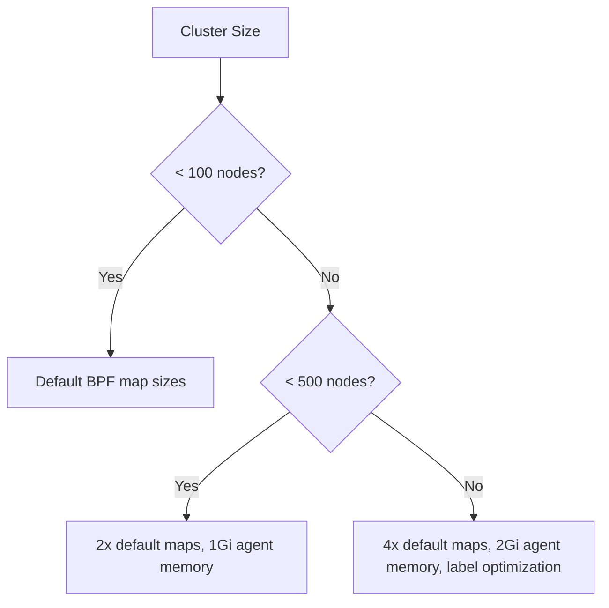

# Tuning Cilium Performance and Scalability

Author: [nawazdhandala](https://github.com/nawazdhandala)

Tags: Cilium, Kubernetes, Performance, Scalability, Tuning, eBPF

Description: Comprehensive guide to tuning Cilium for both performance and scalability in large Kubernetes clusters, covering datapath optimization, identity management, and resource sizing.

---

## Introduction

Cilium's performance and scalability are interconnected but require different tuning strategies. Performance tuning focuses on maximizing throughput and minimizing latency on a per-packet basis, while scalability tuning ensures performance doesn't degrade as the number of pods, services, and network policies grows.

In large clusters with thousands of pods and hundreds of services, Cilium's identity system, BPF map sizes, and agent resource limits become critical factors. Without proper tuning, the agent may run out of memory, BPF maps may overflow, and identity allocation may become a bottleneck.

This guide covers both performance and scalability tuning for Cilium, providing configurations suitable for clusters of all sizes.

## Prerequisites

- Kubernetes cluster (v1.24+) with Cilium v1.14+
- `cilium` CLI, `helm`, and `kubectl`
- `iperf3` and `netperf` for benchmarking
- Prometheus and Grafana for monitoring
- Node-level root access

## Datapath Performance Tuning

```bash
helm upgrade cilium cilium/cilium --namespace kube-system \
  --set tunnel=disabled \
  --set routingMode=native \
  --set autoDirectNodeRoutes=true \
  --set ipv4NativeRoutingCIDR="10.0.0.0/8" \
  --set kubeProxyReplacement=true \
  --set bpf.masquerade=true \
  --set bpf.hostLegacyRouting=false \
  --set loadBalancer.acceleration=native \
  --set socketLB.enabled=true
```

## Scalability Configuration

```bash
# BPF map sizes for large clusters
helm upgrade cilium cilium/cilium --namespace kube-system \
  --set bpf.ctGlobalTCPMax=1048576 \
  --set bpf.ctGlobalAnyMax=524288 \
  --set bpf.natMax=1048576 \
  --set bpf.policyMapMax=65536 \
  --set bpf.lbMapMax=65536 \
  --set bpf.mapDynamicSizeRatio=0.0025
```

## Agent Resource Sizing

```bash
# For large clusters (500+ nodes, 10000+ pods)
helm upgrade cilium cilium/cilium --namespace kube-system \
  --set resources.requests.cpu=500m \
  --set resources.requests.memory=512Mi \
  --set resources.limits.cpu=2000m \
  --set resources.limits.memory=2Gi \
  --set operator.resources.requests.cpu=200m \
  --set operator.resources.requests.memory=256Mi \
  --set operator.resources.limits.cpu=1000m \
  --set operator.resources.limits.memory=1Gi
```

## Identity Management Tuning

```bash
# Limit identity-relevant labels to reduce identity count
helm upgrade cilium cilium/cilium --namespace kube-system \
  --set labels="k8s:app k8s:io.kubernetes.pod.namespace"

# Monitor identity count
cilium identity list | wc -l
# Should be manageable (< 10000 for most clusters)
```

## Hubble Performance Configuration

```bash
# For large clusters, limit Hubble's resource usage
helm upgrade cilium cilium/cilium --namespace kube-system \
  --set hubble.enabled=true \
  --set hubble.metrics.enabled="{dns,drop,tcp,flow}" \
  --set hubble.relay.resources.requests.cpu=100m \
  --set hubble.relay.resources.requests.memory=128Mi
```



## Verification

```bash
cilium status --verbose
cilium identity list | wc -l
kubectl top pods -n kube-system -l k8s-app=cilium
```

## Troubleshooting

- **Agent OOMKilled**: Increase memory limits and consider reducing BPF map sizes.
- **Identity count growing rapidly**: Configure label optimization to reduce unique identities.
- **Slow policy computation**: Reduce policy complexity and limit L7 policy usage.
- **High agent CPU**: Check for excessive monitoring events and reduce Hubble metrics scope.

## Systematic Tuning Methodology

Performance tuning should follow a systematic approach to avoid chasing false leads:

### Step 1: Measure Before Tuning

Always establish a pre-tuning baseline with multiple runs:

```bash
#!/bin/bash
echo "=== Pre-Tuning Baseline ==="
for i in $(seq 1 5); do
  kubectl exec perf-client -- iperf3 -c perf-server -t 15 -P 1 -J | \
    jq '.end.sum_sent.bits_per_second / 1000000000' | \
    xargs -I{} echo "Run $i: {} Gbps"
  sleep 5
done
```

### Step 2: Change One Variable at a Time

Never apply multiple changes simultaneously. Each change should be:
1. Applied independently
2. Measured with the same benchmark methodology
3. Documented with before/after results
4. Reverted if it causes regression

### Step 3: Verify Improvements Are Real

A 2% improvement might be within measurement noise. Use statistical tests to confirm improvements are significant:

```bash
# Compare two sets of measurements
# Use the Welch's t-test threshold of p < 0.05
# In practice, require at least 5% improvement with CV < 5%
```

### Step 4: Document the Final Configuration

After all tuning is complete, document the full configuration as the new baseline:

```bash
# Export final Cilium configuration
helm get values cilium -n kube-system -o yaml > cilium-tuned-values-$(date +%Y%m%d).yaml

# Record final benchmark results
echo "Final tuned throughput: X Gbps"
echo "Improvement from baseline: Y%"
```

### Common Tuning Pitfalls

Avoid these common mistakes in performance tuning:

- **Cargo-cult tuning**: Applying settings from blog posts without understanding why they help
- **Over-tuning**: Making changes that help benchmarks but hurt real workloads
- **Ignoring tail latency**: Optimizing mean while p99 gets worse
- **Hardware-specific tuning**: Settings that work on one hardware platform may hurt on another

## Conclusion

Tuning Cilium for both performance and scalability requires a layered approach: optimize the datapath for throughput and latency, size BPF maps for your cluster scale, allocate adequate agent resources, and manage identity growth through label optimization. These configurations ensure Cilium performs well from small test clusters to large production deployments.
