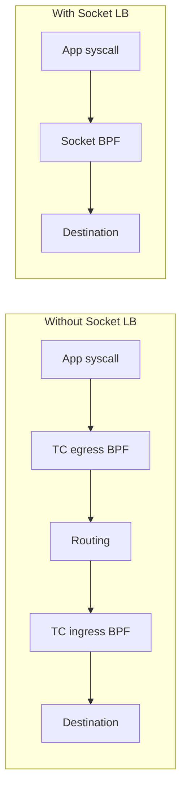

# Tuning Request/Response Rate (TCP_RR) in Cilium Performance

Author: [nawazdhandala](https://github.com/nawazdhandala)

Tags: Cilium, Kubernetes, Networking, Performance, TCP_RR, Latency

Description: Learn how to tune Cilium for optimal TCP request/response (TCP_RR) performance, reducing per-transaction latency and maximizing transactions per second.

---

## Introduction

TCP_RR (TCP Request/Response) measures how many request-response transactions a connection can handle per second. Unlike throughput benchmarks that measure raw bandwidth, TCP_RR tests the latency of each round-trip through the datapath. This metric is critical for microservices architectures where applications make thousands of small API calls per second.

In Cilium, TCP_RR performance is affected by every hop in the eBPF datapath: conntrack lookups, policy evaluation, NAT translation, and socket-level operations. Each adds microseconds of latency that directly reduce the achievable transaction rate.

This guide covers the specific tuning steps to minimize per-transaction latency and maximize TCP_RR performance in Cilium-managed clusters.

## Prerequisites

- Kubernetes cluster (v1.24+) with Cilium v1.14+
- `netperf` container image for TCP_RR testing
- `cilium` CLI and `helm`
- Node-level access for kernel tuning
- Baseline TCP_RR measurements

## Measuring TCP_RR Baseline

First, establish your current TCP_RR performance:

```bash
# Deploy netperf server
kubectl run netperf-server --image=cilium/netperf \
  --overrides='{"spec":{"nodeSelector":{"kubernetes.io/hostname":"node-1"}}}' \
  -- netserver -D

SERVER_IP=$(kubectl get pod netperf-server -o jsonpath='{.status.podIP}')

# Run TCP_RR test
kubectl run netperf-client --image=cilium/netperf \
  --rm -it --restart=Never \
  --overrides='{"spec":{"nodeSelector":{"kubernetes.io/hostname":"node-2"}}}' \
  -- netperf -H $SERVER_IP -t TCP_RR -l 30 -- -r 1,1

# Also test with larger payloads
kubectl run netperf-client-1k --image=cilium/netperf \
  --rm -it --restart=Never \
  -- netperf -H $SERVER_IP -t TCP_RR -l 30 -- -r 1024,1024
```

Record the transactions per second. Typical values range from 10,000 to 50,000+ depending on hardware and configuration.

## Enabling Socket-Level BPF Acceleration

Cilium's socket-level BPF programs can short-circuit the datapath for local pod-to-pod communication:

```bash
helm upgrade cilium cilium/cilium --namespace kube-system \
  --set kubeProxyReplacement=true \
  --set socketLB.enabled=true \
  --set bpf.hostLegacyRouting=false \
  --set bpf.masquerade=true
```

Socket-level load balancing bypasses the entire TC (traffic control) layer for service-to-pod traffic, dramatically reducing TCP_RR latency:



## Conntrack Optimization for TCP_RR

TCP_RR generates rapid lookups on the conntrack table. Optimize it:

```bash
helm upgrade cilium cilium/cilium --namespace kube-system \
  --set bpf.ctGlobalTCPMax=524288 \
  --set bpf.ctGlobalAnyMax=262144 \
  --set bpf.ctTCPTimeoutEstablished=21600
```

Also consider pre-allocating conntrack entries to avoid allocation latency:

```bash
# Check conntrack table utilization
cilium bpf ct list global | wc -l
```

## Kernel TCP Tuning for Low Latency

```bash
# Disable Nagle's algorithm effect by reducing delays
sysctl -w net.ipv4.tcp_low_latency=1

# Reduce TIME_WAIT sockets
sysctl -w net.ipv4.tcp_tw_reuse=1
sysctl -w net.ipv4.tcp_fin_timeout=15

# Enable TCP Fast Open
sysctl -w net.ipv4.tcp_fastopen=3

# Reduce SYN retransmit timeout
sysctl -w net.ipv4.tcp_syn_retries=2
sysctl -w net.ipv4.tcp_synack_retries=2

# Enable busy polling for latency reduction
sysctl -w net.core.busy_read=50
sysctl -w net.core.busy_poll=50
```

## CPU Frequency and Power Management

For lowest latency, disable CPU power saving:

```bash
# Set CPU governor to performance on all cores
for cpu in /sys/devices/system/cpu/cpu*/cpufreq/scaling_governor; do
  echo performance > $cpu
done

# Disable C-states deeper than C1
# In GRUB: intel_idle.max_cstate=1 processor.max_cstate=1
```

## Reducing Policy Evaluation Overhead

Complex network policies add per-packet evaluation cost. For TCP_RR-sensitive paths:

```bash
# Check policy complexity
cilium policy get -o json | jq '[.[] | .rules | length] | add'

# If policies are complex, consider using FQDN-based policies
# only where needed, and L3/L4 policies elsewhere
```

Use endpoint-specific policy caching:

```bash
cilium config view | grep policy-audit-mode
# Consider running in audit mode during benchmarking to isolate policy impact
```

## Verification

```bash
# Re-run TCP_RR after tuning
kubectl run netperf-verify --image=cilium/netperf \
  --rm -it --restart=Never \
  -- netperf -H $SERVER_IP -t TCP_RR -l 30 -- -r 1,1

# Compare before/after
echo "Before: <your_baseline> trans/s"
echo "After: <new_result> trans/s"

# Verify socket LB is active
cilium status --verbose | grep "Socket LB"

# Check latency distribution with histogram
kubectl run netperf-hist --image=cilium/netperf \
  --rm -it --restart=Never \
  -- netperf -H $SERVER_IP -t TCP_RR -l 30 -- -r 1,1 -o mean_latency,p99_latency
```

## Troubleshooting

- **No improvement from socket LB**: Verify source and destination pods are on different nodes. Socket LB has the most impact for service ClusterIP traffic.
- **Inconsistent TCP_RR results**: Check for CPU frequency scaling. Pin to performance governor.
- **High p99 latency despite good mean**: Look for garbage collection pauses in conntrack or periodic background tasks on the Cilium agent.
- **TCP_RR worse after kernel tuning**: Verify `busy_poll` settings do not conflict with your workload's I/O patterns.

## Conclusion

Tuning TCP_RR performance in Cilium focuses on reducing per-transaction latency throughout the datapath. The highest-impact changes are enabling socket-level BPF acceleration, optimizing conntrack table sizes, and tuning kernel TCP parameters for low latency. Each microsecond saved per transaction translates directly to more transactions per second. With proper tuning, Cilium can achieve TCP_RR rates competitive with bare-metal networking.
