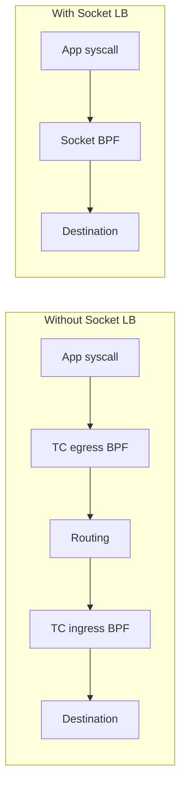

# Tuning Request/Response Rate (TCP_RR) in Cilium Performance

Author: [nawazdhandala](https://github.com/nawazdhandala)

Tags: Cilium, Kubernetes, Networking, Performance, TCP_RR, Latency

Description: Learn how to tune Cilium for optimal TCP request/response (TCP_RR) performance, reducing per-transaction latency and maximizing transactions per second.

---

## Introduction

TCP_RR (TCP Request/Response) measures how many request-response transactions a connection can handle per second. Unlike throughput benchmarks that measure raw bandwidth, TCP_RR tests the latency of each round-trip through the datapath. This metric is critical for microservices architectures where applications make thousands of small API calls per second.

In Cilium, TCP_RR performance is affected by every hop in the eBPF datapath: conntrack lookups, policy evaluation, NAT translation, and socket-level operations. Each adds microseconds of latency that directly reduce the achievable transaction rate.

This guide covers the specific tuning steps to minimize per-transaction latency and maximize TCP_RR performance in Cilium-managed clusters.

## Prerequisites

- Kubernetes cluster (v1.24+) with Cilium v1.14+
- `netperf` container image for TCP_RR testing
- `cilium` CLI and `helm`
- Node-level access for kernel tuning
- Baseline TCP_RR measurements

## Measuring TCP_RR Baseline

First, establish your current TCP_RR performance:

```bash
# Deploy netperf server

kubectl run netperf-server --image=cilium/netperf \
  --overrides='{"spec":{"nodeSelector":{"kubernetes.io/hostname":"node-1"}}}' \
  --command -- netserver -D

kubectl expose pod netperf-server --port=12865 --target-port=12865
SERVICE_IP=$(kubectl get service netperf-server -o jsonpath='{.spec.clusterIP}')

# Run TCP_RR test through the ClusterIP service path
kubectl run netperf-client --image=cilium/netperf \
  --rm -it --restart=Never \
  --overrides='{"spec":{"nodeSelector":{"kubernetes.io/hostname":"node-2"}}}' \
  --command -- netperf -H $SERVICE_IP -t TCP_RR -l 30 -- -r 1,1

# Also test with larger payloads
kubectl run netperf-client-1k --image=cilium/netperf \
  --rm -it --restart=Never \
  --command -- netperf -H $SERVICE_IP -t TCP_RR -l 30 -- -r 1024,1024
```

Record the transactions per second. Typical values range from 10,000 to 50,000+ depending on hardware and configuration.

## Enabling Socket-Level BPF Acceleration

Cilium's socket-level BPF programs can short-circuit the service load-balancing datapath for pod-to-service communication:

```bash
helm upgrade cilium cilium/cilium --namespace kube-system \
  --set kubeProxyReplacement=true \
  --set socketLB.enabled=true \
  --set bpf.hostLegacyRouting=false \
  --set bpf.masquerade=true
```

Socket-level load balancing resolves service backends at the socket layer, avoiding per-packet service NAT in the TC (traffic control) layer and reducing TCP_RR latency for service traffic:


```mermaid
graph LR
    subgraph "Without Socket LB"
        A1[App syscall] --> B1[TC egress BPF] --> C1[Routing] --> D1[TC ingress BPF] --> E1[Destination]
    end
    subgraph "With Socket LB"
        A2[App syscall] --> B2[Socket BPF] --> E2[Destination]
    end
```

## Conntrack Optimization for TCP_RR

TCP_RR generates rapid lookups on the conntrack table. Optimize it:

```bash
helm upgrade cilium cilium/cilium --namespace kube-system \
  --set bpf.ctTcpMax=524288 \
  --set bpf.ctAnyMax=262144 \
  --set bpf.preallocateMaps=true
```

After changing map sizes, check conntrack table utilization:

```bash
# Check conntrack table utilization
kubectl -n kube-system exec ds/cilium -- cilium-dbg bpf ct list | wc -l
```

## Kernel TCP Tuning for Low Latency

```bash
# Note: net.ipv4.tcp_low_latency is obsolete since kernel 4.14 and has no effect

# Reduce connection churn overhead for workloads that create many short-lived connections.
# These settings do not improve transactions on a single established TCP_RR connection.
sysctl -w net.ipv4.tcp_tw_reuse=1
sysctl -w net.ipv4.tcp_fin_timeout=15

# Enable TCP Fast Open for applications that explicitly use it.
# This does not improve a single established TCP_RR connection.
sysctl -w net.ipv4.tcp_fastopen=3

# Reduce SYN retransmit timeout
sysctl -w net.ipv4.tcp_syn_retries=2
sysctl -w net.ipv4.tcp_synack_retries=2

# Enable busy polling for latency reduction
sysctl -w net.core.busy_read=50
sysctl -w net.core.busy_poll=50
```

## CPU Frequency and Power Management

For lowest latency, disable CPU power saving:

```bash
# Set CPU governor to performance on all cores
for cpu in /sys/devices/system/cpu/cpu*/cpufreq/scaling_governor; do
  echo performance > $cpu
done

# Disable C-states deeper than C1
# In GRUB: intel_idle.max_cstate=1 processor.max_cstate=1
```

## Reducing Policy Evaluation Overhead

Large policy sets can increase policy map size and regeneration work, while L7 policy or proxying can add request-path overhead. For TCP_RR-sensitive paths:

```bash
# Check policy complexity
kubectl get cnp,ccnp -A -o json | jq '[.items[] | (.specs // [.spec]) | length] | add'

# If policies are complex, consider using FQDN-based policies
# only where needed, and L3/L4 policies elsewhere
```

Check policy audit mode while benchmarking:

```bash
cilium config view | grep policy-audit-mode
# Consider running in audit mode during benchmarking to isolate policy impact
```

## Verification

```bash
# Re-run TCP_RR after tuning
kubectl run netperf-verify --image=cilium/netperf \
  --rm -it --restart=Never \
  --command -- netperf -H $SERVICE_IP -t TCP_RR -l 30 -- -r 1,1

# Compare before/after
echo "Before: <your_baseline> trans/s"
echo "After: <new_result> trans/s"

# Verify socket LB is active
cilium status --verbose | grep "Socket LB"

# Check latency distribution with histogram
kubectl run netperf-hist --image=cilium/netperf \
  --rm -it --restart=Never \
  --command -- netperf -H $SERVICE_IP -t TCP_RR -l 30 -- -r 1,1 -O MEAN_LATENCY,P99_LATENCY
```

## Troubleshooting

- **No improvement from socket LB**: Verify the benchmark targets a service ClusterIP rather than the backend Pod IP. Socket LB has the most impact for service traffic.
- **Inconsistent TCP_RR results**: Check for CPU frequency scaling. Pin to performance governor.
- **High p99 latency despite good mean**: Look for garbage collection pauses in conntrack or periodic background tasks on the Cilium agent.
- **TCP_RR worse after kernel tuning**: Verify `busy_poll` settings do not conflict with your workload's I/O patterns.

## Conclusion

Tuning TCP_RR performance in Cilium focuses on reducing per-transaction latency throughout the datapath. The highest-impact changes are enabling socket-level BPF acceleration for service traffic, sizing and preallocating BPF maps appropriately, and removing host-level latency sources such as CPU power saving. Each microsecond saved per transaction translates directly to more transactions per second. With proper tuning, Cilium can achieve TCP_RR rates competitive with bare-metal networking.
