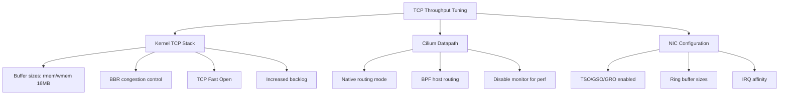

# How to Tune TCP Throughput (TCP_STREAM) in Cilium Performance

Author: [nawazdhandala](https://github.com/nawazdhandala)

Tags: Cilium, TCP, Performance, Throughput, Tuning

Description: Learn how to tune Cilium for maximum TCP throughput using kernel parameters, BPF datapath optimizations, and network configuration best practices.

---

## Introduction

TCP_STREAM throughput is a fundamental measure of your Cilium deployment's ability to move bulk data between pods. This metric matters for workloads like database replication, large file transfers, data pipeline processing, and backup operations. Achieving near-wire-speed throughput through Cilium requires tuning at multiple layers: the Linux kernel TCP stack, the BPF datapath, and the Cilium configuration itself.

Out of the box, Cilium delivers excellent throughput for most workloads. However, if you are pushing high-bandwidth workloads (10+ Gbps), specific tuning is required to eliminate bottlenecks in the packet processing path.

This guide provides concrete tuning steps for maximizing TCP_STREAM throughput in Cilium, with measurements at each step to quantify improvement.

## Prerequisites

- Kubernetes cluster with Cilium installed
- Nodes with high-bandwidth NICs (10+ Gbps)
- iperf3 for benchmarking
- kubectl and Helm 3 access
- Root access to cluster nodes (for kernel tuning)

## Baseline Measurement

Establish your current TCP throughput before tuning:

```bash
# Deploy iperf3 server
kubectl create namespace tcp-tune
kubectl -n tcp-tune run iperf3-server --image=networkstatic/iperf3 --port=5201 -- -s
kubectl -n tcp-tune expose pod iperf3-server --port=5201
kubectl -n tcp-tune wait --for=condition=Ready pod iperf3-server --timeout=60s

# Same-node throughput baseline
NODE=$(kubectl -n tcp-tune get pod iperf3-server -o jsonpath='{.spec.nodeName}')
kubectl -n tcp-tune run baseline --image=networkstatic/iperf3 --rm -it --restart=Never \
  --overrides='{"spec":{"nodeSelector":{"kubernetes.io/hostname":"'$NODE'"}}}' -- \
  -c iperf3-server.tcp-tune -t 30 -P 8

# Record the result as your baseline
```

## Kernel TCP Stack Tuning

Apply kernel-level TCP optimizations on each node:

```bash
# Apply via a DaemonSet for consistency across all nodes
```

```yaml
# tcp-tuning-daemonset.yaml
apiVersion: apps/v1
kind: DaemonSet
metadata:
  name: tcp-tuner
  namespace: kube-system
spec:
  selector:
    matchLabels:
      app: tcp-tuner
  template:
    metadata:
      labels:
        app: tcp-tuner
    spec:
      hostPID: true
      hostNetwork: true
      initContainers:
        - name: sysctl
          image: busybox
          securityContext:
            privileged: true
          command:
            - sh
            - -c
            - |
              # TCP buffer sizes (min, default, max in bytes)
              sysctl -w net.core.rmem_max=16777216
              sysctl -w net.core.wmem_max=16777216
              sysctl -w net.ipv4.tcp_rmem="4096 87380 16777216"
              sysctl -w net.ipv4.tcp_wmem="4096 65536 16777216"

              # Enable TCP window scaling
              sysctl -w net.ipv4.tcp_window_scaling=1

              # Increase the maximum backlog
              sysctl -w net.core.netdev_max_backlog=5000

              # Enable TCP Fast Open
              sysctl -w net.ipv4.tcp_fastopen=3

              # Increase somaxconn for high connection rates
              sysctl -w net.core.somaxconn=32768

              # Reduce TCP FIN timeout
              sysctl -w net.ipv4.tcp_fin_timeout=15

              # Enable BBR congestion control (if available)
              modprobe tcp_bbr 2>/dev/null || true
              sysctl -w net.ipv4.tcp_congestion_control=bbr 2>/dev/null || true
              sysctl -w net.core.default_qdisc=fq 2>/dev/null || true

              echo "TCP tuning applied"
      containers:
        - name: pause
          image: registry.k8s.io/pause:3.9
      tolerations:
        - operator: Exists
```

```bash
kubectl apply -f tcp-tuning-daemonset.yaml
```



## Cilium Datapath Optimizations

Configure Cilium for maximum throughput:

```yaml
# cilium-throughput-tuning.yaml
# Use native routing instead of VXLAN (reduces encapsulation overhead)
tunnel: disabled
routingMode: native
autoDirectNodeRoutes: true
ipv4NativeRoutingCIDR: "10.0.0.0/8"

# Enable BPF-based host routing (bypasses iptables entirely)
bpf:
  hostLegacyRouting: false  # Use BPF routing
  # Increase map sizes for high-connection workloads
  ctTcpMax: 1048576
  natMax: 1048576

# Disable features that add per-packet overhead if not needed
# Only disable these if you do not use the respective feature
enableIPv6: false  # If not using IPv6, disable it

# Monitor aggregation to reduce event processing overhead
monitorAggregation: maximum
monitorAggregationInterval: 10s
```

```bash
helm upgrade cilium cilium/cilium -n kube-system \
  --reuse-values \
  --values cilium-throughput-tuning.yaml
```

## NIC-Level Optimizations

Verify and tune NIC settings on each node:

```bash
# Check current NIC settings (via node debug pod)
kubectl debug node/$(kubectl get nodes -o jsonpath='{.items[0].metadata.name}') \
  -it --image=ubuntu -- bash -c '
  apt-get update -qq && apt-get install -y -qq ethtool > /dev/null 2>&1
  NIC=$(ip route get 1 | grep -oP "dev \K\S+")
  echo "Interface: $NIC"

  # Check offloading features
  echo "=== Offloading ==="
  ethtool -k $NIC | grep -E "tcp-segmentation|generic-segmentation|generic-receive"

  # Check ring buffer sizes
  echo "=== Ring Buffer ==="
  ethtool -g $NIC

  # Check interrupt coalescing
  echo "=== Coalescing ==="
  ethtool -c $NIC 2>/dev/null || echo "Not supported"
'
```

Enable offloading features if they are disabled:

```bash
kubectl debug node/$(kubectl get nodes -o jsonpath='{.items[0].metadata.name}') \
  -it --image=ubuntu -- bash -c '
  apt-get update -qq && apt-get install -y -qq ethtool > /dev/null 2>&1
  NIC=$(ip route get 1 | grep -oP "dev \K\S+")

  # Enable TSO (TCP Segmentation Offload)
  ethtool -K $NIC tso on 2>/dev/null

  # Enable GSO (Generic Segmentation Offload)
  ethtool -K $NIC gso on 2>/dev/null

  # Enable GRO (Generic Receive Offload)
  ethtool -K $NIC gro on 2>/dev/null

  echo "NIC offloading optimized for $NIC"
'
```

## Verification

Measure throughput after tuning:

```bash
# Re-run the same benchmark as the baseline
NODE=$(kubectl -n tcp-tune get pod iperf3-server -o jsonpath='{.spec.nodeName}')
kubectl -n tcp-tune run tuned-test --image=networkstatic/iperf3 --rm -it --restart=Never \
  --overrides='{"spec":{"nodeSelector":{"kubernetes.io/hostname":"'$NODE'"}}}' -- \
  -c iperf3-server.tcp-tune -t 30 -P 8

# Compare with baseline
echo "Compare this result with your baseline measurement"

# Verify kernel settings are applied
kubectl debug node/$NODE -it --image=busybox -- sh -c '
  echo "rmem_max: $(cat /proc/sys/net/core/rmem_max)"
  echo "wmem_max: $(cat /proc/sys/net/core/wmem_max)"
  echo "tcp_congestion: $(cat /proc/sys/net/ipv4/tcp_congestion_control)"
  echo "tcp_fastopen: $(cat /proc/sys/net/ipv4/tcp_fastopen)"
'

# Clean up
kubectl delete namespace tcp-tune
```

## Troubleshooting

- **No improvement after kernel tuning**: The bottleneck may be in the NIC or switch, not the kernel. Check physical network capacity.

- **Native routing not working**: Your cloud provider or network infrastructure must support direct routing between nodes. Check with your network administrator.

- **BBR not available**: BBR requires kernel 4.9+ and the `tcp_bbr` module. Some minimal container OS images do not include it.

- **Throughput degrades with more connections**: Increase BPF CT map sizes. Each connection consumes an entry, and a full table causes drops.

- **Tuning reverts after node restart**: The sysctl DaemonSet runs as an init container and reapplies settings on every pod restart. Ensure the DaemonSet is always running.

## Conclusion

Tuning TCP throughput in Cilium involves three layers: kernel TCP stack parameters (buffer sizes, congestion control), Cilium datapath configuration (native routing, BPF host routing), and NIC offloading features. Each layer contributes incrementally to overall throughput. Always measure before and after each change to quantify the improvement, and test with workloads that match your production traffic patterns.
