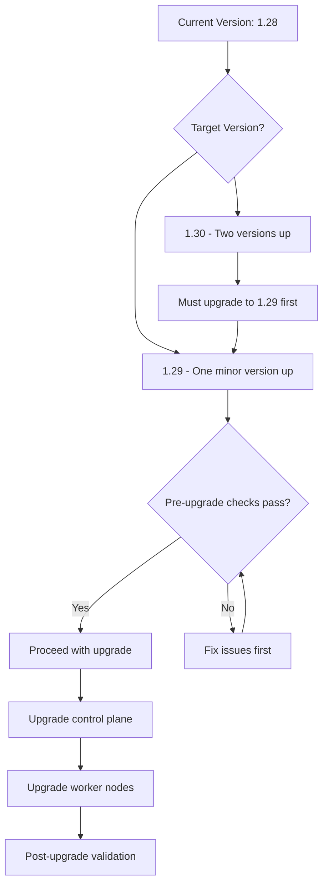

# Planning Your Kubernetes Upgrade Next Steps

Author: [nawazdhandala](https://github.com/nawazdhandala)

Tags: Kubernetes, Upgrade

Description: A comprehensive guide to planning and executing the next steps after deciding to upgrade your Kubernetes cluster, covering pre-upgrade checks, version selection, and rollback strategies.

---

## Introduction

Upgrading a Kubernetes cluster is one of the most impactful operations you can perform on your infrastructure. The upgrade itself is only part of the story. The steps you take before and after the upgrade determine whether it succeeds smoothly or causes downtime.

Many teams focus on the upgrade command itself and neglect the preparation, validation, and follow-up steps that make the difference between a routine maintenance operation and an emergency incident. This guide covers the complete workflow from version selection through post-upgrade validation.

This guide applies to any Kubernetes distribution, though specific commands may vary. The principles and checklist are universal.

## Prerequisites

- A running Kubernetes cluster that you intend to upgrade
- `kubectl` with cluster-admin access
- Access to your cluster's upgrade mechanism (kubeadm, managed service console, etc.)
- A staging or test environment that mirrors production
- Backup of etcd and critical cluster state

## Assessing Your Current Cluster State

Before planning an upgrade, document your current state:

```bash
# Record current Kubernetes version across all components
kubectl version --short 2>/dev/null || kubectl version
kubectl get nodes -o custom-columns=\
NAME:.metadata.name,\
VERSION:.status.nodeInfo.kubeletVersion,\
OS:.status.nodeInfo.osImage

# Check for deprecated API usage that may break in the new version
# Install kubectl-deprecations plugin or use kubent
# https://github.com/doitintl/kube-no-trouble
kubectl get all --all-namespaces -o json | python3 -c "
import sys, json
resources = json.load(sys.stdin)
api_versions = set()
for item in resources.get('items', []):
    api_versions.add(item.get('apiVersion', 'unknown'))
for av in sorted(api_versions):
    print(f'  API Version in use: {av}')
"

# Check for PodDisruptionBudgets that may block node draining
kubectl get pdb --all-namespaces

# Record all installed operators and their versions
kubectl get deployments --all-namespaces \
  -o custom-columns=\
NAMESPACE:.metadata.namespace,\
NAME:.metadata.name,\
IMAGE:.spec.template.spec.containers[0].image | head -30
```

## Selecting the Target Version

```bash
# Check available versions (for kubeadm-based clusters)
# The general rule: upgrade one minor version at a time
# e.g., 1.28 -> 1.29 -> 1.30, NOT 1.28 -> 1.30

# Review the changelog for your target version
# https://github.com/kubernetes/kubernetes/blob/master/CHANGELOG/

# Check compatibility of your CNI plugin with the target version
# For Calico: https://docs.tigera.io/calico/latest/getting-started/kubernetes/requirements
# For Cilium: https://docs.cilium.io/en/stable/network/kubernetes/requirements/
```



## Pre-Upgrade Checklist

Run these checks before starting the upgrade:

```bash
#!/bin/bash
# pre-upgrade-checklist.sh
# Validates cluster readiness for upgrade

echo "=== Pre-Upgrade Checklist ==="
ERRORS=0

# Check 1: All nodes are Ready
NOT_READY=$(kubectl get nodes --no-headers | grep -cv " Ready ")
echo "1. Nodes not Ready: $NOT_READY"
[ "$NOT_READY" -gt 0 ] && ERRORS=$((ERRORS + 1))

# Check 2: All system pods are Running
FAILED_PODS=$(kubectl get pods -n kube-system --no-headers | grep -cv "Running\|Completed")
echo "2. Failed system pods: $FAILED_PODS"
[ "$FAILED_PODS" -gt 0 ] && ERRORS=$((ERRORS + 1))

# Check 3: etcd is healthy
echo "3. etcd health:"
kubectl exec -n kube-system $(kubectl get pod -n kube-system \
  -l component=etcd -o jsonpath='{.items[0].metadata.name}') -- \
  etcdctl endpoint health --cacert=/etc/kubernetes/pki/etcd/ca.crt \
  --cert=/etc/kubernetes/pki/etcd/server.crt \
  --key=/etc/kubernetes/pki/etcd/server.key 2>&1 | tail -1

# Check 4: Sufficient disk space on nodes
echo "4. Disk space on nodes:"
for NODE in $(kubectl get nodes -o jsonpath='{.items[*].metadata.name}'); do
  kubectl debug node/$NODE -it --image=busybox -- df -h /host 2>/dev/null | tail -1
done

# Check 5: Backup exists
echo "5. Verify etcd backup exists (manual check required)"

echo ""
if [ $ERRORS -gt 0 ]; then
  echo "FAIL: $ERRORS issues must be resolved before upgrading"
  exit 1
else
  echo "PASS: Cluster is ready for upgrade"
fi
```

## Executing the Upgrade

For kubeadm-based clusters:

```bash
# Step 1: Upgrade the control plane node
# Install the target version of kubeadm
sudo apt-get update
sudo apt-get install -y kubeadm=1.29.0-1.1

# Verify the upgrade plan
sudo kubeadm upgrade plan

# Apply the upgrade to the control plane
sudo kubeadm upgrade apply v1.29.0

# Upgrade kubelet and kubectl on the control plane node
sudo apt-get install -y kubelet=1.29.0-1.1 kubectl=1.29.0-1.1
sudo systemctl daemon-reload
sudo systemctl restart kubelet

# Step 2: Upgrade worker nodes one at a time
# Drain the worker node
kubectl drain WORKER_NODE --ignore-daemonsets --delete-emptydir-data

# On the worker node: upgrade kubeadm, kubelet, kubectl
# sudo apt-get install -y kubeadm=1.29.0-1.1 kubelet=1.29.0-1.1 kubectl=1.29.0-1.1
# sudo kubeadm upgrade node
# sudo systemctl daemon-reload
# sudo systemctl restart kubelet

# Uncordon the worker node
kubectl uncordon WORKER_NODE
```

## Verification

Post-upgrade validation:

```bash
# Verify all nodes are on the new version
kubectl get nodes -o custom-columns=NAME:.metadata.name,VERSION:.status.nodeInfo.kubeletVersion

# Verify all system pods are running
kubectl get pods -n kube-system

# Verify CNI is functioning
kubectl run upgrade-test --image=nginx --restart=Never
kubectl wait --for=condition=Ready pod/upgrade-test --timeout=60s
kubectl exec upgrade-test -- curl -s localhost
kubectl delete pod upgrade-test

# Check that all workloads are running
kubectl get deployments --all-namespaces | grep -v "1/1\|2/2\|3/3"
```

## Troubleshooting

- **Node stuck in NotReady after upgrade**: Check kubelet logs with `journalctl -u kubelet -f` on the affected node. Common causes include certificate expiration or incompatible container runtime versions.
- **Pods failing after upgrade**: Check for deprecated API versions. Use `kubectl get events --all-namespaces --sort-by='.lastTimestamp'` to find recent errors.
- **etcd cluster unhealthy after control plane upgrade**: Do not proceed with worker node upgrades. Restore from the etcd backup and investigate the control plane upgrade failure.
- **CNI not working after upgrade**: Check if your CNI plugin requires an upgrade to support the new Kubernetes version. Review the CNI plugin's compatibility matrix.

## Conclusion

A successful Kubernetes upgrade requires thorough preparation, careful execution, and comprehensive validation. Follow the one-minor-version-at-a-time rule, always back up etcd before starting, upgrade the control plane before workers, drain nodes before upgrading them, and validate thoroughly after each step. This systematic approach minimizes risk and provides clear rollback points at every stage.
