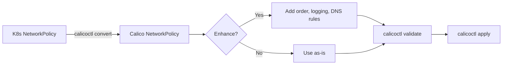

# How to Use calicoctl convert with Practical Examples

Author: [nawazdhandala](https://github.com/nawazdhandala)

Tags: Calico, Kubernetes, Migration, Calicoctl, Network Policy

Description: Master calicoctl convert with practical examples for converting Kubernetes NetworkPolicy to Calico format, migrating between API versions, and batch-converting resources.

---

## Introduction

The `calicoctl convert` command transforms Kubernetes NetworkPolicy resources into Calico NetworkPolicy format. This is valuable when you want to leverage Calico-specific features like global policies, order fields, DNS-based rules, or advanced selector syntax that are not available in standard Kubernetes NetworkPolicy.

Converting existing policies rather than rewriting them from scratch ensures continuity and reduces the risk of introducing errors during migration. The convert command handles the structural translation while preserving the intended network behavior.

This guide provides practical examples of using `calicoctl convert` for common migration and conversion scenarios.

## Prerequisites

- calicoctl v3.27 or later
- Kubernetes NetworkPolicy resources to convert
- Basic understanding of both Kubernetes and Calico NetworkPolicy formats

## Converting a Basic Kubernetes NetworkPolicy

Start with a standard Kubernetes NetworkPolicy:

```yaml
# k8s-netpol.yaml
apiVersion: networking.k8s.io/v1
kind: NetworkPolicy
metadata:
  name: allow-frontend
  namespace: production
spec:
  podSelector:
    matchLabels:
      app: backend
  policyTypes:
    - Ingress
  ingress:
    - from:
        - podSelector:
            matchLabels:
              app: frontend
      ports:
        - protocol: TCP
          port: 8080
```

Convert it to Calico format:

```bash
# Convert the Kubernetes NetworkPolicy to Calico format
calicoctl convert -f k8s-netpol.yaml -o yaml

# Save the converted output
calicoctl convert -f k8s-netpol.yaml -o yaml > calico-netpol.yaml
```

The output will look like:

```yaml
# calico-netpol.yaml (converted output)
apiVersion: projectcalico.org/v3
kind: NetworkPolicy
metadata:
  name: allow-frontend
  namespace: production
spec:
  selector: app == "backend"
  types:
    - Ingress
  ingress:
    - action: Allow
      protocol: TCP
      source:
        selector: app == "frontend"
      destination:
        ports:
          - 8080
```

## Converting with Namespace Selectors

```yaml
# k8s-cross-namespace.yaml
apiVersion: networking.k8s.io/v1
kind: NetworkPolicy
metadata:
  name: allow-monitoring
  namespace: production
spec:
  podSelector:
    matchLabels:
      app: api
  policyTypes:
    - Ingress
  ingress:
    - from:
        - namespaceSelector:
            matchLabels:
              team: monitoring
          podSelector:
            matchLabels:
              app: prometheus
      ports:
        - protocol: TCP
          port: 9090
```

```bash
# Convert cross-namespace policy
calicoctl convert -f k8s-cross-namespace.yaml -o yaml > calico-cross-ns.yaml
cat calico-cross-ns.yaml
```

## Batch Converting Multiple Policies

Convert all Kubernetes NetworkPolicies from a cluster:

```bash
#!/bin/bash
# batch-convert.sh
# Converts all Kubernetes NetworkPolicies to Calico format

set -euo pipefail

OUTPUT_DIR="${1:-./converted-policies}"
mkdir -p "$OUTPUT_DIR"

echo "Exporting Kubernetes NetworkPolicies..."

# Get all namespaces with network policies
NAMESPACES=$(kubectl get networkpolicies --all-namespaces -o jsonpath='{range .items[*]}{.metadata.namespace}{"\n"}{end}' | sort -u)

for ns in $NAMESPACES; do
  mkdir -p "${OUTPUT_DIR}/${ns}"

  # Get each policy in the namespace
  POLICIES=$(kubectl get networkpolicies -n "$ns" -o jsonpath='{range .items[*]}{.metadata.name}{"\n"}{end}')

  for policy in $POLICIES; do
    echo "Converting: ${ns}/${policy}"

    # Export and convert
    kubectl get networkpolicy "$policy" -n "$ns" -o yaml > "/tmp/k8s-${policy}.yaml"
    calicoctl convert -f "/tmp/k8s-${policy}.yaml" -o yaml > "${OUTPUT_DIR}/${ns}/${policy}.yaml"

    rm -f "/tmp/k8s-${policy}.yaml"
  done
done

echo "Conversion complete. Output: $OUTPUT_DIR"
find "$OUTPUT_DIR" -name "*.yaml" | wc -l
echo "policies converted"
```

## Converting and Enhancing with Calico Features

After converting, enhance policies with Calico-specific features:

```bash
#!/bin/bash
# convert-and-enhance.sh
# Converts K8s NetworkPolicy and adds Calico-specific features

set -euo pipefail

INPUT_FILE="${1:?Usage: $0 <k8s-netpol.yaml>}"

# Step 1: Convert to Calico format
CONVERTED=$(calicoctl convert -f "$INPUT_FILE" -o yaml)

# Step 2: Add Calico-specific enhancements
echo "$CONVERTED" | python3 -c "
import yaml, sys

doc = yaml.safe_load(sys.stdin)

# Add order field for policy priority
doc['spec']['order'] = 500

# Enhance with Calico-specific logging
if 'ingress' in doc.get('spec', {}):
    # Add a Log action before Allow for audit purposes
    log_rule = {
        'action': 'Log',
        'protocol': 'TCP'
    }
    # Insert log rule at the beginning
    # doc['spec']['ingress'].insert(0, log_rule)

print(yaml.dump(doc, default_flow_style=False))
" > "${INPUT_FILE%.yaml}-calico-enhanced.yaml"

echo "Enhanced Calico policy: ${INPUT_FILE%.yaml}-calico-enhanced.yaml"
```

## Converting JSON Output

```bash
# Convert to JSON format for programmatic processing
calicoctl convert -f k8s-netpol.yaml -o json | python3 -m json.tool

# Use JSON output in scripts
CALICO_POLICY=$(calicoctl convert -f k8s-netpol.yaml -o json)
echo "$CALICO_POLICY" | python3 -c "
import sys, json
policy = json.load(sys.stdin)
print(f\"Converted: {policy['kind']}/{policy['metadata']['name']}\")
print(f\"Selector: {policy['spec']['selector']}\")
print(f\"Rules: {len(policy['spec'].get('ingress', []))} ingress, {len(policy['spec'].get('egress', []))} egress\")
"
```



## Verification

```bash
# Validate the converted policy
calicoctl validate -f calico-netpol.yaml

# Apply and verify
export DATASTORE_TYPE=kubernetes
calicoctl apply -f calico-netpol.yaml

# Verify the policy is active
calicoctl get networkpolicies -n production -o wide

# Test that the policy behavior matches the original
kubectl exec -n production deploy/frontend -- curl -s --max-time 5 http://backend:8080/health
```

## Troubleshooting

- **"unable to convert" error**: The input file may not be a valid Kubernetes NetworkPolicy. Verify with `kubectl apply --dry-run=client -f input.yaml`.
- **Converted policy behaves differently**: Calico and Kubernetes NetworkPolicy have slightly different semantics for empty selectors and default deny. Review the converted spec carefully.
- **Missing egress rules after conversion**: If the original K8s policy did not specify egress in policyTypes, the converted Calico policy will also omit egress. Add egress rules manually if needed.
- **Selector syntax looks different**: Calico uses `==` operator syntax (e.g., `app == "web"`) instead of Kubernetes label selector format. This is expected and correct.

## Conclusion

The `calicoctl convert` command bridges the gap between Kubernetes and Calico NetworkPolicy formats, enabling teams to migrate existing policies while preserving their intent. Whether converting individual policies or batch-converting an entire cluster, the convert command provides a reliable starting point that you can then enhance with Calico-specific features like policy ordering, logging actions, and advanced selectors. Always validate and test converted policies before applying them to production.
