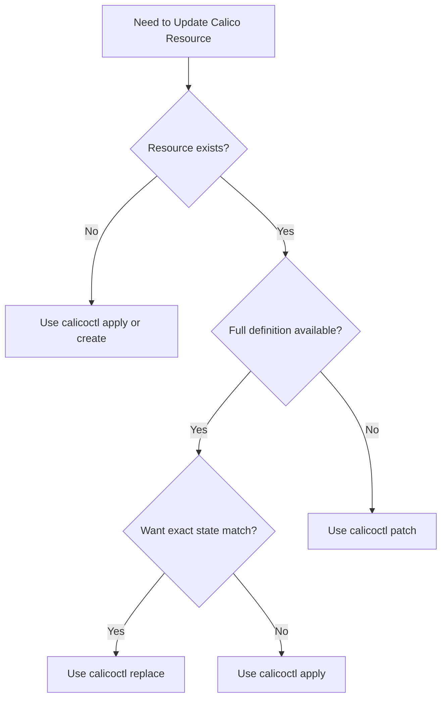

# How to Use calicoctl replace with Practical Examples

Author: [nawazdhandala](https://github.com/nawazdhandala)

Tags: Calico, Kubernetes, calicoctl, Network Policy, Configuration Management

Description: Master calicoctl replace with practical examples covering policy updates, Felix configuration changes, IPPool modifications, and BGP configuration replacements.

---

## Introduction

The `calicoctl replace` command updates an existing Calico resource by completely replacing it with a new definition. Unlike `calicoctl apply` which creates or updates, `replace` fails if the resource does not already exist. Unlike `calicoctl patch` which modifies specific fields, `replace` requires the complete resource definition and overwrites the entire resource.

This behavior makes `replace` the safest choice when you have a complete, validated resource definition and want to ensure the final state matches exactly what you specify, with no leftover fields from a previous version.

This guide provides practical examples of using `calicoctl replace` for common Calico management tasks.

## Prerequisites

- A running Kubernetes cluster with Calico installed
- calicoctl v3.27 or later
- kubectl access to the cluster
- Existing Calico resources to replace

## Replacing a GlobalNetworkPolicy

Update a policy with a completely new definition:

```bash
export DATASTORE_TYPE=kubernetes

# Step 1: Get the current policy
calicoctl get globalnetworkpolicy allow-web -o yaml > /tmp/allow-web-current.yaml

# Step 2: Create the replacement policy
cat > /tmp/allow-web-new.yaml <<EOF
apiVersion: projectcalico.org/v3
kind: GlobalNetworkPolicy
metadata:
  name: allow-web
spec:
  order: 100
  selector: app == "web"
  types:
    - Ingress
    - Egress
  ingress:
    - action: Allow
      protocol: TCP
      source:
        selector: role == "loadbalancer"
      destination:
        ports:
          - 80
          - 443
  egress:
    - action: Allow
      protocol: TCP
      destination:
        selector: app == "api"
        ports:
          - 8080
    - action: Allow
      protocol: UDP
      destination:
        selector: k8s-app == "kube-dns"
        ports:
          - 53
EOF

# Step 3: Replace the policy
calicoctl replace -f /tmp/allow-web-new.yaml

# Step 4: Verify
calicoctl get globalnetworkpolicy allow-web -o yaml
```

## Replacing Felix Configuration

Update the entire Felix configuration for a cluster:

```bash
export DATASTORE_TYPE=kubernetes

# Get current config
calicoctl get felixconfiguration default -o yaml > /tmp/felix-backup.yaml

# Create replacement config
cat > /tmp/felix-new.yaml <<EOF
apiVersion: projectcalico.org/v3
kind: FelixConfiguration
metadata:
  name: default
spec:
  logSeverityScreen: Warning
  reportingInterval: 300s
  ipipEnabled: true
  vxlanEnabled: false
  wireguardEnabled: false
  bpfEnabled: false
  flowLogsFlushInterval: 300s
  prometheusMetricsEnabled: true
  prometheusMetricsPort: 9091
  healthEnabled: true
  healthPort: 9099
EOF

# Replace
calicoctl replace -f /tmp/felix-new.yaml
echo "Felix configuration replaced"
```

## Replacing an IPPool

Modify an IPPool's configuration (note: CIDR changes require delete and recreate):

```bash
export DATASTORE_TYPE=kubernetes

# Get current pool
calicoctl get ippool default-ipv4-ippool -o yaml > /tmp/ippool-backup.yaml

# Replace with updated settings (same CIDR, different encapsulation)
cat > /tmp/ippool-new.yaml <<EOF
apiVersion: projectcalico.org/v3
kind: IPPool
metadata:
  name: default-ipv4-ippool
spec:
  cidr: 192.168.0.0/16
  blockSize: 26
  ipipMode: Never
  vxlanMode: CrossSubnet
  natOutgoing: true
  nodeSelector: all()
  disabled: false
EOF

calicoctl replace -f /tmp/ippool-new.yaml
calicoctl get ippools -o wide
```

## Replacing BGP Configuration

```bash
export DATASTORE_TYPE=kubernetes

# Backup current BGP config
calicoctl get bgpconfiguration default -o yaml > /tmp/bgp-backup.yaml

# Replace with new BGP settings
cat > /tmp/bgp-new.yaml <<EOF
apiVersion: projectcalico.org/v3
kind: BGPConfiguration
metadata:
  name: default
spec:
  logSeverityScreen: Info
  nodeToNodeMeshEnabled: true
  asNumber: 64512
  serviceClusterIPs:
    - cidr: 10.96.0.0/12
  serviceExternalIPs:
    - cidr: 203.0.113.0/24
EOF

calicoctl replace -f /tmp/bgp-new.yaml
calicoctl get bgpconfiguration default -o yaml
```

## Replace vs Apply vs Patch

```bash
# REPLACE: Full resource, must exist already
calicoctl replace -f full-resource.yaml
# Fails if resource does not exist

# APPLY: Full resource, creates or updates
calicoctl apply -f full-resource.yaml
# Creates if missing, updates if exists

# PATCH: Partial update, must exist
calicoctl patch globalnetworkpolicy my-policy -p '{"spec":{"order":100}}'
# Only modifies specified fields
```



## Scripted Replace Workflow

```bash
#!/bin/bash
# safe-replace.sh
# Replace a Calico resource with backup and validation

set -euo pipefail

export DATASTORE_TYPE=kubernetes
RESOURCE_FILE="${1:?Usage: $0 <resource-file.yaml>}"

# Extract metadata
KIND=$(python3 -c "import yaml; print(yaml.safe_load(open('$RESOURCE_FILE'))['kind'])")
NAME=$(python3 -c "import yaml; print(yaml.safe_load(open('$RESOURCE_FILE'))['metadata']['name'])")

# Backup
BACKUP="/tmp/replace-backup-${KIND}-${NAME}-$(date +%s).yaml"
calicoctl get "$KIND" "$NAME" -o yaml > "$BACKUP"
echo "Backup saved: $BACKUP"

# Validate
calicoctl validate -f "$RESOURCE_FILE"

# Replace
calicoctl replace -f "$RESOURCE_FILE"

# Verify
echo "Replacement complete. Current state:"
calicoctl get "$KIND" "$NAME" -o yaml | head -30

echo "Rollback command: calicoctl replace -f $BACKUP"
```

## Verification

```bash
export DATASTORE_TYPE=kubernetes

# Verify the replaced resource matches the new definition
calicoctl get globalnetworkpolicy allow-web -o yaml
calicoctl get felixconfiguration default -o yaml
calicoctl get ippools -o wide

# Verify network connectivity still works
kubectl exec deploy/web -- curl -s --max-time 5 http://api:8080/health
```

## Troubleshooting

- **"resource does not exist"**: The resource must exist before using replace. Use `calicoctl apply` for create-or-update behavior.
- **"resource version conflict"**: Another process modified the resource. Get the latest version, merge your changes, and retry.
- **Missing fields after replace**: Replace overwrites the entire resource. Any fields not included in the new definition are removed. Always provide the complete resource.
- **IPPool CIDR change rejected**: You cannot change the CIDR of an existing IPPool. Delete the old pool and create a new one (after migrating workloads).

## Conclusion

The `calicoctl replace` command is the right choice when you have a complete, validated resource definition and want deterministic results. By replacing the entire resource, you eliminate the risk of stale fields lingering from previous configurations. Always back up the current state before replacing, validate the new definition, and verify the result to maintain a safe and predictable Calico management workflow.
