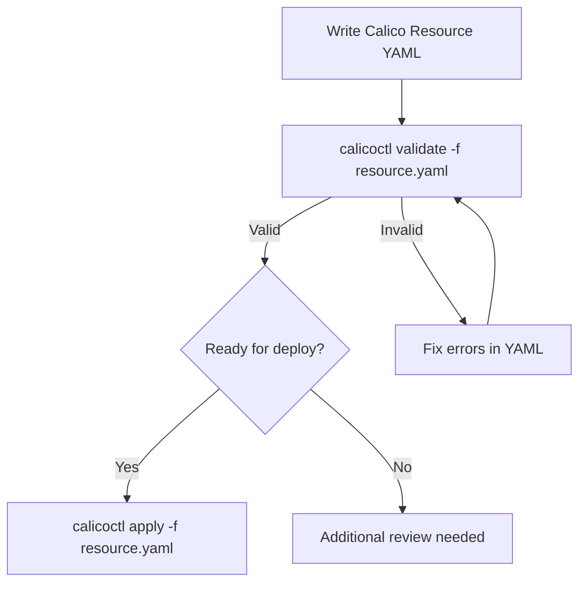

# How to Use calicoctl validate with Practical Examples

Author: [nawazdhandala](https://github.com/nawazdhandala)

Tags: Calico, Kubernetes, Validation, calicoctl, Network Policy

Description: Master calicoctl validate with practical examples covering policy validation, multi-resource validation, CI/CD integration, and common validation error patterns.

---

## Introduction

The `calicoctl validate` command checks Calico resource definitions for correctness without applying them to the datastore. It verifies YAML syntax, required fields, field types, selector syntax, and resource-specific constraints. Running validate before apply or replace catches errors early, preventing misconfigured policies from affecting cluster traffic.

Validation is especially valuable in CI/CD pipelines where changes are reviewed and tested before deployment. A validation failure in CI is far less disruptive than a runtime error in production.

This guide provides practical examples of using `calicoctl validate` for different resource types and integration scenarios.

## Prerequisites

- calicoctl v3.27 or later installed
- Calico resource YAML files to validate
- Basic understanding of Calico resource types

## Validating a GlobalNetworkPolicy

```bash
# Create a policy file to validate
cat > /tmp/test-policy.yaml <<EOF
apiVersion: projectcalico.org/v3
kind: GlobalNetworkPolicy
metadata:
  name: allow-web-traffic
spec:
  order: 100
  selector: app == "web"
  types:
    - Ingress
    - Egress
  ingress:
    - action: Allow
      protocol: TCP
      source:
        selector: role == "frontend"
      destination:
        ports:
          - 80
          - 443
  egress:
    - action: Allow
      protocol: UDP
      destination:
        selector: k8s-app == "kube-dns"
        ports:
          - 53
EOF

# Validate the policy
calicoctl validate -f /tmp/test-policy.yaml
# Output: GlobalNetworkPolicy(allow-web-traffic) is valid.
```

## Validating with Common Errors

Learn what validation catches:

```bash
# Error 1: Invalid action value (case-sensitive)
cat > /tmp/bad-action.yaml <<EOF
apiVersion: projectcalico.org/v3
kind: GlobalNetworkPolicy
metadata:
  name: bad-policy
spec:
  selector: all()
  ingress:
    - action: allow
      protocol: TCP
EOF

calicoctl validate -f /tmp/bad-action.yaml
# Error: spec.ingress[0].action: Unsupported value: "allow"
# Fix: Use "Allow" (capital A)
```

```bash
# Error 2: Invalid selector syntax
cat > /tmp/bad-selector.yaml <<EOF
apiVersion: projectcalico.org/v3
kind: GlobalNetworkPolicy
metadata:
  name: bad-selector-policy
spec:
  selector: "app: web"
  ingress:
    - action: Allow
EOF

calicoctl validate -f /tmp/bad-selector.yaml
# Error: invalid selector syntax
# Fix: Use Calico selector syntax: app == "web"
```

```bash
# Error 3: Missing required field
cat > /tmp/missing-field.yaml <<EOF
apiVersion: projectcalico.org/v3
kind: GlobalNetworkPolicy
metadata:
  name: no-selector
spec:
  ingress:
    - action: Allow
EOF

calicoctl validate -f /tmp/missing-field.yaml
# May validate (selector defaults to all() for GlobalNetworkPolicy)
# But for NetworkPolicy, namespace is required
```

## Validating Multiple Resources

```bash
# Multi-document YAML file
cat > /tmp/multi-resource.yaml <<EOF
apiVersion: projectcalico.org/v3
kind: GlobalNetworkSet
metadata:
  name: trusted-ips
spec:
  nets:
    - 10.0.0.0/8
    - 172.16.0.0/12
---
apiVersion: projectcalico.org/v3
kind: GlobalNetworkPolicy
metadata:
  name: allow-trusted
spec:
  order: 50
  selector: all()
  ingress:
    - action: Allow
      source:
        selector: "global() && name == 'trusted-ips'"
EOF

calicoctl validate -f /tmp/multi-resource.yaml
```

## Validating All Files in a Directory

```bash
#!/bin/bash
# validate-all.sh
# Validates all Calico YAML files in a directory

set -euo pipefail

DIR="${1:-.}"
PASS=0
FAIL=0

find "$DIR" -name "*.yaml" -not -name "kustomization.yaml" | sort | while read file; do
  if calicoctl validate -f "$file" > /dev/null 2>&1; then
    echo "PASS: $file"
    PASS=$((PASS + 1))
  else
    echo "FAIL: $file"
    calicoctl validate -f "$file" 2>&1 | sed 's/^/  /'
    FAIL=$((FAIL + 1))
  fi
done

echo ""
echo "Results: $PASS passed, $FAIL failed"
```

## Validating Different Resource Types

```bash
# IPPool validation
cat > /tmp/ippool.yaml <<EOF
apiVersion: projectcalico.org/v3
kind: IPPool
metadata:
  name: custom-pool
spec:
  cidr: 10.244.0.0/16
  blockSize: 26
  ipipMode: Always
  natOutgoing: true
  nodeSelector: all()
EOF

calicoctl validate -f /tmp/ippool.yaml

# FelixConfiguration validation
cat > /tmp/felix.yaml <<EOF
apiVersion: projectcalico.org/v3
kind: FelixConfiguration
metadata:
  name: default
spec:
  logSeverityScreen: Warning
  prometheusMetricsEnabled: true
  prometheusMetricsPort: 9091
EOF

calicoctl validate -f /tmp/felix.yaml

# BGPPeer validation
cat > /tmp/bgp-peer.yaml <<EOF
apiVersion: projectcalico.org/v3
kind: BGPPeer
metadata:
  name: rack1-tor
spec:
  peerIP: 192.168.1.1
  asNumber: 64512
  nodeSelector: rack == "rack1"
EOF

calicoctl validate -f /tmp/bgp-peer.yaml
```



## CI/CD Integration

```yaml
# .github/workflows/validate-calico.yaml
name: Validate Calico Resources
on:
  pull_request:
    paths: ['calico/**/*.yaml']

jobs:
  validate:
    runs-on: ubuntu-latest
    steps:
      - uses: actions/checkout@v4
      - name: Install calicoctl
        run: |
          curl -L https://github.com/projectcalico/calico/releases/download/v3.27.0/calicoctl-linux-amd64 -o calicoctl
          chmod +x calicoctl && sudo mv calicoctl /usr/local/bin/

      - name: Validate all Calico resources
        run: |
          ERRORS=0
          find calico -name "*.yaml" | while read file; do
            if ! calicoctl validate -f "$file"; then
              ERRORS=$((ERRORS + 1))
            fi
          done
          exit $ERRORS
```

## Verification

```bash
# Validate a known-good file
calicoctl validate -f /tmp/test-policy.yaml && echo "Validation passed"

# Validate a known-bad file (should fail)
calicoctl validate -f /tmp/bad-action.yaml && echo "Should not reach here" || echo "Validation correctly caught error"
```

## Troubleshooting

- **"unknown field" for valid Calico fields**: Your calicoctl version may be older than the Calico version that introduced the field. Update calicoctl.
- **Validation passes but apply fails**: Validate checks syntax and structure but cannot check cluster-specific constraints (like duplicate names or conflicting CIDRs).
- **Multi-document YAML partially validates**: If one document fails, calicoctl may stop validating subsequent documents. Fix errors sequentially.
- **Validation slow on large files**: Validate individual files rather than a single large multi-document YAML for faster feedback.

## Conclusion

Using `calicoctl validate` before every apply or replace operation prevents misconfigured resources from reaching the datastore. Integrate validation into your CI/CD pipeline to catch errors at review time, use it in pre-commit hooks for immediate feedback, and include it in automation scripts as a safety gate. The small investment in validation prevents the much larger cost of debugging a broken network policy in production.
