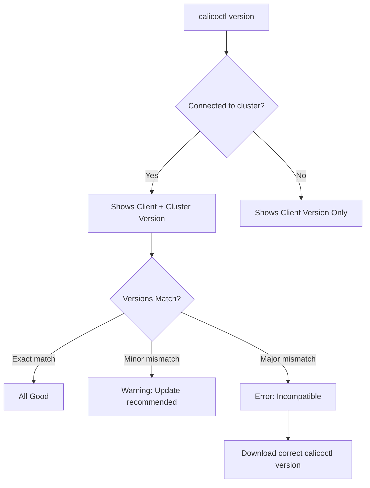

# How to Use calicoctl version with Practical Examples

Author: [nawazdhandala](https://github.com/nawazdhandala)

Tags: Calico, Kubernetes, calicoctl, Version Management, Operations

Description: Master calicoctl version with practical examples for checking client and cluster versions, detecting version mismatches, automating version checks, and integrating into health monitoring.

---

## Introduction

The `calicoctl version` command displays the calicoctl client version and, when connected to a datastore, the Calico cluster version. This seemingly simple command is a critical operational tool -- version mismatches between calicoctl and the cluster are a frequent source of subtle bugs, validation failures, and incompatible resource definitions.

Running `calicoctl version` should be the first step in any troubleshooting session and a regular check in your monitoring and CI/CD workflows. It confirms connectivity to the datastore, verifies compatibility, and provides version information needed for documentation and support requests.

This guide covers practical uses of `calicoctl version` beyond basic version checking, including automated compatibility verification, CI/CD integration, and monitoring.

## Prerequisites

- calicoctl v3.27 or later installed
- A Calico cluster (for cluster version detection)
- kubectl access (for Kubernetes API datastore)

## Basic Version Check

```bash
# Check calicoctl client version (works without cluster access)
calicoctl version

# Example output:
# Client Version:    v3.27.0
# Git commit:        abc1234
# Cluster Version:   v3.27.0
# Cluster Type:      typha,kdd,k8s,operator,bgp,kubeadm

# Check only the client version (no cluster needed)
calicoctl version --client
```

## Checking Version with Different Datastores

```bash
# With Kubernetes API datastore
export DATASTORE_TYPE=kubernetes
calicoctl version
# Shows both client and cluster version

# With etcd datastore
export DATASTORE_TYPE=etcdv3
export ETCD_ENDPOINTS=https://etcd1:2379
export ETCD_CERT_FILE=/etc/calico/certs/cert.pem
export ETCD_KEY_FILE=/etc/calico/certs/key.pem
export ETCD_CA_CERT_FILE=/etc/calico/certs/ca.pem
calicoctl version
# Shows both client and cluster version from etcd
```

## Automated Version Compatibility Check

```bash
#!/bin/bash
# check-version-compatibility.sh
# Verifies calicoctl and cluster versions are compatible

set -euo pipefail

export DATASTORE_TYPE=kubernetes

# Get version information
VERSION_OUTPUT=$(calicoctl version 2>/dev/null)

CLIENT_VERSION=$(echo "$VERSION_OUTPUT" | grep "Client Version" | awk '{print $NF}')
CLUSTER_VERSION=$(echo "$VERSION_OUTPUT" | grep "Cluster Version" | awk '{print $NF}')
CLUSTER_TYPE=$(echo "$VERSION_OUTPUT" | grep "Cluster Type" | cut -d: -f2 | tr -d ' ')

echo "Client Version:  $CLIENT_VERSION"
echo "Cluster Version: $CLUSTER_VERSION"
echo "Cluster Type:    $CLUSTER_TYPE"
echo ""

# Extract major.minor for comparison
CLIENT_MAJOR_MINOR=$(echo "$CLIENT_VERSION" | sed 's/^v//' | cut -d. -f1,2)
CLUSTER_MAJOR_MINOR=$(echo "$CLUSTER_VERSION" | sed 's/^v//' | cut -d. -f1,2)

if [ "$CLIENT_VERSION" = "$CLUSTER_VERSION" ]; then
  echo "STATUS: EXACT MATCH - Client and cluster versions are identical"
elif [ "$CLIENT_MAJOR_MINOR" = "$CLUSTER_MAJOR_MINOR" ]; then
  echo "STATUS: COMPATIBLE - Same major.minor version (patch differs)"
  echo "  Recommendation: Update calicoctl to match cluster version exactly"
else
  echo "STATUS: INCOMPATIBLE - Major or minor version mismatch!"
  echo "  Client: $CLIENT_MAJOR_MINOR"
  echo "  Cluster: $CLUSTER_MAJOR_MINOR"
  echo "  Action required: Download calicoctl ${CLUSTER_VERSION}"
  echo "  curl -L https://github.com/projectcalico/calico/releases/download/${CLUSTER_VERSION}/calicoctl-linux-amd64 -o calicoctl"
  exit 1
fi
```

## CI/CD Version Verification

Include version checks in your deployment pipeline:

```yaml
# .github/workflows/calico-version-check.yaml
name: Calico Version Check
on:
  schedule:
    - cron: '0 8 * * 1'  # Weekly Monday 8 AM
  workflow_dispatch:

jobs:
  check:
    runs-on: ubuntu-latest
    steps:
      - name: Install calicoctl
        run: |
          curl -L https://github.com/projectcalico/calico/releases/download/v3.27.0/calicoctl-linux-amd64 -o calicoctl
          chmod +x calicoctl && sudo mv calicoctl /usr/local/bin/

      - name: Check version compatibility
        env:
          DATASTORE_TYPE: kubernetes
        run: |
          calicoctl version

          CLIENT=$(calicoctl version --client 2>/dev/null | grep "Client Version" | awk '{print $NF}')
          CLUSTER=$(calicoctl version 2>/dev/null | grep "Cluster Version" | awk '{print $NF}')

          if [ "$CLIENT" != "$CLUSTER" ]; then
            echo "::warning::calicoctl version ($CLIENT) does not match cluster ($CLUSTER)"
          fi
```

## Monitoring Version Information

Push version info as Prometheus metrics:

```bash
#!/bin/bash
# calico-version-metrics.sh
# Exports Calico version info as Prometheus metrics

set -euo pipefail

export DATASTORE_TYPE=kubernetes
PUSHGATEWAY="${PUSHGATEWAY:-http://prometheus-pushgateway:9091}"

VERSION_OUTPUT=$(calicoctl version 2>/dev/null || echo "")

CLIENT_VERSION=$(echo "$VERSION_OUTPUT" | grep "Client Version" | awk '{print $NF}' || echo "unknown")
CLUSTER_VERSION=$(echo "$VERSION_OUTPUT" | grep "Cluster Version" | awk '{print $NF}' || echo "unknown")

# Version match: 1 if matching, 0 if not
if [ "$CLIENT_VERSION" = "$CLUSTER_VERSION" ]; then
  MATCH=1
else
  MATCH=0
fi

cat <<EOF | curl -s --data-binary @- "${PUSHGATEWAY}/metrics/job/calico_version"
# HELP calico_version_match Whether calicoctl client matches cluster (1=match, 0=mismatch)
# TYPE calico_version_match gauge
calico_version_match{client="${CLIENT_VERSION}",cluster="${CLUSTER_VERSION}"} ${MATCH}
EOF
```

## Multi-Cluster Version Inventory

```bash
#!/bin/bash
# version-inventory.sh
# Checks calicoctl version across multiple clusters

set -euo pipefail

CLUSTERS=("staging" "production" "dr-site")

echo "=== Calico Version Inventory ==="
printf "%-15s %-15s %-15s %-10s\n" "Cluster" "Client" "Cluster" "Match"
printf "%-15s %-15s %-15s %-10s\n" "-------" "------" "-------" "-----"

for cluster in "${CLUSTERS[@]}"; do
  export KUBECONFIG="${HOME}/.kube/${cluster}.config"
  export DATASTORE_TYPE=kubernetes

  VERSION_OUTPUT=$(calicoctl version 2>/dev/null || echo "Error")
  CLIENT=$(echo "$VERSION_OUTPUT" | grep "Client Version" | awk '{print $NF}' 2>/dev/null || echo "N/A")
  CLUSTER_VER=$(echo "$VERSION_OUTPUT" | grep "Cluster Version" | awk '{print $NF}' 2>/dev/null || echo "N/A")

  if [ "$CLIENT" = "$CLUSTER_VER" ]; then
    MATCH="YES"
  else
    MATCH="NO"
  fi

  printf "%-15s %-15s %-15s %-10s\n" "$cluster" "$CLIENT" "$CLUSTER_VER" "$MATCH"
done
```

## Using Version for Troubleshooting

```bash
# When filing a support request, always include version info
echo "=== Calico Support Information ==="
calicoctl version
echo ""
echo "Kubernetes version:"
kubectl version --short 2>/dev/null || kubectl version
echo ""
echo "Node OS:"
kubectl get nodes -o jsonpath='{range .items[*]}{.metadata.name}: {.status.nodeInfo.osImage}{"\n"}{end}'
```



## Verification

```bash
# Verify version check works
calicoctl version

# Verify compatibility script
bash check-version-compatibility.sh

# Verify metrics are pushed
curl -s "${PUSHGATEWAY}/metrics" | grep calico_version_match
```

## Troubleshooting

- **"Unable to reach cluster"**: The datastore connection is not configured. Set `DATASTORE_TYPE` and ensure kubeconfig or etcd credentials are correct. The client version still displays.
- **Client shows version but cluster is empty**: calicoctl cannot connect to the datastore. Check the connection parameters and try `calicoctl get nodes` for more detailed error messages.
- **Version shows "dev build"**: You are using a development build of calicoctl. Download the official release from the Calico GitHub releases page.
- **Multiple calicoctl binaries on the system**: Use `which calicoctl` and `calicoctl version` to verify you are running the expected binary. Check PATH order.

## Conclusion

The `calicoctl version` command is a deceptively simple but essential operational tool. Use it as the first step in every troubleshooting session, integrate it into CI/CD pipelines to catch version mismatches early, and include it in monitoring to track version consistency across clusters. Version mismatches are one of the most common sources of calicoctl errors, and a proactive version check prevents hours of debugging.
