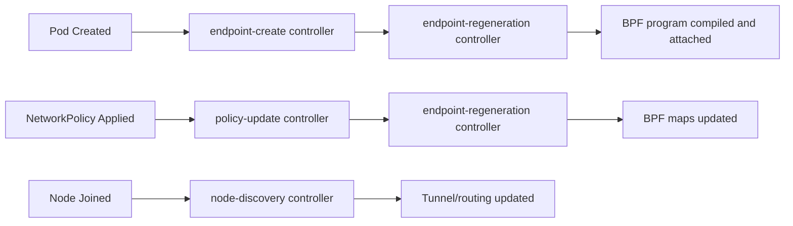

# How to Use Controllers in Cilium Observability

Author: [nawazdhandala](https://github.com/nawazdhandala)

Tags: Cilium, Controller, Observability, Kubernetes, eBPF

Description: Learn how to leverage Cilium's internal controllers for operational observability, including querying controller state, interpreting run statistics, and using controller data to diagnose cluster...

---

## Introduction

Cilium controllers are the reconciliation loops that keep your cluster's networking state in sync. Every time a pod is created, a network policy is applied, or a node joins the cluster, one or more controllers trigger to update the BPF datapath accordingly. Each controller tracks its own run count, success rate, last error, and duration.

Using controller data effectively gives you a window into the real-time behavior of Cilium. Instead of guessing why a policy is not taking effect or why endpoint regeneration is slow, you can query controller status directly and correlate it with metrics and logs.

This guide focuses on practical usage patterns for Cilium controllers, showing you how to interpret their output, correlate them with observability data, and use them in your day-to-day operations workflow.

## Prerequisites

- Kubernetes cluster running Cilium 1.14+
- kubectl and cilium CLI installed
- Prometheus with Cilium metrics enabled
- Familiarity with Cilium endpoint and policy concepts

## Querying Controller State

The primary interface for controller data is the `cilium status controllers` command:

```bash
# List all controllers with their current status
kubectl -n kube-system exec ds/cilium -- cilium status controllers

# Get a specific controller by name pattern
kubectl -n kube-system exec ds/cilium -- cilium status controllers | grep "policy"

# JSON output for programmatic analysis
kubectl -n kube-system exec ds/cilium -- cilium status controllers -o json
```

Each controller entry contains these key fields:

```bash
# Parse and display controller details
kubectl -n kube-system exec ds/cilium -- cilium status controllers -o json | python3 -c "
import json, sys
for c in json.load(sys.stdin)[:5]:
    s = c.get('status', {})
    print(f\"Controller: {c['name']}\")
    print(f\"  Success count: {s.get('success-count', 0)}\")
    print(f\"  Failure count: {s.get('failure-count', 0)}\")
    print(f\"  Consecutive failures: {s.get('consecutive-failure-count', 0)}\")
    print(f\"  Last success: {s.get('last-success-timestamp', 'never')}\")
    print(f\"  Last failure: {s.get('last-failure-timestamp', 'never')}\")
    print(f\"  Last error: {s.get('last-failure-msg', 'none')}\")
    print()
"
```

## Correlating Controllers with Network Events

Controllers map directly to observable network behavior. Understanding which controllers handle which operations helps you trace issues:



To trace a specific operation through controllers:

```bash
# Watch controllers in real-time while creating a pod
# Terminal 1: Watch controllers
kubectl -n kube-system exec ds/cilium -- watch -n 1 "cilium status controllers | grep -E 'endpoint|policy'"

# Terminal 2: Create a test pod
kubectl run test-pod --image=nginx --restart=Never

# After the pod is running, check which controllers ran
kubectl -n kube-system exec ds/cilium -- cilium status controllers -o json | python3 -c "
import json, sys
from datetime import datetime, timedelta
now_str = '$(date -u +%Y-%m-%dT%H:%M:%S)'
controllers = json.load(sys.stdin)
recent = [c for c in controllers
          if c.get('status', {}).get('last-success-timestamp', '') > now_str[:16]]
for c in recent:
    print(f\"Recently active: {c['name']}\")
"
```

## Using Controller Metrics for Capacity Planning

Controller run duration and frequency provide signals about cluster load:

```bash
# Query: Average controller run duration over the last hour
# High durations indicate the agent is under load
curl -s 'http://localhost:9090/api/v1/query?query=rate(cilium_controllers_runs_duration_seconds_sum[1h])/rate(cilium_controllers_runs_duration_seconds_count[1h])' | python3 -m json.tool

# Query: Total controller runs per minute (measures reconciliation load)
curl -s 'http://localhost:9090/api/v1/query?query=sum(rate(cilium_controllers_runs_total[5m]))*60' | python3 -m json.tool

# Query: Error ratio by controller name
curl -s 'http://localhost:9090/api/v1/query?query=sum by (controller)(rate(cilium_controllers_runs_total{outcome="error"}[5m]))/sum by (controller)(rate(cilium_controllers_runs_total[5m]))>0' | python3 -m json.tool
```

Key thresholds to watch:

- Controller run duration above 30 seconds: indicates resource pressure
- Error ratio above 5%: investigate specific failing controllers
- Consecutive failure count above 10: likely a persistent configuration issue

## Automating Controller Health Checks

Create a script to run as a CronJob for regular health checks:

```yaml
# cilium-controller-check.yaml
apiVersion: batch/v1
kind: CronJob
metadata:
  name: cilium-controller-health-check
  namespace: kube-system
spec:
  schedule: "*/10 * * * *"
  jobTemplate:
    spec:
      template:
        spec:
          serviceAccountName: cilium
          containers:
            - name: checker
              image: bitnami/kubectl:latest
              command:
                - /bin/sh
                - -c
                - |
                  # Get all Cilium pods
                  PODS=$(kubectl get pods -n kube-system -l k8s-app=cilium -o name)
                  for pod in $PODS; do
                    FAILING=$(kubectl exec -n kube-system $pod -- \
                      cilium status controllers -o json 2>/dev/null | \
                      python3 -c "
                  import json, sys
                  data = json.load(sys.stdin)
                  failing = [c['name'] for c in data if c.get('status',{}).get('consecutive-failure-count',0) > 5]
                  print('\n'.join(failing))
                  " 2>/dev/null)
                    if [ -n "$FAILING" ]; then
                      echo "WARNING: $pod has failing controllers:"
                      echo "$FAILING"
                    fi
                  done
          restartPolicy: OnFailure
```

```bash
kubectl apply -f cilium-controller-check.yaml
```

## Verification

Confirm your controller observability is working:

```bash
# 1. List all controllers across all nodes
for pod in $(kubectl get pods -n kube-system -l k8s-app=cilium -o name); do
  echo "=== $pod ==="
  kubectl -n kube-system exec $pod -- cilium status controllers 2>/dev/null | tail -5
done

# 2. Check for any currently failing controllers
kubectl -n kube-system exec ds/cilium -- cilium status controllers -o json | python3 -c "
import json, sys
data = json.load(sys.stdin)
failing = [c for c in data if c.get('status',{}).get('consecutive-failure-count',0) > 0]
print(f'Total controllers: {len(data)}, Failing: {len(failing)}')
"

# 3. Verify metrics are available in Prometheus
curl -s 'http://localhost:9090/api/v1/query?query=count(cilium_controllers_failing)' | python3 -m json.tool
```

## Troubleshooting

- **Controller status shows stale timestamps**: The controller may have a long interval. Some controllers only run on-demand (event-triggered), not on a timer.

- **Cannot exec into Cilium pods**: Ensure your RBAC allows exec into kube-system pods. Check with `kubectl auth can-i exec pods -n kube-system`.

- **Controller names are not descriptive**: Use `cilium status controllers -o json` to get the full controller metadata including the UUID and configuration parameters.

- **Too many controllers to monitor**: Focus on the critical ones: `endpoint-regeneration`, `policy-update`, `sync-to-k8s`, and `ipam-sync`. These cover the most impactful operations.

## Conclusion

Cilium controllers provide a detailed operational view of your cluster's networking reconciliation. By querying controller state, correlating it with network events, and building automated health checks, you gain the ability to proactively detect and resolve issues. Integrate controller metrics into your existing monitoring stack to maintain continuous visibility into the health of your Cilium deployment.
