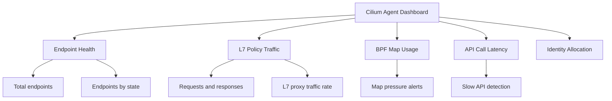

# How to Use Grafana for Cilium Observability

Author: [nawazdhandala](https://github.com/nawazdhandala)

Tags: Cilium, Observability, Grafana, Monitoring, Dashboard, Hubble

Description: Set up and use Grafana dashboards for Cilium observability, including network flow visualization, policy monitoring, Hubble metrics analysis, and custom dashboard creation for cluster-specific...

---

## Introduction

Grafana transforms raw Cilium and Hubble Prometheus metrics into actionable visual dashboards. With properly configured dashboards, operators can monitor network policy enforcement, track traffic patterns, detect anomalies, and investigate connectivity issues - all from a single interface.

Cilium provides official Grafana dashboards that cover the most common observability needs. Beyond these, custom dashboards can be created to address organization-specific monitoring requirements. This guide covers both approaches.

## Prerequisites

- Kubernetes cluster with Cilium and Hubble installed
- Prometheus collecting Cilium and Hubble metrics. Cilium, Hubble, and Cilium Operator metrics must be enabled separately with `prometheus.enabled=true`, `hubble.enabled=true`, `hubble.metrics.enabled`, and `operator.prometheus.enabled=true`.
- Grafana deployed (standalone or via Grafana Operator)
- `kubectl` and `helm` CLI tools
- Basic familiarity with Grafana dashboard editing

## Installing Grafana with Cilium Dashboards

Deploy Grafana using Helm with a Prometheus datasource:

```bash
# Add Grafana Helm repository

helm repo add grafana https://grafana.github.io/helm-charts
helm repo update

# Install Grafana with a Prometheus datasource
helm install grafana grafana/grafana \
    --namespace monitoring \
    --create-namespace \
    --set adminPassword=admin \
    --set datasources."datasources\.yaml".apiVersion=1 \
    --set datasources."datasources\.yaml".datasources[0].name=Prometheus \
    --set datasources."datasources\.yaml".datasources[0].uid=prometheus \
    --set datasources."datasources\.yaml".datasources[0].type=prometheus \
    --set datasources."datasources\.yaml".datasources[0].url=http://prometheus-server.monitoring.svc:9090 \
    --set datasources."datasources\.yaml".datasources[0].access=proxy \
    --set datasources."datasources\.yaml".datasources[0].isDefault=true

# Access Grafana
kubectl port-forward -n monitoring svc/grafana 3000:80 &
echo "Grafana available at http://localhost:3000"
```

Import Cilium's official dashboards:

```bash
# Import dashboards from the Cilium repository using the Grafana API
CILIUM_VERSION=1.19.3

curl -sL "https://raw.githubusercontent.com/cilium/cilium/v${CILIUM_VERSION}/install/kubernetes/cilium/files/cilium-agent/dashboards/cilium-dashboard.json" \
  | jq '{dashboard: (. * {id: null, uid: null}), overwrite: true}' \
  | curl -s -u admin:admin -X POST http://localhost:3000/api/dashboards/db \
      -H "Content-Type: application/json" \
      -d @-

curl -sL "https://raw.githubusercontent.com/cilium/cilium/v${CILIUM_VERSION}/install/kubernetes/cilium/files/hubble/dashboards/hubble-dashboard.json" \
  | jq '{dashboard: (. * {id: null, uid: null}), overwrite: true}' \
  | curl -s -u admin:admin -X POST http://localhost:3000/api/dashboards/db \
      -H "Content-Type: application/json" \
      -d @-
```

## Using the Cilium Agent Dashboard

Key panels and their interpretation:


```mermaid
graph TD
    A[Cilium Agent Dashboard] --> B[Endpoint Health]
    A --> C[L7 Policy Traffic]
    A --> D[BPF Map Usage]
    A --> E[API Call Latency]
    A --> F[Identity Allocation]

    B --> B1[Total endpoints]
    B --> B2[Endpoints by state]
    C --> C1[Requests and responses]
    C --> C2[L7 proxy traffic rate]
    D --> D1[Map pressure alerts]
    E --> E1[Slow API detection]
```

Essential PromQL queries for Cilium monitoring:

```promql
# L7 policy traffic rate
sum(rate(cilium_policy_l7_total[5m])) by (proxy_type)

# Endpoint regeneration rate (indicates policy changes)
rate(cilium_endpoint_regenerations_total[5m])

# BPF map pressure (percentage full)
cilium_bpf_map_pressure * 100

# API request duration (95th percentile)
histogram_quantile(0.95, sum(rate(cilium_api_process_time_seconds_bucket[5m])) by (le))

# Dropped packets by reason
sum(rate(cilium_drop_count_total[5m])) by (reason)
```

## Using the Hubble Dashboard

Hubble metrics provide L7 application-level visibility:

```promql
# HTTP request rate by service
sum(rate(hubble_http_requests_total[5m])) by (destination_workload, method)

# HTTP error rate
sum(rate(hubble_http_responses_total{status=~"5.."}[5m])) by (destination_workload)
/ sum(rate(hubble_http_responses_total[5m])) by (destination_workload)

# DNS query rate
sum(rate(hubble_dns_queries_total[5m])) by (qtypes)

# TCP flag rate
sum(rate(hubble_tcp_flags_total[5m])) by (flag, family)

# Network flow rate by verdict
sum(rate(hubble_flows_processed_total[5m])) by (verdict)
```

Queries that group by `destination_workload`, `source_namespace`, or `destination_namespace` require Hubble `labelsContext` to include those labels.

## Creating Custom Dashboards

Build a custom dashboard for your specific monitoring needs:

```json
{
  "dashboard": {
    "title": "Cilium Custom Observability",
    "panels": [
      {
        "title": "Network Flow Verdicts",
        "type": "timeseries",
        "gridPos": {"h": 8, "w": 12, "x": 0, "y": 0},
        "targets": [
          {
            "expr": "sum(rate(hubble_flows_processed_total[5m])) by (verdict)",
            "legendFormat": "{{verdict}}"
          }
        ]
      },
      {
        "title": "Top Dropped Flow Subtypes",
        "type": "table",
        "gridPos": {"h": 8, "w": 12, "x": 12, "y": 0},
        "targets": [
          {
            "expr": "topk(10, sum(increase(hubble_flows_processed_total{verdict=\"DROPPED\"}[1h])) by (subtype))",
            "format": "table"
          }
        ]
      },
      {
        "title": "Hubble HTTP Latency Heatmap",
        "type": "heatmap",
        "gridPos": {"h": 8, "w": 24, "x": 0, "y": 8},
        "targets": [
          {
            "expr": "sum(increase(hubble_http_request_duration_seconds_bucket[5m])) by (le)",
            "format": "heatmap"
          }
        ]
      }
    ]
  }
}
```

Save and import the custom dashboard:

```bash
# Save dashboard JSON to file and import
curl -s -u admin:admin -X POST http://localhost:3000/api/dashboards/db \
    -H "Content-Type: application/json" \
    -d @custom-dashboard.json
```

## Setting Up Alerts in Grafana

Configure alerts for critical Cilium metrics:

```yaml
# Alert: High policy denial rate
# PromQL: sum(rate(hubble_flows_processed_total{verdict="DROPPED"}[5m])) > 100
# Condition: When avg() of query is above 100 for 5 minutes

# Alert: BPF map pressure high
# PromQL: cilium_bpf_map_pressure > 0.9
# Condition: When max() of query is above 0.9 for 10 minutes

# Alert: Endpoint not ready
# PromQL: cilium_endpoint_state{state!="ready"} > 0
# Condition: When count() of query is above 0 for 5 minutes
```

## Verification

Verify the Grafana setup is complete:

```bash
# Check Grafana is running
kubectl get pods -n monitoring -l app.kubernetes.io/name=grafana

# Verify datasource connectivity
curl -s -u admin:admin http://localhost:3000/api/datasources/uid/prometheus/health | jq '.status'

# List imported dashboards
curl -s -u admin:admin http://localhost:3000/api/search | jq '.[].title'

# Test a PromQL query through Grafana
curl -s -u admin:admin "http://localhost:3000/api/datasources/proxy/uid/prometheus/api/v1/query?query=up" | jq '.data.result | length'
```

## Troubleshooting

**Problem: Dashboard shows "No data" for all panels**
Check the Prometheus datasource URL is correct and accessible from the Grafana pod. Verify metrics exist in Prometheus directly.

**Problem: Hubble panels show data but Cilium Agent panels do not**
Cilium agent and Hubble metrics are exposed on different ports (9962 and 9965). Verify both are being scraped by Prometheus.

**Problem: Dashboard variables not populating**
Variables depend on label values in Prometheus. Check that the label used for the variable (e.g., `namespace`, `pod`) exists in the metric.

**Problem: Alerts not firing despite threshold breach**
Check the alert evaluation interval and the `for` duration. Also verify the alert notification channel is configured correctly in Grafana.

## Conclusion

Grafana provides powerful visualization for Cilium observability when configured with the right datasources, dashboards, and alerts. Start with Cilium's official dashboards for immediate value, then create custom dashboards for organization-specific monitoring needs. The combination of Cilium agent metrics (infrastructure health) and Hubble metrics (application traffic) gives comprehensive visibility into your cluster's network behavior.
