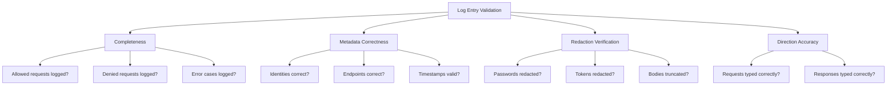

# Validating Access Logging in Cilium Network Security

Author: [nawazdhandala](https://github.com/nawazdhandala)

Tags: Cilium, Network Security, Validation, Access Logging, Testing, Compliance

Description: Validate that access logging in Cilium L7 parsers captures all required events with correct metadata, proper data redaction, and complete coverage of both allowed and denied traffic flows.

---

## Introduction

Validating access logging ensures that every security-relevant event is captured accurately. Incomplete or inaccurate access logs undermine security monitoring, compliance reporting, and incident investigation. Validation must confirm that both allowed and denied requests generate log entries, that metadata is correct, and that sensitive data is properly redacted.

This guide provides a testing framework for validating access logging completeness, correctness, and compliance in Cilium L7 parsers.

## Prerequisites

- Parser with access logging implemented
- Go 1.21 or later
- Test Kubernetes cluster with Cilium and Hubble
- Compliance requirements documentation (if applicable)
- Understanding of your protocol's security-relevant events

## Testing Log Entry Completeness

Every code path through OnData that makes a policy decision must generate a log entry:

```go
func TestAccessLogCompleteness(t *testing.T) {
    tests := []struct {
        name           string
        input          []byte
        expectedVerdict accesslog.FlowVerdict
        expectLog      bool
        desc           string
    }{
        {
            name:           "allowed request logged",
            input:          makeMessage(0x01, []byte("test")),
            expectedVerdict: accesslog.VerdictForwarded,
            expectLog:      true,
            desc:           "Allowed requests must be logged with FORWARDED verdict",
        },
        {
            name:           "denied request logged",
            input:          makeMessage(0xFF, []byte("test")),  // Denied command
            expectedVerdict: accesslog.VerdictDenied,
            expectLog:      true,
            desc:           "Denied requests must be logged with DENIED verdict",
        },
        {
            name:           "partial data not logged",
            input:          []byte{0x00, 0x00},  // Incomplete header
            expectLog:      false,
            desc:           "Incomplete data should not generate a log entry",
        },
        {
            name:           "malformed data logged as error",
            input:          []byte{0xFF, 0xFF, 0xFF, 0xFF},  // Invalid length
            expectedVerdict: accesslog.VerdictError,
            expectLog:      true,
            desc:           "Malformed messages should be logged with ERROR verdict",
        },
    }

    for _, tt := range tests {
        t.Run(tt.name, func(t *testing.T) {
            // Create parser with a mock log collector
            collector := &mockLogCollector{}
            parser := newTestParser(collector)
            reader := proxylib.NewTestReader(tt.input)

            parser.OnData(false, reader)

            if tt.expectLog && len(collector.entries) == 0 {
                t.Errorf("%s: expected log entry but none generated", tt.desc)
            }
            if !tt.expectLog && len(collector.entries) > 0 {
                t.Errorf("%s: unexpected log entry generated", tt.desc)
            }
            if tt.expectLog && len(collector.entries) > 0 {
                if collector.entries[0].Verdict != tt.expectedVerdict {
                    t.Errorf("Verdict: got %v, want %v", collector.entries[0].Verdict, tt.expectedVerdict)
                }
            }
        })
    }
}

type mockLogCollector struct {
    entries []*accesslog.LogRecord
}

func (m *mockLogCollector) Log(entry *accesslog.LogRecord) {
    m.entries = append(m.entries, entry)
}
```

## Validating Metadata Correctness

Verify that each field in the log entry is populated correctly:

```go
func TestAccessLogMetadata(t *testing.T) {
    collector := &mockLogCollector{}
    parser := newTestParserWithConnection(collector, &proxylib.Connection{
        SrcIdentity:  100,
        DstIdentity:  200,
        SrcEndpoint:  "10.0.1.5:43210",
        DstEndpoint:  "10.0.2.10:9000",
    })

    msg := makeMessage(0x01, []byte("testkey"))
    reader := proxylib.NewTestReader(msg)
    parser.OnData(false, reader)

    if len(collector.entries) != 1 {
        t.Fatalf("Expected 1 log entry, got %d", len(collector.entries))
    }

    entry := collector.entries[0]

    // Verify all required fields are present
    checks := []struct {
        field string
        got   interface{}
        want  interface{}
    }{
        {"Protocol", entry.Protocol, "myprotocol"},
        {"Type", entry.Type, accesslog.TypeRequest},
        {"Verdict", entry.Verdict, accesslog.VerdictForwarded},
        {"SourceIdentity", entry.SourceIdentity, uint32(100)},
        {"DestinationIdentity", entry.DestinationIdentity, uint32(200)},
    }

    for _, check := range checks {
        if !reflect.DeepEqual(check.got, check.want) {
            t.Errorf("%s: got %v, want %v", check.field, check.got, check.want)
        }
    }

    // Verify L7 fields
    if entry.L7["command"] == "" {
        t.Error("L7 command field is empty")
    }
    if entry.L7["request_id"] == "" {
        t.Error("L7 request_id field is empty")
    }

    // Verify timestamp is valid
    _, err := time.Parse(time.RFC3339Nano, entry.Timestamp)
    if err != nil {
        t.Errorf("Invalid timestamp format: %v", err)
    }
}
```



## Validating Data Redaction

Ensure sensitive data never appears in logs:

```go
func TestAccessLogRedaction(t *testing.T) {
    collector := &mockLogCollector{}
    parser := newTestParser(collector)

    sensitiveInputs := []struct {
        name    string
        command byte
        payload []byte
    }{
        {"auth with password", 0x10, []byte("user:secretpassword123")},
        {"token auth", 0x11, []byte("Bearer eyJhbGciOiJIUzI1NiJ9.test")},
        {"key with secret value", 0x02, []byte("api_key=sk_live_abc123")},
    }

    for _, si := range sensitiveInputs {
        t.Run(si.name, func(t *testing.T) {
            collector.entries = nil
            msg := makeMessage(si.command, si.payload)
            reader := proxylib.NewTestReader(msg)
            parser.OnData(false, reader)

            for _, entry := range collector.entries {
                entryJSON, _ := json.Marshal(entry)
                entryStr := string(entryJSON)

                // Check that sensitive payload content is not in the log
                if strings.Contains(entryStr, "secretpassword") {
                    t.Error("Password found in log entry")
                }
                if strings.Contains(entryStr, "eyJhbGciOiJIUzI1NiJ9") {
                    t.Error("JWT token found in log entry")
                }
                if strings.Contains(entryStr, "sk_live_abc123") {
                    t.Error("API key found in log entry")
                }
            }
        })
    }
}
```

## End-to-End Log Validation

Validate the complete logging pipeline in a cluster:

```bash
# Send known traffic
kubectl exec test-client -- protocol-client send --command GET --key "test1" --target myservice:9000
kubectl exec test-client -- protocol-client send --command DELETE --key "test2" --target myservice:9000

# Collect Hubble flows
hubble observe --type l7 --protocol myprotocol --last 10 -o json > /tmp/flows.json

# Validate flow count
FLOW_COUNT=$(jq -s 'length' /tmp/flows.json)
echo "Captured $FLOW_COUNT flows"

# Validate verdicts
jq -r '.flow.verdict' /tmp/flows.json | sort | uniq -c
```

## Verification

Run the complete validation suite:

```bash
# Completeness tests
go test ./proxylib/myprotocol/... -v -run TestAccessLogCompleteness

# Metadata correctness tests
go test ./proxylib/myprotocol/... -v -run TestAccessLogMetadata

# Redaction tests
go test ./proxylib/myprotocol/... -v -run TestAccessLogRedaction

# Full suite with race detection
go test ./proxylib/myprotocol/... -race -v -count=1

# Coverage of logging code
go test ./proxylib/myprotocol/... -coverprofile=cover.out
go tool cover -func=cover.out | grep -i "log"
```

## Troubleshooting

**Problem: Mock collector does not capture entries**
Ensure the parser is configured to use the mock collector in tests rather than the real accesslog package. Use dependency injection to make the logging sink configurable.

**Problem: Redaction tests pass but production logs show sensitive data**
The test may be checking different code paths than production. Ensure the sanitization function is called on all paths, not just the ones covered by tests.

**Problem: End-to-end validation shows inconsistent flow counts**
Hubble may aggregate or deduplicate flows. Use unique request IDs and check for each specific ID rather than relying on total counts.

**Problem: Timestamps are not in UTC**
Explicitly call `time.Now().UTC()` rather than `time.Now()`. The latter uses the local timezone which varies across nodes.

## Conclusion

Validating access logging requires testing completeness (all decisions logged), correctness (all metadata accurate), redaction (no sensitive data), and end-to-end delivery (logs reach Hubble). Each dimension needs dedicated tests that fail explicitly when the logging contract is violated. These validations should run in CI to prevent logging regressions that could create security monitoring blind spots.
