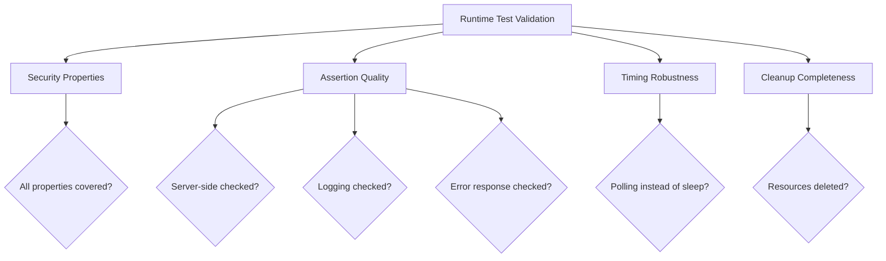

# Validating Runtime Tests for Cilium Network Security

Author: [nawazdhandala](https://github.com/nawazdhandala)

Tags: Cilium, Network Security, Validation, Runtime Tests, Integration Testing

Description: Validate that runtime integration tests for Cilium L7 parsers provide meaningful security coverage by verifying test isolation, policy enforcement accuracy, and end-to-end observability in live...

---

## Introduction

Runtime test validation ensures that integration tests exercise the full security stack - from BPF datapath through proxy redirects, parser logic, policy decisions, error injection, and access logging. A runtime test that only checks connectivity without verifying policy enforcement provides no security value.

Validation examines whether tests check the right properties, handle timing correctly, clean up properly, and provide reliable results across different cluster configurations.

## Prerequisites

- Runtime test suite implemented and runnable
- Test cluster with Cilium
- Understanding of Cilium's security architecture
- Access to test results from multiple runs
- CI/CD pipeline for automated execution

## Validating Security Property Coverage

Each runtime test should verify at least one security property:

```go
// Map tests to security properties they validate
var securityPropertyCoverage = map[string][]string{
    "testAllowedTraffic": {
        "policy_permits_authorized_requests",
        "server_receives_complete_request",
    },
    "testDeniedTraffic": {
        "policy_blocks_unauthorized_requests",
        "server_never_receives_blocked_request",
        "denial_is_logged",
    },
    "testErrorInjection": {
        "client_receives_error_for_denied_request",
        "error_does_not_reveal_internal_info",
    },
    "testAccessLogging": {
        "all_decisions_are_logged",
        "log_entries_have_correct_verdicts",
    },
    "testPolicyUpdate": {
        "policy_changes_take_effect",
        "no_traffic_allowed_during_transition",
    },
}

func TestSecurityPropertyCoverage(t *testing.T) {
    requiredProperties := []string{
        "policy_permits_authorized_requests",
        "policy_blocks_unauthorized_requests",
        "server_never_receives_blocked_request",
        "denial_is_logged",
        "client_receives_error_for_denied_request",
        "all_decisions_are_logged",
        "policy_changes_take_effect",
    }

    covered := make(map[string]bool)
    for _, props := range securityPropertyCoverage {
        for _, p := range props {
            covered[p] = true
        }
    }

    for _, req := range requiredProperties {
        if !covered[req] {
            t.Errorf("Security property not covered by any runtime test: %s", req)
        }
    }
}
```

## Validating Test Assertions

Check that runtime tests make meaningful assertions, not just connectivity checks:

```go
// BAD: Only checks connectivity
func testBadDeniedTraffic(kubectl *helpers.Kubectl) func(t *testing.T) {
    return func(t *testing.T) {
        kubectl.Apply(policyFile)
        _, err := kubectl.Exec("cilium-test", "test-client",
            "protocol-client send --command DELETE --target myprotocol-server:9000")
        if err == nil {
            t.Error("Expected error")
        }
        // Missing: No check that server didn't receive the request
        // Missing: No check that denial was logged
    }
}

// GOOD: Checks all security properties
func testGoodDeniedTraffic(kubectl *helpers.Kubectl) func(t *testing.T) {
    return func(t *testing.T) {
        kubectl.Apply(policyFile)
        waitForPolicyEnforcement(kubectl, "cilium-test", 60*time.Second)

        // Check 1: Client sees denial
        output, _ := kubectl.Exec("cilium-test", "test-client",
            "protocol-client send --command DELETE --target myprotocol-server:9000")
        if containsSuccess(output) {
            t.Error("Denied request should not succeed")
        }

        // Check 2: Server never received the request
        serverLogs, _ := kubectl.Logs("cilium-test", "myprotocol-server")
        if containsDeleteRequest(serverLogs) {
            t.Error("CRITICAL: Server received denied request - policy bypass!")
        }

        // Check 3: Denial was logged
        flows, _ := kubectl.ExecInCilium(
            "hubble observe --type l7 --verdict DENIED --last 5 -o json")
        if !containsMyProtocolDenial(flows) {
            t.Error("Denial not recorded in Hubble flows")
        }
    }
}
```



## Validating Test Reliability

Run tests multiple times and analyze consistency:

```bash
# Run 5 times and collect results
for i in $(seq 1 5); do
    echo "=== Run $i ==="
    go test -tags=integration ./proxylib/myprotocol/... -v -timeout 10m -count=1 2>&1 | \
        grep -E "--- PASS|--- FAIL" | tee -a /tmp/runtime-results.txt
done

# Analyze results
echo ""
echo "=== Reliability Analysis ==="
TOTAL=$(grep -c "---" /tmp/runtime-results.txt)
PASSES=$(grep -c "PASS" /tmp/runtime-results.txt)
echo "Total: $TOTAL, Passes: $PASSES, Rate: $(echo "scale=1; $PASSES*100/$TOTAL" | bc)%"

# Identify flaky tests
sort /tmp/runtime-results.txt | uniq -c | sort -rn | head -10
```

## Validating Cleanup

Verify tests leave no resources behind:

```bash
# Check before tests
kubectl get all,cnp,ccnp -n cilium-test 2>/dev/null > /tmp/before-tests.txt

# Run tests
go test -tags=integration ./proxylib/myprotocol/... -v -timeout 10m

# Check after tests
kubectl get all,cnp,ccnp -n cilium-test 2>/dev/null > /tmp/after-tests.txt

# Compare - should be identical
diff /tmp/before-tests.txt /tmp/after-tests.txt
```

## Verification

```bash
# Full validation run
go test -tags=integration ./proxylib/myprotocol/... -v -timeout 15m -count=1

# Check no leaked resources
kubectl get all -n cilium-test

# Verify test passed all security properties
go test -tags=integration ./proxylib/myprotocol/... -v -run TestSecurityPropertyCoverage
```

## Troubleshooting

**Problem: Tests pass but security properties are not actually verified**
Add explicit assertions for each security property. A test that only checks the client response does not verify that the server was protected.

**Problem: Reliability rate is below 95%**
Identify the flaky tests and replace fixed sleeps with polling. Ensure cleanup happens in t.Cleanup() rather than at the end of the test function.

**Problem: Tests work on one cluster but not another**
The tests may depend on specific Cilium configuration options. Document required Cilium Helm values and check them at test startup.

**Problem: Cleanup validation shows leaked resources**
Add t.Cleanup() functions that delete all resources created during the test, using label selectors rather than specific names to catch all artifacts.

## Conclusion

Validating runtime tests ensures they provide genuine security assurance rather than just checking connectivity. By mapping tests to security properties, auditing assertion quality, measuring reliability across multiple runs, and verifying cleanup completeness, you confirm that the runtime test suite protects against regressions in the parser's security behavior. Run validation regularly as the test suite evolves.
