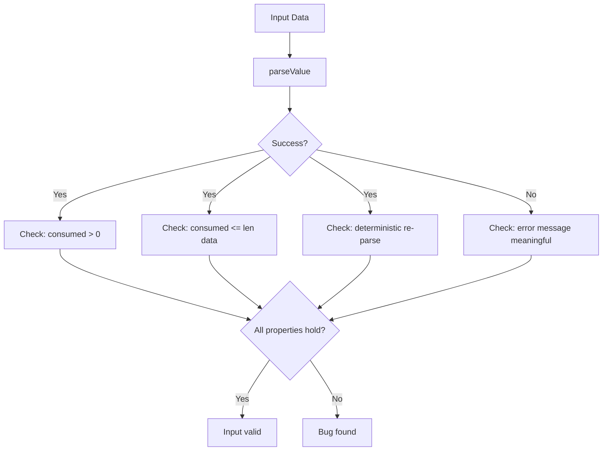

# Validating Advanced Parsing in Cilium Network Security

Author: [nawazdhandala](https://github.com/nawazdhandala)

Tags: Cilium, Network Security, Validation, Advanced Parsing, Fuzzing, Go

Description: Validate complex protocol parsing logic in Cilium L7 parsers using differential testing, property-based verification, protocol conformance suites, and corpus-driven fuzz testing.

---

## Introduction

Validating advanced parsing logic requires techniques beyond basic unit testing. When a parser handles nested structures, variable-length fields, and multi-step exchanges, the input space becomes too large for exhaustive testing. Instead, validation relies on property-based testing, differential testing against reference implementations, and protocol conformance verification.

The goal is to prove that the parser correctly handles the full range of valid inputs while safely rejecting all invalid inputs — without explicitly testing every possible byte sequence. Techniques like fuzz testing explore the input space automatically, while property-based tests verify invariants that must hold for any input.

This guide demonstrates advanced validation techniques for Cilium L7 parsers with practical code examples.

## Prerequisites

- Go 1.21+ with native fuzzing support
- Parser with advanced parsing features implemented
- Reference protocol implementation or specification
- `go-cmp` library for deep comparison
- Traffic capture (pcap) of real protocol exchanges

## Differential Testing Against Reference Implementation

Compare your parser's output against a known-correct implementation:

```go
import (
    "testing"

    reference "github.com/example/myprotocol-go" // Reference implementation
)

func TestDifferentialParsing(t *testing.T) {
    // Load test corpus from captured traffic
    corpus := loadTestCorpus(t, "testdata/captured_traffic/")

    for _, tc := range corpus {
        t.Run(tc.name, func(t *testing.T) {
            // Parse with our implementation
            ourResult, ourErr := parseMessage(tc.data)

            // Parse with reference implementation
            refResult, refErr := reference.Parse(tc.data)

            // Both should agree on validity
            if (ourErr == nil) != (refErr == nil) {
                t.Errorf("Validity mismatch:\n  ours: err=%v\n  ref:  err=%v\n  data: %x",
                    ourErr, refErr, tc.data)
            }

            // For valid messages, results must match
            if ourErr == nil && refErr == nil {
                if !reflect.DeepEqual(ourResult, refResult) {
                    t.Errorf("Parse result mismatch:\n  ours: %+v\n  ref:  %+v",
                        ourResult, refResult)
                }
            }
        })
    }
}

// loadTestCorpus reads test cases from pcap files
func loadTestCorpus(t *testing.T, dir string) []testCase {
    t.Helper()
    entries, err := os.ReadDir(dir)
    if err != nil {
        t.Skipf("No test corpus available: %v", err)
    }

    var cases []testCase
    for _, entry := range entries {
        data, err := os.ReadFile(filepath.Join(dir, entry.Name()))
        if err != nil {
            t.Fatalf("Failed to read %s: %v", entry.Name(), err)
        }
        cases = append(cases, testCase{name: entry.Name(), data: data})
    }
    return cases
}
```

## Property-Based Validation for Complex Structures

Define invariants that must hold for all parsed messages:

```go
func FuzzParseValueProperties(f *testing.F) {
    // Seed with known inputs
    f.Add([]byte{0x01, 0x00, 0x00, 0x00, 0x42})            // integer
    f.Add([]byte{0x02, 0x00, 0x05, 'h', 'e', 'l', 'l', 'o'}) // string
    f.Add([]byte{0x03, 0x00, 0x00, 0x00, 0x00})             // empty array

    f.Fuzz(func(t *testing.T, data []byte) {
        val, consumed, err := parseValue(data, 0, 0)

        // Property 1: If parsing succeeds, consumed bytes must be positive
        // and not exceed input length
        if err == nil {
            if consumed <= 0 {
                t.Errorf("Successful parse consumed %d bytes", consumed)
            }
            if consumed > len(data) {
                t.Errorf("Consumed %d bytes but only %d available", consumed, len(data))
            }
        }

        // Property 2: Re-parsing the same data produces the same result
        if err == nil {
            val2, consumed2, err2 := parseValue(data, 0, 0)
            if err2 != nil {
                t.Error("Determinism: second parse failed when first succeeded")
            }
            if consumed2 != consumed {
                t.Errorf("Determinism: consumed %d then %d", consumed, consumed2)
            }
            if !reflect.DeepEqual(val, val2) {
                t.Error("Determinism: different results for same input")
            }
        }

        // Property 3: Parsing never panics (implicit — fuzz framework catches panics)
    })
}
```



## Round-Trip Validation

If you have both parser and serializer, verify round-trip consistency:

```go
func TestRoundTrip(t *testing.T) {
    testMessages := []Message{
        {Command: 0x01, RequestID: 1, Body: []byte("hello")},
        {Command: 0x02, RequestID: 2, Body: []byte{}},
        {Command: 0x03, RequestID: 0xFFFFFFFF, Body: make([]byte, 1000)},
    }

    for _, msg := range testMessages {
        t.Run(fmt.Sprintf("cmd_%d", msg.Command), func(t *testing.T) {
            // Serialize
            wire, err := msg.Marshal()
            if err != nil {
                t.Fatalf("Marshal failed: %v", err)
            }

            // Parse back
            parsed, consumed, err := parseFullMessage(wire)
            if err != nil {
                t.Fatalf("Parse failed: %v", err)
            }
            if consumed != len(wire) {
                t.Errorf("Consumed %d of %d bytes", consumed, len(wire))
            }

            // Verify equality
            if parsed.Command != msg.Command {
                t.Errorf("Command: got %d, want %d", parsed.Command, msg.Command)
            }
            if parsed.RequestID != msg.RequestID {
                t.Errorf("RequestID: got %d, want %d", parsed.RequestID, msg.RequestID)
            }
            if !bytes.Equal(parsed.Body, msg.Body) {
                t.Errorf("Body mismatch: got %d bytes, want %d bytes",
                    len(parsed.Body), len(msg.Body))
            }
        })
    }
}
```

## Protocol Conformance Testing

Validate against the official protocol specification:

```go
func TestProtocolConformance(t *testing.T) {
    // Test vectors from the protocol specification
    specTests := []struct {
        name     string
        wire     []byte // Exact bytes from spec
        expected ParsedMessage
    }{
        {
            name: "spec example 1 - basic GET",
            wire: []byte{
                0x00, 0x00, 0x00, 0x08, // length: 8
                0x01,                     // command: GET
                0x00, 0x00, 0x00, 0x01,  // request ID: 1
                0x00, 0x03, 'f', 'o', 'o', // key: "foo" (this makes body = 8 bytes)
            },
            expected: ParsedMessage{
                Command:   0x01,
                RequestID: 1,
                Key:       "foo",
            },
        },
    }

    for _, tt := range specTests {
        t.Run(tt.name, func(t *testing.T) {
            result, _, err := parseFullMessage(tt.wire)
            if err != nil {
                t.Fatalf("Failed to parse spec example: %v", err)
            }
            if !reflect.DeepEqual(result, tt.expected) {
                t.Errorf("Spec conformance failure:\n  got:  %+v\n  want: %+v",
                    result, tt.expected)
            }
        })
    }
}
```

## Verification

Run the complete validation suite:

```bash
# Unit tests
go test ./proxylib/myprotocol/... -v -race -count=1

# Fuzz testing with property verification
go test ./proxylib/myprotocol/... -fuzz=FuzzParseValueProperties -fuzztime=2m

# Differential testing (requires reference implementation)
go test ./proxylib/myprotocol/... -run TestDifferentialParsing -v

# Conformance testing
go test ./proxylib/myprotocol/... -run TestProtocolConformance -v

# Coverage report
go test ./proxylib/myprotocol/... -coverprofile=cover.out
go tool cover -func=cover.out
```

## Troubleshooting

**Problem: Differential tests fail on edge cases**
Determine which implementation is correct by checking the protocol specification. The reference implementation may also have bugs.

**Problem: Fuzz testing finds inputs that crash the parser**
Each crashing input is saved in `testdata/fuzz/`. Convert these into permanent regression tests. Fix the crash, then verify the input no longer causes issues.

**Problem: Round-trip tests fail due to serialization differences**
Some protocols allow multiple valid serializations for the same logical message. Normalize both sides before comparison, or compare at the logical level rather than byte level.

**Problem: Conformance tests are hard to write without spec examples**
Use packet captures from known-good implementations as conformance test vectors. Tools like Wireshark can decode protocols and show expected field values.

## Conclusion

Validating advanced parsing requires techniques that scale beyond manual test case enumeration. Differential testing, property-based fuzzing, round-trip verification, and protocol conformance testing each address a different aspect of correctness. Together, they provide strong assurance that the parser handles the full range of protocol messages correctly and safely, making it suitable for deployment in Cilium's security-critical L7 proxy path.
