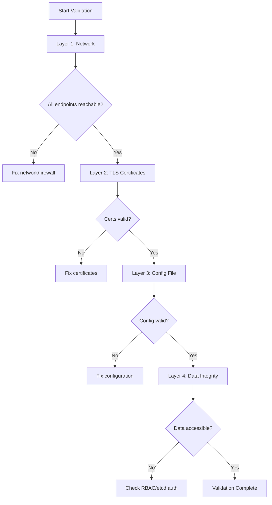

# Validating Calicoctl etcd Configuration

Author: [nawazdhandala](https://github.com/nawazdhandala)

Tags: Calico, etcd, Validation, Kubernetes, Calicoctl

Description: Learn how to validate your calicoctl etcd datastore configuration with systematic checks covering connectivity, TLS certificates, data integrity, and performance to ensure reliable operation.

---

## Introduction

Validating calicoctl etcd configuration goes beyond simply confirming that `calicoctl get nodes` returns output. A thorough validation checks every layer of the connection -- from network reachability and TLS certificate validity to data consistency and performance characteristics.

Skipping validation often results in configurations that work initially but fail under load, during certificate rotation, or after etcd cluster maintenance. Production environments need proactive validation to catch issues before they impact pod networking.

This guide provides a comprehensive validation checklist and automation scripts for calicoctl etcd configurations, suitable for both initial setup verification and ongoing configuration audits.

## Prerequisites

- calicoctl v3.27 or later configured with etcd datastore
- etcdctl v3 for direct etcd verification
- openssl for certificate validation
- Access to the etcd cluster endpoints
- Bash shell environment

## Layer 1: Network Connectivity Validation

Validate that calicoctl can reach all etcd endpoints at the network level:

```bash
#!/bin/bash
# validate-etcd-network.sh
# Validates network connectivity to all etcd endpoints

set -euo pipefail

ETCD_ENDPOINTS="${ETCD_ENDPOINTS:-https://127.0.0.1:2379}"

IFS=',' read -ra ENDPOINTS <<< "$ETCD_ENDPOINTS"
for endpoint in "${ENDPOINTS[@]}"; do
    # Extract host and port
    host=$(echo "$endpoint" | sed 's|https\?://||' | cut -d: -f1)
    port=$(echo "$endpoint" | sed 's|https\?://||' | cut -d: -f2)

    echo "Testing connectivity to ${host}:${port}..."
    if nc -z -w 5 "$host" "$port" 2>/dev/null; then
        echo "  OK: ${host}:${port} is reachable"
    else
        echo "  FAIL: ${host}:${port} is not reachable"
    fi
done
```

## Layer 2: TLS Certificate Validation

Validate all aspects of the TLS certificate chain:

```bash
#!/bin/bash
# validate-etcd-certs.sh
# Comprehensive TLS certificate validation

set -euo pipefail

CERT_DIR="${CERT_DIR:-/etc/calico/certs}"
CA_FILE="${CERT_DIR}/ca.pem"
CERT_FILE="${CERT_DIR}/cert.pem"
KEY_FILE="${CERT_DIR}/key.pem"

echo "=== Certificate File Checks ==="
for f in "$CA_FILE" "$CERT_FILE" "$KEY_FILE"; do
    if [ -f "$f" ] && [ -r "$f" ]; then
        echo "OK: $f exists and is readable"
    else
        echo "FAIL: $f is missing or not readable"
    fi
done

echo ""
echo "=== Certificate Chain Validation ==="
if openssl verify -CAfile "$CA_FILE" "$CERT_FILE" 2>/dev/null; then
    echo "OK: Client certificate is signed by the CA"
else
    echo "FAIL: Client certificate is NOT signed by the CA"
fi

echo ""
echo "=== Certificate Expiry Check ==="
for cert in "$CA_FILE" "$CERT_FILE"; do
    expiry=$(openssl x509 -in "$cert" -noout -enddate | cut -d= -f2)
    subject=$(openssl x509 -in "$cert" -noout -subject)
    echo "Certificate: $subject"
    echo "  Expires: $expiry"

    # Check if expiring within 30 days
    if openssl x509 -in "$cert" -noout -checkend 2592000 > /dev/null 2>&1; then
        echo "  Status: Valid (more than 30 days remaining)"
    else
        echo "  Status: WARNING - Expires within 30 days!"
    fi
done

echo ""
echo "=== Key-Certificate Match ==="
cert_modulus=$(openssl x509 -in "$CERT_FILE" -noout -modulus | md5sum)
key_modulus=$(openssl rsa -in "$KEY_FILE" -noout -modulus 2>/dev/null | md5sum)
if [ "$cert_modulus" = "$key_modulus" ]; then
    echo "OK: Private key matches certificate"
else
    echo "FAIL: Private key does NOT match certificate"
fi
```

## Layer 3: Calicoctl Configuration Validation

Validate the calicoctl configuration file syntax and parameters:

```bash
#!/bin/bash
# validate-calicoctl-config.sh
# Validates calicoctl configuration file

set -euo pipefail

CONFIG_FILE="${1:-/etc/calicoctl/calicoctl.cfg}"

echo "=== Configuration File Validation ==="

if [ ! -f "$CONFIG_FILE" ]; then
    echo "FAIL: Configuration file not found: $CONFIG_FILE"
    exit 1
fi

# Check file permissions (should be 600)
perms=$(stat -c '%a' "$CONFIG_FILE" 2>/dev/null || stat -f '%A' "$CONFIG_FILE")
if [ "$perms" = "600" ]; then
    echo "OK: File permissions are 600 (secure)"
else
    echo "WARNING: File permissions are $perms (should be 600)"
fi

# Validate YAML syntax
if python3 -c "import yaml; yaml.safe_load(open('$CONFIG_FILE'))" 2>/dev/null; then
    echo "OK: YAML syntax is valid"
else
    echo "FAIL: YAML syntax is invalid"
fi

# Check required fields
if grep -q "datastoreType.*etcdv3" "$CONFIG_FILE"; then
    echo "OK: datastoreType is set to etcdv3"
else
    echo "FAIL: datastoreType is not set to etcdv3"
fi

if grep -q "etcdEndpoints" "$CONFIG_FILE"; then
    echo "OK: etcdEndpoints is configured"
else
    echo "FAIL: etcdEndpoints is not configured"
fi
```

## Layer 4: Data Integrity Validation

Confirm that Calico data in etcd is consistent and accessible:

```bash
#!/bin/bash
# validate-calico-data.sh
# Validates Calico data integrity in etcd

set -euo pipefail

export DATASTORE_TYPE=etcdv3

echo "=== Calico Data Validation ==="

# Check cluster information
echo "Checking ClusterInformation..."
if calicoctl get clusterinformation default -o yaml > /dev/null 2>&1; then
    echo "OK: ClusterInformation is accessible"
else
    echo "FAIL: Cannot read ClusterInformation"
fi

# Check nodes
echo "Checking Nodes..."
NODE_COUNT=$(calicoctl get nodes -o json 2>/dev/null | python3 -c "import sys,json; print(len(json.load(sys.stdin)['items']))")
echo "  Found $NODE_COUNT Calico nodes"

# Check IP pools
echo "Checking IPPools..."
POOL_COUNT=$(calicoctl get ippools -o json 2>/dev/null | python3 -c "import sys,json; print(len(json.load(sys.stdin)['items']))")
if [ "$POOL_COUNT" -gt 0 ]; then
    echo "OK: Found $POOL_COUNT IP pools"
    calicoctl get ippools -o wide
else
    echo "WARNING: No IP pools found"
fi

# Check Felix configuration
echo "Checking FelixConfiguration..."
if calicoctl get felixconfiguration default -o yaml > /dev/null 2>&1; then
    echo "OK: Default FelixConfiguration exists"
else
    echo "WARNING: No default FelixConfiguration found"
fi
```



## Complete Validation Script

Combine all layers into a single validation runner:

```bash
#!/bin/bash
# validate-all.sh
# Runs all calicoctl etcd validation checks

set -euo pipefail

PASS=0
FAIL=0
WARN=0

check() {
    local description="$1"
    local command="$2"
    if eval "$command" > /dev/null 2>&1; then
        echo "PASS: $description"
        PASS=$((PASS + 1))
    else
        echo "FAIL: $description"
        FAIL=$((FAIL + 1))
    fi
}

export DATASTORE_TYPE=etcdv3

check "calicoctl can list nodes" "calicoctl get nodes"
check "calicoctl can read cluster info" "calicoctl get clusterinformation default"
check "calicoctl can list IP pools" "calicoctl get ippools"
check "calicoctl can list policies" "calicoctl get globalnetworkpolicies"
check "calicoctl can list Felix config" "calicoctl get felixconfiguration default"
check "calicoctl version matches cluster" "calicoctl version"

echo ""
echo "=== Validation Summary ==="
echo "Passed: $PASS"
echo "Failed: $FAIL"
echo ""

if [ "$FAIL" -gt 0 ]; then
    echo "RESULT: VALIDATION FAILED"
    exit 1
else
    echo "RESULT: ALL CHECKS PASSED"
    exit 0
fi
```

## Verification

```bash
# Run the complete validation suite
chmod +x validate-all.sh
./validate-all.sh

# Verify etcd cluster health independently
etcdctl --endpoints=${ETCD_ENDPOINTS} \
  --cert=/etc/calico/certs/cert.pem \
  --key=/etc/calico/certs/key.pem \
  --cacert=/etc/calico/certs/ca.pem \
  endpoint health --cluster
```

## Troubleshooting

- **Validation passes but calicoctl operations are slow**: Check etcd database size with `etcdctl endpoint status`. A large database may need compaction and defragmentation.
- **Intermittent validation failures**: One etcd member may be unhealthy. Run `etcdctl endpoint health --cluster` to identify the failing member.
- **Certificate validation fails but calicoctl works**: The CA file may contain multiple certificates. Ensure you are validating against the correct CA in the chain.
- **Data integrity check finds missing resources**: Calico may not have fully initialized. Check that calico-node pods are running on all nodes.

## Conclusion

Validating calicoctl etcd configuration across multiple layers -- network, TLS, configuration, and data integrity -- provides confidence that your Calico management plane is functioning correctly. Automate these validation checks as part of your deployment pipeline and run them regularly as health checks. Early detection of configuration drift or certificate expiry prevents unexpected outages in your network policy management.
