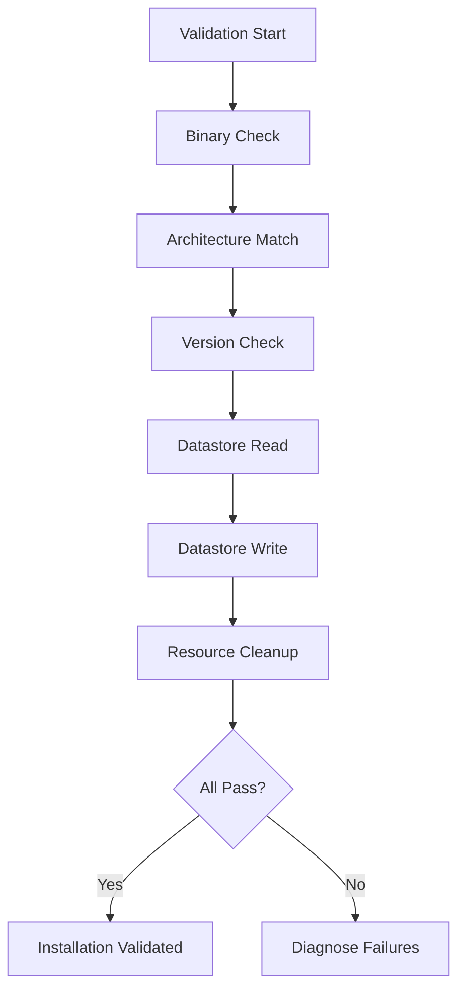

# How to Validate Calicoctl Installation

Author: [nawazdhandala](https://github.com/nawazdhandala)

Tags: Calico, calicoctl, Validation, Installation, Testing

Description: A guide to validating that calicoctl is correctly installed and fully functional, covering binary verification, datastore connectivity testing, and operational readiness checks.

---

## Introduction

Installing calicoctl is only half the job. Validating that it works correctly against your specific Calico cluster ensures that operators can rely on it when they need to manage network policies, inspect endpoints, or troubleshoot connectivity issues. A validated installation means the binary runs, connects to the datastore, can read and write resources, and matches the cluster version.

This guide provides a comprehensive validation procedure that goes beyond checking the version number. We validate binary integrity, datastore read and write operations, resource compatibility, and command-line completion setup.

Running validation after every installation or upgrade prevents the frustrating experience of discovering that calicoctl does not work during an incident when you need it most.

## Prerequisites

- A system with calicoctl installed
- A running Calico cluster accessible from the system
- Network connectivity to the Calico datastore
- Appropriate RBAC permissions for the validation operations

## Binary Validation

Verify the binary is genuine, correct architecture, and correct version.

```bash
#!/bin/bash
# validate-binary.sh
# Validate calicoctl binary

echo "=== Binary Validation ==="

# Check binary exists and is executable
BINARY=$(which calicoctl 2>/dev/null)
if [ -z "${BINARY}" ]; then
  echo "FAIL: calicoctl not found in PATH"
  exit 1
fi
echo "Location: ${BINARY}"

# Check file type and architecture
FILE_INFO=$(file ${BINARY})
echo "File type: ${FILE_INFO}"

SYSTEM_ARCH=$(uname -m)
case ${SYSTEM_ARCH} in
  x86_64)
    echo "${FILE_INFO}" | grep -q "x86-64" && echo "Architecture: MATCH" || echo "Architecture: MISMATCH"
    ;;
  aarch64)
    echo "${FILE_INFO}" | grep -q "aarch64\|ARM" && echo "Architecture: MATCH" || echo "Architecture: MISMATCH"
    ;;
esac

# Check version output
echo ""
echo "Version information:"
calicoctl version 2>&1
VERSION_EXIT=$?
if [ ${VERSION_EXIT} -eq 0 ]; then
  echo "Version command: PASS"
else
  echo "Version command: FAIL (exit code: ${VERSION_EXIT})"
fi
```

## Datastore Connectivity Validation

```bash
#!/bin/bash
# validate-datastore.sh
# Validate calicoctl can connect to the Calico datastore

echo "=== Datastore Connectivity Validation ==="

# Test 1: Read nodes
echo -n "Read nodes: "
calicoctl get nodes -o name 2>/dev/null
if [ $? -eq 0 ]; then
  echo "  Status: PASS"
else
  echo "  Status: FAIL"
fi

# Test 2: Read IP pools
echo ""
echo -n "Read IP pools: "
calicoctl get ippools -o wide 2>/dev/null
if [ $? -eq 0 ]; then
  echo "  Status: PASS"
else
  echo "  Status: FAIL"
fi

# Test 3: Read cluster information
echo ""
echo "Cluster information:"
calicoctl get clusterinformation -o yaml 2>/dev/null
if [ $? -eq 0 ]; then
  echo "  Status: PASS"
else
  echo "  Status: FAIL"
fi

# Test 4: Read Felix configuration
echo ""
echo "Felix configuration:"
calicoctl get felixconfiguration default -o yaml 2>/dev/null
if [ $? -eq 0 ]; then
  echo "  Status: PASS"
else
  echo "  Status: FAIL"
fi
```

## Write Operation Validation

Validate that calicoctl can create and delete resources (use test resources only).

```bash
#!/bin/bash
# validate-write-ops.sh
# Validate calicoctl write operations

echo "=== Write Operation Validation ==="

# Create a test global network set (safe, non-disruptive resource)
echo -n "Create test resource: "
calicoctl apply -f - << 'EOF' 2>/dev/null
apiVersion: projectcalico.org/v3
kind: GlobalNetworkSet
metadata:
  name: calicoctl-validation-test
  labels:
    purpose: installation-validation
spec:
  nets:
    - 192.0.2.0/24
EOF
if [ $? -eq 0 ]; then
  echo "PASS"
else
  echo "FAIL"
fi

# Read the test resource back
echo -n "Read test resource: "
calicoctl get globalnetworkset calicoctl-validation-test -o yaml 2>/dev/null | grep -q "calicoctl-validation-test"
if [ $? -eq 0 ]; then
  echo "PASS"
else
  echo "FAIL"
fi

# Delete the test resource
echo -n "Delete test resource: "
calicoctl delete globalnetworkset calicoctl-validation-test 2>/dev/null
if [ $? -eq 0 ]; then
  echo "PASS"
else
  echo "FAIL"
fi

# Verify deletion
echo -n "Verify deletion: "
calicoctl get globalnetworkset calicoctl-validation-test 2>/dev/null
if [ $? -ne 0 ]; then
  echo "PASS (resource gone)"
else
  echo "FAIL (resource still exists)"
fi
```



## Version Compatibility Validation

Verify calicoctl version matches the cluster.

```bash
#!/bin/bash
# validate-version-compat.sh
echo "=== Version Compatibility ==="

# Get calicoctl version
CTL_VERSION=$(calicoctl version 2>/dev/null | grep "Client Version" | awk '{print $NF}')
echo "calicoctl version: ${CTL_VERSION}"

# Get cluster version
CLUSTER_VERSION=$(calicoctl version 2>/dev/null | grep "Cluster Version" | awk '{print $NF}')
echo "Cluster version: ${CLUSTER_VERSION}"

# Compare major.minor versions
CTL_MAJOR_MINOR=$(echo ${CTL_VERSION} | grep -oP 'v?\d+\.\d+')
CLUSTER_MAJOR_MINOR=$(echo ${CLUSTER_VERSION} | grep -oP 'v?\d+\.\d+')

if [ "${CTL_MAJOR_MINOR}" = "${CLUSTER_MAJOR_MINOR}" ]; then
  echo "Version compatibility: PASS (major.minor match)"
else
  echo "Version compatibility: WARNING (${CTL_MAJOR_MINOR} vs ${CLUSTER_MAJOR_MINOR})"
  echo "Recommend upgrading calicoctl to match cluster version"
fi
```

## Verification

Run the complete validation suite:

```bash
#!/bin/bash
# full-validation.sh
echo "==============================="
echo "Calicoctl Full Validation Suite"
echo "==============================="
echo "Date: $(date)"
echo "Host: $(hostname)"
echo ""

PASS=0
FAIL=0

check() {
  local desc="$1"; local cmd="$2"
  echo -n "${desc}: "
  if eval "${cmd}" > /dev/null 2>&1; then
    echo "PASS"; ((PASS++))
  else
    echo "FAIL"; ((FAIL++))
  fi
}

check "Binary exists" "which calicoctl"
check "Version command" "calicoctl version"
check "Read nodes" "calicoctl get nodes"
check "Read IP pools" "calicoctl get ippools"
check "Read Felix config" "calicoctl get felixconfiguration"
check "Write resource" "calicoctl apply -f - <<< '{"apiVersion":"projectcalico.org/v3","kind":"GlobalNetworkSet","metadata":{"name":"val-test"},"spec":{"nets":["192.0.2.0/24"]}}'"
check "Delete resource" "calicoctl delete globalnetworkset val-test"

echo ""
echo "Results: ${PASS} passed, ${FAIL} failed"
```

## Troubleshooting

- **Binary validation passes but datastore fails**: Check the calicoctl configuration file. Verify KUBECONFIG or etcd connection settings are correct.
- **Read works but write fails**: Check RBAC permissions. The service account or user may have read-only access to Calico resources.
- **Version mismatch warning**: Download the calicoctl version matching your cluster. Minor version differences are usually compatible; major version differences are not.
- **Validation passes on one machine but fails on another**: Compare configuration files and environment variables between the machines. Network access to the datastore may differ.

## Conclusion

Validating calicoctl installation provides confidence that the tool will work when needed. By checking binary integrity, datastore connectivity, read and write operations, and version compatibility, you ensure a fully functional installation. Run this validation suite after every installation, upgrade, or cluster migration to maintain a reliable calicoctl setup.
