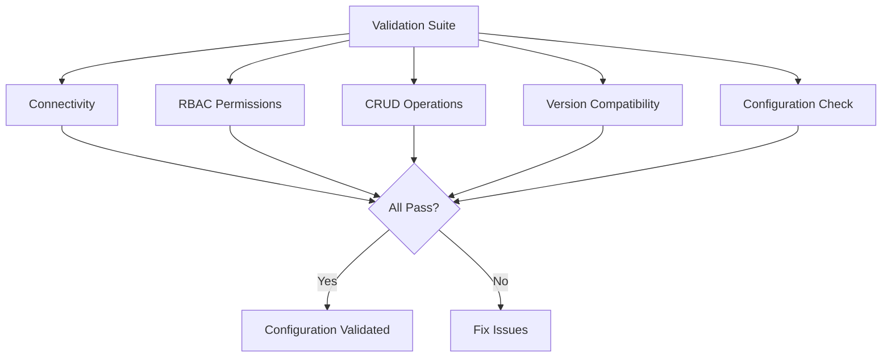

# How to Validate Calicoctl Kubernetes API Datastore Configuration

Author: [nawazdhandala](https://github.com/nawazdhandala)

Tags: Calico, Calicoctl, Kubernetes, Datastore, Validation

Description: A comprehensive validation guide for calicoctl Kubernetes API datastore configuration, covering connectivity testing, RBAC verification, resource access validation, and operational readiness checks.

---

## Introduction

Validating the calicoctl Kubernetes API datastore configuration goes beyond checking that `calicoctl get nodes` returns results. A thorough validation ensures that all Calico resource types are accessible, RBAC permissions are correct for the intended operations, and the configuration works reliably under various conditions.

This guide provides a comprehensive validation suite that checks every aspect of the Kubernetes API datastore configuration. We validate connectivity, authentication, authorization for each resource type, read and write operations, and configuration consistency.

Running this validation after any configuration change, cluster upgrade, or credential rotation ensures that calicoctl remains fully functional.

## Prerequisites

- calicoctl configured to use Kubernetes API datastore
- A running Calico cluster
- Understanding of which operations calicoctl needs to perform in your environment
- Access to run calicoctl commands

## Connectivity Validation

Verify that calicoctl can establish and maintain a connection to the Kubernetes API.

```bash
#!/bin/bash
# validate-connectivity.sh
# Validate Kubernetes API connectivity for calicoctl

echo "=== Connectivity Validation ==="

# Test 1: Basic connectivity
echo -n "Basic API connectivity: "
calicoctl get nodes -o name > /dev/null 2>&1 && echo "PASS" || echo "FAIL"

# Test 2: Multiple rapid requests (connection stability)
echo -n "Connection stability (10 requests): "
FAILURES=0
for i in $(seq 1 10); do
  calicoctl get nodes -o name > /dev/null 2>&1 || ((FAILURES++))
done
if [ ${FAILURES} -eq 0 ]; then
  echo "PASS (0 failures)"
else
  echo "FAIL (${FAILURES}/10 failures)"
fi

# Test 3: Response time
echo -n "Response time: "
START=$(date +%s%N)
calicoctl get nodes -o name > /dev/null 2>&1
END=$(date +%s%N)
MS=$(( (END - START) / 1000000 ))
if [ ${MS} -lt 5000 ]; then
  echo "PASS (${MS}ms)"
else
  echo "SLOW (${MS}ms)"
fi
```

## RBAC Validation

Validate that the configured credentials have appropriate RBAC permissions.

```bash
#!/bin/bash
# validate-rbac.sh
# Validate RBAC permissions for all Calico resource types

echo "=== RBAC Validation ==="

CALICO_RESOURCES=(
  "nodes"
  "globalnetworkpolicies"
  "globalnetworksets"
  "networkpolicies"
  "networksets"
  "ippools"
  "ipamblocks"
  "hostendpoints"
  "workloadendpoints"
  "felixconfigurations"
  "bgpconfigurations"
  "bgppeers"
  "clusterinformations"
  "profiles"
)

PASS=0
FAIL=0

for resource in "${CALICO_RESOURCES[@]}"; do
  echo -n "  ${resource}: "
  if calicoctl get ${resource} > /dev/null 2>&1; then
    echo "READ OK"
    ((PASS++))
  else
    echo "READ FAIL"
    ((FAIL++))
  fi
done

echo ""
echo "Results: ${PASS} accessible, ${FAIL} inaccessible"
```

## Resource CRUD Validation

Test create, read, update, and delete operations on a safe test resource.

```bash
#!/bin/bash
# validate-crud.sh
# Validate CRUD operations on Calico resources

echo "=== CRUD Validation ==="

TEST_RESOURCE="validation-test-$(date +%s)"

# CREATE
echo -n "Create: "
calicoctl apply -f - << EOF 2>/dev/null
apiVersion: projectcalico.org/v3
kind: GlobalNetworkSet
metadata:
  name: ${TEST_RESOURCE}
  labels:
    purpose: validation
spec:
  nets:
    - 192.0.2.0/24
EOF
[ $? -eq 0 ] && echo "PASS" || echo "FAIL"

# READ
echo -n "Read: "
calicoctl get globalnetworkset ${TEST_RESOURCE} -o yaml > /dev/null 2>&1
[ $? -eq 0 ] && echo "PASS" || echo "FAIL"

# UPDATE
echo -n "Update: "
calicoctl apply -f - << EOF 2>/dev/null
apiVersion: projectcalico.org/v3
kind: GlobalNetworkSet
metadata:
  name: ${TEST_RESOURCE}
  labels:
    purpose: validation
    updated: "true"
spec:
  nets:
    - 192.0.2.0/24
    - 198.51.100.0/24
EOF
[ $? -eq 0 ] && echo "PASS" || echo "FAIL"

# Verify update
echo -n "Verify update: "
calicoctl get globalnetworkset ${TEST_RESOURCE} -o yaml 2>/dev/null | grep -q "198.51.100"
[ $? -eq 0 ] && echo "PASS" || echo "FAIL"

# DELETE
echo -n "Delete: "
calicoctl delete globalnetworkset ${TEST_RESOURCE} 2>/dev/null
[ $? -eq 0 ] && echo "PASS" || echo "FAIL"

# Verify deletion
echo -n "Verify deletion: "
calicoctl get globalnetworkset ${TEST_RESOURCE} 2>/dev/null
[ $? -ne 0 ] && echo "PASS (gone)" || echo "FAIL (still exists)"
```



## Version Compatibility Validation

Verify that the calicoctl version is compatible with the cluster.

```bash
#!/bin/bash
# validate-version.sh
echo "=== Version Compatibility Validation ==="

# Get versions
CTL_VERSION=$(calicoctl version 2>/dev/null | grep "Client Version" | awk '{print $NF}')
CLUSTER_VERSION=$(calicoctl version 2>/dev/null | grep "Cluster Version" | awk '{print $NF}')

echo "calicoctl: ${CTL_VERSION}"
echo "Cluster: ${CLUSTER_VERSION}"

# Compare major.minor
CTL_MM=$(echo ${CTL_VERSION} | grep -oP 'v?\d+\.\d+')
CLU_MM=$(echo ${CLUSTER_VERSION} | grep -oP 'v?\d+\.\d+')

if [ "${CTL_MM}" = "${CLU_MM}" ]; then
  echo "Compatibility: PASS (versions match)"
elif [ -z "${CLUSTER_VERSION}" ]; then
  echo "Compatibility: WARNING (cannot determine cluster version)"
else
  echo "Compatibility: WARNING (version mismatch: ${CTL_MM} vs ${CLU_MM})"
fi
```

## Configuration File Validation

Validate the configuration file syntax and content.

```bash
#!/bin/bash
# validate-config.sh
echo "=== Configuration File Validation ==="

CONFIG="/etc/calico/calicoctl.cfg"

# Check file exists
echo -n "Config file exists: "
[ -f "${CONFIG}" ] && echo "PASS" || { echo "FAIL"; exit 1; }

# Check required fields
echo -n "apiVersion set: "
grep -q "apiVersion: projectcalico.org/v3" "${CONFIG}" && echo "PASS" || echo "FAIL"

echo -n "kind set: "
grep -q "kind: CalicoAPIConfig" "${CONFIG}" && echo "PASS" || echo "FAIL"

echo -n "datastoreType set: "
grep -q 'datastoreType.*kubernetes' "${CONFIG}" && echo "PASS" || echo "FAIL"

echo -n "kubeconfig path set: "
KUBECONFIG_PATH=$(grep kubeconfig "${CONFIG}" | awk '{print $2}' | tr -d '"')
if [ -n "${KUBECONFIG_PATH}" ]; then
  echo "PASS (${KUBECONFIG_PATH})"
  echo -n "kubeconfig file exists: "
  [ -f "${KUBECONFIG_PATH}" ] && echo "PASS" || echo "FAIL"
else
  echo "FAIL"
fi

# Check file permissions
echo -n "Config permissions: "
PERMS=$(stat -c '%a' "${CONFIG}" 2>/dev/null || stat -f '%Lp' "${CONFIG}")
echo "${PERMS}"
```

## Complete Validation Suite

Run all validations in sequence.

```bash
#!/bin/bash
# full-datastore-validation.sh
echo "=============================================="
echo "Calicoctl K8s Datastore Full Validation Suite"
echo "=============================================="
echo "Date: $(date)"
echo "Host: $(hostname)"
echo ""

TOTAL_PASS=0
TOTAL_FAIL=0

check() {
  local desc="$1"; local cmd="$2"
  echo -n "  ${desc}: "
  if eval "${cmd}" > /dev/null 2>&1; then
    echo "PASS"; ((TOTAL_PASS++))
  else
    echo "FAIL"; ((TOTAL_FAIL++))
  fi
}

echo "--- Configuration ---"
check "Config file exists" "test -f /etc/calico/calicoctl.cfg"
check "Kubeconfig exists" "test -f $(grep kubeconfig /etc/calico/calicoctl.cfg 2>/dev/null | awk '{print $2}' | tr -d '"')"

echo ""
echo "--- Connectivity ---"
check "API reachable" "calicoctl get nodes -o name"
check "Version command" "calicoctl version"

echo ""
echo "--- Resource Access ---"
check "Nodes" "calicoctl get nodes"
check "IP Pools" "calicoctl get ippools"
check "Global Policies" "calicoctl get globalnetworkpolicies"
check "Felix Config" "calicoctl get felixconfiguration"
check "BGP Config" "calicoctl get bgpconfiguration"

echo ""
echo "--- Write Operations ---"
check "Create test resource" "calicoctl apply -f - <<< '{"apiVersion":"projectcalico.org/v3","kind":"GlobalNetworkSet","metadata":{"name":"ds-val-test"},"spec":{"nets":["192.0.2.0/24"]}}'"
check "Delete test resource" "calicoctl delete globalnetworkset ds-val-test"

echo ""
echo "=============================================="
echo "Total: ${TOTAL_PASS} passed, ${TOTAL_FAIL} failed"
echo "=============================================="

exit ${TOTAL_FAIL}
```

## Verification

Run the complete validation suite and review the results:

```bash
# Execute the full validation
bash full-datastore-validation.sh

# If any tests fail, run the diagnostic script to identify the root cause
# bash diagnose-k8s-datastore.sh
```

## Troubleshooting

- **Connectivity tests pass but CRUD fails**: RBAC permissions may allow read but not write. Check the ClusterRole for missing verbs (create, update, delete).
- **All tests pass but slow responses**: API server may be under load. Check API server metrics and consider using a dedicated service account that avoids unnecessary audit logging.
- **Tests pass for some resource types but not others**: Check the ClusterRole resource list. Ensure all Calico CRD resources are included.
- **Validation passes today but fails tomorrow**: Token expiration or certificate rotation may cause future failures. Use long-lived service account tokens or automate credential refresh.

## Conclusion

Comprehensive validation of the calicoctl Kubernetes API datastore configuration ensures that the tool is ready for both routine operations and incident response. By validating connectivity, RBAC, CRUD operations, version compatibility, and configuration correctness, you build confidence that calicoctl will work when needed. Run this validation suite after any cluster upgrade, credential rotation, or calicoctl configuration change.
