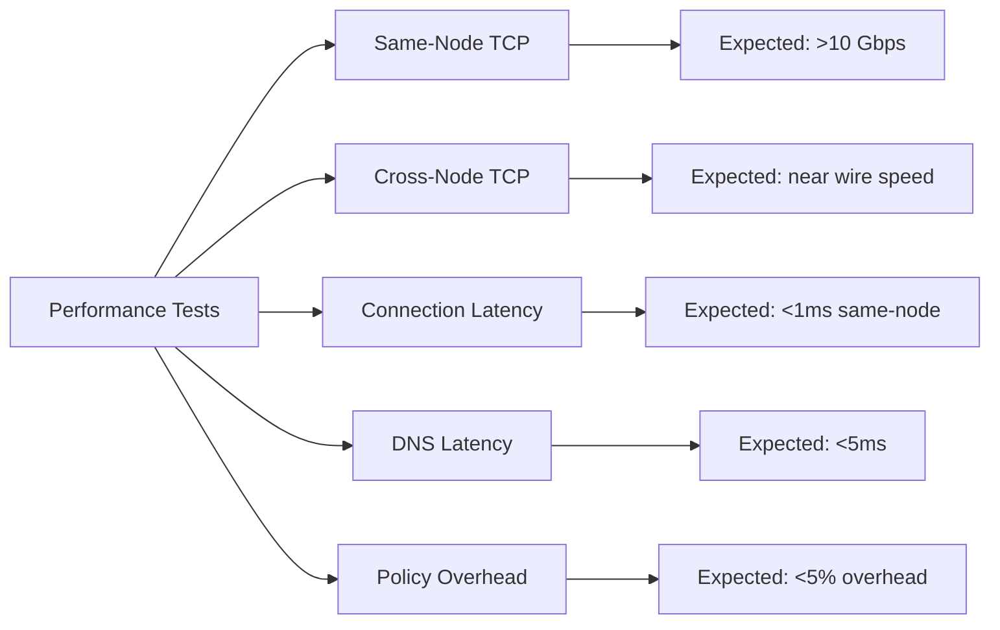

# How to Validate Performance in Cilium

Author: [nawazdhandala](https://github.com/nawazdhandala)

Tags: Cilium, Performance, Validation, Benchmarking, Kubernetes

Description: Learn how to validate Cilium network performance using benchmarking tools, metric analysis, and systematic testing to ensure your cluster meets throughput and latency requirements.

---

## Introduction

Performance validation ensures that your Cilium deployment meets the throughput, latency, and resource consumption requirements of your workloads. Unlike ad-hoc testing, systematic validation provides reproducible results that you can compare across upgrades, configuration changes, and cluster scaling events.

A proper validation suite tests multiple dimensions: same-node and cross-node throughput, connection setup latency, DNS resolution time, and policy evaluation overhead. Each test should be run with and without specific features enabled to understand their individual performance impact.

This guide provides a complete performance validation methodology for Cilium, with ready-to-use test scripts and analysis tools.

## Prerequisites

- Kubernetes cluster with Cilium installed
- iperf3 and netperf images available
- Prometheus for metric collection
- kubectl access to create test workloads
- Multiple nodes for cross-node testing

## Setting Up the Test Environment

Create a dedicated namespace with test workloads:

```bash
# Create test namespace
kubectl create namespace perf-test

# Deploy server pods on specific nodes for controlled testing
kubectl -n perf-test run server-node1 --image=networkstatic/iperf3 \
  --port=5201 --labels="app=iperf-server,node=node1" \
  --overrides='{"spec":{"nodeSelector":{"kubernetes.io/hostname":"'$(kubectl get nodes -o jsonpath='{.items[0].metadata.name}')'"}}}'  -- -s

kubectl -n perf-test expose pod server-node1 --port=5201

# Deploy a server on a second node
NODE2=$(kubectl get nodes -o jsonpath='{.items[1].metadata.name}')
kubectl -n perf-test run server-node2 --image=networkstatic/iperf3 \
  --port=5201 --labels="app=iperf-server,node=node2" \
  --overrides='{"spec":{"nodeSelector":{"kubernetes.io/hostname":"'$NODE2'"}}}'  -- -s

kubectl -n perf-test expose pod server-node2 --port=5201

# Wait for pods to be ready
kubectl -n perf-test wait --for=condition=Ready pod --all --timeout=60s
```

## TCP Throughput Validation

```bash
# Same-node throughput (pod to pod on the same node)
NODE1=$(kubectl get nodes -o jsonpath='{.items[0].metadata.name}')
kubectl -n perf-test run tcp-same-node --image=networkstatic/iperf3 \
  --rm -it --restart=Never \
  --overrides='{"spec":{"nodeSelector":{"kubernetes.io/hostname":"'$NODE1'"}}}' -- \
  -c server-node1.perf-test -t 30 -P 4 --json

# Cross-node throughput
kubectl -n perf-test run tcp-cross-node --image=networkstatic/iperf3 \
  --rm -it --restart=Never \
  --overrides='{"spec":{"nodeSelector":{"kubernetes.io/hostname":"'$NODE1'"}}}' -- \
  -c server-node2.perf-test -t 30 -P 4 --json
```

Expected results analysis:

```bash
# Parse iperf3 JSON output
# Save the output from the commands above, then:
cat iperf3-result.json | python3 -c "
import json, sys
data = json.load(sys.stdin)
end = data.get('end', {})
sum_sent = end.get('sum_sent', {})
sum_received = end.get('sum_received', {})
print(f'Sent: {sum_sent.get(\"bits_per_second\",0)/1e9:.2f} Gbps')
print(f'Received: {sum_received.get(\"bits_per_second\",0)/1e9:.2f} Gbps')
print(f'Retransmits: {sum_sent.get(\"retransmits\",0)}')
"
```



## Connection Latency Validation

Measure the time to establish new connections:

```bash
# Use curl to measure connection time
kubectl -n perf-test run latency-test --image=curlimages/curl --rm -it --restart=Never -- \
  sh -c '
  for i in $(seq 1 100); do
    curl -s -o /dev/null -w "%{time_connect}\n" http://server-node1.perf-test:5201/
  done
  ' | python3 -c "
import sys
times = [float(line.strip()) for line in sys.stdin if line.strip()]
avg = sum(times) / len(times) * 1000  # Convert to ms
p50 = sorted(times)[len(times)//2] * 1000
p99 = sorted(times)[int(len(times)*0.99)] * 1000
print(f'Connection latency (ms):')
print(f'  Average: {avg:.2f}')
print(f'  P50: {p50:.2f}')
print(f'  P99: {p99:.2f}')
"
```

## DNS Resolution Validation

```bash
# Measure DNS resolution time
kubectl -n perf-test run dns-test --image=busybox --rm -it --restart=Never -- sh -c '
for i in $(seq 1 50); do
  START=$(date +%s%N)
  nslookup server-node1.perf-test.svc.cluster.local > /dev/null 2>&1
  END=$(date +%s%N)
  echo $(( (END - START) / 1000000 ))
done
' | python3 -c "
import sys
times = [int(line.strip()) for line in sys.stdin if line.strip().isdigit()]
if times:
    avg = sum(times) / len(times)
    p99 = sorted(times)[int(len(times)*0.99)]
    print(f'DNS resolution (ms):')
    print(f'  Average: {avg:.1f}')
    print(f'  P99: {p99}')
"
```

## Policy Overhead Validation

Compare throughput with and without policies:

```bash
# Baseline: no policies
echo "=== Without policies ==="
kubectl -n perf-test run baseline-test --image=networkstatic/iperf3 \
  --rm -it --restart=Never -- -c server-node1.perf-test -t 15 -P 4

# Apply a policy
cat <<EOF | kubectl apply -f -
apiVersion: cilium.io/v2
kind: CiliumNetworkPolicy
metadata:
  name: allow-iperf
  namespace: perf-test
spec:
  endpointSelector:
    matchLabels:
      app: iperf-server
  ingress:
    - fromEndpoints:
        - matchLabels: {}
      toPorts:
        - ports:
            - port: "5201"
              protocol: TCP
EOF

# Wait for policy to be applied
sleep 10

# With policy
echo "=== With policy ==="
kubectl -n perf-test run policy-test --image=networkstatic/iperf3 \
  --rm -it --restart=Never -- -c server-node1.perf-test -t 15 -P 4

# Clean up
kubectl -n perf-test delete cnp allow-iperf
```

## Verification

Validate that performance meets requirements:

```bash
# Create a summary report
echo "=== Cilium Performance Validation Report ==="
echo "Date: $(date)"
echo "Cilium version: $(cilium version | head -1)"
echo "Nodes: $(kubectl get nodes --no-headers | wc -l)"
echo ""
echo "Results should meet these targets:"
echo "  Same-node TCP: >5 Gbps"
echo "  Cross-node TCP: >1 Gbps (depends on infrastructure)"
echo "  Connection latency P99: <5ms"
echo "  DNS resolution P99: <10ms"
echo "  Policy overhead: <5%"
echo ""

# Metric-based validation
echo "Current Cilium agent resource usage:"
kubectl -n kube-system top pod -l k8s-app=cilium

echo ""
echo "BPF map pressure:"
kubectl -n kube-system exec ds/cilium -- \
  wget -qO- http://localhost:9962/metrics 2>/dev/null | \
  grep "cilium_bpf_map_pressure" | grep -v "^#"

# Clean up test namespace
kubectl delete namespace perf-test
```

## Troubleshooting

- **Throughput well below expected**: Check if encryption (IPSec/WireGuard) is enabled, which adds overhead. Also check the underlying node network bandwidth.

- **High latency variance**: Check for noisy neighbor pods on the same nodes. Use resource limits and node affinity to isolate performance tests.

- **Policy overhead >10%**: Complex L7 policies incur more overhead than L3/L4. Profile the policy evaluation time with `cilium_policy_evaluation_duration` metrics.

- **DNS latency spikes**: Check CoreDNS resource usage. Cilium's DNS proxy adds minimal overhead, but CoreDNS itself may be a bottleneck.

## Conclusion

Systematic performance validation gives you confidence that Cilium meets your workload requirements. Test throughput, latency, DNS resolution, and policy overhead individually, then create a composite report that tracks these metrics over time. Run the validation suite after every Cilium upgrade, configuration change, or significant cluster scaling event to catch performance regressions early.
