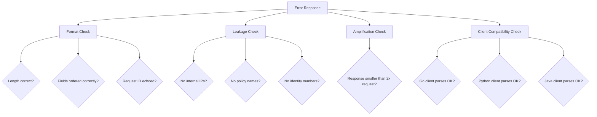

# Validating Error Response Injection in Cilium Network Security

Author: [nawazdhandala](https://github.com/nawazdhandala)

Tags: Cilium, Network Security, Validation, Error Injection, Testing

Description: Validate that error response injection in Cilium L7 parsers produces correctly formatted, policy-compliant, and client-compatible error messages through protocol conformance testing and end-to-end...

---

## Introduction

Validating error response injection requires verifying three independent properties: the injected response conforms to the protocol specification, the response does not leak sensitive information, and clients across different implementations can parse and handle the response correctly. Each property demands its own testing strategy.

Unlike request parsing, where invalid input is rejected, error injection produces output that must be correct. A malformed error response can crash client applications, corrupt their connection state, or cause them to misinterpret subsequent messages on the same connection. Validation must be thorough.

This guide covers structured validation approaches for error response injection in Cilium L7 parsers.

## Prerequisites

- Parser with error injection implemented
- Protocol specification with error response format
- Multiple client implementations for compatibility testing
- Go 1.21 or later
- Test Kubernetes cluster with Cilium

## Validating Response Format Compliance

Verify every byte of the error response matches the protocol specification:

```go
func TestErrorResponseFormat(t *testing.T) {
    parser := &Parser{state: stateRunning}

    tests := []struct {
        name      string
        command   byte
        requestID uint32
        message   string
    }{
        {"basic denial", 0x01, 1, "request denied"},
        {"empty message", 0x02, 0, ""},
        {"max length message", 0x03, 0xFFFFFFFF, strings.Repeat("x", maxErrorMessageLen)},
        {"unicode message", 0x01, 42, "denied"},
    }

    for _, tt := range tests {
        t.Run(tt.name, func(t *testing.T) {
            resp := parser.buildErrorResponse(tt.command, tt.requestID, tt.message)

            // Validate minimum response length
            minLen := 4 + 1 + 1 + 4 + 2 // header + error flag + code + reqID + msgLen
            if len(resp) < minLen {
                t.Fatalf("Response too short: %d bytes, minimum %d", len(resp), minLen)
            }

            // Validate length header
            declaredLen := int(resp[0])<<24 | int(resp[1])<<16 | int(resp[2])<<8 | int(resp[3])
            actualBodyLen := len(resp) - 4
            if declaredLen != actualBodyLen {
                t.Errorf("Length mismatch: header says %d, body is %d", declaredLen, actualBodyLen)
            }

            // Validate error flag
            if resp[4] != 0xFF {
                t.Errorf("Error flag: got 0x%02x, want 0xFF", resp[4])
            }

            // Validate request ID echo
            echoedID := uint32(resp[6])<<24 | uint32(resp[7])<<16 |
                        uint32(resp[8])<<8 | uint32(resp[9])
            if echoedID != tt.requestID {
                t.Errorf("Request ID: got %d, want %d", echoedID, tt.requestID)
            }

            // Validate message length
            msgLen := int(resp[10])<<8 | int(resp[11])
            truncatedMsg := tt.message
            if len(truncatedMsg) > maxErrorMessageLen {
                truncatedMsg = truncatedMsg[:maxErrorMessageLen]
            }
            if msgLen != len(truncatedMsg) {
                t.Errorf("Message length: got %d, want %d", msgLen, len(truncatedMsg))
            }
        })
    }
}
```

## Validating Information Leakage Prevention

Ensure error responses do not contain sensitive data:

```go
func TestErrorResponseNoLeakage(t *testing.T) {
    parser := &Parser{
        state: stateRunning,
        connection: &proxylib.Connection{
            SrcIdentity:  12345,
            DstIdentity:  67890,
            OrigEndpoint: "10.0.1.5:43210",
        },
    }

    // Generate error responses for various scenarios
    scenarios := []struct {
        command   byte
        requestID uint32
    }{
        {0x01, 1},
        {0x02, 100},
        {0xFF, 0xDEADBEEF},
    }

    sensitiveStrings := []string{
        "12345",              // Source identity
        "67890",              // Destination identity
        "10.0.1.5",           // Internal IP
        "43210",              // Internal port
        "policy",             // Policy references
        "rule",               // Rule references
        "identity",           // Identity references
    }

    for _, sc := range scenarios {
        resp := parser.buildErrorResponse(sc.command, sc.requestID, "request denied")
        respStr := string(resp)

        for _, sensitive := range sensitiveStrings {
            if strings.Contains(respStr, sensitive) {
                t.Errorf("Error response contains sensitive string %q for command %d",
                    sensitive, sc.command)
            }
        }
    }
}
```



## Validating Amplification Controls

Verify that error responses cannot be used for amplification attacks:

```go
func TestErrorResponseAmplification(t *testing.T) {
    parser := &Parser{state: stateRunning}

    // Test with various request sizes
    requestSizes := []int{1, 10, 50, 100, 500, 1000, 5000}

    for _, reqSize := range requestSizes {
        t.Run(fmt.Sprintf("request_%d_bytes", reqSize), func(t *testing.T) {
            resp := parser.buildErrorResponse(0x01, 1, "request denied by policy")

            // Error response should not be more than 2x request size or 512 bytes
            maxAllowed := reqSize * 2
            if maxAllowed < 512 {
                maxAllowed = 512
            }

            if len(resp) > maxAllowed {
                t.Errorf("Amplification risk: %d-byte request produces %d-byte error (max %d)",
                    reqSize, len(resp), maxAllowed)
            }
        })
    }
}

func TestErrorMessageTruncation(t *testing.T) {
    parser := &Parser{state: stateRunning}

    // Attempt to inject an oversized error message
    longMessage := strings.Repeat("A", maxErrorMessageLen*2)
    resp := parser.buildErrorResponse(0x01, 1, longMessage)

    // Extract the actual message from the response
    msgLen := int(resp[10])<<8 | int(resp[11])
    if msgLen > maxErrorMessageLen {
        t.Errorf("Error message not truncated: %d bytes (max %d)", msgLen, maxErrorMessageLen)
    }
}
```

## End-to-End Validation

Test the complete injection flow in a cluster:

```yaml
# deny-delete-policy.yaml
apiVersion: cilium.io/v2
kind: CiliumNetworkPolicy
metadata:
  name: deny-delete
spec:
  endpointSelector:
    matchLabels:
      app: myservice
  ingress:
    - fromEndpoints:
        - matchLabels:
            app: client
      toPorts:
        - ports:
            - port: "9000"
              protocol: TCP
          rules:
            l7proto: myprotocol
            l7:
              - command: "GET"
              - command: "SET"
              # DELETE intentionally omitted — will be denied
```

```bash
# Apply the policy
kubectl apply -f deny-delete-policy.yaml

# Send an allowed request — should succeed
kubectl exec test-client -- protocol-client send --command GET --target myservice:9000
# Expected: success response

# Send a denied request — should receive error response
kubectl exec test-client -- protocol-client send --command DELETE --target myservice:9000
# Expected: error response with "access denied"

# Verify the server never saw the DELETE
kubectl logs deployment/myservice | grep -c DELETE
# Expected: 0
```

## Verification

Run the complete validation suite:

```bash
# Format compliance tests
go test ./proxylib/myprotocol/... -v -run TestErrorResponseFormat

# Leakage tests
go test ./proxylib/myprotocol/... -v -run TestErrorResponseNoLeakage

# Amplification tests
go test ./proxylib/myprotocol/... -v -run TestErrorResponseAmplification

# All tests with race detection
go test ./proxylib/myprotocol/... -race -v -count=1

# Coverage of injection code
go test ./proxylib/myprotocol/... -coverprofile=cover.out
go tool cover -func=cover.out | grep -i "error\|inject"
```

## Troubleshooting

**Problem: Format tests fail on boundary messages**
Check that length calculations handle edge cases correctly: zero-length messages, maximum-length messages, and messages with multi-byte characters.

**Problem: Leakage test finds sensitive data in error responses**
Trace the data flow from parser fields to the error message construction. Ensure only static, pre-defined strings are used in client-facing responses.

**Problem: End-to-end tests show no error response**
Verify that the `Inject` call happens before the `DROP` return. Check Cilium logs for injection errors.

**Problem: Client crashes on error response**
Capture the exact bytes and parse them manually against the spec. The most common issue is incorrect length fields that cause the client to read past the response boundary.

## Conclusion

Validating error response injection requires format compliance testing, information leakage checks, amplification controls, and end-to-end cluster verification. Each layer of validation catches different classes of issues, from byte-level formatting errors to security policy violations. Run these validations as part of your CI pipeline to prevent regressions whenever the error injection code is modified.
