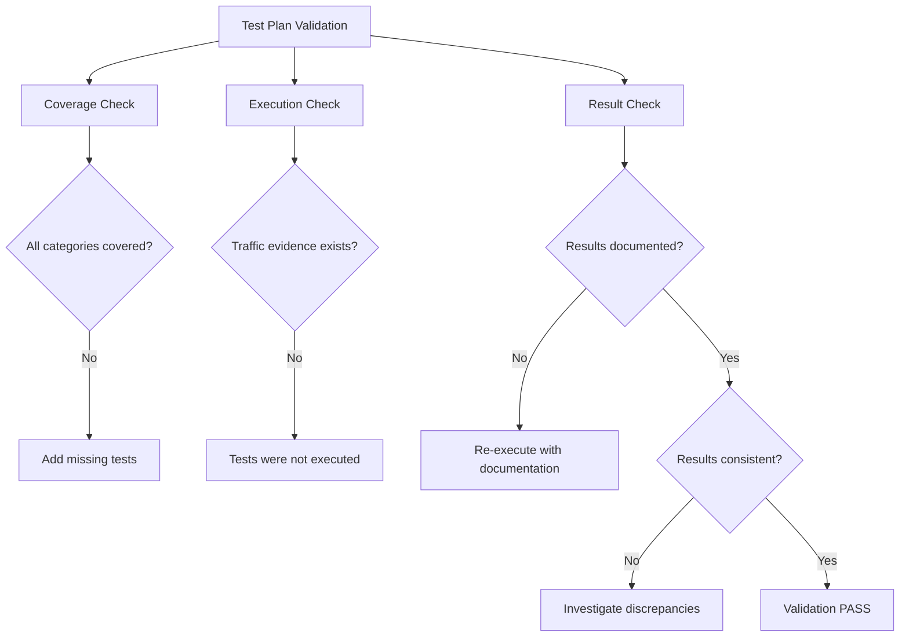

# Validating Manual Testing for Cilium Network Security

Author: [nawazdhandala](https://github.com/nawazdhandala)

Tags: Cilium, Network Security, Validation, Manual Testing, Test Coverage

Description: Validate that manual testing of Cilium L7 parsers is comprehensive, reproducible, and provides meaningful security assurance through structured test plans, coverage checklists, and result...

---

## Introduction

Manual testing is only as valuable as its thoroughness and documentation. Unstructured manual testing may exercise some functionality but miss critical edge cases, leaving a false impression of readiness. Validation of manual testing ensures that the test plan covers all required scenarios, results are documented reproducibly, and the testing provides genuine security assurance.

This guide provides frameworks for validating the completeness of manual test plans, tracking test execution, and documenting results in a way that supports security review and compliance requirements.

## Prerequisites

- A completed manual test plan for the parser
- Test environment with Cilium and L7 policy
- Protocol specification for reference
- Previous test results for comparison
- Understanding of security test coverage requirements

## Validating Test Plan Coverage

Map your test plan against required coverage areas:

```bash
# Check that the test plan covers all policy verdict paths
echo "=== Coverage Matrix ==="
echo "1. Allowed request (PASS verdict): ___"
echo "2. Denied request (DROP verdict): ___"
echo "3. Malformed request (DROP/ERROR): ___"
echo "4. Oversized request (DROP): ___"
echo "5. Partial request (MORE then PASS): ___"
echo "6. Multiple messages on one connection: ___"
echo "7. Request and response correlation: ___"
echo "8. Error response injection: ___"
echo "9. Access log generation: ___"
echo "10. Performance under load: ___"
```

Validate test plan completeness with a checklist:

| Test Category | Subcategory | Test Exists | Result Documented | Verdict |
|---------------|-------------|-------------|-------------------|---------|
| Functional | Allowed commands | | | |
| Functional | Denied commands | | | |
| Functional | Unknown commands | | | |
| Security | Oversized messages | | | |
| Security | Malformed headers | | | |
| Security | Connection flooding | | | |
| Security | Slow-rate attacks | | | |
| Observability | Access logs present | | | |
| Observability | Hubble flows visible | | | |
| Performance | Latency under load | | | |
| Performance | Connection throughput | | | |

## Validating Test Execution

Ensure tests were actually executed and not just planned:

```bash
# Verify test evidence exists
echo "=== Test Execution Evidence ==="

# Check that test traffic was generated
hubble observe --namespace cilium-parser-test --type l7 --since 1h -o json | \
    jq -r '.flow.l7.type' | sort | uniq -c

# Check policy verdict distribution
hubble observe --namespace cilium-parser-test --type l7 --since 1h -o json | \
    jq -r '.flow.verdict' | sort | uniq -c

# Verify both allowed and denied traffic occurred
ALLOWED=$(hubble observe --namespace cilium-parser-test --type l7 --verdict FORWARDED --since 1h -o json | jq -s 'length')
DENIED=$(hubble observe --namespace cilium-parser-test --type l7 --verdict DENIED --since 1h -o json | jq -s 'length')

echo "Allowed requests: $ALLOWED"
echo "Denied requests: $DENIED"

if [ "$DENIED" -eq 0 ]; then
    echo "WARNING: No denied requests recorded — security testing incomplete"
fi
```



## Validating Test Reproducibility

Ensure tests can be re-executed with the same results:

```bash
# Create a reproducible test script
cat > /tmp/manual-test-validation.sh <<'SCRIPT'
#!/bin/bash
set -e

NS="cilium-parser-test"
RESULTS_FILE="/tmp/test-results-$(date +%Y%m%d-%H%M%S).json"

echo '{"tests": [' > "$RESULTS_FILE"

# Test function
run_test() {
    local name="$1"
    local command="$2"
    local expected="$3"

    echo "Running: $name"
    result=$(eval "$command" 2>&1) || true

    if echo "$result" | grep -q "$expected"; then
        status="PASS"
    else
        status="FAIL"
    fi

    echo "{\"name\": \"$name\", \"status\": \"$status\", \"output\": \"$(echo $result | head -c 200)\"}," >> "$RESULTS_FILE"
    echo "  $name: $status"
}

# Execute tests
run_test "allowed_get" \
    "kubectl exec -n $NS deploy/test-client -- protocol-client send --command GET --key test --target test-server:9000" \
    "success"

run_test "denied_delete" \
    "kubectl exec -n $NS deploy/test-client -- protocol-client send --command DELETE --key test --target test-server:9000" \
    "denied"

run_test "hubble_flows" \
    "hubble observe --namespace $NS --type l7 --last 5 -o compact" \
    "myprotocol"

echo ']}' >> "$RESULTS_FILE"
echo ""
echo "Results saved to: $RESULTS_FILE"
SCRIPT

chmod +x /tmp/manual-test-validation.sh
```

## Comparing Results Across Runs

Track test results over time to identify regressions:

```bash
# Compare current results with previous baseline
diff <(jq -r '.tests[].status' baseline-results.json) \
     <(jq -r '.tests[].status' current-results.json)

# Check for new failures
NEW_FAILURES=$(diff <(jq -r '.tests[] | select(.status=="FAIL") .name' baseline-results.json) \
                    <(jq -r '.tests[] | select(.status=="FAIL") .name' current-results.json) | grep "^>" | wc -l)

if [ "$NEW_FAILURES" -gt 0 ]; then
    echo "WARNING: $NEW_FAILURES new test failures detected"
fi
```

## Verification

Validate the validation process itself:

```bash
# Ensure all coverage areas have at least one test
COVERAGE_AREAS=10
COVERED=$(grep -c "PASS\|FAIL" test-results.json | head -1)
echo "Coverage: $COVERED/$COVERAGE_AREAS areas tested"

# Verify test results are saved
ls -la /tmp/test-results-*.json

# Verify Hubble data supports the test claims
hubble observe --namespace cilium-parser-test --type l7 --since 1h -o json | jq -s 'length'
```

## Troubleshooting

**Problem: Test results differ between runs**
Check for stateful behavior in the parser or test client. Reset the test environment completely between validation runs: delete and recreate pods, re-apply policies.

**Problem: Cannot reproduce a specific failure**
The failure may be timing-dependent. Add explicit delays or use deterministic traffic patterns. Record exact timestamps to correlate with Cilium logs.

**Problem: Test coverage gaps found**
Add the missing test cases to the test plan and re-execute. Document why the gap existed (oversight, technical limitation, etc.).

**Problem: Test evidence is insufficient for compliance**
Enhance the test script to capture more detailed output including timestamps, pod names, policy state, and exact commands used.

## Conclusion

Validating manual testing ensures the testing effort provides genuine security assurance rather than a false sense of confidence. By checking test plan coverage against required areas, verifying execution through Hubble evidence, ensuring reproducibility through scripted tests, and comparing results across runs, you confirm that manual testing is thorough and reliable. Document validation results alongside test results for complete audit trails.
